```
______            _                   _        
| ___ \          | |                 | |       
| |_/ /  ___   __| |  ___  ___     __| |  ___  
|    /  / _ \ / _` | / _ \/ __|   / _` | / _ \ 
| |\ \ |  __/| (_| ||  __/\__ \  | (_| ||  __/ 
\_| \_| \___| \__,_| \___||___/   \__,_| \___| 
 _____                                  _               _                         
/  __ \                                | |             | |                        
| /  \/  ___   _ __ ___   _ __   _   _ | |_   __ _   __| |  ___   _ __   ___  ___ 
| |     / _ \ | '_ ` _ \ | '_ \ | | | || __| / _` | / _` | / _ \ | '__| / _ \/ __|
| \__/\| (_) || | | | | || |_) || |_| || |_ | (_| || (_| || (_) || |   |  __/\__ \
 \____/ \___/ |_| |_| |_|| .__/  \__,_| \__| \__,_| \__,_| \___/ |_|    \___||___/ 
                         | |                 
                         |_|                                                      
```

# 00. Conceitos Básicos

## Redes de Computadores:

"É um conjunto de computadores autônomos e interconectados por uma única tecnologia." - Tanenbaum.

O conceito hoje tem um sentido muito mais amplo, incluindo diversos dispositivos com capacidade de processamento de dados (como telefones celulares e televisões), e não apenas computadores tradicionais.

- **Propósito inicial:** A principal motivação foi a necessidade de trocar informações de forma rápida, substituindo métodos antigos que eram demorados, de uso exclusivo e de alto custo.

- **Compartilhamento:** A rede permite o compartilhamento de recursos de *hardware* e *software* (por exemplo, uma firma dividindo o uso de uma impressora ou um sistema de *fax*), otimizando a estrutura e os custos.

## Comunicação:

Em geral, a comunicação em uma rede funciona com três elementos básicos: 

1. **Transmissor:** Origem da informação; 
2. **Receptor:** Destinatário da informação;
3. **Canal de comunicação:** Meio pelo qual o dado é enviado.

## Protocolos e Modelo de Camadas:

- **Protocolos:** São conjuntos de regras seguidas pelos dispositivos para gerar uma padronização na comunicação. Eles funcionam como uma "linguagem comum", garantindo que a mensagem enviada possa ser recebida e compreendida corretamente. Alguns protocolos também garantem a confiabilidade da entrega.

- **Modelos de Camadas:** A comunicação em rede é dividida em camadas, e cada camada agrupa protocolos com funções específicas. Alguns exemplos dessa relação são: HTTP na **Camada de Aplicação**; TCP na **Camada de Transporte**; IP na **Camada de Rede**; PPP na **Camada de Enlace**; e V.92 na **Camada Física**.

## Parâmetros para Avaliação de Redes:

A escolha e a avaliação de uma rede dependem das requisições específicas da aplicação que será utilizada. Os principais fatores a serem considerados são:

- **Custo:** Envolve o preço de aquisição dos equipamentos, bem como os custos contínuos de operação e manutenção da rede.
- **Desempenho:** Relacionado à eficiência da comunicação. Os principais indicadores são a **banda** (capacidade do canal de comunicação, medida em *bits* por segundo) e a **taxa de transmissão** (a velocidade real com que os dados trafegam).
- **Escalabilidade:** É a capacidade da rede de crescer, permitindo a adição de novos dispositivos com o menor impacto possível à estrutura e ao desempenho já estabelecidos.
- **Disponibilidade:** Refere-se à capacidade de fornecimento ininterrupto do serviço. O nível de exigência varia conforme o cenário (por exemplo, alguns serviços requerem acesso 24/7, enquanto outros só precisam estar operacionais em horário comercial).
- **Segurança:** Envolve garantir a **confidencialidade** (apenas pessoas autorizadas acessam a informação) e a **integridade** (os dados não são alterados durante a transmissão).
- **Padronização:** Adoção de modelos de camadas e regras consolidadas para o envio de informações. Atualmente, é um fator indispensável para garantir a interoperabilidade (a capacidade de equipamentos de fabricantes diferentes conversarem entre si). Esse recurso hoje é basicamente o padrão (não se pensa em novos equipamentos fora da padronização).

## Tipos Geográficos de Rede:

As redes de computadores recebem designações específicas dependendo da sua área de cobertura.

- **PAN (*Personal Area Network*):** Rede de área pessoal. Interliga dispositivos em uma área muito pequena e restrita ao usuário (conexão entre celular, computador, impressora e fones sem fio, utilizando tecnologias como Bluetooth, etc.).

- **LAN (*Local Area Network*):** Rede de área local. Abrange uma região um pouco maior, mas ainda geograficamente restrita a um espaço físico específico (rede de apartamentos de um condomínio, andares de um escritório ou um prédio inteiro, etc.).

- **MAN (*Metropolitan Area Network*):** Rede de área metropolitana. Oferece conectividade e taxa de transmissão para locais que saem do escopo local (redes que cobrem cidades inteiras ou regiões metropolitanas).

- **WAN (*Wide Area Network*):** Rede de longa distância. Interliga grandes espaços geográficos de terra (redes que conectam estados, países e até continentes).

## Meios de Transmissão:

A infraestrutura que conecta os dispositivos de uma rede pode ser dividida em duas categorias principais, dependendo da existência de um canal físico.

- **Com Fio:** O sinal de comunicação é conduzido e confinado através de um material físico (como **Cabo de Par Trançado**, **Cabo Coaxial** e **Fibra Óptica**).

- **Sem Fio (*Wireless*):** Não existe uma infraestrutura física direta guiando o sinal - a comunicação ocorre pela propagação de ondas eletromagnéticas através de meios como o ar, a água ou mesmo o vácuo (como **Ondas de Rádio**, **Micro-ondas**, **Transmissão via Satélite** e **Infravermelho**).

## Formas de Interconexão:

A maneira como os dispositivos são organizados e conectados fisicamente (ou logicamente) impacta diretamente o custo e a eficiência da rede.

- **Conexão Ponto a Ponto em Malha (*Mesh*):** Uma conexão ponto a ponto é um *link* direto e exclusivo entre duas máquinas. Se conectarmos *todos* os elementos da rede diretamente uns aos outros (Topologia em Malha Completa), temos altíssima redundância, mas o projeto se torna extremamente caro e pouco escalável devido à quantidade massiva de cabos.

- **Conexão Ponto a Ponto em Redes Comutadas (Nós Intermediários):** Para reduzir o custo da malha completa, utilizam-se dispositivos intermediários (como *switches* e roteadores) para fazer a conexão entre as extremidades. Isso permite interligar os dispositivos sem exigir uma conexão direta entre todos eles e, quando existem caminhos redundantes, possibilita redirecionar a informação em caso de falha.

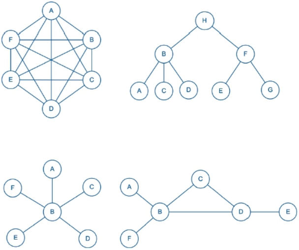<br>
*Fonte: MAIA, Luiz Paulo. Arquitetura de Redes de Computadores, 2ª ed., 2013, p. 37.*

- **Conexão Multiponto:** Ocorre quando três ou mais dispositivos compartilham exatamente o mesmo meio físico de comunicação (um único cabo).

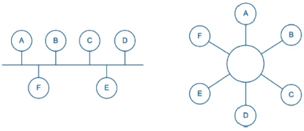<br>
*Fonte: MAIA, Luiz Paulo. Arquitetura de Redes de Computadores, 2ª ed., 2013, p. 38.*

## Comutação por Pacotes:

Como mencionado nas redes comutadas, a comunicação entre dois pontos não precisa ser direta. Ela ocorre através de dispositivos intermediários (comutadores, como *switches* e roteadores), que recebem e reenviam a informação até o seu destino.

- **Divisão da Informação:** Os dados não são enviados de uma única vez; eles são divididos em pequenos blocos chamados de **pacotes**.
- **Caminhos Dinâmicos:** A grande vantagem dos comutadores é que o caminho de comunicação não é fixo.
- **Resiliência e Eficiência:** Como o roteamento pode ser dinâmico, se um ponto da rede falhar ou estiver lidando com um tráfego muito alto, podem existir rotas alternativas até o destino. Além disso, é possível que pacotes pertencentes à mesma informação percorram caminhos diferentes durante a transmissão.

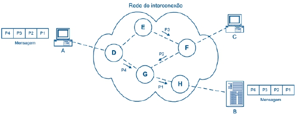<br>
*Fonte: MAIA, Luiz Paulo. Arquitetura de Redes de Computadores, 2ª ed., 2013, p. 41.*

## Serviços Oferecidos pelas Redes:

A disponibilização de recursos na rede geralmente opera sob a **Arquitetura Cliente-Servidor**, em que há uma separação clara de papéis: o **Servidor** (provedor e dono da informação) e o **Cliente** (quem requisita o acesso e consome o serviço).

Para evitar que a queda de um servidor deixe os clientes isolados, adotam-se esquemas de **redundância** (vários servidores assumindo a carga), garantindo a alta disponibilidade do serviço.

Alguns exemplos de serviços básicos são:

- **Serviço *Web*:** A *World Wide Web* (WWW) é o sistema de documentos em formato de hipertexto (textos, imagens e áudios) interligados por *links*;
- **HTTP:** Protocolo responsável por transferir essas páginas do servidor para o *browser* do cliente;
- **Transferência de Arquivos:** Permite o envio e o recebimento de arquivos entre dispositivos conectados à rede;
- **Acesso e Gerenciamento Remoto:** Permite submeter comandos a um sistema distante como se estivesse conectado localmente a ele (**terminal remoto**) e administrar, configurar e diagnosticar problemas nos dispositivos de rede à distância (**gerência remota**);
- **Comunicação em Tempo Real:** Inclui serviços de áudio, videoconferência, chamadas e *streaming* (ex.: Zoom, WhatsApp etc.).

---

# 01. Modelo de Camadas

## Vantagens na sua Adoção:

O desenvolvimento de arquiteturas de redes de computadores é uma tarefa altamente complexa, pois envolve inúmeros aspectos simultâneos (*hardware*, *software*, interfaces de transmissão, verificação de erros, protocolos etc.). Para lidar com essa complexidade, utiliza-se a abordagem de dividir o sistema em camadas, o que traz as seguintes vantagens:

- **Modularidade e Organização:** O problema complexo é dividido em partes menores (camadas), cada uma responsável por uma tarefa específica, tornando o projeto do *software* e do modelo de rede muito mais simples e organizado.
- **Independência entre as Partes:** Cada camada atua de forma isolada e se comunica com as outras através de **interfaces** claras. Isso impede que a complexidade de uma camada interfira na outra.
- **Facilidade de Manutenção e Evolução:** Graças a esse isolamento, se uma parte do processo apresentar algum problema ou se uma nova tecnologia surgir, apenas a camada correspondente precisará ser alterada ou substituída, preservando o restante do sistema intacto.

## Elementos do Modelo de Camadas:

- **Comunicação Vertical:** Ocorre internamente. Cada camada se comunica com a camada imediatamente inferior durante a transmissão ou com a camada imediatamente superior durante a recepção.
- **Comunicação Horizontal (Lógica):** Ocorre entre máquinas diferentes. Uma camada em um dispositivo comunica-se logicamente apenas com a sua camada equivalente no dispositivo de destino (ex.: a camada de Aplicação interpreta apenas dados da camada de Aplicação remota).
- **Encapsulamento e Desencapsulamento:** Como a informação segue um caminho único de descida durante a transmissão, cada camada empacota o dado recebido, adicionando o seu próprio "envelope" (um cabeçalho com informações de controle). Isso garante a organização, a independência dos dados e o roteamento adequado. Quando a informação chega ao destino e começa a subir, ocorre o desencapsulamento, com cada camada lendo e retirando o seu respectivo envelope.

## Modelo de 5 camadas (Internet):

Este é o modelo prático utilizado atualmente. Ele consiste em uma adaptação e evolução do modelo TCP/IP original (a primeira arquitetura de Internet implementada globalmente pelo governo norte-americano).

1. **Camada Física:** É a camada responsável pela transferência literal dos *bits* brutos através do meio de transmissão.

   - Inicia, mantém e finaliza a **comunicação física** entre as máquinas.
   - Mantém o sincronismo entre os dispositivos de origem e destino, além de gerenciar a divisão do meio físico (**multiplexação**).
   - Determina a **duração e a intensidade do envio dos sinais** (por exemplo, como converter os *bits* em pulsos elétricos ou eletromagnéticos).
   - Lida com as características físicas e mecânicas da comunicação (fios, antenas, cabos metálicos, fibra óptica etc.).
   - Alguns exemplos de padrões e especificações que definem aspectos da camada física são V.92, EIA-232-F, IEEE 802.3 e IEEE 802.11.

2. **Camada de Enlace:** Atua como a transição entre o meio físico de transmissão e as funções lógicas da rede.

   - Transforma os *bits* brutos enviados e recebidos da camada física em blocos estruturados que podem ser interpretados (**quadros/*frames***).
   - Detecta (e, dependendo da tecnologia, corrige) erros que possam ter ocorrido na transmissão física dos *bits*.
   - Regula o volume de dados enviados para evitar que a máquina de destino ou a rede sejam sobrecarregadas.
   - Alguns exemplos de protocolos da camada de enlace são PPP, HDLC, LAPB, IEEE 802.3 (*Ethernet*) e IEEE 802.11 (*Wi-Fi*).

3. **Camada de Rede:** É a responsável por garantir a comunicação indireta e o endereçamento lógico entre máquinas através de redes diferentes.

   - Garante identificação única (idealmente) para cada dispositivo na rede (**endereço**), permitindo que a origem e o destino sejam localizados e diferenciados globalmente.
   - Determina o caminho intermediário (melhor rota) por onde a informação deve passar. Os dispositivos intermediários consultam **tabelas de roteamento** (mapas de redes conhecidas) para decidir qual é o próximo salto correto até o destino.
   - A informação é dividida em conjuntos menores (pacotes), enviados de forma independente (**comutação de pacotes**). Caso haja um problema (como uma rota que perde conexão ou pacotes fora de ordem por alto tráfego), a falha de uma parte não invalida a mensagem inteira.
   - O envio de dados na rede pode ser organizado de duas maneiras:

     - **Serviço Não Orientado a Conexão (Datagrama):** Não possui um caminho fixo predefinido. Cada pacote pode tomar uma rota diferente, ajustando-se dinamicamente conforme as condições da rede durante o trajeto.
     - **Serviço Orientado a Conexão (Circuito Virtual):** Estabelece um caminho lógico e fixo antes do envio dos dados. Todos os pacotes seguirão exatamente a mesma rota, dispensando o processo de decisão de roteamento a cada salto para os pacotes seguintes.

   - Alguns exemplos de protocolos da camada de rede são IP (IPv4 e IPv6), ICMP, ARP e OSPF.

4. **Camada de Transporte:** É a responsável por criar uma abstração na transferência de dados, estabelecendo uma comunicação lógica de ponta a ponta (diretamente entre a origem e o destino).

   - Oculta toda a complexidade da rede física e do roteamento (ignorando caminhos intermediários e técnicas de comutação). **Cria a ilusão de que existe uma conexão direta**, dedicada e exclusiva entre os dois pontos.
   - Atua como uma interface universal para os *softwares*. Utiliza identificadores chamados de "Portas" para **garantir que a informação recebida seja entregue à aplicação correta na máquina** (separando, por exemplo, o tráfego do navegador *web* do tráfego de um *e-mail*).
   - Diferentemente da camada de enlace (que verifica erros entre pontos diretamente conectados), protocolos confiáveis da camada de transporte, como o TCP, podem verificar se os dados chegaram corretamente ao destino final (controle *End-to-End*), ordenando os pacotes e solicitando o reenvio de partes perdidas.
   - Alguns exemplos de protocolos da camada de transporte são TCP (focado em confiabilidade e garantia de entrega) e UDP (focado em velocidade, sem garantia de entrega).

5. **Camada de Aplicação:** É a camada de mais alto nível e a mais próxima do usuário final, responsável por lidar diretamente com a informação que será transmitida para o destinatário.

   - Atua como a **ponte de comunicação** entre os aplicativos de *software* (que geram ou consomem a informação) e a estrutura técnica da rede.
   - É composta pelos serviços práticos e aplicações de rede que utilizamos no dia a dia. Ela estrutura como os dados de serviços *web*, correio eletrônico, transferência de arquivos, acessos remotos e gerenciamento de mídias (áudio, texto e vídeo) devem ser formatados e compreendidos pela máquina de destino.
   - Alguns exemplos de protocolos da camada de aplicação são HTTP/HTTPS (navegação *web*), SMTP e IMAP (*e-mail*), FTP (transferência de arquivos) e SSH (acesso remoto).

## Outros Modelos de Camadas:

Como o foco prático atual é o modelo de 5 camadas (*Internet*), os modelos clássicos servem principalmente como base teórica ou contexto histórico, não necessitando do mesmo rigor técnico de detalhamento em suas descrições.

- **Modelo TCP/IP Original:** Foi a primeira arquitetura de *Internet* implementada na prática pelo governo americano. Suas camadas são **Aplicação**, **Transporte**, ***Internet*** (equivalente à Rede) e **Acesso à Rede**. A camada de **Acesso à Rede** agrupava o que hoje conhecemos como as camadas de Enlace e Física. Futuramente, viu-se a necessidade técnica de separar essas partes para dar mais independência aos *hardwares* e aos protocolos lógicos de enlace.

- **Modelo OSI:** Modelo de referência teórica criado pela ISO. Propôs uma divisão extremamente detalhada, que acabou se provando rígida e burocrática demais para a implementação prática comercial. Suas camadas são **Aplicação**, **Apresentação**, **Sessão**, **Transporte**, **Rede**, **Enlace** e **Física**.

  - **Camadas Inferiores:** Inclui camadas de Transporte, Rede, Enlace e Física. Possuem funções **praticamente equivalentes** às do modelo de 5 camadas atual.
  - **Camada de Sessão:** Responsável por estabelecer, manter e encerrar sessões de comunicação, além de controlar o diálogo entre os dispositivos e utilizar pontos de sincronização (*checkpoints*) que permitem retomar uma comunicação interrompida.
  - **Camada de Apresentação:** Focada na sintaxe e na semântica da informação. Realiza a formatação dos dados, a conversão de códigos (como tabelas de caracteres), a compressão e a criptografia.

> Pode-se entender que as antigas camadas de Sessão, Apresentação e Aplicação do modelo OSI foram aglutinadas na **Camada de Aplicação** do modelo de 5 camadas. Muitos dos recursos propostos pelo OSI geravam uma camada burocrática desnecessária, sendo mais simples transferir e incorporar essas características opcionais diretamente no *software* do usuário final.

## *Gateway*:

Em vez de forçar os dispositivos a suportarem nativamente múltiplos protocolos diferentes (o que aumenta a complexidade e a chance de falhas), utiliza-se o *Gateway* como um nó intermediário focado na tradução entre sistemas incompatíveis (**conversor de protocolos**). Suas principais características são:

- **Tradução de Protocolos:** Atua convertendo regras, velocidades e formatos entre redes que possuem arquiteturas completamente diferentes, garantindo uma comunicação estável entre elas.
- **Modularidade e Isolamento:** Funciona como uma camada dedicada de tradução. Isso mantém a rede modularizada: se houver um erro de compatibilidade ou falha na conversão, o problema fica isolado no *Gateway* e pode ser resolvido sem afetar a estrutura principal da rede.

Alguns exemplos de uso do *Gateway* são a tradução de pacotes IPv4 para IPv6, a conexão de redes de sensores industriais (IoT) à *Internet* tradicional e a comunicação entre redes corporativas fechadas e a rede pública.

## Padrão IEEE 802:

Trata-se de um projeto de padronização criado para unificar o desenvolvimento e o funcionamento de redes locais (LAN) e metropolitanas (MAN). O modelo gerencia e padroniza exclusivamente as duas camadas mais baixas do modelo de redes (a **Camada Física** e a **Camada de Enlace**).

**Divisão da Camada de Enlace:** Para integrar diferentes tecnologias de forma eficiente, o padrão dividiu a camada de enlace em duas subcamadas complementares:

- **MAC (*Medium Access Control*):** É a subcamada inferior. Fica responsável pelo controle de acesso ao meio físico (decidindo quando a máquina pode transmitir) e pela detecção de erros nos quadros recebidos.
- **LLC (*Logical Link Control*):** É a subcamada superior. Compatibiliza os diversos tipos de *hardware* e padrões MAC com a Camada de Rede superior, ocultando as diferenças físicas e entregando uma interface padronizada.

> Alguns exemplos dos padrões gerenciados pelo IEEE 802 são IEEE 802.2 (LLC), IEEE 802.3 (*Ethernet* padrão com fio), IEEE 802.4 (Token Bus), IEEE 802.11 (redes locais sem fio / *Wi-Fi*), IEEE 802.15 (redes pessoais sem fio / *Bluetooth*) e IEEE 802.16 (redes metropolitanas sem fio / *WiMAX*).

---

# 02. Camada Física

## Processo de Transmissão (Sinais e Dados):

Envolve o tratamento da informação para que ela possa ir fisicamente de uma máquina à outra. Para isso, é essencial diferenciar a natureza dos sinais.

- **Sinal Analógico:** É um sinal que varia de forma contínua em relação ao tempo e à amplitude (como ondas sonoras, ondas de rádio, ondas eletromagnéticas etc.).

- **Sinal Digital:** É um sinal que varia de forma discreta (saltando entre patamares fixos). É o formato nativo com o qual os computadores conseguem operar e interpretar as informações, trabalhando com valores binários (0 e 1).

- **Tratamento e Conversão:** Como os computadores geram dados puramente digitais, o papel do transmissor na camada física é **converter e codificar esses dados para o formato suportado pelo canal de comunicação**. Isso pode envolver transformar dados digitais em sinais digitais (pulsos elétricos estruturados em um cabo) ou modular esses dados digitais em sinais analógicos (ondas eletromagnéticas transmitidas pelo ar).

## Problemas na Transmissão:

Durante o processo de transmissão, o sinal pode sofrer degradações que causam interferência e levam à má interpretação da informação pelo receptor.

### Ruído:

É a consequência de interferências indesejadas e aleatórias que se somam ao sinal original, provocando distorção na sua forma.

- **Causas:** Pode ser originado por diversas fontes, como interferência de ondas eletromagnéticas externas, ruído térmico (ou ruído branco, gerado pela agitação natural dos elétrons nos componentes) e *crosstalk* (interferência causada por cabos e antenas vizinhas).
- **Relação sinal-ruído (*signal-to-noise ratio* - SNR):** É a métrica utilizada para medir o impacto do ruído na comunicação. Ela é calculada pela razão (divisão) entre a potência do sinal transmitido e a potência do ruído presente no canal. Quanto maior for a relação sinal-ruído, melhor será a qualidade do sinal, pois indica que o sinal útil é significativamente mais forte do que a interferência indesejada.

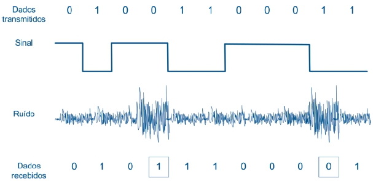<br>
*Fonte: MAIA, Luiz Paulo. Arquitetura de Redes de Computadores, 2ª ed., 2013, p. 98.*

### Atenuação:

É a perda progressiva da energia (potência) do sinal à medida que ele percorre o meio de transmissão até chegar ao destino (a amplitude da onda diminui ao longo do trajeto). 
> Em transmissões digitais, os "picos" de energia (que representam o *bit* '1', por exemplo) ficam tão fracos e próximos de zero que o receptor não consegue mais interpretá-los corretamente.

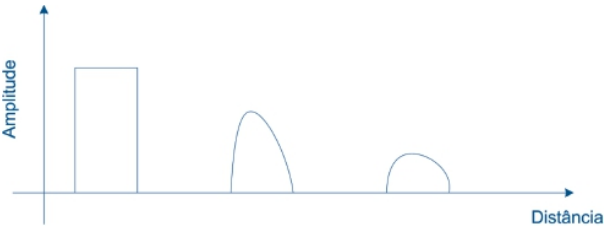<br>
*Fonte: MAIA, Luiz Paulo. Arquitetura de Redes de Computadores, 2ª ed., 2013, p. 100.*

**Circuitos Regeneradores (Repetidores):** O problema da atenuação é contornado instalando equipamentos intermediários que recebem o sinal enfraquecido e o reconstroem (regeneram) de volta à potência original antes de repassá-lo para frente.

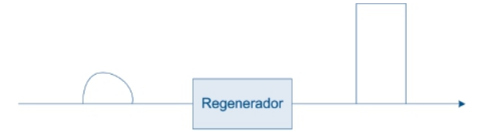<br>
*Fonte: MAIA, Luiz Paulo. Arquitetura de Redes de Computadores, 2ª ed., 2013, p. 100.*

A regeneração é **altamente sensível à presença de ruídos**. Se um sinal chegar demasiadamente atenuado ao regenerador, o ruído pode já ter deformado a informação original (corrompendo os picos). 
> Nesse caso, o circuito acaba regenerando e repassando adiante um dado completamente danificado.

## Largura de Banda:

A **largura de banda** é uma característica física do próprio meio de transmissão: ela define o intervalo de frequências que pode ser sinalizado nesse meio sem perdas significativas e, por consequência, a capacidade máxima de dados que ele consegue transportar. Por exemplo, uma linha telefônica convencional trabalha entre 300 Hz e 3400 Hz, o que dá uma largura de banda de 3100 Hz. Em geral, quanto maior a largura de banda de um meio, maior o seu custo.

## Capacidade de Transmissão:

Para calcular quantos *bits* por segundo (bps) um canal realmente consegue transportar, utilizam-se os seguintes teoremas:

- **Teorema de Nyquist:** Calcula a capacidade máxima de transmissão (CMT) **na ausência de ruído**. A fórmula é `CMT = 2W log2 N`, em que `W` é a largura de banda e `N` é o número de níveis de sinalização utilizados. Ou seja, a quantidade de níveis é proporcional à quantidade de *bits* transmitidos.
- **Teorema de Shannon:** É o Teorema de Nyquist levando em conta a existência de **ruído** no canal (mais especificamente, o ruído térmico). A fórmula é `CMT = W log2 (1 + SNR)`, em que `SNR` é a relação sinal-ruído do canal (*signal-to-noise ratio*). Não leva em conta outros tipos de ruído nem a atenuação.

## Meios de Transmissão:

### Fatores a serem analisados na escolha:

Os meios de transmissão se dividem em **com fio** (par trançado, cabo coaxial e fibra óptica) e **sem fio** (rádio, micro-ondas, satélite e infravermelho). Para comparar esses meios entre si, avalia-se um conjunto de características:

- **Tipo de sinalização:** Suporte a sinalização analógica, digital ou ambas. Apenas o par trançado e o cabo coaxial suportam os dois tipos; os demais suportam apenas sinalização analógica (mesmo assim, é possível transmitir **dados digitais** por eles, modulando o sinal analógico).
- **Largura de banda e capacidade de transmissão:** Meios com frequências mais altas (como a fibra óptica) costumam oferecer maior largura de banda e, consequentemente, taxas de transmissão maiores. Em transmissões sem fio, frequências mais baixas atravessam obstáculos físicos (como paredes) com mais facilidade e sofrem menos com a atenuação, enquanto frequências mais altas exigem antenas menores e permitem que o sinal seja mais facilmente direcionado.
- **Confiabilidade:** Suscetibilidade do meio a problemas como ruído e atenuação. Meios sem fio tendem a ser mais suscetíveis a interferências; entre os meios com fio, a fibra óptica é a menos suscetível.
- **Segurança:** Refere-se à dificuldade de um terceiro interceptar (escutar) os dados. Redes com fio exigem contato físico com o meio, o que dificulta a escuta indevida; já em redes sem fio, o sinal se propaga livremente e pode ser interceptado com mais facilidade, sendo essencial o uso de criptografia.
- **Instalação e manutenção:** Dependem do tipo de meio, do número de dispositivos e da distância entre eles. Redes com fio podem enfrentar dificuldades práticas na passagem de cabos (prédios antigos, áreas de difícil acesso), enquanto meios sem fio dispensam essa etapa.
- **Custo:** Envolve o preço do próprio meio, da instalação, da manutenção e das interfaces/dispositivos de rede envolvidos. Cresce, de forma geral, com o número de dispositivos e a distância entre eles.

### Com fio:

- **Par Trançado:** Dois fios de cobre entrelaçados em espiral (o que reduz o efeito de ruídos). Suporta sinalização analógica e digital e existe em duas variações.

  - **UTP (*Unshielded Twisted Pair*):** Possui baixo custo e fácil instalação, mas é suscetível a ruídos como *crosstalk* (interferência entre cabos vizinhos). Ainda assim, permite taxas acima de 1 Gbps em distâncias curtas.
  - **STP (*Shielded Twisted Pair*):** Possui um revestimento externo que reduz interferências, permitindo maiores distâncias e taxas de transmissão. Por ser mais caro e difícil de manusear, é raramente utilizado (redes *Token Ring* e *Ethernet* de 10 Gbits).

- **Cabo Coaxial:** Formado por um condutor interno (de cobre) e um externo (malha metálica de blindagem), separados por um material isolante e revestidos por uma proteção plástica. É menos suscetível a ruídos que o par trançado, oferecendo taxas de transmissão mais altas e maiores distâncias, porém com maior custo e instalação mais complexa. É utilizado em sistemas de TV a cabo (áudio, vídeo e acesso à *Internet*) e já foi muito usado em redes locais e em transmissões telefônicas de longa distância, tendo sido substituído pela fibra óptica.

- **Fibra Óptica:** Transmite dados por meio de **luz**, utilizando o princípio da **reflexão interna total**: o cabo é formado por um núcleo (de vidro ou plástico), envolvido por um revestimento com índice de refração menor que o do núcleo, de forma que a luz emitida na origem seja refletida pelo revestimento e guiada pelo núcleo até o destino. Ela possui **grande largura de banda** e **maior imunidade a ruídos eletromagnéticos e à atenuação**, além de **maior segurança** (não emite radiação, dificultando a escuta), e é **fácil de instalar** (cabo leve e fino). Todavia, **seu custo é maior** e o **reparo é mais complicado** em caso de rompimento.

  - ***Singlemode*:** Transporta apenas um feixe de luz. É utilizada em transmissões de longa distância, como redes distribuídas.
  - **Multimodo:** Transporta diversos feixes de luz simultaneamente. É utilizada em curtas distâncias, como redes locais.

### Sem fio:

- **Rádio:** Abrange as faixas de rádio AM, rádio FM, TV aberta e telefonia móvel celular. Nessa faixa, as ondas atravessam obstáculos (como paredes) com facilidade e podem alcançar longas distâncias, especialmente quando refratadas na ionosfera. A transmissão utiliza antenas **omnidirecionais** (o sinal é transmitido em todas as direções), dispensando o alinhamento entre transmissor e receptor. Justamente por ser transmitido por difusão, o uso do espectro de rádio é regulamentado pelos governos - exceto pelas faixas **ISM** (*Industrial, Scientific, Medical*), de uso livre em baixa potência, utilizadas por redes locais sem fio (padrão IEEE 802.11) e telefones sem fio.

- **Micro-ondas:** Utiliza antenas **direcionais**, funcionando no esquema ponto a ponto. Por conta da curvatura da Terra, a distância máxima entre duas antenas sem obstáculos é de aproximadamente 48 km (distâncias maiores exigem antenas em elevações). É suscetível a interferências e à atenuação, principalmente em dias de chuva. É amplamente utilizada no sistema telefônico (transmissão de voz), por emissoras de TV (áudio e vídeo) e em conexões ponto a ponto entre prédios próximos.

- **Satélite:** Utiliza estações terrestres e satélites em órbita, que funcionam como repetidores: uma estação transmite um sinal (***uplink***) para o satélite, que o amplifica e retransmite (***downlink***) em uma frequência diferente para outra estação. Cada frequência em que o satélite opera é chamada de ***transponder***. Os satélites **geoestacionários** (a cerca de 36.000 km de altura) acompanham a rotação da Terra, o que facilita o alinhamento com as estações terrestres. Oferece **grande cobertura geográfica** e **grande largura de banda**; todavia, apresenta **suscetibilidade a ruído e à atenuação** e um **atraso de propagação** (cerca de 250 milissegundos). É muito usado na transmissão de TV, em ligações telefônicas de longa distância e em redes corporativas que conectam escritórios distantes.

- **Infravermelho:** Ocupa a faixa de frequências logo abaixo da luz visível. Ao contrário do rádio, o sinal de infravermelho **não ultrapassa obstáculos** como paredes, o que o torna indicado para a conexão de dispositivos próximos dentro de um mesmo ambiente (permitindo, inclusive, que **dispositivos em cômodos diferentes usem a mesma faixa sem interferir entre si**). É utilizado na conexão de periféricos sem fio (teclado, mouse), em redes locais sem fio do padrão IEEE 802.11 (com taxas de 1 e 2 Mbps) e em controles remotos.

## Conversão dos dados:

**Digitalização:** Conversão dos dados analógicos em digitais antes de serem transmitidos pela rede. Esse processo é feito por um dispositivo chamado **CODEC** (**co**dificador-**dec**odificador), que converte o dado analógico para o formato digital na origem e faz o processo inverso no destino.

A técnica mais utilizada para digitalizar áudio é o **PCM** (*Pulse Code Modulation*), em que:

1. O sinal analógico é amostrado (medido) periodicamente, formando pulsos estreitos chamados **PAM** (*Pulse Amplitude Modulated*).
2. Cada pulso é associado a um intervalo de valores, chamado **nível de quantização**.
3. Cada nível de quantização recebe um conjunto de *bits*.

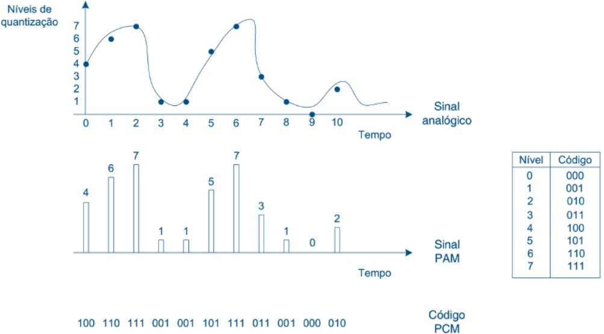<br>
*Fonte: MAIA, Luiz Paulo. Arquitetura de Redes de Computadores, 2ª ed., 2013, p. 117.*

## Técnicas para transmissão da informação:

### Sinalização Digital:

Utiliza variações discretas do sinal físico para representar os dados digitais. É suportada (sem interpretações) apenas por par trançado e cabo coaxial e, devido ao efeito da atenuação em sinais digitais, é usada apenas em pequenas distâncias (são necessários regeneradores para distâncias maiores).

Algumas das principais técnicas de codificação digital são:

- **NRZ-L (*Non Return to Zero-Level*):** Associa um valor de voltagem fixo (arbitrário) a cada *bit*.

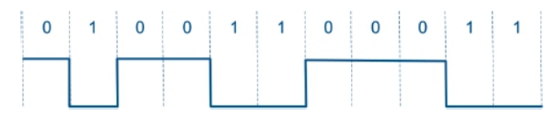<br>
*Fonte: MAIA, Luiz Paulo. Arquitetura de Redes de Computadores, 2ª ed., 2013, p. 118.*

- **NRZ-I (*Non Return to Zero Invert* - codificação diferencial):** Se o sinal se mantém constante, representa o 0; se trocar de fase, representa o 1.

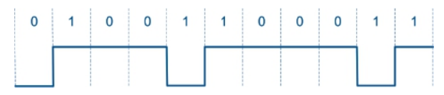<br>
*Fonte: MAIA, Luiz Paulo. Arquitetura de Redes de Computadores, 2ª ed., 2013, p. 118.*

- **Codificação Manchester:** Existe sempre uma transição no meio do período de cada *bit* (se a primeira metade estiver ativa, representa o 0; se a segunda metade estiver alta, representa o 1). Esse método é mais robusto pensando em sincronização, tendo em vista que cada ciclo é sinalizado (transição de fase), sendo possível acompanhar mais facilmente.

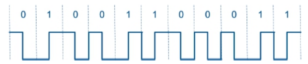<br>
*Fonte: MAIA, Luiz Paulo. Arquitetura de Redes de Computadores, 2ª ed., 2013, p. 119.*

### Sinalização Analógica:

Usa sinais analógicos para transmitir os dados. Um exemplo é a conexão de um computador à *Internet* por linha telefônica, em que os dispositivos se conectam ao meio através de um ***modem*** (modulador-demodulador), responsável por converter (modular) o dado digital em sinal analógico na origem e por fazer o processo inverso (demodular) no destino.

A modulação consiste em alterar uma característica dessa onda (amplitude, frequência ou fase) para representar os *bits* que estão sendo enviados.

- **ASK (*Amplitude Shift Keying*):** A amplitude da onda representa os *bits* (por exemplo, ausência de amplitude = *bit* 0 e presença de amplitude = *bit* 1). É **simples de implementar**, mas **mais suscetível a ruídos e interferências**.

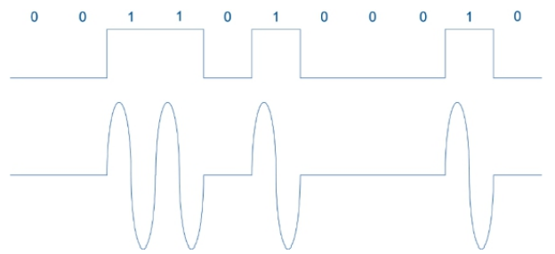<br>
*Fonte: MAIA, Luiz Paulo. Arquitetura de Redes de Computadores, 2ª ed., 2013, p. 121.*

- **FSK (*Frequency Shift Keying*):** A frequência da onda representa os *bits* (cada *bit* corresponde a uma frequência diferente).

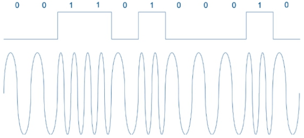<br>
*Fonte: MAIA, Luiz Paulo. Arquitetura de Redes de Computadores, 2ª ed., 2013, p. 121.*

- **PSK (*Phase Shift Keying*):** A fase da onda representa os *bits*.

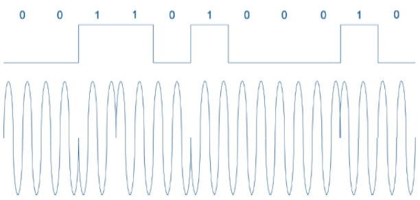<br>
*Fonte: MAIA, Luiz Paulo. Arquitetura de Redes de Computadores, 2ª ed., 2013, p. 122.*

- **QAM (*Quadrature Amplitude Modulation*):**  Utilização simultânea desses modelos para aumentar a capacidade de representação da informação.

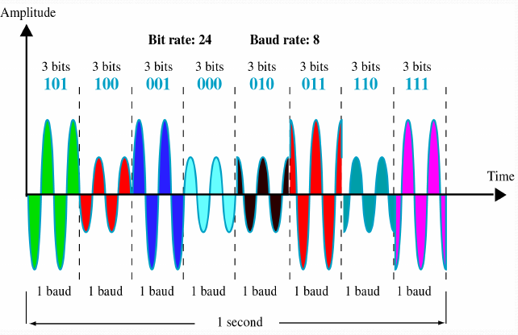<br>
*Fonte: FRAGA, Marcelo Caramuru Pimentel. Redes de Computadores - 6ª Aula, p. 23.*

## Sinalização Multinível:

Os exemplos anteriores codificam apenas **um *bit* por sinal** (**monobit**). É possível aumentar a taxa de transmissão enviando mais de um *bit* por sinal através da **sinalização multinível** (aplicável a sinais digitais e analógicos). A relação entre *bits* e níveis de sinalização é: para enviar **n *bits* por sinal, são necessários 2^n níveis distintos**.

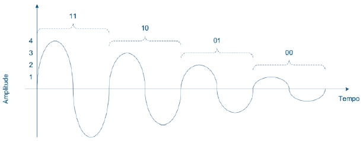<br>
*Fonte: MAIA, Luiz Paulo. Arquitetura de Redes de Computadores, 2ª ed., 2013, p. 123.*

- ***Baud*:** Mede quantas vezes por segundo o *modem* sinaliza o meio (ou seja, quantas amostras/sinais são enviados por segundo).
- **bps:** Mede quantos *bits* por segundo são efetivamente transmitidos. 
> As duas taxas só coincidem na sinalização monobit. Em uma transmissão dibit, por exemplo, um *modem* de 2400 baud (2400 sinais por segundo) transmite, na prática, 4800 bps (2 *bits* por sinal).

## Multiplexação:

Técnica que permite que **diversas transmissões independentes** utilizem o mesmo meio físico simultaneamente, maximizando o seu uso e reduzindo custos.

Todo esse processo é implementado por um aparelho chamado **multiplexador** (ou *mux*), que combina os dados na origem e os separa novamente no destino.

### Multiplexação por Divisão de Frequência (FDM):

- Aproveita-se do fato de a largura de banda do meio tender a ser maior do que o necessário para uma única transmissão, deixando parte da banda ociosa.
- Divide a largura de banda do meio em **canais** (faixas de frequência) independentes, cada um transportando seus próprios dados.
- Esses canais não precisam ter a mesma largura, permitindo transmitir tipos diferentes de informação (por exemplo, dados, voz e vídeo) simultaneamente no mesmo meio.
- Esse modelo pode ser aproveitado tanto na **divisão de dados de um único usuário**, com a separação de faixas de frequência para dados diferentes (áudio, vídeo etc.) de um mesmo usuário, permitindo a utilização mais eficiente da sua largura de banda, quanto na **divisão de usuários**, princípio que permite a existência de múltiplos usuários simultâneos na rede. Cada um utiliza uma faixa de frequência dentro da sua largura de banda (como no rádio).

### Multiplexação por Divisão de Tempo (TDM):

- Aproveita-se do fato de que, mesmo quando o meio é usado em sua capacidade máxima (o que raramente ocorre o tempo todo), grande parte do tempo está ocioso.
- Cada dispositivo utiliza **toda** a largura de banda do meio, mas apenas durante um intervalo de tempo específico, chamado ***slot***. As informações são divididas em pedaços menores (pacotes) e enviadas aos poucos.

- **TDM síncrono:** Cada dispositivo recebe *slots* previamente definidos, que se repetem a cada ciclo. Mesmo que não tenha dados para enviar, os intervalos reservados a ele podem ficar sem uso.

- **TDM assíncrono (estatístico):** Os *slots* não ficam permanentemente reservados a um dispositivo. Eles são atribuídos conforme a demanda, permitindo que dispositivos com dados para enviar aproveitem intervalos que, no modelo síncrono, poderiam ficar ociosos.

É possível, inclusive, combinar FDM e TDM no mesmo meio: TVs a cabo com acesso à *Internet*, por exemplo, usam FDM para dividir o meio em três grandes faixas (canais, *upload* e *download*) e, dentro da faixa de *upload*/*download*, usam TDM para compartilhar o acesso entre os vários usuários.

## Transmissão *Simplex*, *Half-Duplex* e *Full-Duplex*:

Classificação de uma transmissão conforme a direção do fluxo de dados entre transmissor e receptor.

- ***Simplex*:** Os dados trafegam em um único sentido (transmissor → receptor, como rádio, televisão etc.).

- ***Half-Duplex*:** Os dados podem trafegar nas duas direções, mas nunca ao mesmo tempo (é necessário um intervalo para inverter o sentido da transmissão, como em *walkie-talkies*).

- ***Full-Duplex (*duplex*):** Os dados trafegam nas duas direções **simultaneamente**, sem necessidade de *turnaround*. É o modelo predominante em redes de computadores atuais, podendo ser implementado com dois canais independentes (um para cada sentido - comum em fibra óptica, que usa duas fibras) ou multiplexando um único canal em duas faixas de frequência (esquema usado pela maioria dos *modems*). É o modo utilizado em redes locais *Ethernet* que utilizam *switches*.

## Transmissão Serial e Paralela:

Classificação conforme a forma como os sinais são encaminhados entre transmissor e receptor.

- **Paralela:** Os sinais são transmitidos simultaneamente, seja através de canais independentes (por exemplo, cada *bit* de um *byte* indo por um fio diferente - método mais defasado e quase integralmente substituído pela transmissão serial), como os padrões SCSI e ATA, ou multiplexando um único meio em várias faixas de frequência.

- **Serial:** Os sinais (*bits*) são transmitidos sequencialmente, um após o outro, por um único canal. É o modelo mais utilizado em computadores (discos como SSDs, SATA - *Serial ATA*, PCIe etc.), justamente por sua simplicidade, baixo custo de implementação e velocidade (suporta frequências maiores sem interferência eletromagnética e sem *overhead* na organização dos *bits*).

## Transmissão Assíncrona e Síncrona:

Para garantir que um sinal não seja perdido ou lido duas vezes, corrompendo o dado (problema conhecido como **sincronização**), a transmissão de informação é controlada por uma espécie de "relógio" presente nas interfaces do transmissor e do receptor, e a diferença entre as duas técnicas está em como esses relógios se relacionam.

- **Transmissão assíncrona (*start/stop*):** O transmissor e o receptor **não** estão sincronizados entre si. Para compensar isso, a sincronização é feita **por caractere**: cada caractere transmitido é precedido por um *bit* de início e finalizado por um ou dois *bits* de término. É simples e barata de implementar, mas relativamente lenta, além do *overhead* de informação com os *bits* extras.

- **Transmissão síncrona:** O transmissor e o receptor estão sincronizados entre si. A sincronização é feita **por blocos** de caracteres ou *bits*. Cada bloco é precedido por um ou mais caracteres de sincronismo, chamados **SYN**, que permitem ao receptor ajustar seu relógio ao do transmissor. É mais eficiente que a transmissão assíncrona, mas exige interfaces mais precisas (e, portanto, mais caras).

> Vale lembrar que o sincronismo também pode ser obtido através da própria codificação do sinal (como visto na codificação Manchester).

## Topologias de Rede:

A **topologia** de uma rede define como os dispositivos estão fisicamente conectados entre si. Como já apresentado, essa conexão pode seguir dois modelos gerais - **ponto a ponto** (conexão dedicada entre dois dispositivos, sem compartilhamento físico do canal) ou **multiponto** (o canal de comunicação é compartilhado por três ou mais dispositivos).

### Ponto a Ponto:

- **Totalmente Ligada:** Todos os dispositivos estão conectados diretamente a todos os demais (em uma rede com `N` dispositivos, são `N * (N - 1) / 2` conexões). Possui **excelente desempenho** (conexão direta entre quaisquer dois pontos) e **alta disponibilidade** (existem vários caminhos alternativos caso uma conexão falhe), mas seu **custo de instalação e manutenção muito alto**, além de **baixa escalabilidade** (adicionar um novo dispositivo exige criar conexões com todos os outros já existentes). 
> Pouco usada na prática, servindo mais como referência comparativa.

- **Estrela:** Todos os dispositivos se conectam a um dispositivo central. Para dois dispositivos (que não sejam o concentrador) se comunicarem, a mensagem precisa passar primeiro pelo concentrador, que a reencaminha ao destino. É bastante **simples** e possui **baixo custo**, mas possui **baixa disponibilidade** (a rede inteira depende do concentrador - se ele falhar, ninguém mais se comunica) e possível **gargalo de desempenho** (todo o tráfego passa por ele).

- **Hierárquica ou em Árvore:** Bastante parecida com a topologia em estrela, mas com uma hierarquia: um dispositivo, para se comunicar com outro, pode precisar passar por mais de um ponto intermediário até alcançar o destino. Tem **boa escalabilidade** (basta adicionar concentradores e criar novos níveis) e, por ter vários concentradores, **distribui melhor os pontos de falha e o tráfego da rede** (o que também ajuda no desempenho). Semelhantes à topologia em estrela, se um ponto falhar, os dispositivos ligados a ele (e aos concentradores abaixo dele) ficam isolados do restante da rede, embora consigam continuar se comunicando entre si.

- **Distribuída:** Sem chegar ao custo da topologia totalmente ligada, oferece alguns **caminhos alternativos** entre os dispositivos da rede, aumentando a disponibilidade. O mecanismo que permite escolher entre esses caminhos é chamado de **comutação**, e os dispositivos responsáveis por essa tarefa são chamados de **comutadores**. Oferece uma boa relação entre disponibilidade, escalabilidade e custo-desempenho, por isso é muito utilizada em redes do tipo WAN - como a própria *Internet*, em que a comutação é feita **por pacotes** e os comutadores responsáveis por essa tarefa são os **roteadores**.

### Multipontos:

- **Barra:** Todos os dispositivos são conectados ao mesmo meio de transmissão (um único barramento), compartilhado tanto para o envio quanto para o recebimento de mensagens. É **simples** e possui **baixo custo**, mas **qualquer problema no meio** (como o rompimento do cabo) **deixa todos os dispositivos incomunicáveis**, além de apresentar **baixa escalabilidade** e um **gargalo de desempenho**.

- **Anel:** Os dispositivos compartilham o mesmo canal de comunicação, organizado em forma de anel. Suas vantagens e desvantagens são semelhantes às da topologia em barra. O controle de acesso ao meio mais comum nessa topologia é a **passagem de *token***: um *token* (uma espécie de "permissão para transmitir") circula pelo anel; o dispositivo que deseja transmitir precisa esperar a chegada do *token*, retirá-lo do anel, enviar seus dados e, em seguida, reinserir um novo *token*, liberando o meio para os demais.

---

# 03. Camada de Enlace

## Introdução e Comparação com a Camada Física:

Enquanto a **Camada Física** foca na transmissão bruta dos *bits* através do canal, a **Camada de Enlace** atua como uma transição lógica. Ela não avalia se o conteúdo da informação "faz sentido" para a aplicação final, mas organiza os dados e garante que a entrega local entre dois pontos ocorra de forma íntegra e estruturada.

Para garantir essa integridade, a Camada de Enlace exerce as seguintes funções principais:

- **Enquadramento:** Agrupa os *bits* brutos recebidos em blocos lógicos chamados **quadros** (*frames*).
- **Controle de Erros:** Detecta (e, dependendo da tecnologia, corrige) danos ou anomalias sofridos pelos *bits* durante a transmissão física.
- **Controle de Fluxo:** Regula a velocidade e o volume do envio de dados para não sobrecarregar o receptor.
- **Controle de Acesso ao Meio:** Em redes com canais compartilhados, gerencia quando cada dispositivo pode transmitir, a fim de evitar colisões.

## Quadros (*Frames*):

Em vez de trabalhar com *bits* brutos, a Camada de Enlace organiza a informação em blocos estruturados de *bits*, chamados de **quadros** ou ***frames***. Um quadro é tipicamente formado por três estruturas básicas.

1. **Cabeçalho:** Contém as informações de controle para que haja a comunicação horizontal entre as camadas (origem e destino da mensagem, e protocolo utilizado).

2. **Dados:** Representam a carga útil da mensagem (a informação propriamente dita que foi repassada pelas camadas superiores).

3. **CDE (Código de Detecção de Erro):** Estrutura que tem a função de controlar os erros, permitindo verificar se a mensagem sofreu alguma alteração ou corrupção durante a transmissão física.

> O tamanho de cada uma dessas estruturas varia de acordo com o protocolo.

## Enquadramento:

Como a Camada de Enlace trabalha com quadros que podem ter tamanhos variáveis, é necessário identificar exatamente onde cada mensagem começa e termina. Para estabelecer esses limites, a maioria dos protocolos utiliza uma ***flag*** (marcador). Essa *flag* atua como um sinalizador de início e fim do quadro, podendo ser representada por um caractere específico ou por uma sequência especial de *bits*.

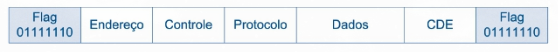<br>
*Fonte: MAIA, Luiz Paulo. Arquitetura de Redes de Computadores, 2ª ed., 2013, p. 153.*

### Problemas na Utilização de *Flags*:

Um problema comum ao utilizar *flags* é que o padrão de *bits* ou o caractere que as representa pode aparecer espontaneamente no meio da mensagem.

Para evitar que o receptor confunda esse pedaço de dado com o fim do quadro, pode-se adicionar um dado extra à mensagem para quebrar esse padrão acidental (*stuffing*). O receptor, ao ler a mensagem, identifica e retira esse dado extra antes de repassá-la para frente.

- ***Stuffing*:** Insere caracteres (transmissões orientadas a *byte* - *byte stuffing*) ou *bits* (orientadas a *bits* - *bit stuffing*) extras logo antes da *flag* que apareceu acidentalmente nos dados.

## Endereçamento:

Na camada de enlace, os endereços usados na comunicação local identificam interfaces de rede. Em tecnologias como *Ethernet*, eles são chamados de endereços **MAC (*Medium Access Control*)**. Esse endereço possui o tamanho padrão de **6 *bytes*** (2^48 endereços possíveis, mas uma parte é reservada à identificação do fabricante).

### Alvos do Endereçamento:

Existem três maneiras de direcionar uma mensagem na rede, dependendo da quantidade de destinatários desejados:

- ***Unicast*:** A mensagem é enviada para apenas um dispositivo específico (comunicação um-para-um).
- ***Multicast*:** A mensagem é enviada para um grupo selecionado de dispositivos (comunicação um-para-vários).
- ***Broadcast*:** A mensagem é transmitida para todos os dispositivos conectados na rede local (domínio do *broadcast* - comunicação um-para-todos).

## Detecção de Erros:

Para identificar falhas que podem ter ocorrido na mensagem durante a transmissão física (como aquelas causadas por ruído ou atenuação) e, em alguns casos, até mesmo reverter o erro, a camada de enlace aplica mecanismos de controle. Esse processo é feito utilizando o **CDE**. Trata-se de um conjunto de *bits* gerado a partir de operações matemáticas aplicadas aos dados da mensagem pelo remetente. Ao receber o quadro, o destinatário refaz essas mesmas operações para verificar a integridade da informação. Se o valor calculado pelo receptor for diferente do CDE original recebido, a mensagem sofreu alterações e é considerada inválida.

### Mecanismos de Detecção: 

- ***Bit* de Paridade:** É a técnica mais simples de detecção de erros. Consiste em adicionar um único *bit* extra (atuando como CDE) ao final do bloco de dados transmitido para garantir que a quantidade de ***bits* '1'** presentes na mensagem seja par (**paridade par** - CDE = 1 se a quantidade de *bits* '1' da mensagem for **ímpar**) ou ímpar (**paridade ímpar** - lógica inversa).

- **Paridade Múltipla:** O *bit* de paridade por si só é consideravelmente inseguro (alterações em múltiplos *bits*, inclusive no *bit* de paridade, podem passar despercebidas). Para contornar isso, pode ser utilizada a técnica de **paridade múltipla**, realizando a paridade individual das linhas, de cada uma das colunas, e até da linha de paridade múltipla.

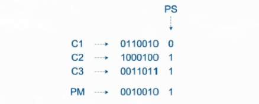<br>
*Fonte: MAIA, Luiz Paulo. Arquitetura de Redes de Computadores, 2ª ed., 2013, p. 159.*

- ***Checksum*:** É um método de detecção utilizado principalmente quando a mensagem é estruturada em blocos de caracteres. Nele, realiza-se a soma dos valores numéricos dos blocos, divide-se o resultado por uma constante predefinida (depende do tamanho do bloco - com 8 *bits*, 256), e o **resto dessa divisão** torna-se o valor do *checksum* (CDE).

> Considerando a mensagem "MODEM!": Tira-se o valor ASCII (77 79 68 69 77 33), soma-se tudo (403), obtém-se o resultado modular (147 = ô) e adiciona-se esse valor ao final da mensagem (MODEM!ô).

- **CRC (*Cyclic Redundancy Check*):** Técnica de detecção de erros baseada em uma divisão binária feita com operações `XOR`. O transmissor e o receptor usam a mesma sequência de *bits*, chamada **polinômio gerador**. Para calcular o CRC, o transmissor acrescenta temporariamente zeros ao fim dos dados, faz a divisão e coloca o **resto obtido** no lugar desses zeros. O receptor divide o conjunto recebido pelo mesmo gerador. Neste modelo simplificado, um resto diferente de zero indica erro; um resto igual a zero indica apenas que **nenhum erro foi detectado**.
> Não é uma garantia absoluta de que os dados estão intactos, mas é um dos melhores métodos de detecção levando em conta sua eficiência.

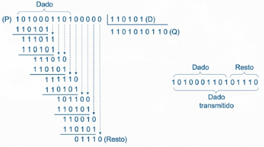<br>
*Fonte: MAIA, Luiz Paulo. Arquitetura de Redes de Computadores, 2ª ed., 2013, p. 161.*

## Hamming:

### Distância de Hamming:

É uma métrica para definir a **distância mínima** (quantidade de *bits* divergentes) entre dois blocos válidos de dados (111000 e 110001 têm uma distância de 2).

- **Detecção de Erros:** Para detectar `n` erros, a distância mínima suportada (intrínseca ao algoritmo) precisa ser igual a `n + 1`.
- **Correção de Erros:** Para corrigir `n` erros, a distância mínima suportada (intrínseca ao algoritmo) precisa ser igual a `2n + 1`.

### Algoritmo de Hamming:

É uma técnica que insere ***bits* de redundância** (paridade) em posições estratégicas da mensagem original. Esse método permite não apenas detectar, mas localizar e corrigir um erro simples que tenha ocorrido durante a transmissão da informação.

- ***Bits* de paridade:** Os *bits* de paridade ocupam exclusivamente as posições da mensagem correspondentes às potências de 2 (posições `2^0 = 1`, `2^1 = 2`, `2^2 = 4`, ...). Os espaços restantes (3, 5, 6, 7, 9 etc.) são preenchidos sequencialmente pelos *bits* de dados da mensagem original. O tamanho da mensagem final é igual à `n + (⌊log2(n)⌋ + 1)`, onde `n` é a quantidade original.
- **Verificação:** Cada *bit* de paridade atua como um "fiscal" de um conjunto específico de posições. A composição desse conjunto obedece a uma lógica matemática: um *bit* de dado será verificado pelos *bits* de paridade da sua posição em binário. Por exemplo, o dado na posição 7 = 111 será verificado pelas paridades na posição 100 = 4, 10 = 2 e 1.
- **Localização do Erro:** A grande vantagem desse método reside na verificação cruzada. Quando um *bit* de dado é corrompido na transmissão, as paridades responsáveis por ele apresentarão erro, sendo possível localizar o ponto de falha pela interseção das paridades.

Por exemplo, considerando uma mensagem qualquer, originalmente de 16 *bits* (passa a ter 21), com o seguinte resultado das paridades:

  1. `b1` (1,3,5,7,9,11,13,15,17,19,21): Falha;
  2. `b2` (2,3,6,7,10,11,14,15,18,19): Acerto;
  3. `b4` (4,5,6,7,12,13,14,15,20,21): Falha;
  4. `b8` (8,9,10,11,12,13,14,15): Acerto;
  5. `b16` (16,17,18,19,20,21): Acerto;

Os potenciais *bits* problemáticos são dados por `b1 ∩ b4 - (b2 U b8 U b16)`, resultando apenas no *bit* 5 como problemático.
> Para obter o resultado mais facilmente, pode-se realizar a soma ponderada `1 * b1 + 2 * b2 + 4 * b4 + 8 * b8 + ...`, em que `bi` é 0 se houver acerto e 1 se houver erro.

O código de Hamming descrito possui distância mínima de 3. Por conta dessa limitação, ele consegue **corrigir um erro** por mensagem (`2n + 1 = 3 => n = 1`), mas não garante a correção de dois ou mais erros simultâneos.

## Correções de Erros:

É importante salientar que **nem sempre a camada de enlace implementará métodos para correção de erros**, pois eles podem ser dispensáveis quando se usam meios de transmissão muito resistentes a ruído (como a fibra óptica), ou a responsabilidade pela correção pode ser delegada às camadas superiores.

### Transmissão *Stop-and-Wait*:

A comunicação em um cenário ideal (sem perda de dados) funciona através de uma confirmação passo a passo (protocolo *Stop-and-Wait*). O transmissor envia um quadro de dados para o receptor (pode ser o destino final ou um intermediário) e bloqueia temporariamente novos envios. Ao receber a mensagem e constatar a ausência de erros, o receptor devolve um reconhecimento (***acknowledgement* - ACK**).
> O nó intermediário, após enviar o ACK para a máquina anterior, assume o papel de transmissor. Ele encaminha o quadro para o próximo dispositivo da rota e aguarda o recebimento do respectivo ACK, repetindo o ciclo até o destino final.

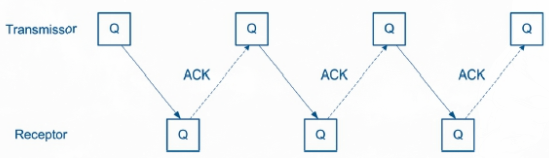<br>
*Fonte: MAIA, Luiz Paulo. Arquitetura de Redes de Computadores, 2ª ed., 2013, p. 163.*

### Transmissão com Perda de Quadros (Temporizadores):

A comunicação em rede real está sujeita a atrasos e perdas. **Um quadro pode não chegar ao destino**, ou **a própria confirmação (ACK) pode se perder** no caminho de volta. Para lidar com isso, os protocolos implementam mecanismos automáticos de recuperação.

- **Retransmissão por *Timeout*:** O transmissor aciona um cronômetro no momento em que envia a mensagem. Se o tempo limite (*timeout*) se esgotar sem o recebimento do ACK, o sistema deduz que ocorreu uma falha e retransmite o quadro automaticamente.

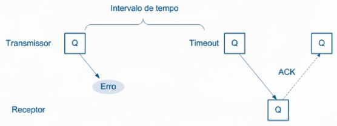<br>
*Fonte: MAIA, Luiz Paulo. Arquitetura de Redes de Computadores, 2ª ed., 2013, p. 163.*

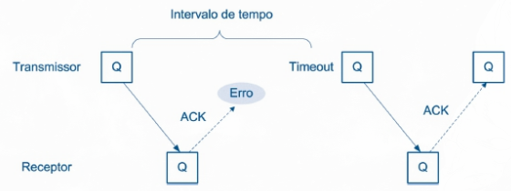<br>
*Fonte: MAIA, Luiz Paulo. Arquitetura de Redes de Computadores, 2ª ed., 2013, p. 164.*

### Tratamento de Transmissões com Erro:

Quando um quadro chega ao destino, mas a verificação acusa que a mensagem foi corrompida, a resposta depende da confiabilidade do meio físico e do custo da retransmissão. As principais abordagens são:

- **Descarte (Espera por *Timeout*):** O receptor ignora e descarta a mensagem defeituosa. O transmissor, ao não receber o ACK, aguardará o seu temporizador estourar (*timeout*) e executará o reenvio automaticamente.
- **NAK (*Negative Acknowledgement*):** O receptor avisa ativamente o transmissor que o quadro chegou corrompido. Ao receber o NAK, o transmissor interrompe o temporizador e reenvia a mensagem imediatamente.
> Na prática, essa técnica não é tão benéfica, pois adiciona complexidade ao sistema sem garantias absolutas (o próprio NAK pode se perder durante o retorno).
- **FEC (*Forward Error Correction*):** Em vez de solicitar o reenvio, **o sistema aplica técnicas de correção diretamente no destino** (como o Algoritmo de Hamming). Embora os *bits* de redundância gastem mais largura de banda, a técnica compensa em meios físicos com alta taxa de erros ou com alto custo de retransmissão (como conexões sem fio ou via satélite).

### ARQ (*Automatic Repeat reQuest*):

As técnicas de detecção de erros, combinadas com o uso de temporizadores e mensagens de confirmação, formam a base dos protocolos de controle de erros. As abordagens principais são:

- **Protocolo de *Bit* Alternado:** Os quadros são enviados com *bits* alternados. Se o ACK for perdido e o quadro for reenviado, o receptor usa esse *bit* para identificar a duplicata e descartá-la.
> Esse protocolo é simples, mas ineficiente (o transmissor tem de esperar a informação ir e voltar para só então enviar o próximo bloco).

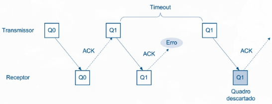<br>
*Fonte: MAIA, Luiz Paulo. Arquitetura de Redes de Computadores, 2ª ed., 2013, p. 167.*

- **Retransmissão Integral:** Para resolver o problema da ociosidade, o transmissor envia uma sequência contínua de vários quadros (uma "janela") sem esperar a confirmação individual de cada um. O receptor só aceita os quadros na ordem exata.
> Apesar da maior eficiência, se um quadro falhar, o receptor descarta esse quadro e **todos** os seguintes que já estavam a caminho.

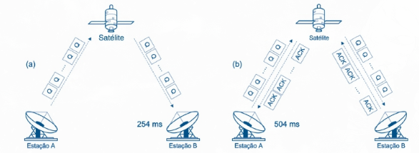<br>
*Fonte: MAIA, Luiz Paulo. Arquitetura de Redes de Computadores, 2ª ed., 2013, p. 170.*

- **Retransmissão Seletiva:** Opera com uma janela deslizante (*pipeline*), na qual os quadros recebem números sequenciais e vários blocos podem ser transmitidos sem aguardar a confirmação de cada um. O receptor armazena os quadros em *buffers* e, em caso de falha, o transmissor reenvia apenas o quadro pendente (o receptor guarda os quadros 2, 3 e 4 enquanto espera o 1 que falhou, por exemplo). Depois que o receptor ordena a mensagem completa, o *buffer* é liberado.

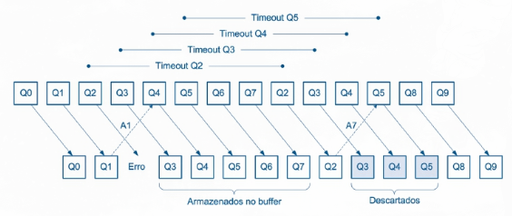<br>
*Fonte: MAIA, Luiz Paulo. Arquitetura de Redes de Computadores, 2ª ed., 2013, p. 175.*

## Controle de Fluxo:

Também são necessários mecanismos para sincronizar a velocidade de comunicação entre os dispositivos. Eles impedem que um transmissor rápido envie mais dados do que o receptor consegue processar e armazenar, evitando o transbordo do *buffer* e a perda de informações.

Para gerenciar essa sincronização e evitar o afogamento do receptor, os protocolos podem adotar diferentes estratégias:

- **Descarte por Transbordo (Reativo):** Se o *buffer* encher, o receptor é fisicamente forçado a ignorar e descartar os novos pacotes. O transmissor não recebe o ACK e trata a situação usando os mecanismos de controle de erros (retransmite por *timeout*, por exemplo).
- **Sinalização de Parada:** O receptor monitora o limite da sua memória e envia um quadro de controle (ou *bits* específicos) avisando o transmissor de que o *buffer* está cheio. O transmissor pausa o envio até receber um novo sinal verde.
- **Controle Baseado em Créditos (Janela):** É uma abordagem dinâmica na qual o receptor aproveita o envio do ACK para informar quanto espaço ainda tem livre no *buffer*. Assim, o transmissor ajusta a quantidade de mensagens que pode enviar antes de parar e esperar.

# Apêndice A - Arquitetura Prática de Redes Locais

Fugindo um pouco do modelo teórico e abstrato das seções anteriores, este se pauta em protocolos práticos e utilizados em diversas camadas da arquitetura de uma rede:

## Controle de Acesso ao Meio:

Quando vários dispositivos compartilham o mesmo canal, é preciso decidir **quem pode transmitir e quando** (informações no mesmo canal ao mesmo tempo podem se misturar/sobrepor), causando uma **colisão**. Os métodos de controle de acesso são:

### Acesso Particionado:

Cada dispositivo recebe uma parte do meio, como uma faixa de frequência, um intervalo de tempo ou um código. As transmissões podem ocorrer sem colisões entre os participantes corretamente separados.

- **FDMA (*Frequency Division Multiple Access*):** Divide a capacidade do meio em faixas de frequência. Cada dispositivo utiliza sua própria faixa, como duas estações de rádio transmitindo simultaneamente em frequências diferentes. A separação evita colisões entre as faixas, mas uma faixa reservada continua sem uso quando seu dispositivo não está transmitindo.
> É necessário deixar pequenos espaços entre faixas vizinhas para reduzir interferências.

- **TDMA (*Time Division Multiple Access*):** Divide o tempo em intervalos (*slots*). Cada dispositivo transmite no seu intervalo reservado e, ao terminar uma sequência de *slots*, o ciclo se repete (cada participante tem um intervalo para transmitir). Dessa maneira, evitam-se colisões entre dispositivos que respeitam seus intervalos, mas alguém pode precisar esperar sua próxima vez.
> Um *slot* reservado também pode ficar vazio. A alocação dinâmica de intervalos procura reduzir esse desperdício.

- **CDMA (*Code Division Multiple Access*):** Permite que dispositivos transmitam no mesmo intervalo e na mesma faixa de frequência. As transmissões são distinguidas por códigos, e o receptor utiliza o código correspondente para recuperar o sinal desejado. É como se ocorressem várias conversas simultâneas em idiomas diferentes (só consegue acompanhar quem conhece o idioma).
> Na prática, sinais simultâneos ainda podem interferir uns nos outros se o sistema não for bem controlado.

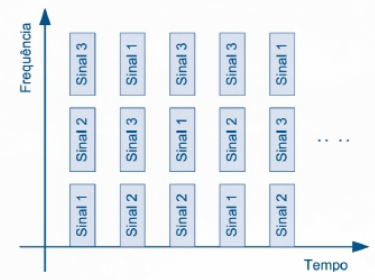<br>
*Fonte: MAIA, Luiz Paulo. Arquitetura de Redes de Computadores, 2ª ed., 2013, p. 188.*

### Acesso Aleatório:

Os dispositivos tentam transmitir quando têm dados. Se houver colisão, aguardam um intervalo e tentam novamente.

- **ALOHA puro:** O dispositivo envia o quadro assim que tem dados, sem verificar se alguém já está transmitindo. Se não recebe a confirmação de entrega (*ACK*, ou reconhecimento), considera que a tentativa pode ter falhado e retransmite após uma espera aleatória (para diminuir a chance de uma segunda colisão).
> Mesmo em condições ideais, a utilização máxima do meio pelo ALOHA puro fica em torno de **18%**.

- **ALOHA com *slots*:** Mantém a liberdade de tentativa, mas divide o tempo em intervalos. Um dispositivo só pode começar a transmitir **no início de um *slot***. Assim, as colisões ficam concentradas nos casos em que dois ou mais dispositivos escolhem o mesmo intervalo.
> Essa organização eleva a utilização máxima ideal para cerca de **37%**, mas ainda pode haver colisões e intervalos vazios.

- **CSMA (*Carrier Sense Multiple Access*):** Antes de transmitir, o dispositivo verifica se o meio parece estar livre. É como ouvir se alguém já está falando antes de usar o rádio. Isso reduz colisões, mas não as elimina (dois dispositivos podem perceber o canal livre quase ao mesmo tempo e começar a transmitir juntos).
  - **CSMA persistente:** O dispositivo que encontra o meio ocupado continua acompanhando-o e tenta transmitir assim que ele fica livre.
  - **CSMA não persistente:** Ele espera um intervalo antes de verificar novamente.
  > A segunda estratégia pode reduzir a disputa imediata entre vários dispositivos que aguardavam a liberação do canal, embora também possa aumentar a espera.

- **CSMA/CD (CSMA com detecção de colisão):** Além de verificar o meio antes de começar, a interface monitora a transmissão para **detectar uma colisão enquanto ela acontece**. Se isso ocorre, interrompe o envio, sinaliza a colisão e espera um tempo aleatório antes de tentar novamente. Após colisões sucessivas, o intervalo possível de espera aumenta (*backoff* exponencial).

> Esse mecanismo se aplica ao **Ethernet com meio compartilhado**, como redes antigas com cabo coaxial ou *hub*. Em uma ligação *Ethernet* atual entre um dispositivo e uma porta de *switch*, operando em *full-duplex*, não existe aquela disputa pelo meio compartilhado (por isso, o CSMA/CD não é necessário nessa ligação).

- **CSMA/CA (CSMA com prevenção de colisão):** Em redes sem fio, uma estação não consegue detectar colisões durante sua transmissão com a mesma facilidade. Por isso, o objetivo é **reduzir a chance de colisão antes de enviar**. A estação observa o canal, aguarda os intervalos exigidos pelo protocolo e pode trocar pequenos quadros de reserva antes de transmitir os dados. Essa reserva pode usar um pedido para enviar (***Request to Send*, RTS**) e uma autorização para enviar (***Clear to Send* - CTS**). Apesar dessas preocupações, ainda existem alguns problemas possíveis, como:

  - **Estação Escondida:** X e Z conseguem se comunicar com Y, mas estão longe demais para se ouvir. X pode julgar o canal livre enquanto Z transmite para Y. Quando Y responde com CTS, as estações ao seu alcance sabem que devem aguardar.

  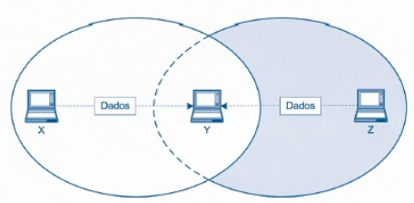<br>
  *Fonte: MAIA, Luiz Paulo. Arquitetura de Redes de Computadores, 2ª ed., 2013, p. 196.*

  - **Estação Exposta:** Uma estação ouve uma transmissão próxima e deixa de enviar, mesmo quando seu destinatário está fora da área de interferência daquela comunicação.

  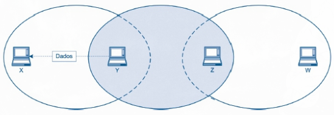<br>
  *Fonte: MAIA, Luiz Paulo. Arquitetura de Redes de Computadores, 2ª ed., 2013, p. 197.*
  > Esses dois casos mostram por que **ouvir o canal** nem sempre descreve toda a situação de uma rede sem fio.

### Acesso Ordenado:

- **Consulta centralizada (*polling*):** Um dispositivo central pergunta, em sequência, quais estações têm dados para transmitir e concede a vez a cada uma (moderador).
> A ordem evita colisões, mas as consultas consomem tempo e o funcionamento depende do dispositivo central.

- **Passagem de *token*:** Em vez de um moderador central, uma autorização chamada *token* circula entre os dispositivos. Quem recebe o *token* livre pode transmitir, os demais aguardam sua vez. O desafio é manter essa autorização circulando corretamente, inclusive quando há falhas.

## *Ethernet* e o Modelo IEEE 802:

Como já mencionado anteriormente, no padrão *Ethernet*, a camada de Enlace pode ser subdividida em:

- **MAC (Controle de Acesso ao Meio):** Ferramenta responsável por aspectos como controle de acessos, endereços, formato do quadro e verificação de erros.
- **LLC (Controle do Enlace Lógico):** Oferece à Camada de Rede uma forma de utilizar diferentes tecnologias de enlace, podendo oferecer serviços com ou sem estabelecimento prévio de uma ligação lógica, e com ou sem confirmação de entrega.

  - **Orientado à conexão:** Estabelece uma ligação lógica antes da comunicação e pode oferecer controle de fluxo e confirmação de entrega dos quadros.
  - **Não orientado à conexão:** Dispensa a ligação lógica prévia. Pode operar **com reconhecimento** ou **sem reconhecimento** de entrega.
  > No serviço sem reconhecimento, uma camada superior pode cuidar da entrega confiável quando a aplicação precisar dela; o TCP, por exemplo, oferece esse recurso na camada de transporte.

### Quadro *Ethernet*:

O quadro *Ethernet* especifica os campos necessários para uma entrega local. Além dos **dados**, ele inclui os endereços MAC da origem e do destino, um campo de identificação e uma verificação de erros no final.

- **Preâmbulo e marcador de início:** Ajudam o receptor a se sincronizar e a reconhecer o início do quadro.
- **MAC de destino:** Indica a interface à qual o quadro se destina.
- **MAC de origem:** Identifica a interface que o enviou.
- **Tamanho/Tipo:** Informa o tamanho dos dados em um formato de quadro ou identifica o protocolo transportado em outro.
- **Dados:** Transportam a informação recebida da camada superior.
- **Sequência de verificação de quadro (*Frame Check Sequence*, FCS):** Contém o resultado da verificação de erros feita com CRC.

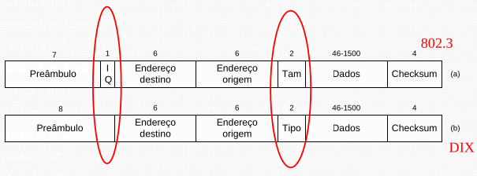<br>
*Fonte: FRAGA, Marcelo Caramuru Pimentel. Redes de Computadores - 11ª Aula, p. 15.*

> A principal diferença entre os formatos **IEEE 802.3** e ***Ethernet* II (DIX)** está no campo de `2 bytes` após os endereços: no IEEE 802.3, ele indica o **tamanho** dos dados; no Ethernet II, indica o **tipo** do protocolo transportado.

O quadro *Ethernet* tem um **tamanho mínimo de `64 bytes`**, desconsiderando o preâmbulo e o marcador de início (`6 + 6 + 2 + 46 + 4 = 64`). Se houver menos de `46 bytes` de dados, acrescenta-se um **preenchimento** (*padding*).
> Esse tamanho mínimo garante (em sistemas compartilhados como CSMA/CD) que uma estação ainda esteja transmitindo quando o sinal de uma possível colisão distante consiga retornar até ela (se ele terminasse cedo demais, a estação poderia concluir que a transmissão deu certo antes de perceber a colisão).

### Evolução do *Ethernet*:

1. **10BASE5 e 10BASE2:** Primeiras redes *Ethernet*. Diferem, entre outros aspectos, no tipo de cabo e nas distâncias admitidas. Compartilhavam um cabo coaxial em topologia de barra.
> Uma falha no cabo ou uma mudança na instalação podia afetar várias estações.

2. **10BASE-T:** As estações passaram a usar cabos de par trançado conectados a um ponto central (topologia física estrela). Isso facilitou a instalação e a manutenção, mas o comportamento dependia do equipamento central.

  - **Utilização com um *hub*:** Todos ainda compartilham o mesmo domínio de colisão (na prática, continuava com a topologia lógica de barra).
  - **Utilização com um *switch*:** As portas podem operar de forma independente.

3. **Padrões atuais:** Oferecem velocidades de transmissão como *Fast Ethernet* (`100 Mbps`) e *Gigabit Ethernet* (`1 Gbps`) e até superiores.

Nas redes compartilhadas, aumentar a taxa torna o tempo de transmissão do quadro mínimo menor, exigindo atenção aos limites de distância para a detecção de colisões.
> A adoção de *switches* e conexões *full-duplex* retirou essa disputa do funcionamento normal dessas ligações.

## Equipamentos de Interconexão:

- **Repetidor:** Atua na **Camada Física**. Recebe um sinal enfraquecido, regenera-o e o envia ao trecho seguinte. Ele permite estender a comunicação, mas não lê os endereços do quadro nem decide quais dispositivos deveriam recebê-lo.

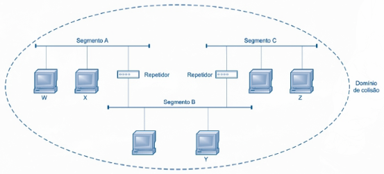<br>
*Fonte: MAIA, Luiz Paulo. Arquitetura de Redes de Computadores, 2ª ed., 2013, p. 220.*

- ***Hub*:** Repetidor com várias portas. O sinal que chega por uma delas é enviado às demais.
> Embora os cabos formem uma estrela, os dispositivos continuam compartilhando o meio do ponto de vista da transmissão (ainda pode haver colisão).

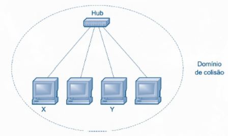<br>
*Fonte: MAIA, Luiz Paulo. Arquitetura de Redes de Computadores, 2ª ed., 2013, p. 220.*

- **Ponte:** Atua na **Camada de Enlace**. Ao observar os endereços MAC, consegue **evitar o encaminhamento** de quadros para segmentos onde eles não são necessários, separando os domínios de colisão.

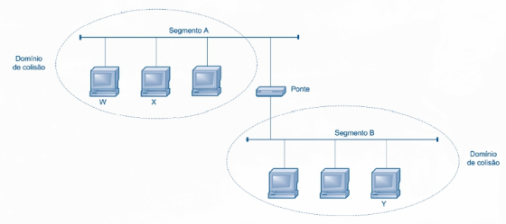<br>
*Fonte: MAIA, Luiz Paulo. Arquitetura de Redes de Computadores, 2ª ed., 2013, p. 223.*

- ***Switch*:** Ponte com várias portas. Ele observa os endereços MAC para encaminhar quadros à porta apropriada. Quando cada porta liga diretamente a um dispositivo, cada ligação forma seu próprio domínio de colisão e pode operar em *full-duplex*.

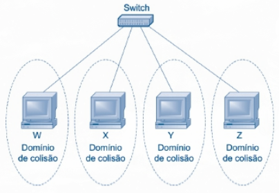<br>
*Fonte: MAIA, Luiz Paulo. Arquitetura de Redes de Computadores, 2ª ed., 2013, p. 224.*

> Se X enviar um quadro para Y, em um *hub* o sinal é repetido para todas as outras portas; em um *switch* que já sabe onde Y está conectado, o quadro é encaminhado à porta de Y. **Separar colisões não é a mesma coisa que separar todos os tipos de tráfego**.

Um quadro de ***broadcast*** ainda é distribuído pelo *switch* às demais portas da mesma rede lógica. O conjunto de dispositivos que recebe esse tipo de transmissão constitui um **domínio de *broadcast***.

## Redes Locais Sem Fio (IEEE 802.11):

### Endereçamento:

Em redes *Wi-Fi*, um quadro pode possuir **até quatro campos de endereço**, utilizados de acordo com o caminho percorrido pela informação. Em geral, os primeiros campos identificam quem está transmitindo e recebendo naquele enlace, enquanto campos adicionais podem representar a origem e o destino da comunicação em relação ao ponto de acesso e ao restante da rede.

### Organização das Estações:

Em uma rede IEEE 802.11, um grupo de estações que se comunica constitui um conjunto básico de serviços (*Basic Service Set*, BSS). Ele pode funcionar de duas maneiras:

- **AP (*Access Point*):** As estações se associam.
- ***Ad Hoc*:** As estações se comunicam diretamente (sem AP).

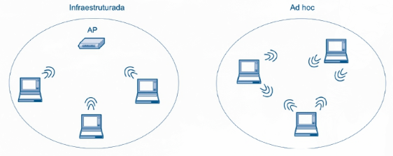<br>
*Fonte: MAIA, Luiz Paulo. Arquitetura de Redes de Computadores, 2ª ed., 2013, p. 229.*

Vários BSS com pontos de acesso podem ser interligados por um sistema de distribuição (*Distribution System*, DS). Juntos, formam um conjunto estendido de serviços (*Extended Service Set*, ESS).

Considerando vários APs instalados em diferentes áreas de um prédio: cada um atende uma região, enquanto a ligação entre eles permite que uma estação passe de uma área de cobertura para outra.

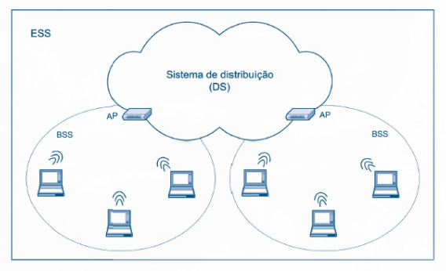<br>
*Fonte: MAIA, Luiz Paulo. Arquitetura de Redes de Computadores, 2ª ed., 2013, p. 230.*

> Nesse exemplo, cada AP e as estações que atende formam um BSS. Os dois BSS interligados integram um ESS.

### Acesso ao Meio:

Quando vários dispositivos compartilham o mesmo meio de transmissão, é necessário definir **quem pode transmitir em cada momento**, evitando que diversas mensagens sejam enviadas simultaneamente e interfiram umas nas outras.

**DCF (*Distributed Coordination Function*):** Distribui a decisão de transmitir entre as estações. Ela se baseia em **CSMA/CA**: cada estação verifica o canal e aguarda antes de enviar.
> Ainda podem ocorrer colisões, especialmente quando estações não conseguem se ouvir.

**PCF (*Point Coordination Function*):** Alternativa **opcional** que utiliza o AP para consultar as estações (semelhante ao *polling*). Como o AP organiza as oportunidades de transmissão, o período sob seu controle dispensa a disputa normal entre estações.

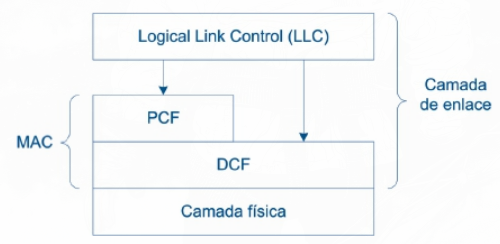<br>
*Fonte: MAIA, Luiz Paulo. Arquitetura de Redes de Computadores, 2ª ed., 2013, p. 233.*

### RTS, CTS e ACK:

Para reduzir ainda mais a possibilidade de colisões, o *Wi-Fi* pode utilizar pequenos quadros de controle antes e depois da transmissão dos dados:

- **RTS:** O transmissor solicita a utilização do meio.
- **CTS:** O receptor confirma que o transmissor pode enviar os dados.
- **ACK:** Após receber os dados corretamente, o receptor confirma a recepção.

Assim, uma comunicação pode seguir a sequência `RTS → CTS → Dados → ACK`.

> O uso de RTS e CTS é **opcional**, sendo especialmente útil quando existe maior possibilidade de colisões.

### NAV (*Network Allocation Vector*):

Mecanismo no qual os quadros informam por **quanto tempo aquela comunicação deverá utilizar o canal**. As outras estações que recebem essa informação ajustam seu NAV e evitam transmitir durante esse intervalo. Na prática, funciona como uma espécie de **"reserva do meio"** (uma estação informa por quanto tempo precisará do canal e as demais aguardam esse tempo antes de tentar utilizá-lo).

### IFS (*InterFrame Space*):

Mesmo depois que o meio fica livre, uma estação normalmente **não transmite imediatamente**. Antes disso, ela aguarda um intervalo IFS.

Existem diferentes tempos de espera, utilizados para estabelecer prioridades:

- **SIFS (IFS curto):** Menor intervalo (maior prioridade). É utilizado em respostas imediatas de uma comunicação já iniciada, como `CTS` e `ACK`.
- **PIFS (IFS da PCF):** Intervalo intermediário, utilizado pelo acesso centralizado PCF.
- **DIFS (IFS da DCF):** Maior intervalo, utilizado pelas estações que desejam iniciar uma transmissão através do DCF.
> Quanto **menor o intervalo de espera, maior a prioridade** de acesso ao meio (`SIFS < PIFS < DIFS`).

Quadros muito grandes também podem ser **fragmentados em partes menores** (reduz a quantidade de dados que precisa ser reenviada em caso de falha). Os fragmentos de uma mesma transmissão podem ser enviados em sequência, preservando temporariamente o acesso ao meio.

### Segurança:

- **WEP (*Wired Equivalent Privacy*):** Tentativa inicial de proteger redes *Wi-Fi*, mas possui muitas vulnerabilidades conhecidas.
- **WPA (*Wi-Fi Protected Access*):** Surgiu para corrigir problemas do WEP.
- **WPA2:** Proteção criptográfica diferente e mais robusta.

Tanto no WPA quanto no WPA2, existem diferentes tipos de autenticação:

- **Pessoal:** Os usuários compartilham uma chave de acesso pré-compartilhada (*pre-shared key*, PSK).
- **Corporativo:** A autenticação pode envolver uma infraestrutura própria, com servidor que verifica as credenciais de cada usuário.

## Agregação de Enlaces:

Combina duas ou mais conexões físicas para que funcionem como uma única ligação lógica. Algo como, por exemplo, dois *switches* conectados por vários cabos: o tráfego pode ser distribuído entre essas conexões, aumentando a capacidade **total disponível para diferentes fluxos**. A técnica também oferece redundância (se um dos cabos falhar, os demais podem manter a ligação ativa).
> Isso não significa que **uma única transferência** necessariamente terá sua velocidade multiplicada pelo número de cabos (a distribuição costuma ser feita entre fluxos).

## STP (*Spanning Tree Protocol*):

Criar caminhos alternativos entre *switches* aumenta a disponibilidade, mas pode formar um *loop* (quadros são reenviados repetidamente entre os equipamentos), causando tráfego excessivo e prejudicando a rede.

O **STP** identifica esses caminhos redundantes e deixa alguns deles temporariamente sem encaminhar quadros. Se um caminho ativo falhar, um caminho alternativo pode passar a ser utilizado.
> É como fechar uma das ruas de um circuito para impedir que veículos fiquem dando voltas.

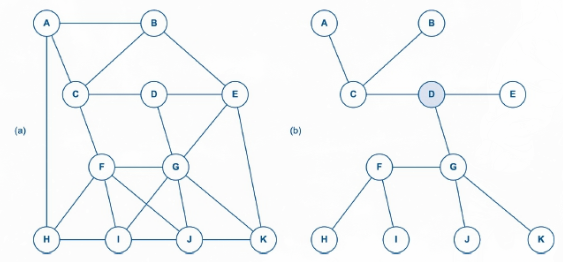<br>
*Fonte: MAIA, Luiz Paulo. Arquitetura de Redes de Computadores, 2ª ed., 2013, p. 241.*

## VLANs (*Virtual Local Area Networks*):

Um *switch* separa os domínios de colisão de suas portas, mas, sem outra configuração, um ***broadcast*** ainda alcança os dispositivos da mesma rede lógica. Uma **VLAN** permite dividir essa rede em grupos: cada VLAN constitui, em condições normais, seu próprio domínio de *broadcast*. A identificação de qual VLAN pertence um quadro pode ser feita pela **porta** do *switch*, endereços MAC, IP, etc.

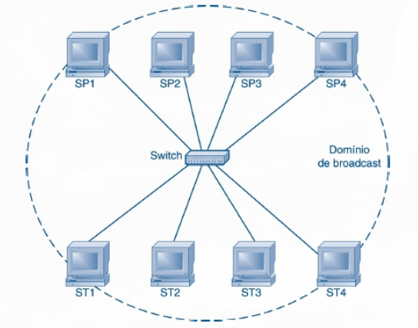<br>
*Fonte: MAIA, Luiz Paulo. Arquitetura de Redes de Computadores, 2ª ed., 2013, p. 243.*

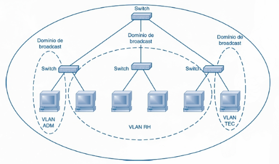<br>
*Fonte: MAIA, Luiz Paulo. Arquitetura de Redes de Computadores, 2ª ed., 2013, p. 246.*

Quando é necessário transportar quadros de **várias VLANs por uma mesma ligação** entre equipamentos, utiliza-se uma ligação de entroncamento (*trunk*), com identificação da VLAN nos quadros encaminhados por ela.

Dispositivos de **VLANs diferentes** não passam a se comunicar diretamente só porque estão ligados ao mesmo *switch*. Para permitir essa comunicação, é necessário encaminhar o tráfego entre as redes, por exemplo, usando um roteador.
> As VLANs oferecem separação lógica e ajudam a limitar onde o tráfego de *broadcast* circula.

> REVISADO ATÉ AQUI!

---

# Fontes:

- MAIA, Luiz Paulo. Arquitetura de Redes de Computadores. 2. ed. Rio de Janeiro: LTC, 2013.

- TANENBAUM, Andrew; FEAMSTER, Nick; WEATHERALL, David. Redes de Computadores. 6. ed. São Paulo: Pearson, 2021.

- NEWMAN-WOLFE, Richard E. Multiplexing. CEN 4500C: Fundamentals of Computer Communication Networks. University of Florida, 1995. Disponível em: https://www.cise.ufl.edu/~nemo/cen4500/mux.html. Acesso em: 24 set. 2026.

- FRAGA, Marcelo Caramuru Pimentel. Disciplina: Redes de Computadores I. Curso de graduação em Engenharia de Computação – Centro Federal de Educação Tecnológica de Minas Gerais (CEFET-MG), 2026.
