```
______            _                   _        
| ___ \          | |                 | |       
| |_/ /  ___   __| |  ___  ___     __| |  ___  
|    /  / _ \ / _` | / _ \/ __|   / _` | / _ \ 
| |\ \ |  __/| (_| ||  __/\__ \  | (_| ||  __/ 
\_| \_| \___| \__,_| \___||___/   \__,_| \___| 
 _____                                  _               _                         
/  __ \                                | |             | |                        
| /  \/  ___   _ __ ___   _ __   _   _ | |_   __ _   __| |  ___   _ __   ___  ___ 
| |     / _ \ | '_ ` _ \ | '_ \ | | | || __| / _` | / _` | / _ \ | '__| / _ \/ __|
| \__/\| (_) || | | | | || |_) || |_| || |_ | (_| || (_| || (_) || |   |  __/\__ \
 \____/ \___/ |_| |_| |_|| .__/  \__,_| \__| \__,_| \__,_| \___/ |_|    \___||___/ 
                         | |                 
                         |_|                                                      
```

# 0. Conceitos Básicos

## Redes de Computadores:

"É um conjunto de computadores autônomos e interconectados por uma única tecnologia." - Tanenbaum.

O conceito hoje tem um sentido mais amplo, incluindo diversos dispositivos com capacidade de processamento de dados (como telefones celulares e televisões), e não apenas computadores tradicionais. As redes permitem trocar informações e compartilhar recursos de *hardware* e *software* (como uma impressora ou um sistema), otimizando a estrutura e os custos.

## Comunicação:

A comunicação envolve três elementos básicos:

- **Transmissor:** Origem da informação.
- **Receptor:** Destinatário da informação.
- **Canal de Comunicação:** Meio pelo qual o dado é enviado.

## Protocolos e Modelo de Camadas:

- **Protocolos:** São conjuntos de regras seguidas pelos dispositivos para padronizar a comunicação. Funcionam como uma "linguagem comum", definindo como as mensagens devem ser enviadas e interpretadas. Alguns protocolos também oferecem mecanismos de entrega confiável.
- **Modelos de Camadas:** Dividem a comunicação em camadas com funções específicas. Alguns exemplos dessa relação são HTTP na **Aplicação**, TCP no **Transporte**, IP na **Rede**, PPP no **Enlace** e V.92 na **Física**.

## Parâmetros para Avaliação de Redes:

A escolha e a avaliação de uma rede dependem dos requisitos da aplicação:

- **Custo:** Envolve aquisição dos equipamentos, operação e manutenção da rede.
- **Desempenho:** Considera a **capacidade nominal** do enlace (em bps), a **vazão** (*throughput*, taxa efetivamente obtida) e a **latência** (tempo que a informação leva para chegar ao destino). A expressão "banda" pode indicar capacidade em bps; na camada física, **largura de banda** também designa um intervalo de frequências, medido em Hz.
- **Escalabilidade:** Capacidade de adicionar dispositivos com o menor impacto possível à estrutura e ao desempenho existentes.
- **Disponibilidade:** Refere-se à possibilidade de utilizar o serviço quando necessário. Alguns serviços exigem acesso 24/7; outros, apenas em horário comercial.
- **Segurança:** Envolve confidencialidade (acesso apenas por autorizados), integridade (proteção contra alterações indevidas) e disponibilidade dos recursos.
- **Padronização:** Adoção de regras e interfaces comuns para favorecer a interoperabilidade, permitindo que equipamentos de fabricantes diferentes se comuniquem.

## Tipos Geográficos de Rede:

| Tipo | Abrangência | Exemplo |
| --- | --- | --- |
| **PAN** (*Personal Area Network*) | Área pessoal, próxima ao usuário. | Celular e fones conectados por Bluetooth. |
| **LAN** (*Local Area Network*) | Área local, como um escritório ou prédio. | Computadores e impressoras de uma empresa. |
| **MAN** (*Metropolitan Area Network*) | Cidade ou região metropolitana. | Interligação de unidades distribuídas pela cidade. |
| **WAN** (*Wide Area Network*) | Grandes distâncias, entre estados, países ou continentes. | Interligação de redes em países diferentes. |

## Meios de Transmissão:

- **Com Fio (Guiados):** O sinal é conduzido por um meio físico, como par trançado, cabo coaxial ou fibra óptica.
- **Sem Fio (*Wireless*, Não Guiados):** Ondas eletromagnéticas se propagam sem um cabo que as guie, através do ar, da água ou do vácuo. Incluem comunicações por rádio, micro-ondas e infravermelho, além de enlaces via satélite.

## Formas de Interconexão:

- **Conexão Ponto a Ponto em Malha (*Mesh*):** Uma conexão ponto a ponto é um *link* direto entre dois dispositivos. Ao conectar todos diretamente uns aos outros (**malha completa**), obtém-se alta redundância, mas o custo e a quantidade de conexões prejudicam a escalabilidade.
- **Conexão Ponto a Ponto em Redes Comutadas:** Dispositivos intermediários, como *switches* e roteadores, interligam as extremidades sem exigir conexões diretas entre todos os participantes. Quando existem caminhos redundantes, a rede pode redirecionar a informação em caso de falha.

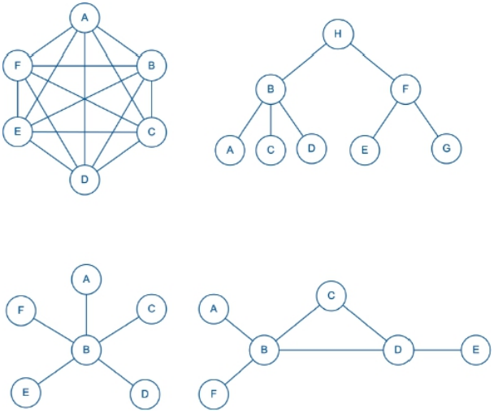<br>
*Fonte: MAIA, Luiz Paulo. Arquitetura de Redes de Computadores, 2ª ed., 2013, p. 37.*

- **Conexão Multiponto:** Três ou mais dispositivos compartilham o mesmo meio de comunicação, como um barramento ou um canal sem fio.

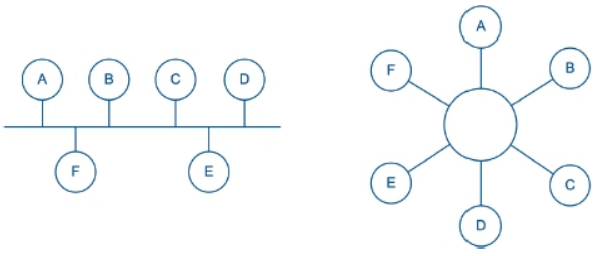<br>
*Fonte: MAIA, Luiz Paulo. Arquitetura de Redes de Computadores, 2ª ed., 2013, p. 38.*

## Comutação por Pacotes:

Os dados são organizados em pequenos blocos chamados **pacotes**, encaminhados por dispositivos intermediários até o destino. Isso permite compartilhar os enlaces entre diferentes comunicações, sem reservar um circuito físico exclusivo para cada uma.

Em redes de datagramas, pacotes de uma mesma comunicação podem percorrer caminhos diferentes. Rotas alternativas podem ajudar em caso de falha, mas sua utilização depende da topologia e dos mecanismos de roteamento; o caminho não precisa mudar a cada pacote.

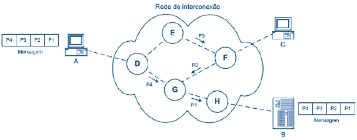<br>
*Fonte: MAIA, Luiz Paulo. Arquitetura de Redes de Computadores, 2ª ed., 2013, p. 41.*

## Serviços Oferecidos pelas Redes:

A disponibilização de recursos geralmente utiliza a **arquitetura cliente-servidor**: o servidor oferece um serviço e o cliente o requisita. Esquemas de redundância, com servidores capazes de assumir a carga de outros, ajudam a manter o serviço disponível em caso de falha.

- **Serviço *Web*:** A *World Wide Web* (WWW) reúne documentos e recursos interligados por *links*. O HTTP permite transferi-los entre servidores e clientes, como o navegador (*browser*).
- **Transferência de Arquivos:** Permite enviar e receber arquivos entre dispositivos conectados à rede.
- **Acesso e Gerenciamento Remoto:** Permite executar comandos em um sistema distante (**terminal remoto**) e administrar, configurar e diagnosticar dispositivos à distância (**gerência remota**).
- **Comunicação em Tempo Real:** Inclui chamadas de áudio, videoconferência e transmissões ao vivo (ex.: Zoom e WhatsApp).

---

# 1. Modelo de Camadas

## Vantagens na sua Adoção:

O desenvolvimento de uma rede envolve *hardware*, *software*, transmissão, verificação de erros e protocolos. Dividir essas funções em camadas facilita a organização:

- **Modularidade:** Cada camada reúne funções relacionadas, dividindo o problema em partes menores.
- **Independência entre as Partes:** Interfaces definidas permitem utilizar uma camada sem conhecer todos os seus detalhes internos.
- **Manutenção e Evolução:** Uma camada pode ser modificada preservando as demais, desde que mantenha os serviços e interfaces de que elas dependem.

## Elementos do Modelo de Camadas:

- **Comunicação Vertical:** Ocorre internamente, entre camadas adjacentes: os dados descem na transmissão e sobem na recepção.
- **Comunicação Horizontal (Lógica):** Ocorre entre entidades da mesma camada em dispositivos diferentes. Por exemplo, o protocolo de aplicação de um dispositivo interpreta mensagens produzidas pelo correspondente remoto.
- **Encapsulamento e Desencapsulamento:** Ao descer pelas camadas, os dados recebem informações de controle, como "envelopes". Protocolos podem acrescentar cabeçalhos e, no enlace, campos finais; a camada física representa a informação em sinais. Na recepção, cada camada interpreta e retira os elementos correspondentes antes de entregar os dados à superior.

## Modelo de 5 Camadas (Internet):

É uma organização didática da arquitetura Internet que separa as funções de Enlace e Física. As camadas abaixo estão apresentadas da transmissão dos sinais até os serviços utilizados pelas aplicações.

### Camada Física:

Responsável pela transmissão dos ***bits*** através do meio. Define características dos sinais (duração, intensidade e representação dos dados), sincronismo e aspectos físicos das interfaces, cabos e antenas. Técnicas de multiplexação também podem atuar nesse nível.

- **Exemplos:** V.92, EIA-232-F e as especificações físicas de IEEE 802.3 e IEEE 802.11.

### Camada de Enlace:

Organiza os dados em **quadros** (*frames*) para comunicação local. Dependendo da tecnologia, oferece endereçamento, detecção de erros, recuperação de falhas, controle de fluxo do receptor e controle de acesso ao meio compartilhado.

- **Exemplos:** PPP, HDLC, LAPB e as funções de enlace de IEEE 802.3 (*Ethernet*) e IEEE 802.11 (*Wi-Fi*).

### Camada de Rede:

Oferece **endereçamento lógico** e encaminhamento de pacotes entre redes. Roteadores consultam tabelas para decidir o próximo salto até o destino. Os endereços identificam interfaces no contexto de endereçamento utilizado; nem todo endereço é globalmente único.

- **Serviço Não Orientado a Conexão (Datagrama):** Cada pacote é encaminhado sem estabelecer previamente uma conexão na rede. Pacotes da mesma comunicação podem seguir caminhos diferentes.
- **Serviço Orientado a Conexão (Circuito Virtual):** Estabelece previamente um caminho lógico e informações de encaminhamento nos nós intermediários. Os pacotes seguem esse circuito, e cada nó consulta a identificação da conexão para encaminhá-los.

- **Exemplos:** IP (IPv4 e IPv6), ICMP e OSPF. O IP utiliza datagramas e não garante entrega ou ordem de chegada.

### Camada de Transporte:

Estabelece uma **comunicação lógica de ponta a ponta** entre aplicações, ocultando detalhes dos caminhos intermediários. Utiliza **portas** para distinguir os serviços e processos que enviam ou recebem os dados (como o tráfego do navegador e o de um serviço de correio eletrônico).

- **TCP:** Oferece um fluxo confiável e ordenado de *bytes*, com confirmações, retransmissões e controle de fluxo e congestionamento. Uma falha persistente ainda pode impedir a conclusão da comunicação.
- **UDP:** Envia datagramas sem estabelecer uma conexão e sem oferecer retransmissão ou ordenação. Possui menos mecanismos próprios, mas isso não garante que será sempre mais rápido.

### Camada de Aplicação:

Reúne os protocolos utilizados pelos aplicativos para trocar informações. Define como as mensagens dos serviços devem ser estruturadas e interpretadas, como nos serviços *web*, correio eletrônico, transferência de arquivos e acesso remoto.

- **Exemplos:** HTTP/HTTPS, SMTP e IMAP (*e-mail*), FTP (arquivos) e SSH (acesso remoto).

## Outros Modelos de Camadas:

- **TCP/IP de Quatro Camadas:** Divide a arquitetura em Aplicação, Transporte, Internet (Rede) e Acesso à Rede (Enlace). Esta última reúne as funções que o modelo didático de cinco camadas separa em Enlace e Física; os modelos representam níveis diferentes de detalhamento.
- **OSI:** Modelo de referência da ISO com sete camadas: Aplicação, Apresentação, Sessão, Transporte, Rede, Enlace e Física. As quatro inferiores têm funções semelhantes às correspondentes do modelo de cinco camadas.

No OSI, a **Sessão** organiza o diálogo e pode utilizar pontos de sincronização (*checkpoints*); a **Apresentação** trata da representação dos dados, incluindo conversão de formatos, compressão e criptografia. No modelo Internet, essas funções podem ser implementadas por protocolos e bibliotecas utilizados pelas aplicações, sem camadas separadas equivalentes.

## *Gateway*:

É um ponto de interligação entre redes ou sistemas. Um ***gateway* de tradução** converte protocolos ou formatos incompatíveis, como na tradução entre IPv4 e IPv6 ou na integração de redes industriais. Já o ***gateway* padrão** de uma máquina normalmente é o roteador ao qual ela envia pacotes para destinos sem uma rota mais específica, sem exigir tradução de protocolos.

## Padrão IEEE 802:

Família de padrões para redes locais e metropolitanas, concentrada nas funções de **Física** e **Enlace**. No modelo IEEE 802, o enlace é dividido em:

- **MAC (*Medium Access Control*):** Trata de acesso ao meio, endereçamento, formato dos quadros e detecção de erros.
- **LLC (*Logical Link Control*):** Oferece uma interface lógica às camadas superiores sobre diferentes tecnologias MAC. Sua utilização depende do formato e da tecnologia de enlace.

> Exemplos incluem IEEE 802.3 (*Ethernet*), IEEE 802.11 (*Wi-Fi*) e IEEE 802.15 (redes pessoais sem fio), além de padrões históricos como IEEE 802.2 (LLC), IEEE 802.4 (*Token Bus*) e IEEE 802.16 (*WiMAX*). O ARP, que associa endereços IPv4 a endereços de enlace, é tratado no enlace pela arquitetura TCP/IP.

---

# 2. Camada Física

## Processo de Transmissão (Sinais e Dados):

O transmissor converte os dados para sinais adequados ao meio. É importante distinguir os dados que serão enviados da sua representação física:

- **Sinal Analógico:** Sua amplitude pode variar continuamente, como em uma onda sonora ou em uma portadora de rádio modulada.

- **Sinal Digital:** Representa símbolos por um conjunto discreto de níveis ou estados. Embora o sinal físico sofra transições e ruído, o receptor interpreta esses estados como dados digitais.

- **Tratamento e Conversão:** Dados digitais podem ser representados por pulsos elétricos ou ópticos, ou pela modulação de uma portadora. O meio e a técnica utilizada determinam como os *bits* serão sinalizados.

## Problemas na Transmissão:

### Ruído:

É a presença de perturbações indesejadas que se somam ao sinal original.

- **Causas:** Incluem interferências eletromagnéticas externas, ruído térmico (agitação dos portadores de carga) e *crosstalk* (acoplamento indesejado entre canais próximos).
- **Relação Sinal-Ruído (*Signal-to-Noise Ratio*, SNR):** Razão entre a potência do sinal e a do ruído no mesmo ponto de observação. Na recepção, uma SNR maior facilita a distinção do sinal útil em relação ao ruído.

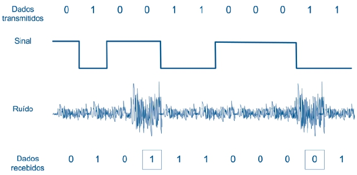<br>
*Fonte: MAIA, Luiz Paulo. Arquitetura de Redes de Computadores, 2ª ed., 2013, p. 98.*

### Atenuação:

É a redução da potência do sinal ao percorrer o meio. Se os níveis recebidos ficarem difíceis de distinguir entre si ou do ruído, o receptor poderá interpretar os *bits* incorretamente.

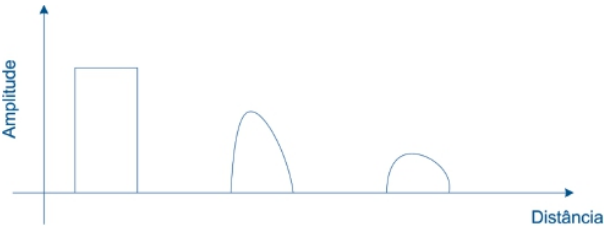<br>
*Fonte: MAIA, Luiz Paulo. Arquitetura de Redes de Computadores, 2ª ed., 2013, p. 100.*

**Circuitos Regeneradores (Repetidores):** Recebem o sinal digital e reconstroem seus níveis e temporização antes de repassá-lo. Permitem estender a comunicação, desde que ainda seja possível reconhecer os símbolos recebidos.

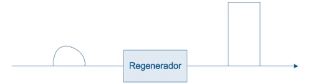<br>
*Fonte: MAIA, Luiz Paulo. Arquitetura de Redes de Computadores, 2ª ed., 2013, p. 100.*

Se o sinal chegar demasiadamente degradado ao regenerador, um símbolo poderá ser interpretado incorretamente. Nesse caso, o equipamento regenera o sinal, mas repassa o erro de informação.

## Largura de Banda:

A **largura de banda**, em Hz, é o intervalo de frequências utilizado ou admitido por um canal. Uma linha telefônica convencional entre 300 Hz e 3400 Hz, por exemplo, possui largura de banda de 3100 Hz. Ela influencia a capacidade de transmissão, mas não a determina sozinha: ruído e sinalização também importam.

## Capacidade de Transmissão:

- **Teorema de Nyquist:** Para um canal ideal sem ruído e de largura de banda `W`, a taxa máxima com `N` níveis é `CMT = 2W log2 N`. Cada símbolo representa `log2 N` *bits*: dobrar os níveis acrescenta um *bit* por símbolo, não dobra a quantidade de *bits*.
- **Teorema de Shannon:** No modelo de canal com ruído branco gaussiano aditivo, a capacidade é `CMT = W log2 (1 + SNR)`. É um limite teórico de transmissão confiável, não uma taxa necessariamente alcançada pelo equipamento. A SNR deve estar em escala linear (`SNR = 10^(SNR_dB / 10)`), e a atenuação pode reduzi-la ao diminuir a potência recebida.

## Meios de Transmissão:

### Fatores de Escolha:

- **Sinalização e Capacidade:** Dependem da faixa de frequências, da largura de banda disponível, do ruído e das técnicas de codificação ou modulação. Dados digitais podem ser transmitidos por meios elétricos, ópticos e de rádio.
- **Confiabilidade:** Suscetibilidade a ruído, atenuação e interferências. A fibra óptica é imune à interferência eletromagnética externa, mas ainda apresenta perdas e outras limitações físicas.
- **Segurança:** Facilidade de interceptação do sinal. O acesso a um cabo costuma ser mais restrito do que a um sinal irradiado, mas nenhum meio dispensa proteção dos dados quando ela é necessária.
- **Instalação e Manutenção:** Dependem da distância, do número de dispositivos e das condições do local. Cabos exigem passagem física; enlaces sem fio exigem planejamento de cobertura e interferência.
- **Custo:** Inclui meio, interfaces, instalação e manutenção, variando conforme a capacidade e o alcance exigidos.

### Com Fio:

- **Par Trançado:** Utiliza pares de fios de cobre entrelaçados, reduzindo interferências. Suporta sinalização analógica e digital; seu desempenho depende da categoria do cabo, da instalação e da tecnologia empregada.

  - **UTP (*Unshielded Twisted Pair*):** Sem blindagem adicional. Tem baixo custo e fácil instalação, mas exige cuidados com interferências e *crosstalk*. Categorias adequadas suportam taxas de vários Gbps em distâncias especificadas pelo padrão.
  - **STP (*Shielded Twisted Pair*):** Possui blindagem para reduzir interferências. Exige instalação e aterramento adequados; a blindagem, por si só, não determina uma taxa ou distância maior.

- **Cabo Coaxial:** Possui um condutor central, isolante, blindagem metálica e proteção externa. A blindagem reduz interferências; capacidade, alcance e custo dependem do sistema utilizado. É empregado em TV a cabo e acesso à Internet, tendo sido muito utilizado em redes locais e telefonia de longa distância.

- **Fibra Óptica:** Transmite informação por **luz**, guiada por um núcleo de vidro ou plástico envolvido por um revestimento de menor índice de refração (princípio da **reflexão interna total**). Oferece grande capacidade, baixa atenuação e imunidade a interferências eletromagnéticas. O cabo é leve e fino, mas conexões e reparos exigem cuidados e ferramentas apropriadas; custos dependem dos cabos, transceptores e instalação.

  - **Monomodo (*Singlemode*):** Permite um único modo de propagação na faixa de operação, sendo adequada a enlaces de longa distância.
  - **Multimodo:** Permite vários modos de propagação. A diferença entre seus tempos de percurso limita o alcance e a capacidade, sendo comum em enlaces mais curtos.

### Sem Fio:

- **Rádio:** Utiliza ondas de radiofrequência, com alcance, penetração de obstáculos e direcionalidade dependentes da frequência, das antenas e do ambiente. A propagação pela ionosfera ocorre em determinadas faixas, não em todas. Redes *Wi-Fi* utilizam faixas compartilhadas, sujeitas a limites de potência e outras regras de uso do espectro.

- **Micro-ondas:** São ondas de rádio de frequências mais elevadas, muito utilizadas em enlaces direcionais ponto a ponto. O alcance depende da altura das antenas, dos obstáculos e da curvatura da Terra; determinadas faixas também sofrem atenuação significativa pela chuva. São empregadas em telecomunicações, transmissão de TV e interligação de prédios.

- **Satélite:** Uma estação terrestre transmite ao satélite (*uplink*), que retransmite a outra estação (*downlink*). Um **transponder** recebe, processa ou amplifica e retransmite o sinal, normalmente em outra frequência. Satélites **geoestacionários**, a cerca de 36.000 km de altitude sobre o equador, acompanham a rotação da Terra e facilitam o alinhamento das antenas. Oferecem grande cobertura, mas o percurso Terra–satélite–Terra apresenta atraso de propagação próximo de 250 ms em um sentido, conforme a geometria. Outras órbitas têm características diferentes.

- **Infravermelho:** Utiliza frequências abaixo da luz visível. Não atravessa paredes, sendo adequado à comunicação em um mesmo ambiente, como em controles remotos e determinadas interfaces de curta distância. Essa limitação permite reutilizar a faixa em cômodos separados. O IEEE 802.11 original também previa uma opção infravermelha de 1 e 2 Mbps, hoje de interesse histórico.

## Conversão dos Dados:

**Digitalização:** Conversão de dados analógicos em digitais. Na comunicação de áudio, um **CODEC** (codificador-decodificador) pode realizar a conversão na origem e reconstruir o sinal analógico no destino.

Uma técnica comum para digitalizar áudio é o **PCM** (*Pulse Code Modulation*), em que:

1. O sinal analógico é amostrado (medido) periodicamente, obtendo amostras de sua amplitude (representáveis por **PAM**, *Pulse Amplitude Modulation*).
2. Cada amostra é aproximada a um dos **níveis de quantização** disponíveis.
3. Cada nível de quantização recebe um conjunto de *bits*.

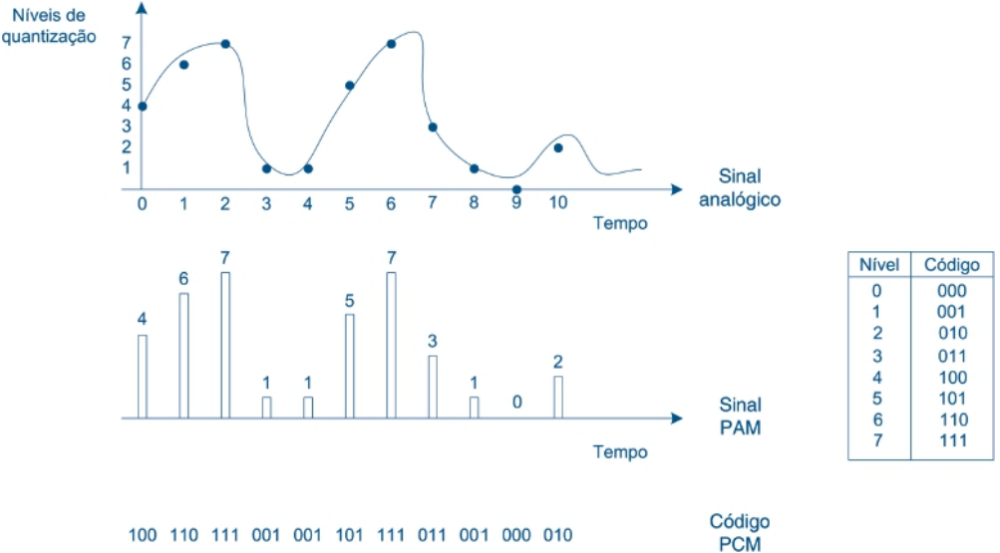<br>
*Fonte: MAIA, Luiz Paulo. Arquitetura de Redes de Computadores, 2ª ed., 2013, p. 117.*

## Técnicas para Transmissão da Informação:

### Sinalização Digital:

Utiliza estados ou níveis distinguíveis para representar dados digitais, como pulsos elétricos ou ópticos. O alcance depende do meio, da taxa e da degradação do sinal; regeneradores podem estendê-lo.

- **NRZ-L (*Non Return to Zero-Level*):** Associa um valor de voltagem fixo (arbitrário) a cada *bit*.

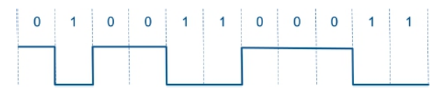<br>
*Fonte: MAIA, Luiz Paulo. Arquitetura de Redes de Computadores, 2ª ed., 2013, p. 118.*

- **NRZ-I (*Non Return to Zero Invert* - codificação diferencial):** Se o sinal se mantém constante, representa o 0; se houver transição de nível no início do período, representa o 1 (convenção adotada aqui).

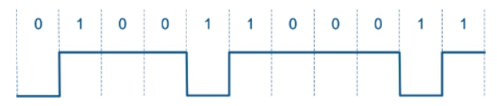<br>
*Fonte: MAIA, Luiz Paulo. Arquitetura de Redes de Computadores, 2ª ed., 2013, p. 118.*

- **Codificação Manchester:** Existe sempre uma transição no meio do período de cada *bit*. Na convenção descrita, a transição de alto para baixo representa 0; de baixo para alto, 1 (a associação pode ser invertida em outras convenções). Essa transição regular facilita a recuperação do relógio e o sincronismo entre transmissor e receptor.

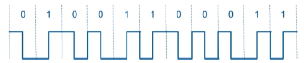<br>
*Fonte: MAIA, Luiz Paulo. Arquitetura de Redes de Computadores, 2ª ed., 2013, p. 119.*

### Sinalização Analógica:

Utiliza uma portadora cuja amplitude, frequência ou fase é modificada para representar os dados. Um **modem** (modulador-demodulador) realiza a modulação na origem e a demodulação no destino, como em conexões por linha telefônica.

- **ASK (*Amplitude Shift Keying*):** A amplitude da onda representa os *bits* (por exemplo, ausência de amplitude = *bit* 0 e presença de amplitude = *bit* 1). É **simples de implementar**, mas **mais suscetível a ruídos e interferências**.

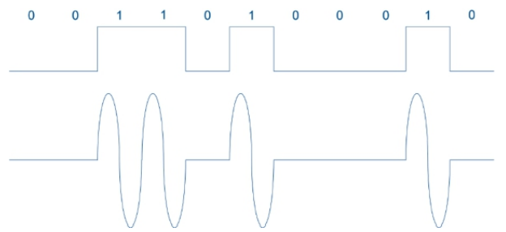<br>
*Fonte: MAIA, Luiz Paulo. Arquitetura de Redes de Computadores, 2ª ed., 2013, p. 121.*

- **FSK (*Frequency Shift Keying*):** A frequência da onda representa os *bits* (cada *bit* corresponde a uma frequência diferente).

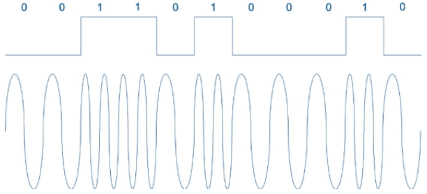<br>
*Fonte: MAIA, Luiz Paulo. Arquitetura de Redes de Computadores, 2ª ed., 2013, p. 121.*

- **PSK (*Phase Shift Keying*):** A fase da onda representa os *bits*.

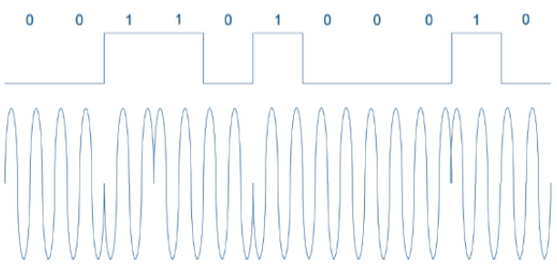<br>
*Fonte: MAIA, Luiz Paulo. Arquitetura de Redes de Computadores, 2ª ed., 2013, p. 122.*

- **QAM (*Quadrature Amplitude Modulation*):** Combina componentes em quadratura, formando símbolos definidos por amplitude e fase. Isso permite representar vários *bits* por símbolo, conforme a constelação utilizada.

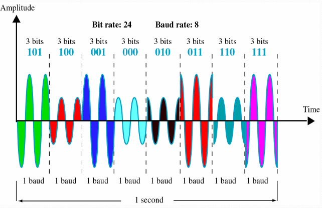<br>
*Fonte: FRAGA, Marcelo Caramuru Pimentel. Redes de Computadores - 6ª Aula, p. 23.*

## Sinalização Multinível:

Uma sinalização pode representar **um *bit* por símbolo** (monobit) ou **vários *bits* por símbolo** (utilizando mais estados de sinalização). Para representar `n` *bits* por símbolo, são necessários `2^n` estados distinguíveis, como níveis de amplitude ou combinações de amplitude e fase em QAM.

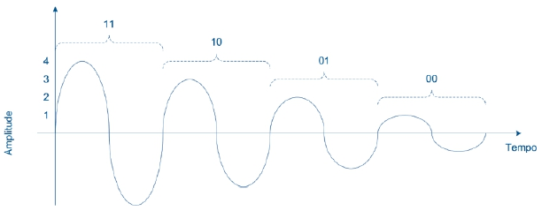<br>
*Fonte: MAIA, Luiz Paulo. Arquitetura de Redes de Computadores, 2ª ed., 2013, p. 123.*

- **Baud:** Taxa de símbolos por segundo.
- **bps:** Taxa de *bits* por segundo. Sem considerar redundância de codificação, `bps = baud * bits por símbolo`. Em uma transmissão dibit, 2400 baud representam 4800 bps; as duas taxas coincidem no caso monobit.

## Multiplexação:

Técnica que permite que **diversas transmissões independentes** compartilhem um meio físico. O **multiplexador** (*mux*) combina os canais na origem, e o demultiplexador os separa no destino.

### Multiplexação por Divisão de Frequência (FDM):

Divide a largura de banda em **faixas de frequência** independentes, utilizadas simultaneamente. As faixas podem ter larguras diferentes, conforme a necessidade de cada transmissão, e transportar serviços de um mesmo usuário ou de usuários distintos, como as estações de rádio.

### Multiplexação por Divisão de Tempo (TDM):

Divide o uso do meio em **intervalos de tempo** (*slots*). Cada canal utiliza a capacidade de transmissão durante sua vez; os blocos transportados podem ser *bits*, *bytes* ou outras unidades, conforme o sistema.

- **TDM Síncrono:** Os *slots* são previamente definidos e se repetem a cada ciclo. Se um canal não tiver dados, sua vez pode ficar ociosa.
- **TDM Assíncrono (Estatístico):** Os intervalos são atribuídos conforme a demanda, aproveitando o tempo dos canais que não têm dados para transmitir.

> FDM e TDM podem ser combinados: um sistema separa canais por frequência e, dentro de uma dessas faixas, divide o tempo entre diferentes transmissões.

## Transmissão *Simplex*, *Half-Duplex* e *Full-Duplex*:

- ***Simplex*:** Os dados trafegam em um único sentido (transmissor → receptor, como rádio, televisão etc.).

- ***Half-Duplex*:** Os dados podem trafegar nas duas direções, mas nunca ao mesmo tempo (é necessário um intervalo para inverter o sentido da transmissão, como em *walkie-talkies*).

- ***Full-Duplex* (*Duplex*):** Os dados trafegam nas duas direções **simultaneamente**. Pode utilizar caminhos físicos distintos, como duas fibras, ou técnicas que separam os sentidos no mesmo meio. É comum em ligações *Ethernet* entre dispositivos e *switches*, mas não caracteriza toda rede: o acesso *Wi-Fi* convencional compartilha o canal entre transmissões.

## Transmissão Serial e Paralela:

- **Paralela:** Transmite vários *bits* de uma unidade de dados simultaneamente por caminhos distintos, como nos barramentos paralelos ATA e SCSI. Não deve ser confundida com FDM: multiplexar canais por frequência não torna uma interface automaticamente um barramento paralelo.

- **Serial:** Transmite os *bits* sequencialmente em cada canal ou via (*lane*). É utilizada em SATA e PCIe, por exemplo; este último pode combinar várias vias seriais. Reduz conexões e dificuldades de sincronização entre fios, mas continua sujeita a interferências e ao *overhead* do protocolo.

## Transmissão Assíncrona e Síncrona:

O receptor precisa reconhecer os instantes corretos de leitura dos *bits*. O sincronismo pode ser estabelecido e mantido de diferentes maneiras:

- **Transmissão Assíncrona (*Start/Stop*):** Não mantém sincronismo contínuo entre caracteres. Transmissor e receptor usam uma taxa acordada, e o *bit* de início permite ajustar a leitura de cada caractere, seguido por um ou mais *bits* de parada. É simples, mas esses *bits* extras geram *overhead*.
- **Transmissão Síncrona:** Mantém o sincronismo durante um fluxo ou bloco, usando relógio compartilhado ou recuperado do sinal. Dispensa *bits* de início e parada por caractere; preâmbulos ou caracteres SYN podem ajudar em determinados protocolos, mas não são obrigatórios em todos.

> A codificação Manchester facilita a recuperação do relógio pelas transições no meio de cada *bit*.

## Topologias de Rede:

A **topologia física** descreve as conexões entre os dispositivos; a **topologia lógica**, como a informação circula. Elas podem ser diferentes: uma rede com *hub* tem cabos em estrela, mas compartilha o meio logicamente.

- **Totalmente Ligada (Malha Completa):** Todos se conectam diretamente aos demais (`N * (N - 1) / 2` ligações para `N` dispositivos). Oferece caminhos redundantes, mas tem alto custo e baixa escalabilidade, pois cada novo dispositivo precisa de conexões com todos os outros.
- **Estrela:** Todos se conectam a um equipamento central, por onde passa a comunicação. Facilita instalação e manutenção; uma falha no centro afeta a rede, enquanto a falha em um cabo normalmente isola apenas seu dispositivo. O equipamento central também pode limitar o desempenho.
- **Hierárquica ou em Árvore:** Organiza os dispositivos em níveis, ampliando a estrela e favorecendo a escalabilidade. Uma falha pode isolar uma ramificação; os dispositivos só continuam se comunicando entre si se os caminhos e equipamentos necessários permanecerem ativos.
- **Distribuída (Malha Parcial):** Mantém alguns caminhos alternativos, equilibrando redundância, custo e escalabilidade. É comum em WANs; roteadores encaminham pacotes pelos enlaces disponíveis conforme as rotas utilizadas.
- **Barra:** Todos compartilham um barramento. É simples, mas a disputa pelo meio limita o desempenho e falhas no cabo podem comprometer o segmento.
- **Anel:** Os dispositivos formam um circuito fechado, que pode ser construído com enlaces ponto a ponto entre vizinhos. O funcionamento lógico depende da tecnologia; em redes com passagem de *token*, uma autorização circulante determina quem pode transmitir. Falhas podem interromper um anel simples, enquanto outras implementações oferecem caminhos de proteção.

---

# 3. Camada de Enlace

Enquanto a **Camada Física** transmite os *bits* através do meio, a **Camada de Enlace** organiza a comunicação local em quadros. Seus mecanismos dependem da tecnologia; a camada não garante, por si só, que toda informação será entregue corretamente.

- **Enquadramento:** Agrupa os *bits* brutos recebidos em blocos lógicos chamados **quadros** (*frames*).
- **Controle de Erros:** Detecta (e, dependendo da tecnologia, corrige) danos ou anomalias sofridos pelos *bits* durante a transmissão física.
- **Controle de Fluxo:** Regula a velocidade e o volume do envio de dados para não sobrecarregar o receptor.
- **Controle de Acesso ao Meio:** Em redes com canais compartilhados, gerencia quando cada dispositivo pode transmitir, para organizar o compartilhamento e reduzir ou evitar colisões, conforme o método.

## Quadros (*Frames*):

Um quadro (*frame*) transporta os dados e as informações necessárias à comunicação local. Sua estrutura varia conforme o protocolo, mas costuma incluir:

- **Cabeçalho:** Informações de controle, como endereços e identificação do protocolo transportado.
- **Dados:** Carga útil recebida das camadas superiores.
- **Campo Final:** Pode incluir um **CDE (Código de Detecção de Erro)**, calculado para verificar alterações na informação protegida.

## Enquadramento:

O **enquadramento** permite reconhecer onde cada quadro começa e termina. Alguns protocolos usam *flags* (marcadores), representadas por caracteres ou sequências de *bits*; outros utilizam comprimento, preâmbulos e mecanismos próprios da tecnologia.

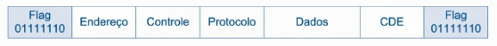<br>
*Fonte: MAIA, Luiz Paulo. Arquitetura de Redes de Computadores, 2ª ed., 2013, p. 153.*

### Problemas na Utilização de *Flags*:

O padrão de uma *flag* pode aparecer nos dados. O ***stuffing*** introduz elementos que impedem essa confusão, retirados pelo receptor antes de entregar a informação:

- ***Byte Stuffing*:** Utiliza um caractere de escape para distinguir *bytes* reservados presentes nos dados. O próprio escape também precisa ser tratado conforme o protocolo.
- ***Bit Stuffing*:** Insere *bits* para impedir a formação do marcador. Em HDLC, acrescenta-se um zero após cinco *bits* `1` consecutivos entre *flags*; o receptor remove esse zero.

## Endereçamento:

Na camada de enlace, os endereços identificam interfaces na comunicação local. Em *Ethernet*, os endereços **MAC** têm **6 *bytes*** (48 *bits*). Endereços globalmente administrados incluem uma identificação atribuída à organização responsável; também existem endereços locais, como os configurados por software.

### Alvos do Endereçamento:

- ***Unicast*:** A mensagem é enviada para apenas um dispositivo específico (comunicação um-para-um).
- ***Multicast*:** A mensagem é enviada para um grupo selecionado de dispositivos (comunicação um-para-vários).
- ***Broadcast*:** A mensagem é transmitida para todos os dispositivos conectados na rede local (domínio do *broadcast* - comunicação um-para-todos).

## Detecção de Erros:

O transmissor calcula um **CDE** a partir dos dados protegidos e o envia com o quadro. O receptor verifica a relação entre os dados e o código recebido: uma inconsistência indica erro, mas um resultado válido significa apenas que **nenhum erro foi detectado**. A capacidade de detectar ou corrigir falhas depende do código utilizado.

- **Bit de Paridade:** Acrescenta um *bit* para que a quantidade total de *bits* `1` seja par (**paridade par**) ou ímpar (**paridade ímpar**). Na paridade par, o CDE vale 1 quando os dados possuem uma quantidade ímpar de *bits* `1`. Detecta qualquer quantidade ímpar de inversões, mas uma quantidade par pode passar despercebida.

- **Paridade Múltipla:** Organiza os dados em linhas e colunas e calcula suas paridades, podendo incluir a paridade dos próprios *bits* adicionais. A verificação cruzada permite detectar mais padrões de erro e, em configurações apropriadas, localizar um erro simples.

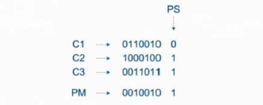<br>
*Fonte: MAIA, Luiz Paulo. Arquitetura de Redes de Computadores, 2ª ed., 2013, p. 159.*

- ***Checksum*:** Código obtido por uma operação sobre blocos de dados, frequentemente uma soma. Em um exemplo simples com *bytes*, somam-se seus valores e toma-se o resto da divisão por 256 como CDE. Outros protocolos utilizam regras diferentes de soma e representação.

> Considerando a mensagem `MODEM!`, os valores ASCII são `77, 79, 68, 69, 77, 33`. A soma é `403`, e `403 mod 256 = 147`. Envia-se esse valor como *byte* adicional; sua representação como caractere depende da codificação, não sendo um caractere ASCII de 7 *bits*.

- **CRC (*Cyclic Redundancy Check*):** Técnica de detecção de erros baseada em uma divisão binária feita com operações `XOR`. O transmissor e o receptor usam a mesma sequência de *bits*, chamada **polinômio gerador**. Para calcular o CRC, o transmissor acrescenta temporariamente zeros ao fim dos dados, faz a divisão e coloca o **resto obtido** no lugar desses zeros. O receptor divide o conjunto recebido pelo mesmo gerador. Neste modelo simplificado, um resto diferente de zero indica erro; um resto igual a zero indica apenas que **nenhum erro foi detectado**. O CRC é muito utilizado pela boa capacidade de detecção com baixo custo de implementação.

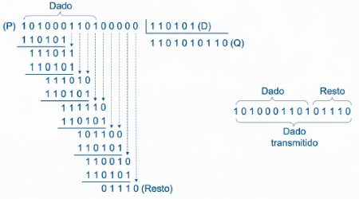<br>
*Fonte: MAIA, Luiz Paulo. Arquitetura de Redes de Computadores, 2ª ed., 2013, p. 161.*

## Hamming:

### Distância de Hamming:

A **distância de Hamming** entre duas palavras é a quantidade de posições em que seus *bits* diferem (`111000` e `110001` têm distância 2). A **distância mínima do código** é a menor distância entre quaisquer duas palavras válidas distintas.

- **Detecção de Erros:** Para detectar até `n` erros, é necessário `d_min ≥ n + 1`.
- **Correção de Erros:** Para corrigir até `n` erros, é necessário `d_min ≥ 2n + 1`.

### Algoritmo de Hamming:

É uma técnica que insere ****bits** de redundância** (paridade) em posições estratégicas da mensagem original. Esse método permite não apenas detectar, mas localizar e corrigir um erro simples que tenha ocorrido durante a transmissão da informação.

- ***Bits* de paridade:** Os *bits* de paridade ocupam exclusivamente as posições da mensagem correspondentes às potências de 2 (posições `2^0 = 1`, `2^1 = 2`, `2^2 = 4`, ...). Os espaços restantes (3, 5, 6, 7, 9 etc.) são preenchidos sequencialmente pelos *bits* de dados da mensagem original. Para `n` *bits* de dados, escolhe-se o menor número `r` de *bits* de paridade que satisfaça `2^r ≥ n + r + 1`. O tamanho final é `n + r`.
- **Verificação:** Cada *bit* de paridade atua como um "fiscal" de um conjunto específico de posições. A composição desse conjunto obedece a uma lógica matemática: um *bit* de dado será verificado pelos *bits* de paridade da sua posição em binário. Por exemplo, o dado na posição 7 = 111 será verificado pelas paridades na posição 100 = 4, 10 = 2 e 1.
- **Localização do Erro:** A grande vantagem desse método reside na verificação cruzada. Quando um único *bit* (de dado ou paridade) é corrompido na transmissão, as paridades responsáveis por ele apresentarão erro, sendo possível localizar o ponto de falha pela interseção das paridades.

Por exemplo, considerando uma mensagem qualquer, originalmente de 16 *bits* (com 5 paridades, passa a ter 21), com o seguinte resultado das paridades:

- `b1` (1,3,5,7,9,11,13,15,17,19,21): Falha;
- `b2` (2,3,6,7,10,11,14,15,18,19): Acerto;
- `b4` (4,5,6,7,12,13,14,15,20,21): Falha;
- `b8` (8,9,10,11,12,13,14,15): Acerto;
- `b16` (16,17,18,19,20,21): Acerto;

Os potenciais *bits* problemáticos são dados por `(b1 ∩ b4) - (b2 ∪ b8 ∪ b16)`, resultando apenas no *bit* 5 como problemático.

> Para obter o resultado mais facilmente, pode-se realizar a soma ponderada `1 * b1 + 2 * b2 + 4 * b4 + 8 * b8 + ...`, em que `bi` é 0 se houver acerto e 1 se houver erro.

O código descrito tem distância mínima 3 e **corrige um erro** por palavra (`2n + 1 = 3 => n = 1`). Se houver dois erros, um decodificador que tente corrigir como se houvesse apenas um pode alterar o *bit* errado; a correção depende dessa hipótese de erro simples.

## Recuperação de Erros:

A recuperação pode ser feita por **retransmissão** ou por **correção no receptor**. Nem toda tecnologia de enlace oferece esses mecanismos; quando necessário, camadas superiores também podem assumir a recuperação.

### Transmissão *Stop-and-Wait*:

No **Stop-and-Wait**, o transmissor envia um quadro e aguarda um reconhecimento (**ACK**, *acknowledgement*) antes de enviar o próximo. O receptor confirma os quadros aceitos após a verificação de erros. Esse controle se aplica ao enlace considerado; outros trechos da rota podem utilizar mecanismos diferentes.

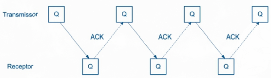<br>
*Fonte: MAIA, Luiz Paulo. Arquitetura de Redes de Computadores, 2ª ed., 2013, p. 163.*

O quadro ou seu ACK podem se perder. Por isso, no **Stop-and-Wait ARQ**, o transmissor inicia um temporizador ao enviar e retransmite se o ***timeout*** expirar sem a confirmação esperada. A ausência de ACK indica uma tentativa sem confirmação, não necessariamente a perda do quadro.

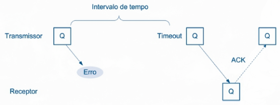<br>
*Fonte: MAIA, Luiz Paulo. Arquitetura de Redes de Computadores, 2ª ed., 2013, p. 163.*

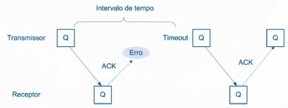<br>
*Fonte: MAIA, Luiz Paulo. Arquitetura de Redes de Computadores, 2ª ed., 2013, p. 164.*

### Tratamento de Transmissões com Erro:

Quando a verificação detecta um quadro corrompido, o tratamento depende do protocolo:

- **Descarte (Espera por *Timeout*):** O receptor ignora e descarta a mensagem defeituosa. O transmissor, ao não receber o ACK, aguardará o seu temporizador estourar (*timeout*) e executará o reenvio automaticamente.
- **NAK (*Negative Acknowledgement*):** O receptor pode sinalizar uma falha, antecipando a retransmissão em vez de esperar o *timeout*. Como o NAK também pode se perder, ele não elimina a necessidade de temporizadores.

### ARQ (*Automatic Repeat reQuest*):

**ARQ** combina detecção de erros, confirmações e retransmissões. As principais abordagens são:

- **Protocolo de Bit Alternado:** Aplica Stop-and-Wait com um número de sequência de um *bit*, alternado entre quadros novos. Se um ACK se perder, o receptor reconhece o quadro retransmitido como duplicata, não entrega os dados novamente e repete a confirmação. É simples, mas a espera a cada quadro pode deixar o enlace ocioso.

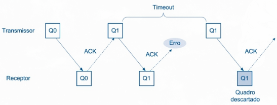<br>
*Fonte: MAIA, Luiz Paulo. Arquitetura de Redes de Computadores, 2ª ed., 2013, p. 167.*

- **Retransmissão Integral (*Go-Back-N*):** O transmissor mantém vários quadros pendentes em uma **janela**, sem esperar um ACK individual para cada envio. O receptor aceita os quadros em ordem e descarta os que chegam fora dela. Se um quadro se perder ou falhar, retransmitem-se o pendente e os seguintes ainda não confirmados.

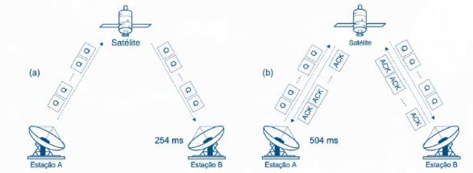<br>
*Fonte: MAIA, Luiz Paulo. Arquitetura de Redes de Computadores, 2ª ed., 2013, p. 170.*

- **Retransmissão Seletiva (*Selective Repeat*):** Também utiliza uma janela de quadros numerados, mas o receptor armazena os recebidos fora de ordem e o transmissor reenvia apenas os pendentes. Se o quadro 1 falhar, por exemplo, os quadros 2, 3 e 4 podem aguardar no *buffer*. Quando a lacuna é resolvida, os dados disponíveis são entregues em ordem e o espaço correspondente é liberado.

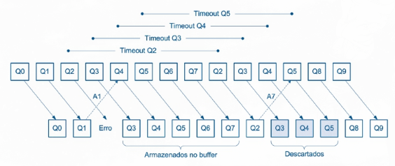<br>
*Fonte: MAIA, Luiz Paulo. Arquitetura de Redes de Computadores, 2ª ed., 2013, p. 175.*

## Controle de Fluxo:

Regula o envio para que um transmissor rápido não exceda a capacidade de processamento e armazenamento do receptor. Distingue-se do **controle de congestionamento**, que considera sobrecarga na rede, e pode utilizar:

- **Sinalização de Parada:** O receptor pede uma pausa antes de esgotar seu *buffer* e autoriza a retomada quando houver espaço.
- **Créditos (Janela):** O receptor informa quanto pode aceitar, permitindo ajustar a quantidade de dados pendentes de confirmação.

O **descarte por transbordo** é uma consequência da falta de espaço, não uma prevenção. Protocolos confiáveis podem recuperar esses dados por retransmissão, mas isso gera trabalho e tráfego adicionais.

---

# 04. Camada de Rede

> REVISADO ATÉ AQUI!

---

> REVISADO A PARTIR DAQUI!

# Apêndice A. Arquitetura Prática de Redes Locais

Este apêndice reúne mecanismos de acesso ao meio, tecnologias de redes locais e equipamentos que aplicam os conceitos das camadas Física e de Enlace.

## Controle de Acesso ao Meio:

Quando dispositivos compartilham um canal, é necessário organizar **quem pode transmitir e quando**. Transmissões incompatíveis que se sobrepõem podem causar uma **colisão**, impedindo a recepção correta.

### Acesso Particionado:

Cada dispositivo recebe uma parte do meio, como uma faixa de frequência, um intervalo de tempo ou um código. As transmissões podem ocorrer sem colisões entre os participantes corretamente separados.

- **FDMA (*Frequency Division Multiple Access*):** Aplica a divisão por frequência ao acesso de diferentes dispositivos, atribuindo uma faixa a cada um. Faixas reservadas podem ficar ociosas, e bandas de guarda ajudam a reduzir interferências entre canais vizinhos.

- **TDMA (*Time Division Multiple Access*):** Divide o acesso em *slots*: cada participante transmite na sua vez e aguarda a próxima oportunidade. Slots fixos podem ficar vazios; a alocação dinâmica procura reduzir esse desperdício.

- **CDMA (*Code Division Multiple Access*):** Permite que dispositivos transmitam no mesmo intervalo e na mesma faixa de frequência. As transmissões são distinguidas por códigos, e o receptor utiliza o código correspondente para recuperar o sinal desejado. É como se ocorressem várias conversas simultâneas em idiomas diferentes (só consegue acompanhar quem conhece o idioma).

> Na prática, sinais simultâneos ainda podem interferir uns nos outros se o sistema não for bem controlado.

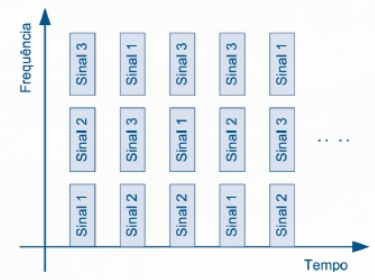<br>
*Fonte: MAIA, Luiz Paulo. Arquitetura de Redes de Computadores, 2ª ed., 2013, p. 188.*

### Acesso Aleatório:

Os dispositivos tentam transmitir quando têm dados. Se houver colisão, aguardam um intervalo e tentam novamente.

- **ALOHA puro:** O dispositivo envia o quadro assim que tem dados, sem verificar se alguém já está transmitindo. Se não recebe a confirmação de entrega (*ACK*, ou reconhecimento), considera que a tentativa pode ter falhado e retransmite após uma espera aleatória (para diminuir a chance de uma segunda colisão).

> Mesmo em condições ideais, a utilização máxima do meio pelo ALOHA puro fica em torno de **18%**.

- **ALOHA com *slots*:** Mantém a liberdade de tentativa, mas divide o tempo em intervalos. Um dispositivo só pode começar a transmitir **no início de um **slot****. Assim, as colisões ficam concentradas nos casos em que dois ou mais dispositivos escolhem o mesmo intervalo.

> Essa organização eleva a utilização máxima ideal para cerca de **37%**, mas ainda pode haver colisões e intervalos vazios.

- **CSMA (*Carrier Sense Multiple Access*):** Antes de transmitir, o dispositivo verifica se o meio parece estar livre. É como ouvir se alguém já está falando antes de usar o rádio. Isso reduz colisões, mas não as elimina (dois dispositivos podem perceber o canal livre quase ao mesmo tempo e começar a transmitir juntos).
  - **CSMA 1-Persistente:** O dispositivo que encontra o meio ocupado continua acompanhando-o e tenta transmitir assim que ele fica livre.
  - **CSMA Não Persistente:** Ele espera um intervalo antes de verificar novamente.

  > A segunda estratégia pode reduzir a disputa imediata entre vários dispositivos que aguardavam a liberação do canal, embora também possa aumentar a espera.

- **CSMA/CD (CSMA com detecção de colisão):** Além de verificar o meio antes de começar, a interface monitora a transmissão para **detectar uma colisão enquanto ela acontece**. Se isso ocorre, interrompe o envio, sinaliza a colisão e espera um tempo aleatório antes de tentar novamente. Após colisões sucessivas, o intervalo possível de espera aumenta (*backoff* exponencial).

> Esse mecanismo se aplica ao ***Ethernet* com meio compartilhado**, como redes antigas com cabo coaxial ou *hub*. Em uma ligação *Ethernet* atual entre um dispositivo e uma porta de *switch*, operando em *full-duplex*, não existe aquela disputa pelo meio compartilhado (por isso, o CSMA/CD não é necessário nessa ligação).

- **CSMA/CA (CSMA com Prevenção de Colisão):** Em redes sem fio, não é simples detectar colisões enquanto se transmite. A estação observa o canal e utiliza intervalos e espera aleatória para reduzir a chance de colisão. Opcionalmente, pode reservar o meio com RTS/CTS, detalhados na seção de *Wi-Fi*. Ouvir o canal, porém, não revela toda a situação da rede:

**Estação Escondida:** X e Z conseguem se comunicar com Y, mas não se ouvem. X pode julgar o canal livre enquanto Z transmite para Y. Uma resposta CTS de Y pode avisar as estações ao seu alcance para aguardar, reduzindo esse problema.

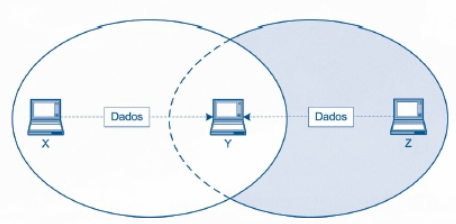<br>
*Fonte: MAIA, Luiz Paulo. Arquitetura de Redes de Computadores, 2ª ed., 2013, p. 196.*

**Estação Exposta:** Uma estação ouve uma transmissão próxima e deixa de enviar, mesmo quando seu destinatário está fora da área de interferência daquela comunicação.

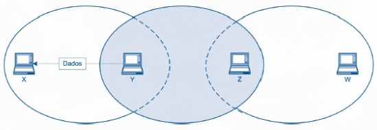<br>
*Fonte: MAIA, Luiz Paulo. Arquitetura de Redes de Computadores, 2ª ed., 2013, p. 197.*

### Acesso Ordenado:

- **Consulta centralizada (*polling*):** Um dispositivo central pergunta, em sequência, quais estações têm dados para transmitir e concede a vez a cada uma (moderador).

> A ordem evita colisões, mas as consultas consomem tempo e o funcionamento depende do dispositivo central.

- **Passagem de *token*:** Em vez de um moderador central, uma autorização chamada *token* circula entre os dispositivos. Quem recebe o *token* livre pode transmitir, os demais aguardam sua vez. O desafio é manter essa autorização circulando corretamente, inclusive quando há falhas.

## *Ethernet* e o Modelo IEEE 802:

O modelo IEEE 802 utiliza as subcamadas **MAC** e **LLC**, apresentadas no capítulo 1. O MAC *Ethernet* define endereçamento, formato do quadro, verificação de erros e regras de acesso pertinentes ao modo de operação.

O LLC prevê serviços **orientados à conexão**, com controle de fluxo e confirmações, e **não orientados à conexão**, com ou sem reconhecimento. Isso não significa que todo enlace *Ethernet* utilize todos esses recursos: no formato *Ethernet* II, o campo de tipo identifica diretamente o protocolo transportado.

### Quadro *Ethernet*:

O quadro *Ethernet* especifica os campos necessários para uma entrega local. Além dos **dados**, ele inclui os endereços MAC da origem e do destino, um campo de identificação e uma verificação de erros no final.

- **Preâmbulo e marcador de início:** Ajudam o receptor a se sincronizar e a reconhecer o início do quadro.
- **MAC de destino:** Indica a interface à qual o quadro se destina.
- **MAC de origem:** Identifica a interface que o enviou.
- **Tamanho/Tipo:** Informa o tamanho dos dados em um formato de quadro ou identifica o protocolo transportado em outro.
- **Dados:** Transportam a informação recebida da camada superior.
- **Sequência de verificação de quadro (*Frame Check Sequence*, FCS):** Contém o resultado da verificação de erros feita com CRC.

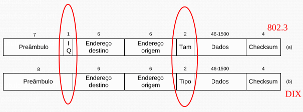<br>
*Fonte: FRAGA, Marcelo Caramuru Pimentel. Redes de Computadores - 11ª Aula, p. 15.*

A comparação histórica entre **IEEE 802.3 com LLC** e ***Ethernet* II (DIX)** está no campo de 2 *bytes* após os endereços: o primeiro o utiliza como comprimento; o segundo, como tipo de protocolo. O padrão IEEE 802.3 atual contempla o campo **Comprimento/Tipo**, distinguindo os usos pelo valor, sem tornar *Ethernet* II incompatível com ele.

O quadro *Ethernet* tem um **tamanho mínimo de `64 bytes`**, desconsiderando o preâmbulo e o marcador de início (`6 + 6 + 2 + 46 + 4 = 64`). Nesse formato básico, se houver menos de `46 bytes` de dados, acrescenta-se um **preenchimento** (*padding*).

> Esse tamanho mínimo, combinado com os limites físicos do segmento, garante (no *Ethernet* compartilhado clássico com CSMA/CD) que uma estação ainda esteja transmitindo quando o sinal de uma possível colisão distante consiga retornar até ela (se ele terminasse cedo demais, a estação poderia concluir que a transmissão deu certo antes de perceber a colisão).

### Evolução do *Ethernet*:

- **10BASE5 e 10BASE2:** Padrões antigos de *Ethernet*. Diferem, entre outros aspectos, no tipo de cabo e nas distâncias admitidas. Compartilhavam um cabo coaxial em topologia de barra.

> Uma falha no cabo ou uma mudança na instalação podia afetar várias estações.

- **10BASE-T:** As estações passaram a usar par trançado conectado a um ponto central (estrela física), facilitando instalação e manutenção. Com um *hub*, compartilham o mesmo domínio de colisão (barra lógica); com um *switch*, as portas podem operar independentemente.

- **Taxas Superiores:** Oferecem velocidades de transmissão como *Fast Ethernet* (`100 Mbps`) e *Gigabit Ethernet* (`1 Gbps`) e até superiores.

Nas redes compartilhadas, aumentar a taxa reduz o tempo de transmissão do quadro mínimo, exigindo atenção às condições para detectar colisões. A adoção de *switches* e conexões *full-duplex* retirou essa disputa do funcionamento normal dessas ligações.

## Equipamentos de Interconexão:

- **Repetidor:** Atua na **Camada Física**. Recebe um sinal enfraquecido, regenera-o e o envia ao trecho seguinte. Ele permite estender a comunicação, mas não lê os endereços do quadro nem decide quais dispositivos deveriam recebê-lo.

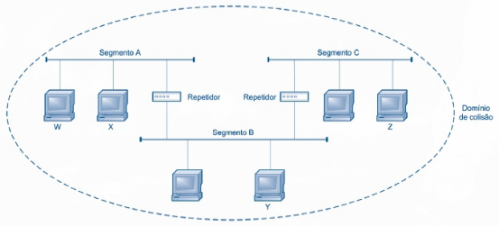<br>
*Fonte: MAIA, Luiz Paulo. Arquitetura de Redes de Computadores, 2ª ed., 2013, p. 220.*

- ***Hub*:** Repetidor com várias portas: o sinal recebido por uma é enviado às demais. Embora os cabos formem uma estrela, o meio continua compartilhado, com possibilidade de colisões.

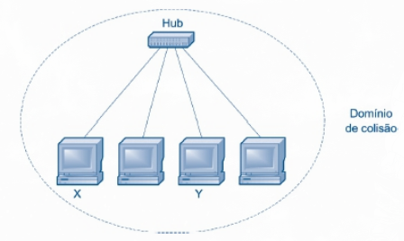<br>
*Fonte: MAIA, Luiz Paulo. Arquitetura de Redes de Computadores, 2ª ed., 2013, p. 220.*

- **Ponte:** Atua na **Camada de Enlace**. Ao observar os endereços MAC, consegue **evitar o encaminhamento** de quadros para segmentos onde eles não são necessários, separando os domínios de colisão.

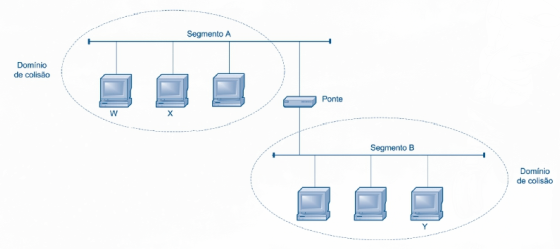<br>
*Fonte: MAIA, Luiz Paulo. Arquitetura de Redes de Computadores, 2ª ed., 2013, p. 223.*

- ***Switch*:** Ponte com várias portas. Aprende a localização das interfaces observando o **MAC de origem** dos quadros recebidos e associando-o à porta de entrada. Quando conhece um destino *unicast*, encaminha à porta correspondente; se ele estiver na própria porta de entrada, filtra o quadro. Um destino *unicast* desconhecido é distribuído pelas demais portas elegíveis da mesma VLAN. Ligações diretas a dispositivos podem operar em *full-duplex*, sem colisões.

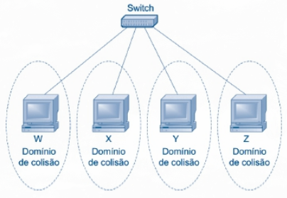<br>
*Fonte: MAIA, Luiz Paulo. Arquitetura de Redes de Computadores, 2ª ed., 2013, p. 224.*

> Se X enviar um quadro para Y, em um *hub* o sinal é repetido para todas as outras portas; em um *switch* que já sabe onde Y está conectado, o quadro é encaminhado à porta de Y. **Separar colisões não é a mesma coisa que separar todos os tipos de tráfego**.

Um quadro de ***broadcast*** ainda é distribuído pelo *switch* às demais portas da mesma rede lógica. O conjunto de dispositivos que recebe esse tipo de transmissão constitui um **domínio de **broadcast****.

## Redes Locais Sem Fio (IEEE 802.11):

### Endereçamento:

Em *Wi-Fi*, quadros de dados podem ter **até quatro campos de endereço**, conforme o trajeto. Os primeiros identificam receptor e transmissor imediatos; conforme o caso, esses endereços coincidem com a origem e o destino finais, e campos adicionais identificam o conjunto de estações (BSS, explicado a seguir) ou as outras extremidades da comunicação.

### Organização das Estações:

Em uma rede IEEE 802.11, um grupo de estações que se comunica constitui um conjunto básico de serviços (*Basic Service Set*, BSS). Ele pode funcionar de duas maneiras:

- **Infraestrutura:** As estações se associam a um **AP** (*Access Point*), que intermedeia a comunicação e pode conectar o BSS ao sistema de distribuição.
- ***Ad Hoc*:** As estações se comunicam diretamente, sem AP, formando um BSS independente (IBSS).

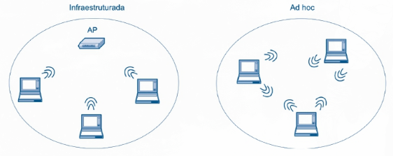<br>
*Fonte: MAIA, Luiz Paulo. Arquitetura de Redes de Computadores, 2ª ed., 2013, p. 229.*

Vários BSS com pontos de acesso podem ser interligados por um sistema de distribuição (*Distribution System*, DS). Juntos, formam um conjunto estendido de serviços (*Extended Service Set*, ESS).

Em um prédio, cada AP pode atender uma região. A integração dos BSS em um ESS permite mobilidade entre essas áreas, conforme os mecanismos de associação utilizados.

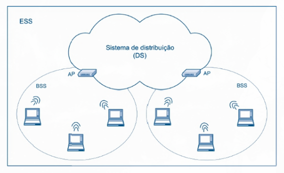<br>
*Fonte: MAIA, Luiz Paulo. Arquitetura de Redes de Computadores, 2ª ed., 2013, p. 230.*

### Acesso ao Meio:

- **DCF (*Distributed Coordination Function*):** Distribui a decisão entre as estações, com base em CSMA/CA. Combina observação do canal, intervalos entre quadros e ***backoff* aleatório**: a estação sorteia uma espera em *slots*, decrementa o contador enquanto o canal permanece livre e o congela quando fica ocupado, retomando após o intervalo exigido. Ainda podem ocorrer colisões.
- **PCF (*Point Coordination Function*):** Mecanismo opcional do modelo clássico que utiliza o AP para consultar estações (*polling*), organizando períodos sem a disputa normal da DCF. É apresentado aqui pelo seu papel no modelo original de acesso.

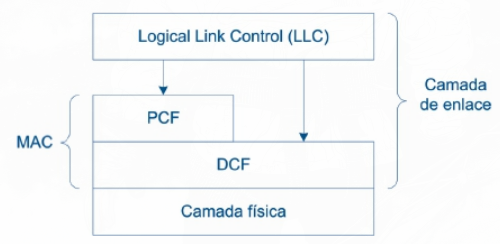<br>
*Fonte: MAIA, Luiz Paulo. Arquitetura de Redes de Computadores, 2ª ed., 2013, p. 233.*

### RTS, CTS, ACK e NAV:

- **RTS (*Request to Send*):** O transmissor solicita a reserva do meio.
- **CTS (*Clear to Send*):** O receptor responde à solicitação, indicando que a transmissão pode prosseguir.
- **ACK (*Acknowledgement*):** Confirma a recepção correta de um quadro que exige reconhecimento, como no envio *unicast* convencional. Não tem a mesma função preventiva de RTS/CTS.

Com a reserva opcional, a sequência pode ser `RTS → CTS → Dados → ACK`; sem ela, `Dados → ACK`. RTS/CTS pode ajudar com estações escondidas, mas acrescenta *overhead* e não elimina todas as colisões.

O **NAV** (*Network Allocation Vector*) é um temporizador de reserva virtual: uma estação que recebe um quadro com informação de duração ajusta seu NAV e adia transmissões durante o período indicado. Assim, a reserva também considera o tempo necessário às respostas da troca.

### IFS (*Interframe Space*):

Após o meio ficar livre, as estações aguardam intervalos que ajudam a estabelecer prioridades. No modelo DCF/PCF descrito:

- **SIFS:** Intervalo curto, utilizado em respostas imediatas, como CTS e ACK.
- **PIFS:** Intervalo intermediário, utilizado pela PCF.
- **DIFS:** Intervalo utilizado no acesso por DCF, antes da disputa por *backoff* quando aplicável.

Como `SIFS < PIFS < DIFS`, as respostas de uma troca iniciada têm precedência sobre novas tentativas. Quadros também podem ser **fragmentados** para reduzir o volume retransmitido em caso de erro; seus fragmentos podem ser enviados em sequência, preservando temporariamente o acesso ao meio.

### Segurança:

- **WEP (*Wired Equivalent Privacy*):** Proteção inicial do *Wi-Fi*, com vulnerabilidades que o tornam inadequado para proteger redes atuais.
- **WPA (*Wi-Fi Protected Access*):** Solução de transição que introduziu TKIP para enfrentar limitações do WEP, também superada.
- **WPA2:** Introduziu proteção baseada em AES-CCMP, mais robusta do que WEP e WPA/TKIP.
- **WPA3:** Acrescenta melhorias de autenticação e proteção. No modo pessoal, utiliza **SAE** (*Simultaneous Authentication of Equals*) em lugar da autenticação PSK do WPA2.

Os modos **pessoais** utilizam uma senha compartilhada (PSK em WPA/WPA2 ou SAE em WPA3); os **corporativos** utilizam autenticação individual, normalmente apoiada por um servidor que verifica as credenciais dos usuários.

## Agregação de Enlaces:

Combina duas ou mais conexões físicas para que funcionem como uma única ligação lógica. Algo como, por exemplo, dois *switches* conectados por vários cabos: o tráfego pode ser distribuído entre essas conexões, aumentando a capacidade **total disponível para diferentes fluxos**. Uma única transferência não terá necessariamente sua velocidade multiplicada pelo número de cabos, pois a distribuição costuma ocorrer entre fluxos. A técnica também oferece redundância: se um cabo falhar, os demais podem manter a ligação ativa.

## STP (*Spanning Tree Protocol*):

Criar caminhos alternativos entre *switches* aumenta a disponibilidade, mas pode formar um *loop* (quadros são reenviados repetidamente entre os equipamentos), causando tráfego excessivo e prejudicando a rede.

O **STP** identifica esses caminhos redundantes e deixa alguns deles temporariamente sem encaminhar quadros. Se um caminho ativo falhar, um caminho alternativo pode passar a ser utilizado.

> É como fechar uma das ruas de um circuito para impedir que veículos fiquem dando voltas.

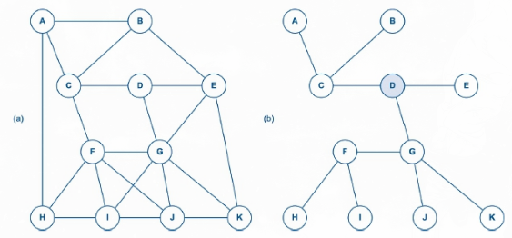<br>
*Fonte: MAIA, Luiz Paulo. Arquitetura de Redes de Computadores, 2ª ed., 2013, p. 241.*

## VLANs (*Virtual Local Area Networks*):

Um *switch* separa os domínios de colisão de suas portas, mas, sem outra configuração, um ***broadcast*** ainda alcança os dispositivos da mesma rede lógica. Uma **VLAN** permite dividir essa rede em grupos: cada VLAN constitui, em condições normais, seu próprio domínio de *broadcast*. A associação à VLAN pode vir da configuração da **porta de acesso** ou de políticas específicas; entre equipamentos, a identificação também pode ser transportada por uma *tag* no quadro.

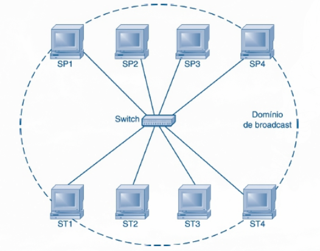<br>
*Fonte: MAIA, Luiz Paulo. Arquitetura de Redes de Computadores, 2ª ed., 2013, p. 243.*

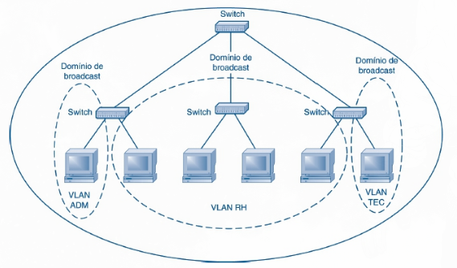<br>
*Fonte: MAIA, Luiz Paulo. Arquitetura de Redes de Computadores, 2ª ed., 2013, p. 246.*

Uma ligação de **entroncamento** (*trunk*) transporta várias VLANs entre equipamentos, normalmente identificadas por *tags* IEEE 802.1Q. Conforme a configuração, o tráfego de uma VLAN nativa pode circular sem *tag*; por isso, associação à VLAN e presença de uma marca no quadro não são a mesma coisa.

Dispositivos de **VLANs diferentes** não passam a se comunicar diretamente só porque estão ligados ao mesmo *switch*. Para permitir essa comunicação, é necessário encaminhar o tráfego entre as redes, por exemplo, usando um roteador.

---

# Fontes

- MAIA, Luiz Paulo. *Arquitetura de Redes de Computadores*. 2. ed. Rio de Janeiro: LTC, 2013.
- TANENBAUM, Andrew; FEAMSTER, Nick; WETHERALL, David. *Redes de Computadores*. 6. ed. São Paulo: Pearson, 2021.
- FRAGA, Marcelo Caramuru Pimentel. *Redes de Computadores I*. Material de aula. Curso de graduação em Engenharia de Computação - Centro Federal de Educação Tecnológica de Minas Gerais (CEFET-MG), 2026.
- NEWMAN-WOLFE, Richard E. *Multiplexing*. CEN 4500C: Fundamentals of Computer Communication Networks. University of Florida, 1995. Disponível em: https://www.cise.ufl.edu/~nemo/cen4500/mux.html. Acesso em: 24 set. 2026.
- BRADEN, R. (ed.). *Requirements for Internet Hosts — Communication Layers*. RFC 1122. [S. l.]: RFC Editor, 1989. Disponível em: https://www.rfc-editor.org/rfc/rfc1122.html. Acesso em: 8 out. 2026.
- SIMPSON, W. (ed.). *PPP in HDLC-like Framing*. RFC 1662. [S. l.]: RFC Editor, 1994. Disponível em: https://www.rfc-editor.org/rfc/rfc1662.html. Acesso em: 8 out. 2026.
- MASSACHUSETTS INSTITUTE OF TECHNOLOGY. *Principles of Digital Communication II: The Gap Between Uncoded Performance and the Shannon Limit*. Cap. 4. Cambridge, MA: MIT OpenCourseWare, 2005. Disponível em: https://ocw.mit.edu/courses/6-451-principles-of-digital-communication-ii-spring-2005/b286123989945cef13e5a9aa20e56a18_chap4.pdf. Acesso em: 8 out. 2026.
- CISCO. *WPA3 Deployment Guide*. [S. l.]: Cisco, [s. d.]. Disponível em: https://www.cisco.com/c/en/us/td/docs/wireless/controller/9800/technical-reference/wpa3-dg.html. Acesso em: 8 out. 2026.
