```
 _____  _       _                                 
/  ___|(_)     | |                                
\ `--.  _  ___ | |_   ___  _ __ ___    __ _  ___  
 `--. \| |/ __|| __| / _ \| '_ ` _ \  / _` |/ __| 
/\__/ /| |\__ \| |_ |  __/| | | | | || (_| |\__ \ 
\____/ |_||___/ \__| \___||_| |_| |_| \__,_||___/  
 _____                                  _                       _      
|  _  |                                (_)                     (_)
| | | | _ __    ___  _ __   __ _   ___  _   ___   _ __    __ _  _  ___ 
| | | || '_ \  / _ \| '__| / _` | / __|| | / _ \ | '_ \  / _` || |/ __|
\ \_/ /| |_) ||  __/| |   | (_| || (__ | || (_) || | | || (_| || |\__ \
 \___/ | .__/  \___||_|    \__,_| \___||_| \___/ |_| |_| \__,_||_||___/
       | |                                                             
       |_|                                                             
```

# 0. Conceitos Básicos

## O que é um Sistema Operacional:

Pode ser definido como uma camada de *software* que opera entre o *hardware* e os programas. Entre suas funções estão:

- **Abstração:** Fornece interfaces comuns para acessar recursos complexos. Uma aplicação pode ler um arquivo, por exemplo, sem conhecer os detalhes do dispositivo que o armazena.
- **Gerência:** Gerencia o uso do processador pelos programas (tempo de uso e prioridade), a alocação de memória, os dispositivos e a proteção dos recursos.

## Tipos de Sistemas Operacionais:

- **Em lote (*batch*):** Processa conjuntos de tarefas com pouca ou nenhuma interação do usuário durante a execução, como um lote de transações.
- **De rede:** Permite acessar recursos de outros computadores, como arquivos e impressoras, mantendo a identificação das máquinas envolvidas.
- **Distribuído:** Coordena recursos de diferentes computadores e procura apresentá-los de forma transparente, como se pertencessem a um único sistema.
- **Multiusuário:** Atende diferentes usuários, controlando o acesso e o compartilhamento dos recursos entre eles.
- **Servidor:** Prioriza o atendimento de solicitações, a disponibilidade e a gerência de grandes volumes de recursos.
- ***Desktop*:** Prioriza a interatividade e o uso de aplicações pessoais, normalmente com interface gráfica.
- **Móvel:** Gerencia energia, conectividade e sensores.
- **Embarcado:** Atende a uma finalidade específica dentro de um equipamento, frequentemente com restrições de memória, processamento e energia.
- **Tempo real:** Busca garantir o cumprimento de prazos. Em sistemas *hard real-time*, perder um prazo pode comprometer o funcionamento; em sistemas *soft real-time*, atrasos ocasionais podem ser tolerados, com perda de qualidade.

> SOs modernos não se limitam apenas a uma dessas configurações, pois combinam várias delas. Tempo real também não significa simplesmente “mais rápido”: o importante é responder dentro do prazo necessário.

## Estrutura de um Sistema Operacional:

- **Núcleo (*kernel*):** Responsável pela gerência dos recursos do *hardware*, além de fornecer abstrações e serviços às aplicações.
- **Inicialização (*boot*):** Prepara a máquina e carrega o núcleo na memória, com a participação do *firmware*, do carregador de inicialização e do próprio núcleo.
- ***Drivers*:** Módulos de código que permitem acessar e controlar dispositivos físicos, como placas de vídeo, interfaces de rede e unidades de armazenamento.
- **Utilitários:** Ferramentas complementares, como formatação de disco, *shell* (interpretador de comandos) e interface com o usuário.

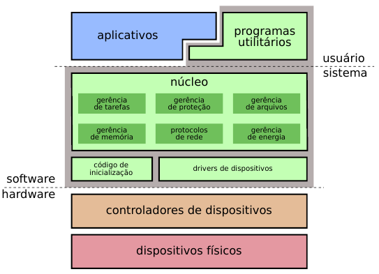<br>
*Fonte: MAZIERO, Carlos A. Sistemas Operacionais: Conceitos e Mecanismos, 1. ed., 2019, p. 14.*

### Políticas e Mecanismos:

A **política** define o que deve ser feito; o **mecanismo**, como realizar a decisão. No escalonamento, por exemplo, a política escolhe quem recebe a CPU, enquanto o mecanismo salva o estado da tarefa atual e restaura o da próxima. A separação permite mudar a política sem reconstruir todo o mecanismo.

### Endereços de Dispositivos:

Os dispositivos possuem registradores de controle e dados, utilizados pelo processador para consultar informações e enviar comandos. O *driver* conhece sua organização e os acessa por **E/S mapeada em memória** (MMIO - *Memory-Mapped I/O*) ou por instruções e endereços específicos de entrada e saída (E/S), conforme a arquitetura.

## Desvios:

O processador pode desviar a execução para tratar eventos, classificados neste resumo como:

- **Interrupção:** Sinaliza um evento externo à instrução em execução, como a chegada de um pacote de rede ou o disparo de um temporizador.
- **Exceção:** Sinaliza um evento ocorrido durante a execução de uma instrução, como divisão por zero, instrução inválida (*opcode* inexistente) ou tentativa de acessar uma página de memória ainda não disponível.
- ***Trap*:** Solicita um desvio de forma intencional pelo *software*, como na entrada controlada em um serviço do núcleo.

> A nomenclatura depende da arquitetura e da fonte consultada. Em algumas, *trap* é um termo mais geral ou uma categoria de exceção.

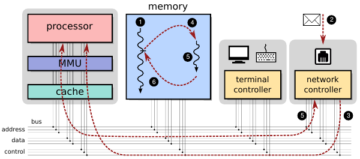<br>
*Fonte: MAZIERO, Carlos A. Sistemas Operacionais: Conceitos e Mecanismos, 1. ed., 2019, p. 18.*

1. Durante a execução de um processo, a placa *Ethernet* recebe um pacote e envia uma requisição de interrupção (IRQ) ao processador.
2. A execução é desviada para a rotina que providencia o tratamento dos dados recebidos.
3. Ao final, o processo pode ser retomado ou outra tarefa pode receber a CPU, se houver reescalonamento.

## Níveis de Privilégio:

A organização depende da arquitetura, mas os SOs modernos normalmente utilizam dois níveis conceituais:

- **Menor privilégio:** Reservado às aplicações (*user mode*), que possuem acesso limitado às operações e aos recursos protegidos.
- **Maior privilégio:** Reservado ao núcleo (*kernel mode*), que pode executar operações restritas e gerenciar os recursos do sistema.

## Chamadas de Sistema (*Syscalls*):

As **chamadas de sistema** permitem às aplicações solicitar serviços como ler arquivos, trocar dados pela rede e criar processos. O controle passa por uma entrada definida para executar código privilegiado do núcleo, que verifica a solicitação, realiza o serviço e devolve o resultado. Isso permite utilizar recursos protegidos sem dar à aplicação acesso irrestrito a eles.

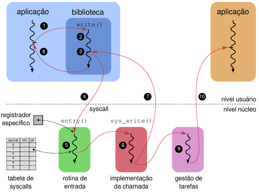<br>
*Fonte: MAZIERO, Carlos A. Sistemas Operacionais: Conceitos e Mecanismos, 1. ed., 2019, p. 23.*

> Entrar no núcleo não significa necessariamente trocar de tarefa. Da mesma forma, uma interrupção pode ser atendida e retornar à tarefa original, sem que outra receba o processador.

---

# 1. Arquitetura de Sistemas Operacionais

## Divisão do Núcleo:

### Sistemas Monolíticos:

Os principais serviços executam dentro do núcleo, em modo privilegiado (gerência de processos, memória, arquivos, rede e *drivers*). A comunicação direta favorece o **desempenho**, mas as dependências aumentam a **complexidade**, e uma falha pode comprometer todo o sistema. 

> Monolítico não significa necessariamente um único bloco indivisível: o núcleo pode ser organizado em módulos, inclusive carregados conforme a necessidade.

### Sistemas Micronúcleo:

Mantêm no núcleo mecanismos essenciais de proteção, execução e comunicação, enquanto serviços como sistemas de arquivos e alguns *drivers* podem executar em processos separados. Isso favorece a **modularidade e o isolamento de falhas**, mas exige comunicação entre componentes, cujo custo depende da implementação.

### Sistemas em Camadas:

Subdividem responsabilidades em camadas: as inferiores lidam com o *hardware*, as intermediárias fornecem gerência e abstrações, e as superiores oferecem serviços às aplicações. A organização facilita a manutenção, mas a passagem por muitas camadas pode acrescentar custo à execução.

### Sistemas Híbridos:

Misturam características dos modelos anteriores. Podem agrupar rotinas muito interligadas para preservar a eficiência e manter interfaces e módulos que facilitem a organização e a manutenção.

## Virtualização:

### Máquinas Virtuais:

Fornecem um ambiente de execução construído por *software*, frequentemente com apoio do *hardware*. A **máquina virtual de aplicação**, como a JVM do Java, executa código em um ambiente próprio; a **de sistema** permite executar um SO inteiro. Neste segundo caso, participam:

- **Hospedeiro (*host*):** A máquina que fornece os recursos reais de *hardware*.
- **Hipervisor:** A camada que cria e gerencia as máquinas virtuais, controlando o acesso aos recursos do hospedeiro.
- **Convidado (*guest*):** O sistema operacional executado dentro da máquina virtual.

O **hipervisor nativo (tipo 1)** executa diretamente sobre o *hardware*, como Xen e VMware ESXi. O **hipervisor hospedado (tipo 2)** executa sobre um sistema operacional hospedeiro, como VirtualBox e VMware Workstation.

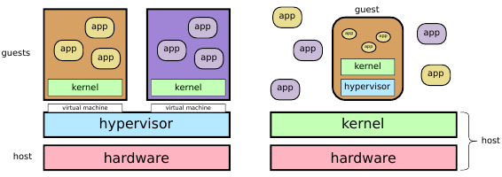<br>
*Fonte: MAZIERO, Carlos A. Sistemas Operacionais: Conceitos e Mecanismos, 1. ed., 2019, p. 33.*

### *Containers*:

Consistem em uma forma de isolar ambientes de execução em nível de sistema operacional. Cada *container* reúne aplicações e suas dependências, mas **compartilha o núcleo** com os demais ambientes do mesmo hospedeiro.

- **Isolamento e recursos:** O sistema restringe a visão e o acesso aos recursos de cada ambiente. A comunicação e os limites de memória e CPU são configuráveis; esses limites não são necessariamente aplicados por padrão.
- **Vantagem em relação às máquinas virtuais:** Não é necessário carregar um núcleo separado para cada instância, reduzindo o consumo de recursos e o tempo de inicialização.
- **Limitação:** Depende do núcleo compartilhado: incluir arquivos de outra distribuição não permite, por si só, executar um núcleo diferente.

## Tipos Avançados de Sistemas Operacionais:

### Exonúcleo:

Dá às aplicações maior controle dos recursos, mantendo no núcleo a **proteção e o compartilhamento seguro**. Bibliotecas das aplicações podem implementar políticas de memória, armazenamento e comunicação, permitindo maior especialização, mas assumindo mais responsabilidade pela gerência.

### *Unikernel*:

Reúne a aplicação e os componentes de sistema necessários em uma imagem especializada. Normalmente utiliza um único espaço de endereçamento, sem processos isolados como em um SO tradicional, e pode executar sobre um hipervisor ou diretamente no *hardware*.

- **Vantagens:** Pode apresentar baixo consumo de memória, inicialização rápida e menor superfície de ataque, por dispensar serviços e utilitários desnecessários.
- **Limitações:** A especialização reduz a flexibilidade e pode dificultar a depuração. Ter menos componentes não elimina falhas, e a ausência de isolamento interno pode ampliar o impacto de um erro.

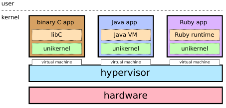<br>
*Fonte: MAZIERO, Carlos A. Sistemas Operacionais: Conceitos e Mecanismos, 1. ed., 2019, p. 36.*

---

# 2. Tarefas

## Programa × Tarefa:

Um **programa** é uma sequência de instruções armazenada, sem uma execução em andamento. Uma **tarefa** é uma atividade em execução, com estado próprio: ela pode ser interrompida e depois continuar do ponto em que parou.

## Formas de Execução das Tarefas:

### Sistema Monotarefa:

Executa uma tarefa de cada vez, até sua conclusão. Enquanto ela espera uma operação de E/S, o processador pode permanecer ocioso.

### Sistema Multitarefa:

Mantém várias tarefas em andamento, alternando o uso da CPU. Se uma fica bloqueada esperando E/S, outra pode executar. Na **multitarefa cooperativa**, a tarefa atual precisa ceder, bloquear ou terminar; um laço infinito pode impedir a alternância. Na **preemptiva**, o sistema pode retirar a CPU da tarefa mesmo sem sua cooperação.

> A espera comum por acesso à RAM não implica troca de tarefa; o exemplo considera uma espera bloqueante, como E/S.

### Tempo Compartilhado (*Time Sharing*):

Distribui tempo de CPU para manter o sistema responsivo. Cada tarefa recebe uma **fatia de tempo** (*quantum*), após a qual pode sofrer preempção. Fatias pequenas favorecem a alternância, mas aumentam o custo das trocas de contexto; fatias grandes reduzem esse custo, mas prolongam a espera das outras tarefas. Prioridades também podem influenciar a distribuição.

### Concorrência e Paralelismo:

**Concorrência** significa que várias tarefas progridem ao longo do mesmo intervalo, mesmo que executem de forma intercalada em uma única CPU. **Paralelismo** significa que elas executam efetivamente ao mesmo tempo, utilizando mais de uma unidade de processamento.

> Um cozinheiro alternando entre dois pratos trabalha de forma concorrente; dois cozinheiros preparando os pratos ao mesmo tempo trabalham em paralelo. A intercalação já permite conflitos de acesso compartilhado, mesmo com uma única CPU.

## Estados de uma Tarefa:

- **Pronta:** Possui tudo o que precisa para executar e está apenas esperando receber tempo de processador.
- **Executando:** Está utilizando efetivamente o processador naquele momento.
- **Bloqueada:** Não pode continuar enquanto espera algum evento ou recurso, como a chegada de dados da rede, leitura do disco ou entrada do usuário.
- **Finalizada:** Terminou sua execução e não precisa mais utilizar o processador.

Uma tarefa passa de pronta para executando ao receber a CPU. Se precisar esperar E/S, fica bloqueada e volta a pronta quando a operação termina.

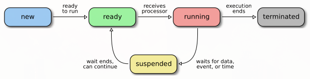<br>
*Fonte: MAZIERO, Carlos A. Sistemas Operacionais: Conceitos e Mecanismos, 1. ed., 2019, p. 45.*

## Gestão de Tarefas:

### Contexto de Execução:

Reúne as informações necessárias para interromper e retomar uma tarefa do ponto em que parou, incluindo o contador de programa (*Program Counter*, PC), o ponteiro da pilha (*Stack Pointer*, SP) e os demais registradores da CPU.

> Memória, arquivos abertos e conexões também pertencem ao estado geral do processo, mas permanecem armazenados: **não são copiados a cada troca de contexto**.

### TCB (*Task Control Block*):

É a estrutura que registra o identificador, estado, prioridade, contexto salvo e referências aos recursos da tarefa, permitindo acompanhá-la e retomá-la. Normalmente, é implementada com estruturas de dados, como uma `struct` em C.

### Troca de Contexto:

Alterna a CPU entre tarefas, seguindo estas etapas:

1. Salva o contexto da tarefa atualmente em execução (no seu respectivo TCB).
2. Escolhe a próxima tarefa a ser executada.
3. Restaura o contexto da próxima tarefa quando ela assumir o processador.

- **Despachante (*Dispatcher*):** Realiza efetivamente a troca de contexto em baixo nível.
- **Escalonador (*Scheduler*):** Avalia as tarefas prontas e define a ordem de execução.

## Processos:

Um processo é um conjunto organizado de recursos utilizado para executar um programa, contendo um ou mais fluxos de execução (*threads*).

- **Componentes:** Contém áreas de memória (código, dados, pilha etc.), descritores de recursos (arquivos, *sockets* etc.) e uma ou mais tarefas em execução.
- **Isolamento:** Processos normalmente possuem **espaços de endereçamento separados**, protegidos pela unidade de gerência de memória (MMU) e pelo SO. Já os níveis de privilégio separam principalmente aplicações comuns e núcleo.

A criação depende do SO. Na família Unix, novos processos podem ser criados a partir de outros, formando uma hierarquia:

- **Duplicação (`fork()`):** Cria um processo filho (*child*) semelhante ao pai (*parent*). Ambos possuem identificadores distintos e seguem executando independentemente.
- **Substituição da imagem (família `exec`):** Troca o programa executado dentro do processo, mantendo seu identificador. É comum usar `fork()` e, no filho, uma função `exec` para carregar outro programa.
- **Acompanhamento:** O pai pode aguardar e recolher informações sobre a finalização dos filhos com `wait()` e `waitpid()`.

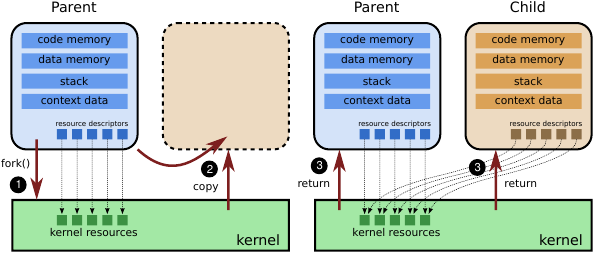<br>
*Fonte: MAZIERO, Carlos A. Sistemas Operacionais: Conceitos e Mecanismos, 1. ed., 2019, p. 56.*

## *Threads*:

Uma *thread* é um fluxo de execução dentro de um processo; também existem *threads* do núcleo. Um editor pode utilizar uma para responder ao usuário enquanto outra realiza processamento. A organização dos recursos é:

| Elemento | Organização no Processo |
| --- | --- |
| Código, dados globais e memória dinâmica | Compartilhados pelas *threads*. |
| Arquivos e outros recursos do processo | Compartilhados pelas *threads*. |
| Registradores, ponto de execução e pilha | Próprios de cada *thread*. |

> A pilha própria não é protegida das demais *threads*: elas compartilham o espaço de endereçamento e precisam coordenar acessos para evitar corrupção de dados.

### Modelos de Implementação de *Threads*:

Descrevem o mapeamento das *threads* de usuário nas reconhecidas pelo núcleo, cuja quantidade não corresponde diretamente à de núcleos físicos:

- **N:1:** Várias *threads* de usuário compartilham uma *thread* do núcleo. A criação e a alternância podem ter baixo custo, mas não há paralelismo entre elas em várias CPUs. No modelo clássico, bloquear a única *thread* do núcleo impede o progresso das demais.

- **1:1:** Cada *thread* de usuário corresponde a uma do núcleo, permitindo escalonamento independente e paralelismo com CPUs disponíveis. Em contrapartida, cada uma exige recursos do SO, encarecendo sua criação em grande quantidade.

- **N:M:** Distribui várias *threads* de usuário entre várias do núcleo. Combina flexibilidade e paralelismo, mas exige coordenação entre os níveis, aumentando a complexidade.

## Escalonamento de Tarefas:

Define a ordem de execução das tarefas prontas conforme os objetivos do sistema. A política pode favorecer diferentes perfis: tarefas **limitadas por CPU (*CPU-bound*)** passam mais tempo processando; tarefas **limitadas por E/S (*I/O-bound*)** alternam processamento e esperas por dispositivos ou dados.

### Critérios de Escalonamento:

- **Tempo de vida (ou *Turnaround*):** Tempo entre a criação de uma tarefa e o seu encerramento.
- **Tempo de espera:** Tempo acumulado na fila de tarefas prontas; não inclui o período bloqueado aguardando E/S.
- **Tempo de resposta:** Tempo entre uma solicitação e o início de sua resposta. Em exercícios de escalonamento, costuma ser medido entre a chegada da tarefa e sua primeira execução.
- **Justiça:** Distribuição adequada do uso do processador entre as tarefas, conforme a política do sistema; não significa necessariamente conceder tempos iguais.

### Algoritmos de Escalonamento:

Os exemplos a seguir utilizam a mesma tabela de tarefas e hipóteses simplificadas para permitir a comparação:

<br>
*Fonte: MAZIERO, Carlos A. Sistemas Operacionais: Conceitos e Mecanismos, 1. ed., 2019, p. 73.*

> O **critério de desempate** entre tarefas de mesma prioridade e com início no mesmo ciclo é o número da tarefa em ordem crescente.

**FCFS (*First-Come, First-Served*):** Atende as tarefas pela ordem de chegada à fila de prontas, sem preempção. Uma tarefa longa pode fazer várias tarefas curtas esperarem atrás dela.

<br>
*Fonte: MAZIERO, Carlos A. Sistemas Operacionais: Conceitos e Mecanismos, 1. ed., 2019, p. 73.*

**Revezamento (*Round Robin*):** Utiliza preempção por tempo. Quando esgota seu *quantum*, a tarefa que ainda pode continuar volta ao final da fila de prontas. Se bloquear ou terminar antes disso, libera a CPU antecipadamente.

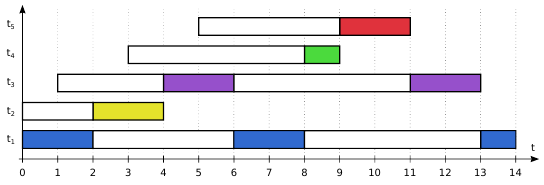<br>
*Fonte: MAZIERO, Carlos A. Sistemas Operacionais: Conceitos e Mecanismos, 1. ed., 2019, p. 74.*

**SJF (*Shortest Job First*):** Escolhe a tarefa pronta com o menor próximo trecho de processamento na CPU, sem preempção. Em exercícios em que cada tarefa possui apenas um trecho, esse valor corresponde ao seu tempo total de execução.

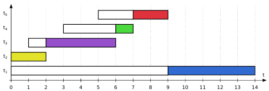<br>
*Fonte: MAZIERO, Carlos A. Sistemas Operacionais: Conceitos e Mecanismos, 1. ed., 2019, p. 76.*

**SRTF (*Shortest Remaining Time First*):** É a versão preemptiva do SJF. Executa a tarefa com o menor tempo restante no trecho de CPU considerado e pode interromper a tarefa atual se outra com tempo restante menor entrar na fila de prontas.

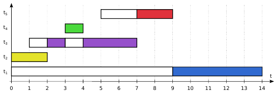<br>
*Fonte: MAZIERO, Carlos A. Sistemas Operacionais: Conceitos e Mecanismos, 1. ed., 2019, p. 77.*

> Na prática, a duração dos próximos trechos de CPU geralmente não é conhecida. Políticas baseadas nessa duração precisam trabalhar com **estimativas**, como as obtidas pelo histórico de execução. SJF e SRTF também podem provocar inanição de tarefas longas se tarefas curtas continuarem chegando.

**PRIOc (Prioridade Cooperativa):** Escolhe a tarefa pronta de maior prioridade. A tarefa atual não sofre preempção por essa política: continua até terminar, bloquear ou ceder a CPU. Isso não impede que o processador atenda interrupções de dispositivos.

<br>
*Fonte: MAZIERO, Carlos A. Sistemas Operacionais: Conceitos e Mecanismos, 1. ed., 2019, p. 78.*

**PRIOp (Prioridade Preemptiva):** É parecido com o modelo cooperativo, mas utiliza preempção. Se uma tarefa de maior prioridade entrar na fila de prontas, **a execução atual será pausada** para que a nova tarefa seja executada.

<br>
*Fonte: MAZIERO, Carlos A. Sistemas Operacionais: Conceitos e Mecanismos, 1. ed., 2019, p. 78.*

**PRIOd (Prioridade Dinâmica):** Altera prioridades ao longo do tempo. O **envelhecimento (*aging*)** aumenta a prioridade de quem espera, reduzindo o risco de inanição (*starvation*). As regras de aumento e retorno à prioridade base dependem da política, que deve permitir o progresso das tarefas preteridas.

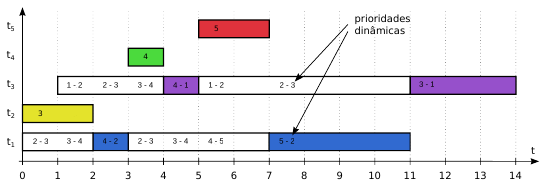<br>
*Fonte: **Adaptado** de MAZIERO, Carlos A. Sistemas Operacionais: Conceitos e Mecanismos, 1. ed., 2019, p. 80.*

**Comparação entre os algoritmos:**

<br>
*Fonte: MAZIERO, Carlos A. Sistemas Operacionais: Conceitos e Mecanismos, 1. ed., 2019, p. 82.*

### Inversão de Prioridade:

Ocorre quando uma tarefa de alta prioridade precisa esperar por um recurso utilizado por uma tarefa de baixa prioridade. Se tarefas de prioridade intermediária atrasarem a tarefa de baixa prioridade, elas também atrasarão indiretamente a tarefa mais prioritária, mesmo sem compartilhar o recurso com ela.

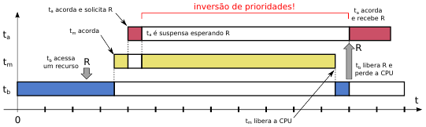<br>
*Fonte: MAZIERO, Carlos A. Sistemas Operacionais: Conceitos e Mecanismos, 1. ed., 2019, p. 88.*

### Protocolo de Herança de Prioridade:

A tarefa que possui o recurso pode **herdar temporariamente a prioridade** da tarefa bloqueada. Assim, tarefas intermediárias deixam de interrompê-la até que libere o recurso e perca a prioridade herdada:

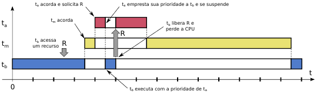<br>
*Fonte: MAZIERO, Carlos A. Sistemas Operacionais: Conceitos e Mecanismos, 1. ed., 2019, p. 88.*

1. **Tarefa Baixa** inicia a execução e adquire o recurso exclusivo (R).
2. **Tarefa Alta** solicita (R), fica bloqueada e faz com que a **Tarefa Baixa** herde temporariamente sua prioridade.
3. **Tarefa Média** não consegue interromper a **Tarefa Baixa**, permitindo que ela termine o uso do recurso.
4. **Tarefa Baixa** libera (R) e perde a prioridade herdada. Neste exemplo, a **Tarefa Alta** assume a CPU e prossegue.

> A herança reduz o atraso causado por tarefas intermediárias, mas não elimina o tempo necessário para liberar o recurso nem resolve impasses por si só.

---

# 3. Comunicação, Sincronização e Impasses

**Comunicação** permite trocar informações; **sincronização** coordena a ordem das operações e o acesso aos recursos. *Threads* de um processo podem usar a memória que já compartilham, enquanto processos separados recorrem a mecanismos como canais de mensagens ou memória compartilhada autorizada pelo SO.

## Tipos de Comunicação:

### Comunicação Direta e Indireta:

Na **direta**, o emissor identifica o receptor; na **indireta**, as tarefas utilizam um canal ou uma caixa de mensagens, sem identificar diretamente quem produzirá ou consumirá cada mensagem. Essa classificação não determina o bloqueio das operações nem dispensa a intermediação do núcleo.

### Características dos Canais:

- **Capacidade:** Nula (sem armazenamento, exigindo encontro entre envio e recepção), limitada (com *buffer* finito) ou ilimitada (simplificação teórica, pois os recursos reais são finitos).
- **Confiabilidade:** Pode garantir entrega, integridade e ordenação. As garantias e falhas possíveis dependem do mecanismo e do protocolo.
- **Número de participantes:** Um emissor e um receptor (1:1) ou múltiplos participantes (M:N). Em filas de trabalho, cada mensagem é consumida por um receptor; em canais de eventos, pode ser distribuída a vários assinantes.

### Sincronismo e Bloqueio:

Na comunicação **síncrona**, as tarefas se coordenam para concluir a troca: sem armazenamento, o envio aguarda uma recepção correspondente. Na **assíncrona**, a mensagem pode ficar armazenada até o receptor consumi-la.

O bloqueio depende da operação: receber pode exigir dados disponíveis; enviar, espaço no *buffer*. Uma operação **não bloqueante** retorna sem aguardar, permitindo tratar a indisponibilidade. Na comunicação **semissíncrona**, a espera tem um prazo (*timeout*), após o qual o programa deve tratar a falha, tentando novamente ou cancelando a solicitação.

## Mecanismos de Comunicação:

### *Pipes*:

Canais unidirecionais de comunicação entre processos, no modelo usual do Unix, com uma extremidade de escrita e outra de leitura. Transportam um **fluxo de *bytes***, sem separar mensagens, e podem ser usados pelo *shell* ou diretamente por programas.

Possuem *buffer* limitado, de tamanho dependente do sistema e da configuração. Em modo bloqueante, ler sem dados aguarda se houver alguma extremidade de escrita aberta; escrever sem espaço pode esperar pelo consumo. Fechadas todas as extremidades de escrita e esgotados os dados, a leitura indica fim de arquivo.

O ***pipe* anônimo** não possui nome no sistema de arquivos. Normalmente é compartilhado entre processos relacionados e desaparece quando suas referências são fechadas. Em `ls | grep "txt"`, o *shell* utiliza um *pipe* para ligar a saída do `ls` à entrada do `grep`.

O ***pipe* nomeado (FIFO)** é criado por `mkfifo` e acessado pelo caminho, conforme as permissões. O nome persiste até ser removido, mas **os dados transmitidos não ficam gravados no disco**.

Após `mkfifo canal`, executar `echo "Olá" > canal` normalmente espera na abertura para escrita. Em outro terminal, `cat < canal` abre a leitura e recebe a mensagem, permitindo concluir a comunicação. O nome `canal` permanece disponível.

> Múltiplos leitores ou escritores exigem coordenação. Cada dado é consumido por um leitor, sem distribuição automática de cópias aos demais.

### Filas de Mensagens (*Message Queues*):

Preservam os limites entre **mensagens**, retiradas uma por recebimento, e permitem múltiplos produtores e consumidores. Nas filas POSIX, a maior prioridade vem primeiro; entre prioridades iguais, vale a ordem de chegada. As operações podem bloquear, retornar imediatamente ou aguardar até um prazo:

- **`mq_open`:** Cria uma fila ou abre uma já existente. Na criação, podem ser definidos atributos como capacidade e tamanho máximo de mensagem.
- **`mq_getattr` / `mq_setattr`:** Consultam os atributos da fila ou ajustam o modo bloqueante/não bloqueante. `mq_setattr` não altera a capacidade nem o tamanho máximo de mensagem.
- **`mq_send` / `mq_receive`:** Enviam e recebem mensagens. Podem esperar se a fila estiver cheia ou vazia, respectivamente, salvo quando configuradas para não bloquear.
- **`mq_timedsend` / `mq_timedreceive`:** Enviam e recebem com prazo máximo de espera. O programa precisa tratar o término do prazo; ele não garante ausência de inanição.
- **`mq_close`:** Fecha o descritor utilizado pelo processo para acessar a fila.
- **`mq_unlink`:** Remove o nome da fila. O objeto é destruído após o fechamento das referências que ainda permanecem abertas.

> Em uma fila de pedidos, vários atendentes registram solicitações e vários trabalhadores retiram uma por vez.

### Memória Compartilhada (*Shared Memory*):

Permite acessar diretamente uma mesma área, reduzindo cópias e chamadas de sistema em trocas frequentes de dados. Um processo cria a área e define as permissões; os autorizados solicitam o mapeamento e passam a ler e escrever nela. Cada processo pode receber um endereço diferente para os mesmos dados.

<br>
*Fonte: MAZIERO, Carlos A. Sistemas Operacionais: Conceitos e Mecanismos, 1. ed., 2019, p. 110.*

> É como dois trabalhadores usando o mesmo quadro de anotações: ambos consultam e alteram o conteúdo, mas precisam combinar quem pode escrever e quando. **Compartilhar a memória não sincroniza seu uso**.

### *Sockets*:

Pontos de comunicação entre processos na mesma máquina ou pela rede. Podem transportar fluxos de *bytes* ou mensagens, com garantias de entrega e ordenação dependentes do tipo. Um cliente pode usar um *socket* para enviar uma solicitação ao servidor e receber sua resposta.

## Coordenação entre Tarefas:

Uma **seção crítica** é um trecho que acessa recursos compartilhados e precisa de proteção contra acessos conflitantes.

Em uma conta com saldo `0`, duas tarefas depositam `50` e `1000`. Se ambas lerem o saldo antes de qualquer atualização, calcularão `50` e `1000`. Uma gravação substituirá a outra, embora o saldo esperado seja `1050`:

**Condição Ideal (Operações Separadas):**

<br>
*Fonte: MAZIERO, Carlos A. Sistemas Operacionais: Conceitos e Mecanismos, 1. ed., 2019, p. 110.*

**Concorrência de Operações:**

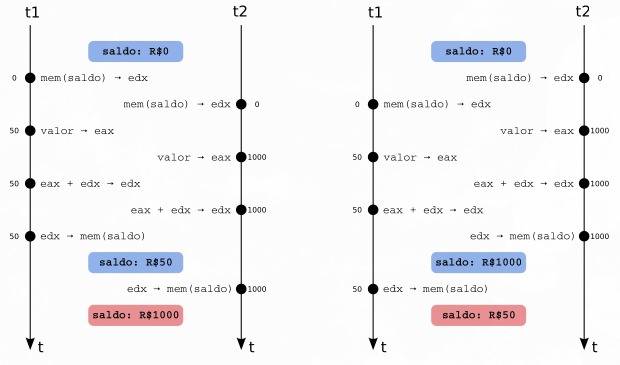<br>
*Fonte: MAZIERO, Carlos A. Sistemas Operacionais: Conceitos e Mecanismos, 1. ed., 2019, p. 110.*

Quando o resultado depende da ordem ou do momento das operações concorrentes, há uma **condição de corrida** (*race condition*). Ela também ocorre por intercalação em uma única CPU: basta interromper uma tarefa entre ler o saldo e gravar sua atualização.

> O conflito envolve pelo menos uma escrita; leituras de dados inalterados não causam esse problema. A proteção deve cobrir toda a atualização (ler, calcular e gravar).

## Requisitos para a Solução da Seção Crítica:

- **Exclusão mútua:** Somente uma tarefa por vez executa a seção crítica protegida pelo mesmo mecanismo. Seções que utilizam recursos independentes podem executar simultaneamente.
- **Progresso:** Se a seção está livre e há tarefas interessadas, a escolha da próxima não pode ser adiada indefinidamente nem depender de uma tarefa que não queira entrar.
- **Espera limitada:** Deve existir um limite para quantas vezes outras tarefas entram antes de uma tarefa que já solicitou acesso. Isso evita inanição, sem significar necessariamente um prazo fixo em segundos.
- **Independência de velocidades relativas:** A correção não pode depender de uma tarefa ser “rápida o suficiente” em relação à outra. As hipóteses necessárias de execução e acesso à memória devem ser conhecidas.

## Soluções Básicas:

Uma operação **atômica** é indivisível em relação aos acessos concorrentes. Testar uma variável e depois alterá-la são duas ações separadas, salvo quando um mecanismo garante a atomicidade do conjunto.

### Variável de Trava:

Uma variável como `busy` indica se a seção está ocupada. Como o teste e a atribuição são separados, duas tarefas podem observar a área livre antes que qualquer uma registre sua entrada, violando a exclusão mútua:

```c
int busy = 0;         // a seção está inicialmente livre

void enter() {
    while (busy) {}   // espera enquanto a seção estiver ocupada
    busy = 1;         // marca a seção como ocupada
}

void leave() {
    busy = 0;         // libera a seção
}
```

### Alternância de Uso:

Define uma ordem cíclica de entrada (tarefa 0, tarefa 1 etc.), mas prejudica o **progresso**: a tarefa pode esperar por outra que não pretende entrar, mesmo com a seção livre.

```c
int num_tasks = 2;
int turn = 0;                      // inicia pela tarefa 0

void enter(int task) {
    while (turn != task) {}        // espera seu turno
}

void leave(int task) {
    turn = (turn + 1) % num_tasks; // passa para a próxima tarefa
}
```

### Algoritmos de Dekker e Peterson:

São soluções lógicas que combinam a indicação de interesse com uma variável de turno para desempate. A seguir, está a versão de **Peterson para duas tarefas**:

```c
int turn = 0;
int wants[2] = {0, 0};

void enter(int task) {             // task pode valer 0 ou 1
    int other = 1 - task;
    wants[task] = 1;               // registra o interesse em entrar
    turn = other;                  // dá preferência à outra tarefa
    while (wants[other] && turn == other) {}
}

void leave(int task) {
    wants[task] = 0;               // deixa de disputar a seção
}
```

Se apenas uma tarefa quiser entrar, ela não fica esperando a vez da outra. Se ambas quiserem, o turno resolve a disputa. Sob as hipóteses do modelo clássico (leituras e escritas atômicas, respeitando a ordem considerada), o algoritmo garante exclusão mútua, progresso e espera limitada.

> Em programas reais, compiladores e processadores podem reorganizar acessos à memória. Variáveis comuns em C não fornecem as garantias necessárias; é preciso utilizar mecanismos adequados de sincronização. Acrescentar `volatile` não resolve essa necessidade.

### Espera Ocupada e Bloqueio:

A **espera ocupada** (*busy waiting*) verifica continuamente uma condição, consumindo CPU. Bloquear permite executar outra tarefa, mas bloquear e acordar também têm custo; por isso, esperas curtas podem justificar travas como *spinlocks*.

Operações atômicas de *hardware* ajudam a construir travas corretas, mas não eliminam, por si só, a espera ocupada nem garantem justiça.

## Mecanismos de Coordenação:

### *Mutex*:

É uma trava de exclusão mútua (*mutual exclusion*), como uma sala com uma única chave: quem a recebe entra e precisa devolvê-la ao sair. No exemplo bancário, deve proteger toda a sequência de leitura, cálculo e gravação do saldo:

- **Aquisição (`lock`):** Obtém a posse da trava; se ela estiver ocupada, a operação pode bloquear a tarefa.
- **Liberação (`unlock`):** Devolve a trava, permitindo que outra tarefa a adquira. Em regra, a liberação cabe à tarefa que possui o *mutex*.

### Semáforos:

Utilizam um **contador** para representar vagas ou eventos. O semáforo contador controla várias unidades; o binário representa uma unidade disponível e pode fornecer exclusão mútua. No modelo didático a seguir, o semáforo mantém também uma fila de espera e duas operações atômicas:

- ***Down* (Aquisição):** Decrementa o contador em 1. Se o resultado for `contador >= 0`, a tarefa obtém a permissão e continua; se for `contador < 0`, ela é bloqueada e inserida na fila.
- ***Up* (Liberação ou Sinalização):** Incrementa o contador em 1. Se o resultado for `contador <= 0`, uma tarefa da fila é desbloqueada, com a permissão já reservada. Se for `contador > 0`, a permissão fica disponível para uma aquisição futura.

> Nesse modelo, o módulo do contador negativo indica quantas tarefas esperam. Outras implementações mantêm o contador em zero e registram os bloqueados separadamente.

Um estacionamento com duas vagas inicia o contador em `2`. Duas aquisições o levam a `0`; a terceira, a `-1`, bloqueando a tarefa. Liberar uma vaga retorna o contador a `0` e reserva essa vaga para quem esperava.

> Desbloquear não significa executar imediatamente: a tarefa ainda depende do escalonador. A ordem de escolha da fila depende da implementação, não sendo necessariamente a ordem de chegada.

### Variáveis de Condição:

Organizam a espera por uma condição, como a chegada de um item. **A condição é representada pelos dados do programa**, protegidos por um *mutex*. A tarefa adquire a trava, verifica a condição e espera se ainda não puder continuar:

- **`wait` (Espera):** Libera o *mutex* e bloqueia a tarefa de forma atômica; antes de retornar, readquire a trava.
- **`signal` (Sinalização):** Desbloqueia ao menos uma tarefa em espera (POSIX), sem garantir qual será escolhida nem sua execução imediata.
- **`broadcast` (Sinalização a Todas):** Notifica todas as tarefas em espera; elas ainda precisam obter o *mutex* para prosseguir.

```text
lock(mutex)
while buffer_vazio:
    wait(condicao_itens, mutex)
retirar_item()
unlock(mutex)
```

O `while` reavalia a condição: outro consumidor pode retirar o item antes que a tarefa acordada obtenha o *mutex*. Interfaces como POSIX também permitem despertares sem notificação; **acordar não garante poder continuar**.

> A notificação não fica guardada para quem começar a esperar depois. O estado compartilhado, verificado sob o *mutex*, indica se ainda é necessário esperar.

### Monitores:

Reúnem dados e operações protegidas por **exclusão mútua**, podendo oferecer variáveis de condição. Em Java, métodos de instância `synchronized` utilizam o monitor do objeto: tarefas distintas não executam seus métodos sincronizados ao mesmo tempo, mesmo que sejam métodos diferentes.

A organização reduz o controle manual das travas, mas o programador ainda precisa definir o que proteger e como esperar; o monitor não elimina automaticamente corridas ou impasses em todo o programa.

## Casos Práticos de Implementação:

### Produtor/Consumidor (Gestão de *Buffer*):

Coordena tarefas que produzem e consomem dados em velocidades diferentes, utilizando uma área compartilhada de capacidade fixa (*buffer*).

- **Produtor:** Cria e insere itens no *buffer*. Se ele estiver cheio, o produtor precisa esperar que um espaço seja liberado.
- **Consumidor:** Retira e processa itens. Se o *buffer* estiver vazio, o consumidor precisa esperar que um novo item seja produzido.

> Esse modelo aparece em *pipes*, filas de impressão (os programas produzem documentos e a impressora os consome) e *streaming* de mídia (a rede enche o *buffer* e o aplicativo consome os dados para exibição).

### Jantar dos Selvagens (Produção em Lote):

Variação do modelo **produtor/consumidor** com produção em lote (*batch processing*). Um cozinheiro (produtor) abastece uma panela de capacidade fixa (*buffer*), da qual vários selvagens (consumidores) retiram porções.

- **Produtor (cozinheiro):** Prepara um lote até preencher a panela. Depois, espera até que seja necessário reabastecê-la.
- **Consumidores (selvagens):** Retiram porções enquanto houver disponibilidade. Ao encontrar a panela vazia, um consumidor solicita o reabastecimento e espera a chegada das novas porções.

O controle deve impedir retiradas conflitantes e solicitações duplicadas de reabastecimento. 

> Produzir em lote pode reduzir o custo por item, mas o ganho depende da implementação; um consumidor que encontra a panela vazia precisa aguardar o preparo do lote inteiro.

### Leitores/Escritores:

Situações em que uma estrutura de dados compartilhada recebe acessos tanto para consulta (leitura) quanto para modificação (escrita).

- **Leitores:** Apenas consultam a informação. Várias leituras podem ocorrer simultaneamente, desde que não haja uma escrita conflitante em andamento.
- **Escritores:** Modificam a informação. Neste modelo, a escrita exige exclusividade: nenhum outro leitor ou escritor acessa a estrutura enquanto ela estiver sendo alterada.

Favorecer continuamente leitores pode provocar **inanição** (*starvation*) dos escritores; favorecer escritores pode causar o inverso. A política precisa considerar também quem está esperando.

> Em uma implementação bancária baseada nesse modelo, vários terminais poderiam consultar um saldo ao mesmo tempo. Para atualizá-lo, a tarefa escritora precisaria de acesso exclusivo à estrutura protegida, impedindo consultas e alterações conflitantes até terminar.

## Impasses (*Deadlocks*):

Um impasse ocorre quando tarefas ficam presas em dependências: cada uma espera um recurso ou uma ação de outra também bloqueada. Pode envolver travas, dispositivos e comunicação, não apenas dados em memória.

### Jantar dos Filósofos:

Imagine cinco filósofos em uma mesa redonda, com um *hashi* entre cada par de pratos. Eles alternam entre **meditar** e **comer**, mas precisam dos dois *hashis* vizinhos para comer. Se todos pegarem o da direita (azul) antes que alguém consiga os dois:

1. Cada filósofo segura um *hashi* e tenta obter o da esquerda (vermelho).
2. O *hashi* desejado está com o vizinho, que também espera outro *hashi*.
3. Como ninguém devolve o que já possui antes de comer, o ciclo de espera permanece.

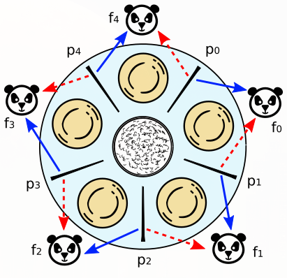<br>
*Fonte: MAZIERO, Carlos A. Sistemas Operacionais: Conceitos e Mecanismos, 1. ed., 2019, p. 144.*

Ninguém come ou devolve os *hashis*. Não é necessário sentir fome simultaneamente: basta que as aquisições levem a esse ciclo.

### Condições para Impasses:

No modelo de alocação de recursos, quatro condições precisam estar presentes para que um impasse ocorra:

- **Exclusão mútua:** Pelo menos um dos recursos envolvidos só pode ser utilizado por uma tarefa de cada vez.
- **Posse e espera:** Uma tarefa mantém recursos que já possui enquanto aguarda outros.
- **Não preempção:** Os recursos envolvidos não podem ser retirados à força; sua liberação depende de quem os possui.
- **Espera circular:** Existe um ciclo de dependências, como a tarefa 1 esperando um recurso da tarefa 2, que espera um recurso da tarefa 3, que espera um recurso da tarefa 1.

Em um grafo de alocação com **uma única instância de cada recurso**, um ciclo de espera caracteriza impasse. Com **múltiplas instâncias**, o ciclo não é suficiente para concluir isso: outras instâncias podem permitir que uma tarefa avance e libere recursos.

> A não preempção dos recursos não é a mesma coisa que a preempção da CPU. Retirar uma tarefa do processador não faz com que ela devolva automaticamente as travas que possui.

### Prevenção de Impasses:

Organiza o uso dos recursos para **eliminar pelo menos uma condição necessária**. Apenas dificultar sua ocorrência reduz o risco, mas não garante prevenção.

- **Exclusão mútua:** Substituir a posse exclusiva por compartilhamento ou atendimento centralizado, quando possível. Uma fila de impressão recebe documentos sem que as aplicações mantenham a impressora sob sua posse, embora ela continue fisicamente exclusiva e o serviço ainda precise evitar outros impasses.
- **Posse e espera:** Adquirir todos os recursos em conjunto ou esperar sem possuir nenhum, evitando retenção parcial. Isso pode reservar recursos ociosos. Dividir tarefas reduz a demanda simultânea, mas não elimina a condição por si só.
- **Não preempção:** Retirar ou exigir a liberação de recursos de quem não consegue continuar, permitindo nova tentativa depois. Só é aplicável quando a retirada preserva ou permite recuperar a consistência.
- **Espera circular:** Impor uma **ordem global de aquisição**. Para `R1 < R2 < R3 < R4`, quem possui `R2` pode solicitar `R3` ou `R4`, mas não `R1`. Como as dependências avançam na mesma direção, não formam ciclos.

> Um *timeout* exige tratar a desistência e liberar recursos quando apropriado. Repetir tentativas sem coordenação pode gerar *livelock*, com atividade contínua, mas sem progresso útil.

### Impedimento de Impasses:

Permite a existência das condições necessárias, mas controla a alocação para evitar estados inseguros. Pode ser visto como uma **máquina de estados**: cada estado representa a distribuição dos recursos, e as transições representam aquisições ou liberações.

- **Estado seguro:** Existe uma sequência em que todas as tarefas podem obter os recursos de que ainda poderão precisar, concluir e liberar suas alocações.
- **Estado inseguro:** Não há sequência de conclusão garantida para as demandas máximas consideradas. **Não significa impasse já ocorrido**, mas possibilidade de ele acontecer.

Antes de conceder, o sistema simula a alocação e verifica a segurança do novo estado. Se não houver sequência segura, adia a solicitação; outras requisições seguras podem continuar sendo atendidas.

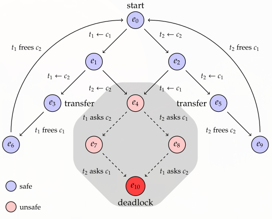<br>
*Fonte: MAZIERO, Carlos A. Sistemas Operacionais: Conceitos e Mecanismos, 1. ed., 2019, p. 156.*

O **Algoritmo do Banqueiro** só “empresta” recursos se puder garantir os compromissos assumidos. Conhecendo as disponibilidades, alocações e demandas máximas, procura uma tarefa cuja necessidade restante possa ser atendida e simula sua conclusão, liberando seus recursos. Repete até concluir todas ou não encontrar mais nenhuma que possa terminar.

Considere **3 unidades** de um recurso: A possui `1` e pode precisar de até `3`; B possui `1` e pode precisar de até `2`. Entregar a unidade livre a B permite que ela termine e libere `2`, com as quais A também termina. Entregá-la a A deixa ambas potencialmente precisando de mais `1`, sem nenhuma livre: o estado é inseguro, mesmo antes dessas solicitações.

> Sua principal limitação é precisar conhecer as demandas máximas antecipadamente, o que nem sempre é viável em sistemas reais.

### Detecção e Resolução de Impasses:

Permite que o impasse ocorra e age após identificá-lo. Analisa alocações e esperas, procurando ciclos ou verificando também as quantidades que permitem concluir tarefas, conforme o modelo. A recuperação pode utilizar:

- **Preempção de recursos:** Quando a natureza do recurso permitir, ele pode ser retirado ou liberado de uma das tarefas envolvidas para quebrar a dependência.
- ***Rollback*:** Retorna a tarefa a um estado anterior válido, liberando recursos adquiridos depois dele. Exige estados recuperáveis, como *checkpoints*.
- **Cancelamento de tarefas:** Encerra uma ou mais tarefas para quebrar o ciclo. Recursos e dados que não sejam recuperados automaticamente precisam de tratamento.

Recuperar pode exigir restaurar estados ou descartar trabalho, com custo elevado. A escolha depende dos recursos envolvidos e da possibilidade de reiniciar as tarefas com segurança.

> No **impasse**, as dependências impedem o progresso das tarefas envolvidas. Na **inanição**, uma tarefa é continuamente preterida enquanto outras avançam. No ***livelock***, as tarefas continuam ativas, mas suas tentativas de reação não produzem progresso útil.

---

# 4. Gestão de Memória

> Corrigido até aqui!
---

# Fontes

- MAZIERO, Carlos A. *Sistemas Operacionais: Conceitos e Mecanismos*. 1. ed. Curitiba: Editora UFPR, 2019.
- MACHADO, Francis Berenger; MAIA, Luiz Paulo. *Arquitetura de Sistemas Operacionais*. 5. ed. Rio de Janeiro: LTC, 2013.
- ANDRADE, Michelle Hanne Soares de. *Disciplina: Sistemas Operacionais*. Curso de graduação em Engenharia de Computação - Centro Federal de Educação Tecnológica de Minas Gerais (CEFET-MG), 2026.
- ARPACI-DUSSEAU, Remzi H.; ARPACI-DUSSEAU, Andrea C. *Operating Systems: Three Easy Pieces*. Versão 1.10. [S. l.]: Arpaci-Dusseau Books, 2023. Capítulos sobre escalonamento, *threads*, travas e problemas de concorrência. Disponível em: [https://pages.cs.wisc.edu/~remzi/OSTEP/](https://pages.cs.wisc.edu/~remzi/OSTEP/). Acesso em: 8 out. 2026.
- LINUX MAN-PAGES PROJECT. *Linux manual pages*. Versão 6.19. [S. l.]: Linux man-pages project, 2026. Páginas `pipe(7)`, `fifo(7)`, `mq_overview(7)`, `mq_getattr(3)`, `mq_send(3)`, `mq_unlink(3)` e `socket(7)`. Disponível em: [https://man7.org/linux/man-pages/](https://man7.org/linux/man-pages/). Acesso em: 8 out. 2026.
- THE OPEN GROUP; IEEE. *POSIX Programmer’s Manual*. [S. l.: s. n.], 2018. Páginas sobre espera e sinalização de variáveis de condição, reproduzidas no projeto Linux man-pages. Disponível em: [https://man7.org/linux/man-pages/man3/pthread_cond_wait.3p.html](https://man7.org/linux/man-pages/man3/pthread_cond_wait.3p.html). Acesso em: 8 out. 2026.
- DOCKER. *Resource constraints*. [S. l.]: Docker, [s. d.]. Disponível em: [https://docs.docker.com/engine/containers/resource_constraints/](https://docs.docker.com/engine/containers/resource_constraints/). Acesso em: 8 out. 2026.
- ORACLE. *Synchronized Methods*. In: *The Java Tutorials*. [S. l.]: Oracle, [s. d.]. Disponível em: [https://docs.oracle.com/javase/tutorial/essential/concurrency/syncmeth.html](https://docs.oracle.com/javase/tutorial/essential/concurrency/syncmeth.html). Acesso em: 8 out. 2026.
- MIRAGEOS. *MirageOS*. [S. l.: s. n.], [s. d.]. Disponível em: [https://mirage.io/](https://mirage.io/). Acesso em: 8 out. 2026.
