```
 _____  _       _                                 
/  ___|(_)     | |                                
\ `--.  _  ___ | |_   ___  _ __ ___    __ _  ___  
 `--. \| |/ __|| __| / _ \| '_ ` _ \  / _` |/ __| 
/\__/ /| |\__ \| |_ |  __/| | | | | || (_| |\__ \ 
\____/ |_||___/ \__| \___||_| |_| |_| \__,_||___/  
 _____                                  _                       _      
|  _  |                                (_)                     (_)
| | | | _ __    ___  _ __   __ _   ___  _   ___   _ __    __ _  _  ___ 
| | | || '_ \  / _ \| '__| / _` | / __|| | / _ \ | '_ \  / _` || |/ __|
\ \_/ /| |_) ||  __/| |   | (_| || (__ | || (_) || | | || (_| || |\__ \
 \___/ | .__/  \___||_|    \__,_| \___||_| \___/ |_| |_| \__,_||_||___/
       | |                                                             
       |_|                                                             
```

# 00. Conceitos Básicos

## O que é um Sistema Operacional:

Pode ser definido como uma camada de *software* que opera entre o *hardware* e os programas. Entre suas funções estão:

- **Abstração:** Simplifica funções complexas, provendo uma interface simples, homogênea e universal (aplicativos e dispositivos funcionam independentemente do *hardware* em quase todos os casos).
- **Gerência:** Gerencia o uso do processador pelos programas (tempo de uso e prioridade), a alocação de memória e a segurança das aplicações.

## Tipos de Sistemas Operacionais:

- ***Batch*:** Executa tarefas sequenciais (transações etc.).
- **De rede:** Acessa recursos em outros computadores.
- **Distribuído:** Acessa recursos de forma transparente.
- **Multiusuário:** Cada recurso tem um “dono” e regras de acesso.
- **Servidor:** Gerencia eficientemente grandes volumes de recursos.
- ***Desktop*:** Oferece interface gráfica e suporte à interatividade.
- **Móvel:** Gerencia energia, conectividade e sensores.
- **Embarcado:** Opera em *hardware* com poucos recursos e energia.
- **Tempo real:** Tem comportamento temporal previsível (pode ser *soft real-time* ou *hard real-time*).
> SOs modernos não se limitam apenas a uma dessas configurações, pois combinam várias delas.

## Estrutura de um Sistema Operacional:

O sistema operacional se encontra exatamente na interseção entre o *hardware* (componentes físicos) e o *software* (aplicativos). Os principais componentes de sua estrutura são:

- **Núcleo (*kernel*):** Responsável pela gerência de recursos do *hardware*, além de fornecer abstrações e ser utilizado ativamente pelas aplicações.
- **Inicialização (*boot*):** Reconhece os dispositivos instalados na máquina e é responsável por carregar o núcleo do sistema para a memória principal.
- ***Drivers*:** Módulos de código específicos utilizados para acessar, comunicar e controlar dispositivos físicos (*hardware*), como placas de vídeo, interfaces de rede, dispositivos USB e controladores de armazenamento.
- **Utilitários:** Funcionalidades e ferramentas complementares do sistema, englobando recursos como formatação de disco, *shell* (interpretador de comandos), interface com o usuário, entre outros.

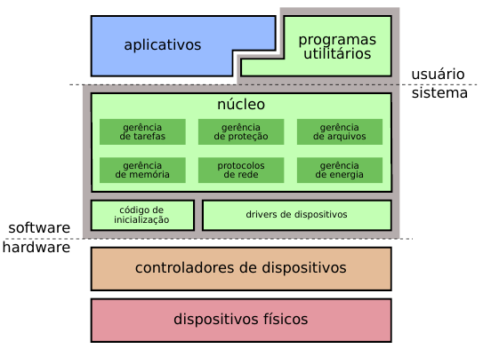<br>
*Fonte: MAZIERO, Carlos A. Sistemas Operacionais: Conceitos e Mecanismos, 1ª ed., 2019, p. 14.*

### Políticas e Mecanismos:

No desenvolvimento da estrutura do sistema operacional, é importante separar esses dois conceitos:

- **Política:** É um aspecto abstrato e de alto nível, responsável por tomar decisões (como definir a quantidade de memória alocada para as aplicações, o objetivo de um pacote, etc.). A política deve ser abstrata e totalmente independente dos mecanismos.

- **Mecanismos:** São os procedimentos de baixo nível que realmente realizam e executam as decisões tomadas pelas políticas. Os mecanismos devem ser genéricos para que possam ser reaproveitados e reutilizados pelo sistema.

### Endereço de Dispositivos:

Os dispositivos de *hardware* normalmente possuem registradores de controle e dados (utilizados pelo processador para consultar informações e enviar comandos) que podem ser associados a endereços específicos, permitindo que o sistema operacional se comunique com o dispositivo.

O *driver* conhece a organização e o funcionamento desses registradores e utiliza essa interface para controlar o *hardware*. Em algumas arquiteturas, esse acesso ocorre por meio de endereços da memória (E/S mapeada em memória ou MMIO); em outras, podem existir instruções e endereços específicos para operações de entrada e saída.

## Desvios:

O *hardware* pode desviar o fluxo de execução de um processo em um dos três eventos:

- **Interrupção:** Desvia a execução para um evento externo gerado por um periférico.
- **Exceção:** Desvia a execução devido a um evento interno ocorrido durante a execução de uma instrução, como divisão por zero, instrução inválida (*opcode* inexistente) ou tentativa de acessar uma página de memória ainda não disponível.
- ***Trap*:** Desvia a execução a pedido do *software*.

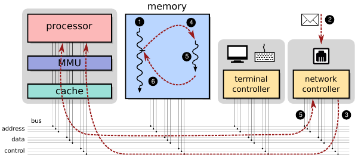<br>
*Fonte: MAZIERO, Carlos A. Sistemas Operacionais: Conceitos e Mecanismos, 1ª ed., 2019, p. 18.*

1. Execução de um processo.
2. Um pacote vindo da rede é recebido pela placa *Ethernet*.
3. O controlador *Ethernet* envia uma IRQ ao processador.
4. O processamento é desviado para a rotina de tratamento da interrupção.
5. A rotina de tratamento transfere os dados do pacote do controlador para a memória.
6. A rotina de tratamento finaliza e o processador retorna à execução do programa.

## Nível de privilégio:

Embora a quantidade e a organização dos níveis de privilégio dependam da arquitetura do processador, os sistemas operacionais modernos normalmente trabalham principalmente com dois níveis conceituais:

- **Nível mais baixo:** Reservado às aplicações (*user mode*).
- **Nível mais alto:** Reservado ao núcleo (*kernel mode*) do sistema operacional.

## Chamadas de sistema:

Os aplicativos conseguem utilizar os recursos do *hardware* por meio de **chamadas de sistema** (*syscalls*). A partir delas, eles conseguem executar operações restritas ao SO, como ler e fechar arquivos, enviar e receber dados pela rede, ler o teclado, escrever na tela etc.

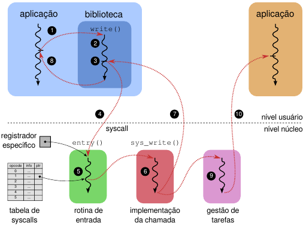<br>
*Fonte: MAZIERO, Carlos A. Sistemas Operacionais: Conceitos e Mecanismos, 1ª ed., 2019, p. 23.*

---

# 01. Arquitetura de Sistemas Operacionais

As arquiteturas são classificadas com base em sua estruturação interna, na divisão de tarefas, no nível de privilégio concedido às aplicações e na disposição dos seus componentes.

## Divisão do Núcleo:

- **Sistemas monolíticos:** Praticamente todo o núcleo roda em modo privilegiado sem restrições. Todas as funções que ficam por conta do sistema operacional estão embutidas dentro do núcleo do *software* (ex.: gerência de processos, alocador de memória, sistema de arquivos, sistema de rede, troca de contexto, *drivers* etc.). O sistema possui **alto desempenho**, apesar de ser extremamente **complexo** (por conta da interligação, mudanças encadeadas e dependências explícitas) e **frágil** (erros em componentes privilegiados podem comprometer todo o sistema).

- **Sistema micronúcleo:** O núcleo fica responsável somente pelas funções essenciais, enquanto **outras funções operam fora dele**. Dentro do núcleo ficam recursos como espaço de memória, tarefas e comunicação entre tarefas. Fora do núcleo ficam as políticas de escalonamento e memória, o sistema de arquivos e os protocolos de rede. Embora seja extremamente **estável** (fácil de manter devido à modularização), seu **desempenho é baixo** em relação aos demais modelos.

- **Sistema em camadas:** O núcleo é organizado em camadas de abstração que subdividem as responsabilidades de cada uma.

    1. **Camada inferior:** É a interface de mais baixo nível, que realiza a comunicação com o *hardware*.
    2. **Camadas intermediárias:** São focadas principalmente em abstração e gerência.
    3. **Camada superior:** Define as chamadas de sistema, que são a forma de alto nível de se comunicar com o *hardware*.

Apesar da sua organização, a **burocracia de comunicação** entre as camadas a torna ineficiente na prática.

- **Sistemas híbridos:** Misturam as características dos modelos anteriores, utilizando cada um onde é mais vantajoso. Agrupam, por exemplo, rotinas muito interligadas para preservar a eficiência, mas mantêm abstrações que organizam a comunicação entre *software* e *hardware*, além da modularidade que facilita a manutenção.

## Virtualização:

- **Máquinas Virtuais:** Consistem em uma camada de *software* ou *hardware* que constrói uma interface para que outro sistema consiga rodar por cima. Alguns desses componentes são:

    - **Sistema real (*host*):** Contém os recursos reais de *hardware* utilizados pelo sistema.
    - **Camada de virtualização (Hipervisor):** Constrói a máquina virtual a partir dos recursos do sistema *host*.

        - **Hipervisor de Aplicação:** Suporta apenas uma única aplicação de uma linguagem específica, abstraindo o sistema operacional base (**JVM** do Java, **CLR** do C#, etc.).
        - **Hipervisor de Sistemas:** Suporta a execução de um sistema operacional inteiro. Pode executar diretamente sobre o *hardware*, sem um sistema operacional intermediário (**Hipervisor Nativo**, como Xen e VMware ESXi), ou sobre um sistema operacional hospedeiro (**Hipervisor Convidado**, como VirtualBox e VMware Workstation).

    - **Sistema virtual (*guest*):** O sistema simulado em si.

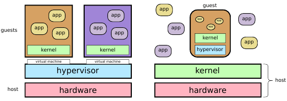<br>
*Fonte: MAZIERO, Carlos A. Sistemas Operacionais: Conceitos e Mecanismos, 1ª ed., 2019, p. 33.*

- ***Containers*:** Consistem em uma forma de isolar as aplicações e os sistemas operacionais, virtualizando o espaço (em nível de sistema operacional). O sistema é dividido em áreas restritas, denominadas domínios (ou *containers*).

    - **Isolamento e Recursos:** Cada domínio é isolado do outro, não existindo, por padrão, comunicação interdomínios. O *hardware* é dividido e limitado para cada um (como quantidade de memória, tempo de processador e espaço em disco).
    - **Vantagem em relação às Máquinas Virtuais:** Não é necessário alocar e carregar um sistema operacional inteiro para cada instância. O *container* empacota apenas a aplicação e os recursos ou bibliotecas estritamente necessários ao seu funcionamento e compartilha o mesmo *kernel*. Assim, é muito mais leve e eficiente para esse propósito, pois não há cópia de um sistema operacional inteiro para rodar uma aplicação de poucos MB.

## Tipos avançados de Sistemas Operacionais:

- **Sistema Exonúcleo:** Criado para tornar a comunicação entre *software* e *hardware* mais eficiente e direta, diminuindo as camadas de abstração e favorecendo o desempenho.

    - **Gerência direta:** A comunicação e os recursos tendem a ser gerenciados diretamente pela aplicação, que fica responsável por fazer a utilização e paginação de memória, o controle dos blocos do disco, a interface com a rede, etc.
    - **Indicação de uso:** É o modelo utilizado por sistemas que exigem desempenho extremamente alto e adequação direta ao *hardware* e aos dispositivos (como servidores *web* de alto desempenho e compiladores).

- ***Unikernel*:** É um modelo focado em extrema eficiência e segurança, em que cada aplicação funciona como um sistema operacional próprio, com seus *drivers* e bibliotecas. É muito utilizado em computação em nuvem e microsserviços. Assemelha-se a um *container*, mas não possui um sistema operacional tradicional unificando tudo, aproximando-se de um sistema de programas embarcados autossuficientes.

    - **Características:** Possui apenas um espaço de endereçamento e roda estritamente um único processo.
    - **Vantagens:** Tempo de inicialização quase instantâneo, uso mínimo de memória e altíssima segurança (por não possuir um *shell*, utilitários ou processos secundários, a superfície de ataque para invasores é drasticamente reduzida).

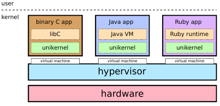<br>
*Fonte: MAZIERO, Carlos A. Sistemas Operacionais: Conceitos e Mecanismos, 1ª ed., 2019, p. 36.*

---

# 02. Tarefas

## Programa x Tarefa:

- **Programa:** Trata-se de um código, uma sequência de instruções estática e sem estado interno.
- **Tarefa:** É como o programa é executado realmente pelo sistema operacional. Pode ser escalonada pelo sistema operacional e possui um estado próprio, indicando onde sua execução parou e quais recursos são necessários para continuá-la.

## Número de Tarefas:

O sistema pode gerenciar essas tarefas de três maneiras principais:

### 1. Sistema Monotarefa:

É o sistema mais arcaico de gerenciamento de tarefas. Executa uma tarefa de cada vez, seguindo a ordem:

1. O programa é carregado para a memória.
2. Os dados do programa são carregados.
3. O programa executa até a sua conclusão.
4. Os resultados do programa são salvos.
5. O ciclo se repete indefinidamente até o fim da execução de todos os programas.

### 2. Sistema Multitarefa:

Em vez de esperar a execução de uma tarefa por vez, o tempo ocioso do processador (como a espera por um dado da memória ou uma entrada) é utilizado para intercalar várias aplicações.

- **Otimização:** Entre a execução de uma tarefa e o tempo em que outra está ociosa, o sistema fica sempre alternando as execuções, tentando utilizar o máximo de tempo possível da CPU.
- **Problema:** Pode exibir mau funcionamento por conta de aplicações bloqueadas (em um laço infinito, por exemplo) ou operações interativas não muito bem otimizadas para serem responsivas. Nesses casos, pode não ocorrer a troca de tarefa, pois, na teoria, a CPU está sempre ocupada executando a instrução problemática.

### 3. Sistema de Tempo Compartilhado (*Time Sharing* / Preempção por tempo):

Cada tarefa recebe uma **fatia de tempo máxima** para executar na CPU de cada vez (normalmente entre 10 milissegundos e 200 milissegundos).

- **Troca obrigatória:** Ao atingir esse limite de tempo, a tarefa sofre **preempção**, ou seja, é obrigada a parar sua execução e ceder o processador para outra.
- **Prioridade:** O escalonador pode utilizar prioridades para favorecer determinadas tarefas. Dependendo do algoritmo utilizado, isso pode alterar a frequência com que a tarefa recebe o processador, sua posição nas filas ou até mesmo o tamanho de sua fatia de tempo.

## Estados de uma tarefa:

Durante sua existência, uma tarefa pode passar por diferentes estados de execução. Os principais são:

- **Pronta:** Possui tudo o que precisa para executar e está apenas esperando receber tempo de processador.
- **Executando:** Está utilizando efetivamente o processador naquele momento.
- **Bloqueada:** Não pode continuar enquanto espera algum evento ou recurso, como a chegada de dados da rede, leitura do disco ou entrada do usuário.
- **Finalizada:** Terminou sua execução e não precisa mais utilizar o processador.

Uma tarefa pode, por exemplo, passar do estado de pronta para o de execução, ser bloqueada enquanto espera uma operação de entrada e saída e voltar ao estado de pronta quando essa operação for concluída.

## Gestão de tarefas:

Para gerenciar as tarefas e garantir que a troca não altere o funcionamento do programa nem corrompa seus dados, alguns elementos são importantes:

### Contexto de execução:

Trata-se do conjunto de informações necessárias para que o processador consiga interromper uma tarefa e posteriormente continuar sua execução exatamente do ponto onde parou.

Alguns desses elementos incluem:

- **Posição atual da execução:** Registradores como *Program Counter* (PC) e *Stack Pointer* (SP).
- **Registradores da CPU:** Valores temporários utilizados pela tarefa durante sua execução.
- **Informações de controle:** Estado atual da tarefa, prioridade e demais informações necessárias ao escalonamento.

As áreas de memória, arquivos abertos e conexões de rede também fazem parte do estado geral do processo, mas permanecem armazenados durante a troca de contexto e **não precisam ser copiados a cada alternância de tarefa**.

### TCB (*Task Control Block*):

É o bloco de controle (identificador) da tarefa, responsável por fazer o gerenciamento de todo o seu contexto.

- **Informações armazenadas:** Mantém o estado da tarefa, os registradores utilizados, os recursos alocados, etc.
- **Implementação:** Nos sistemas operacionais, é implementado normalmente como uma simples `struct` na linguagem C.

### Troca de contexto:

É a ação de trocar a execução de uma tarefa por outra, sendo o mecanismo básico utilizado nos sistemas multitarefa. O processo ocorre nas seguintes etapas:

1. Salva o contexto da tarefa atualmente em execução (no seu respectivo TCB).
2. Escolhe a próxima tarefa a ser executada.
3. Restaura o contexto da próxima tarefa quando ela assumir o processador.

Existem duas entidades principais envolvidas na troca de contexto:

- **Despachante (*Dispatcher*):** Realiza efetivamente a troca de contexto em baixo nível.
- **Escalonador (*Scheduler*):** Avalia as tarefas prontas e define a ordem de execução.

## Processos:

Um processo é um *container* de recursos utilizado para executar as tarefas.

- **Componentes:** Contém áreas de memória (código, dados, pilha etc.), descritores de recursos (arquivos, *sockets* etc.) e uma ou mais tarefas em execução.
- **Isolamento:** Os processos normalmente possuem **espaços de endereçamento separados**, impedindo que uma aplicação acesse diretamente a memória de outra. A MMU e os mecanismos de proteção do sistema operacional ajudam a implementar esse isolamento. Os níveis de privilégio, por sua vez, são utilizados principalmente para separar as aplicações comuns do núcleo do sistema.

A forma de criação de processos depende do sistema operacional. Em sistemas da família Unix, é comum que novos processos sejam criados a partir de processos já existentes, formando uma hierarquia em formato de árvore.

- **Duplicação (`fork()`):** Um processo solicita a criação de um novo processo semelhante a ele. O processo original é denominado Processo Pai (*Parent*) e o novo processo é denominado Processo Filho (*Child*). Após a criação, ambos possuem identificadores diferentes e passam a executar de forma independente.
- **Substituição da imagem (`exec()`):** Permite substituir o programa que está sendo executado dentro de um processo por outro. É comum que um processo criado com `fork()` utilize `exec()` em seguida para carregar o programa que realmente deverá executar.
- **Hierarquia:** Como processos podem criar outros processos, forma-se uma relação entre pais e filhos. O processo pai pode acompanhar eventos relacionados aos filhos, como sua finalização.

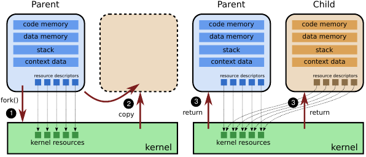<br>
*Fonte: MAZIERO, Carlos A. Sistemas Operacionais: Conceitos e Mecanismos, 1ª ed., 2019, p. 56.*

## *Threads*:

Trata-se do fluxo de execução dentro de um processo ou dentro do núcleo do sistema operacional.

- **Dentro do processo:** Cada subdivisão ou linha de execução dentro de um processo pode ser uma *thread*. Isso permite que um único processo realize múltiplas tarefas simultaneamente (compartilhando as mesmas áreas de memória e recursos do processo).
- **No Sistema Operacional:** Seguindo essa lógica, a execução real que o sistema operacional gerencia e envia para o processador é, na essência, uma *thread* (lembrando que todo processo possui, no mínimo, uma *thread* principal de execução).

### Modelos de implementação de *Threads*:

- **Modelo N:1:** Cada processo possui várias *threads* internas (nível de usuário), mas apenas uma é mapeada e executada de cada vez no *kernel*. Garante uma grande **escalabilidade** (a criação e a troca entre *threads* podem ser realizadas sem envolver diretamente o núcleo), permitindo que uma aplicação tenha milhares ou milhões de *threads* sem sobrecarregar o sistema. Todavia, é um modelo **frágil e pouco confiável**. Se uma *thread* realizar uma operação bloqueante (ou cair), ela bloqueia todas as outras *threads* do processo.

- **Modelo 1:1:** Cada *thread* do processo corresponde a uma *thread* direta no *kernel* (modelo mais usado nos sistemas operacionais contemporâneos). Possui um **tratamento mais robusto** e **escalonamento independente**. As *threads* conseguem utilizar vários processadores simultaneamente, permitindo que sejam realmente executadas em paralelo. É **pouco escalável**, tendo em vista que **exige muitos recursos do sistema e do *hardware*** para gerenciar e manter essa simultaneidade.

- **Modelo N:M:** Existe um sistema de gerenciamento para saber quais *threads* vão ocupar o *hardware* dinamicamente. Um processo com três *threads* pode utilizar só um núcleo, por exemplo, enquanto outro com três *threads* pode utilizar os três ao mesmo tempo. Possui **gerenciamento mais dinâmico e flexível** (meio-termo entre escalabilidade e paralelismo). Apesar disso, não é tão adotado por sua **maior complexidade de implementação** e por gerar maior **custo de gerência** no mapeamento das *threads* em relação aos núcleos.

## Escalonamento de tarefas:

Responsável por definir a ordem de execução das tarefas prontas.

### Critérios de escalonamento:

- **Tempo de vida (ou *Turnaround*):** Tempo entre a criação de uma tarefa e o seu encerramento.
- **Tempo de espera:** Tempo perdido pela tarefa na fila de tarefas prontas.
- **Tempo de resposta:** Tempo entre a chegada de um evento ao sistema e a resposta a ele.
- **Justiça:** Distribuição adequada do uso do processador entre as tarefas.

### Algoritmos de escalonamento:

Considere a seguinte tabela de tarefas para exemplificar o funcionamento dos algoritmos:

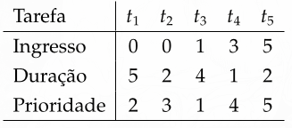<br>
*Fonte: MAZIERO, Carlos A. Sistemas Operacionais: Conceitos e Mecanismos, 1ª ed., 2019, p. 73.*

> O **critério de desempate** entre tarefas de mesma prioridade e com início no mesmo ciclo é o número da tarefa em ordem crescente.

- **FCFS (*First-Come, First-Served*):** Executa as tarefas estritamente à medida que elas chegam (ordem de chegada).

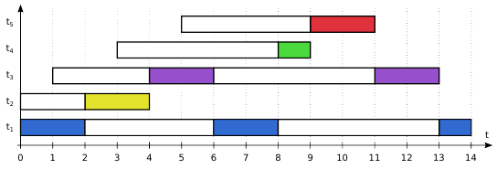<br>
*Fonte: MAZIERO, Carlos A. Sistemas Operacionais: Conceitos e Mecanismos, 1ª ed., 2019, p. 73.*

- ***Round Robin* (Revezamento):** Utiliza preempção de tempo. Faz a troca da execução das tarefas, intercalando-as e considerando a ordem em que foram colocadas na fila de prontas.

<br>
*Fonte: MAZIERO, Carlos A. Sistemas Operacionais: Conceitos e Mecanismos, 1ª ed., 2019, p. 74.*

- **SJF (*Shortest Job First*):** Prioriza sempre a tarefa que possui o menor trabalho (tempo total de execução) a ser feito.

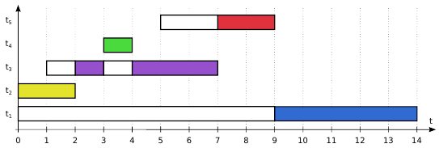<br>
*Fonte: MAZIERO, Carlos A. Sistemas Operacionais: Conceitos e Mecanismos, 1ª ed., 2019, p. 76.*

- **SRTF (*Shortest Remaining Time First*):** Executa a tarefa que possui o menor tempo restante para conclusão. Pode interromper a tarefa atual, que sofre preempção, caso chegue à fila uma nova tarefa com tempo restante ainda menor.

<br>
*Fonte: MAZIERO, Carlos A. Sistemas Operacionais: Conceitos e Mecanismos, 1ª ed., 2019, p. 77.*

> Na prática, esses dois últimos modelos são amplamente teóricos ou implementados por meio de **estimativas (heurísticas)**. Como não é possível saber com precisão absoluta quanto tempo uma tarefa demorará para ser concluída antes de ela terminar, o sistema estima esse tempo com base no histórico de execução.

- **PRIOc (Prioridade Cooperativa):** Utiliza um sistema de prioridade entre as tarefas, em que a ordem de execução é definida pela importância de cada uma. Por ser cooperativa, **a tarefa em execução não sofre interrupção**, seguindo até o fim ou até ser bloqueada.

<br>
*Fonte: MAZIERO, Carlos A. Sistemas Operacionais: Conceitos e Mecanismos, 1ª ed., 2019, p. 78.*

- **PRIOp (Prioridade Preemptiva):** É parecido com o modelo cooperativo, mas utiliza preempção. Se uma tarefa de maior prioridade entrar na fila de prontas, **a execução atual será pausada** para que a nova tarefa seja executada.

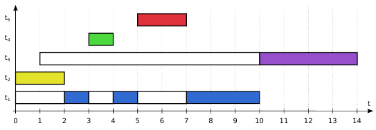<br>
*Fonte: MAZIERO, Carlos A. Sistemas Operacionais: Conceitos e Mecanismos, 1ª ed., 2019, p. 78.*

- **PRIOd (Prioridade Dinâmica):** Diferentemente dos outros métodos, que usam prioridade estática, este modelo emprega uma prioridade dinâmica que se ajusta ao longo do tempo.

    - **Problema evitado (*Starvation* / Inanição):** Impede que tarefas de menor prioridade fiquem indefinidamente sem tempo de CPU devido à chegada constante de tarefas de maior prioridade.
    - **Mecanismo (*Aging* / Envelhecimento):** A prioridade da tarefa vai aumentando gradativamente quando tarefas são adicionadas e/ou finalizadas, e ela não foi escolhida (aguardando na fila).
    - **Retorno ao padrão:** Quando a tarefa finalmente é executada, sua prioridade volta para o seu valor base original.

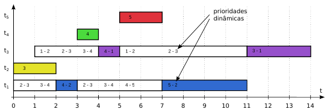<br>
*Fonte: MAZIERO, Carlos A. Sistemas Operacionais: Conceitos e Mecanismos, 1ª ed., 2019, p. 80.*

**Comparação entre os algoritmos:**

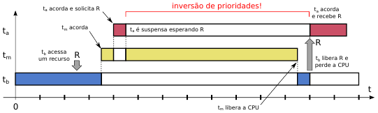<br>
*Fonte: MAZIERO, Carlos A. Sistemas Operacionais: Conceitos e Mecanismos, 1ª ed., 2019, p. 82.*

### Inversão de Prioridade:

Ocorre quando uma tarefa de alta prioridade precisa esperar por um recurso utilizado por uma tarefa de baixa prioridade. Se tarefas de prioridade intermediária atrasarem a tarefa de baixa prioridade, elas também atrasarão indiretamente a tarefa mais prioritária, mesmo sem compartilhar o recurso com ela.

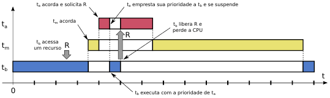<br>
*Fonte: MAZIERO, Carlos A. Sistemas Operacionais: Conceitos e Mecanismos, 1ª ed., 2019, p. 88.*

### Protocolo de Herança de Prioridade:

Para reduzir esse problema, quando uma tarefa de alta prioridade fica bloqueada esperando um recurso pertencente a uma tarefa de baixa prioridade, a tarefa que possui o recurso pode **herdar temporariamente a prioridade** da tarefa bloqueada. Assim, tarefas intermediárias deixam de interrompê-la, permitindo que ela termine rapidamente o uso do recurso. Após liberá-lo, sua prioridade retorna ao valor normal.

**Exemplo prático de herança de prioridade:**

<br>
*Fonte: MAZIERO, Carlos A. Sistemas Operacionais: Conceitos e Mecanismos, 1ª ed., 2019, p. 88.*

1. **Tarefa Baixa** inicia a execução e adquire o recurso exclusivo (R).
2. **Tarefa Alta** inicia, solicita (R) e é bloqueada.
3. **Mecanismo entra em ação:** A **Tarefa Baixa** herda temporariamente a prioridade da **Tarefa Alta**.
4. **Tarefa Média** não consegue interromper a **Tarefa Baixa** (pois esta agora está operando com prioridade "Alta").
5. **Tarefa Baixa** termina de usar (R), libera o recurso e sua prioridade volta a ser "Baixa".
6. **Tarefa Alta** imediatamente assume (R), executa até o fim e finaliza.
7. **Tarefa Média** executa e finaliza.
8. **Tarefa Baixa** retoma o controle da CPU para finalizar o restante do seu código.

---

# 03. Comunicação

A interação entre tarefas (comunicação) é uma característica essencial e extremamente benéfica quando se pensa no *design* de sistemas grandes e escaláveis, visto que permite:

- **Atendimento simultâneo:** Capacidade de atender a inúmeros usuários ao mesmo tempo.
- **Aceleração da execução:** Utilização eficiente de processadores *multicore* (com vários núcleos) para executar tarefas em paralelo.
- **Modularidade:** Permite dividir o sistema em módulos autônomos que cooperam e trabalham entre si.
- **Aplicações interativas:** Facilita a responsividade de programas complexos (como navegadores *web* e editores de texto) por meio da divisão do trabalho em várias *threads*.

A grande questão da comunicação e interação é fazer a gestão eficiente e segura das áreas compartilhadas, evitando que as tarefas interfiram negativamente umas nas outras. Os desafios envolvem gerenciar:

- **Área comum entre *threads*:** O controle do acesso simultâneo à mesma memória, já que *threads* do mesmo processo compartilham o mesmo espaço de endereçamento.
- **Área do núcleo (*kernel*):** A comunicação entre diferentes processos (que são naturalmente isolados) utilizando áreas compartilhadas geridas pelo próprio sistema operacional.
- **Comunicação de *hardware*:** A sincronização e troca de informações entre núcleos físicos de processamento diferentes.

## Tipos de comunicação:

A comunicação entre as tarefas pode ocorrer de duas maneiras principais:

- **Comunicação direta/indireta:** Na comunicação direta, o emissor (origem) envia os dados diretamente ao receptor (destino). Já na indireta, o emissor e o receptor se comunicam por meio de um canal. Os dados são enviados do emissor para o canal, e o receptor coleta (lê) as informações a partir desse canal. O canal de comunicação é categorizado quanto à capacidade de armazenar dados em trânsito, à confiabilidade e ao número de participantes:

    - **Capacidade:**

        - **Nula:** Não há armazenamento. A comunicação exige que emissor e receptor estejam prontos simultaneamente para uma transferência direta.
        - **Limitada:** O canal possui um *buffer* de tamanho finito, suportando uma quantidade limite de dados em trânsito.
        - **Ilimitada:** O *buffer* é potencialmente infinito, armazenando as mensagens continuamente enquanto o receptor não as consumir.

    - **Confiabilidade:**

        - **Confiável:** O canal consegue transportar todos os dados até o destino mantendo a sua integridade e a ordem original de envio.
        - **Não confiável:** O canal não garante a entrega perfeita; os dados podem não chegar, podem chegar alterados ou em uma ordem invertida daquela em que foram enviados.

    - **Número de Participantes:**

        - **1 para 1:** Um emissor e um receptor interagem diretamente por meio de um canal de comunicação.
        - **M para N:** Um ou mais emissores enviam mensagens para um ou mais receptores. Cada mensagem depositada no canal pode ser recebida/consumida por apenas um dos receptores (**modelo *mailbox***), ou cada mensagem enviada é recebida por todos os receptores conectados ao canal e filtrada (**canal de eventos**).

- **Comunicação síncrona/assíncrona:** Na operação síncrona, **as operações bloqueiam as tarefas envolvidas**. Existe uma necessidade de sincronização (espera) entre as partes: o receptor precisa esperar até os dados ficarem prontos e chegarem, e o emissor precisa esperar que o receptor esteja pronto para concluir o envio. Já na comunicação assíncrona, **o emissor não é bloqueado**. A partir do momento em que envia os dados (geralmente depositados em um canal ou *buffer*), o emissor fica livre para continuar sua execução. O receptor coleta essas informações quando estiver pronto, concluindo a etapa de recepção.
- **Comunicação semi-síncrona:** As operações bloqueiam as tarefas apenas durante um prazo predefinido (*timeout*). Funciona como um meio-termo entre o envio indiscriminado contínuo (assíncrono) e a sincronização forçada indefinida (síncrona), criando uma "janela de comunicação" com tempo limite para que a troca de dados ocorra.

> REVISADO ATÉ AQUI!

# Fontes

- MAZIERO, Carlos A. Sistemas Operacionais: Conceitos e Mecanismos. 1. ed. Curitiba: Editora UFPR, 2019.
- MACHADO, Francis Berenger; MAIA, Luiz Paulo. Arquitetura de sistemas operacionais. 5. ed. Rio de Janeiro: LTC, 2013.
- ANDRADE, Michelle Hanne Soares de. Disciplina: Sistemas Operacionais. Curso de graduação em Engenharia de Computação – Centro Federal de Educação Tecnológica de Minas Gerais (CEFET-MG), 2026.
