```
 _____      _  _               _          _____ 
/  __ \    |/ | |             | |        |_   _|
| /  \/  __ _ | |  ___  _   _ | |  ___     | |  
| |     / _` || | / __|| | | || | / _ \    | |  
| \__/\| (_| || || (__ | |_| || || (_) |  _| |_ 
 \____/ \__,_||_| \___| \__,_||_| \___/  |_____| 
```

# 1. Limites e Continuidade

## Limite em um Ponto:

$\displaystyle f\left(a\right)$ indica o valor da função $\displaystyle f\left(x\right)$ quando $\displaystyle x = a$. Já $\displaystyle \lim_{x \to a} f\left(x\right)$ vê a tendência da função quando $\displaystyle x$ se aproxima de $\displaystyle a$.

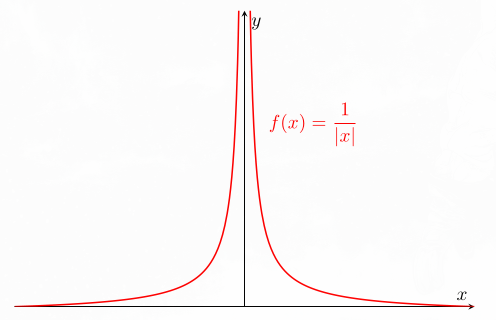<br>
*Fonte: Elaborado pelo autor (2025).*

Para $\displaystyle f\left(x\right)=\frac{1}{\left\lvert x\right\rvert}$: $\displaystyle f\left(0\right)$ não existe; $\displaystyle \lim_{x \to 0} f\left(x\right) = \infty$ (quando $\displaystyle x$ se aproxima de $\displaystyle 0$, $\displaystyle y$ tende ao infinito).

### Limites Laterais:

**Para um limite existir (bilateral), ao se aproximar de um ponto pelos dois lados, os limites laterais devem ser iguais** (o mesmo valor com a função se aproximando pela esquerda e direita).

$$
\displaystyle \lim_{x \to a^-} f\left(x\right) = \lim_{x \to a^+} f\left(x\right) = L \Rightarrow \lim_{x \to a} f\left(x\right) = L
$$

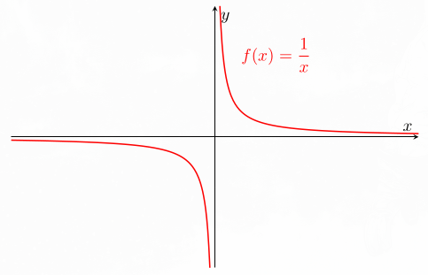<br>
*Fonte: Elaborado pelo autor (2025).*

$$
\displaystyle \lim_{x \to 0^-} \frac{1}{x} = -\infty \quad \text{e} \quad \lim_{x \to 0^+} \frac{1}{x} = \infty \quad \Rightarrow \quad \nexists\lim_{x \to 0} \frac{1}{x}
$$

## Propriedades dos Limites:

Para limites finitos, as operações abaixo podem ser realizadas separadamente, respeitando as condições indicadas:

| Propriedade | Relação | Exemplo |
|---|---|---|
| Constante | $\displaystyle \lim_{x\to a}c=c$ | $\displaystyle \lim_{x\to\infty}2=2$ |
| Identidade | $\displaystyle \lim_{x\to a}x=a$ | $\displaystyle \lim_{x\to7}x=7$ |
| Multiplicação por constante | $\displaystyle \lim_{x\to a}\left[\alpha f\left(x\right)\right]=\alpha\lim_{x\to a}f\left(x\right)$ | $\displaystyle \lim_{x\to7}4x=4\cdot7=28$ |
| Soma | $\displaystyle \lim_{x\to a}\left[f\left(x\right)+g\left(x\right)\right]=\lim_{x\to a}f\left(x\right)+\lim_{x\to a}g\left(x\right)$ | $\displaystyle \lim_{x\to7}\left(x+2\right)=7+2=9$ |
| Produto | $\displaystyle \lim_{x\to a}\left[f\left(x\right)g\left(x\right)\right]=\left(\lim_{x\to a}f\left(x\right)\right)\left(\lim_{x\to a}g\left(x\right)\right)$ | $\displaystyle \lim_{x\to2}\left[x^2\left(2x+1\right)\right]=4\cdot5=20$ |
| Quociente | $\displaystyle \lim_{x\to a}\frac{f\left(x\right)}{g\left(x\right)}=\frac{\lim_{x\to a}f\left(x\right)}{\lim_{x\to a}g\left(x\right)}$, se o limite do denominador não for zero. | $\displaystyle \lim_{x\to2}\frac{x^2}{2x+1}=\frac45$ |

Para uma composição, se $\displaystyle g\left(x\right)\to L$ e $\displaystyle f$ é contínua em $\displaystyle L$, podemos aplicar a função externa ao limite da interna:

$$
\displaystyle \lim_{x\to a}f\left(g\left(x\right)\right)=f\left(\lim_{x\to a}g\left(x\right)\right)
$$

Seja $\displaystyle f\left(x\right)=x^2$ e $\displaystyle g\left(x\right)=2x+1$. Então:

$$
\displaystyle \lim_{x\to2}\left(2x+1\right)^2=\left(\lim_{x\to2}\left(2x+1\right)\right)^2=5^2=25
$$

### Continuidade em um Ponto:

Se $\displaystyle f$ é contínua em $\displaystyle a$, o valor para o qual a função tende é o próprio valor da função no ponto. Isso permite calcular o limite por substituição direta:

$$
\displaystyle \lim_{x\to a}f\left(x\right)=f\left(a\right)
$$

Para essa igualdade fazer sentido, $\displaystyle f\left(a\right)$ precisa existir, assim como o limite. A existência do limite, sozinha, não exige que a função esteja definida no ponto.

## Limites no Infinito:

Quando aplicamos um limite no infinito, a função pode se aproximar de um número real, crescer ou decrescer sem limite, ou não se fixar em um único comportamento, como ocorre em uma oscilação:

| Comportamento | Exemplo |
|---|---|
| Convergência para um número real | $\displaystyle \lim_{x\to\infty}\left(1+\frac1x\right)=1+0=1$ |
| Tendência a $\displaystyle +\infty$ ou $\displaystyle -\infty$ | $\displaystyle \lim_{x\to\infty}x^3=+\infty$ |
| Oscilação sem limite | $\displaystyle \lim_{x\to\infty}\sin x$ não existe. |

> Escrever que um limite é infinito descreve um crescimento ou decrescimento sem limite; não significa que o infinito seja um número real atingido pela função.

## Limites Indeterminados:

Ao substituir os valores ou analisar separadamente as partes de uma expressão, podemos encontrar uma **forma indeterminada**: ela, sozinha, não permite concluir o valor do limite. Alguns casos são:

| Forma | Exemplo |
|---|---|
| $\displaystyle \frac{0}{0}$ | $\displaystyle \lim_{x\to1}\frac{x^2-1}{x-1}$ |
| $\displaystyle \frac{\infty}{\infty}$ | $\displaystyle \lim_{x\to\infty}\frac{3x^2-1}{x^2+4}$ |
| $\displaystyle \infty-\infty$ | $\displaystyle \lim_{x\to\infty}\left(x^2-x\right)$ |
| $\displaystyle 0\cdot\infty$ | $\displaystyle \lim_{x\to\infty}\left(\frac1x e^x\right)$ |
| $\displaystyle 1^\infty$ | $\displaystyle \lim_{x\to\infty}\left(1+\frac1x\right)^x$ |
| $\displaystyle \infty^0$ | $\displaystyle \lim_{x\to\infty}\left(1+x\right)^{\frac{1}{x}}$ |

Para resolver essas indeterminações existem algumas ferramentas, envolvendo tanto manipulação algébrica quanto análise das relações entre funções.

### Polinômios em Evidência:

Principalmente em polinômios tendendo ao infinito, o crescimento é mais acelerado nos polinômios de maior grau, sendo eles dominantes:

$$
\displaystyle
\lim_{x\to\infty}\frac{3x^2-1}{x^2+4}=\lim_{x\to\infty}\frac{x^2\left(3-\frac{1}{x^2}\right)}{x^2\left(1+\frac{4}{x^2}\right)}=\lim_{x\to\infty}\frac{3-\frac{1}{x^2}}{1+\frac{4}{x^2}}=\frac31=3
$$

### Fatoração:

Ação análoga ao método **polinômios em evidência**, mas não colocando apenas a variável em evidência (útil quando a fatoração de uma expressão for fácil): 

$$
\displaystyle \lim_{x \to 1} \frac{x^2 - 1}{x - 1} = \lim_{x \to 1} \frac{\left(x+1\right)\left(x-1\right)}{x - 1} = \lim_{x \to 1} \left[x + 1\right] = 2
$$

### Substituição de Variáveis:

Com $\displaystyle h=x-1$, temos $\displaystyle h\to0$ quando $\displaystyle x\to1$:

$$
\displaystyle \begin{aligned}
\lim_{x\to1}\frac{x^2-1}{x-1}=\lim_{h\to0}\frac{\left(h+1\right)^2-1}{h}=&\lim_{h\to0}\frac{h^2+2h}{h}\\=&\lim_{h\to0}\left(h+2\right)=2
\end{aligned}
$$

### Racionalização:

A ideia é multiplicar por uma expressão conveniente para formar um produto notável e simplificar a indeterminação. Essa manipulação não se limita a raízes quadradas.

$$
\displaystyle \begin{aligned}
\lim_{x\to0}\frac{\sqrt{x^2+9}-3}{x^2}
&=\lim_{x\to0}\frac{\left(\sqrt{x^2+9}-3\right)\left(\sqrt{x^2+9}+3\right)}{x^2\left(\sqrt{x^2+9}+3\right)}\\
&=\lim_{x\to0}\frac{x^2+9-9}{x^2\left(\sqrt{x^2+9}+3\right)}\\
&=\lim_{x\to0}\frac1{\sqrt{x^2+9}+3}\\
&=\frac1{\sqrt9+3}=\frac16
\end{aligned}
$$

### Teorema do Confronto (Sanduíche):

Mesmo que ainda não saibamos calcular o limite de $\displaystyle f\left(x\right)$, podemos compará-la com outras duas funções. Se $\displaystyle g\left(x\right)\le f\left(x\right)\le h\left(x\right)$ para os pontos suficientemente próximos de $\displaystyle a$, exceto possivelmente o próprio $\displaystyle a$, e **as duas funções externas tendem ao mesmo valor**, a função intermediária também tende a esse valor:

$$
\displaystyle \lim_{x\to a}g\left(x\right)=\lim_{x\to a}h\left(x\right)=L
\quad\Rightarrow\quad
\lim_{x\to a}f\left(x\right)=L
$$

Para calcular $\displaystyle \lim_{x\to0}x^2\sin\left(\frac{1}{x}\right)$, mesmo que $\displaystyle \lim_{x\to0}\sin\left(\frac{1}{x}\right)$ não exista, tem-se que:

$$
\displaystyle -1\le\sin\left(\frac1x\right)\le1
\quad\Rightarrow\quad
-x^2\le x^2\sin\left(\frac1x\right)\le x^2
$$

Como os limites de $\displaystyle -x^2$ e $\displaystyle x^2$ são zero, a função fica “espremida” entre valores que se aproximam de zero. Logo:

$$
\displaystyle \lim_{x\to0}x^2\sin\left(\frac1x\right)=0
$$

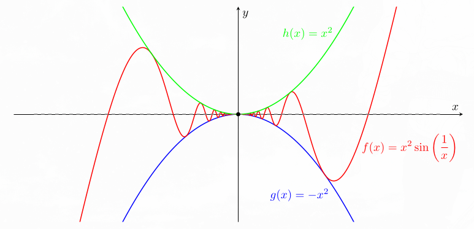<br>
*Fonte: Elaborado pelo autor (2025).*

## Teorema do Valor Intermediário (TVI):

Se $\displaystyle f$ for uma função contínua em um intervalo $\displaystyle \left[a, b\right]$, se $\displaystyle d$ está entre $\displaystyle f\left(a\right)$ e $\displaystyle f\left(b\right)$, então existe um valor $\displaystyle c$, tal que $\displaystyle f\left(c\right) = d$.

$$
\displaystyle \min\left\{f\left(a\right),f\left(b\right)\right\}\le d\le\max\left\{f\left(a\right),f\left(b\right)\right\}
\quad\Rightarrow\quad
\exists c\in\left[a,b\right]:\ f\left(c\right)=d
$$

## Formalizando o Conceito de Limite:

$$
\displaystyle \forall \varepsilon > 0\ \exists \delta > 0 \text{ tal que, }\forall x \in D_f \text{: }
0 < \left|x-a\right| < \delta \Rightarrow \left|f\left(x\right) - L\right| < \varepsilon
$$

**Pode-se tornar o valor de $\displaystyle f\left(x\right)$ arbitrariamente próximo de $\displaystyle L$ aproximando $\displaystyle x$ de $\displaystyle a$, sem exigir $\displaystyle x=a$.** Para cada margem de erro $\displaystyle \varepsilon>0$ escolhida em $\displaystyle y$, existe uma distância $\displaystyle \delta>0$ em $\displaystyle x$ que garante essa proximidade.

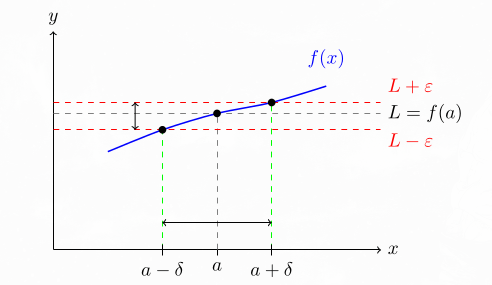<br>
*Fonte: Elaborado pelo autor (2025).*

> As distâncias $\displaystyle \delta$ não tem de ser necessariamente as mesmas na porção esquerda e direta em relação ao $\displaystyle a$ (normalmente nem serão).

---

# 2. Derivadas

## Derivada em um Ponto:

A taxa de crescimento de uma função qualquer em 2 pontos pode ser obtida por $\displaystyle \frac{\Delta y}{\Delta x} =  \frac{y_2 - y_1}{x_2 - x_1}$, sendo esse o coeficiente angular de uma reta secante ao gráfico de $\displaystyle f$ nos pontos $\displaystyle \left(x_1, f\left(x_1\right)\right)$, $\displaystyle \left(x_2, f\left(x_2\right)\right)$.

Mantendo um ponto fixo e aproximando o outro dele, quando a razão possui limite finito, encontra-se o coeficiente angular de uma reta tangente ao gráfico de $\displaystyle f$ no ponto $\displaystyle \left(a, f\left(a\right)\right)$, sendo essa a derivada (taxa de variação instantânea).

$$
\displaystyle \left.\frac{dy}{dx}\right|_{x=a}
=\left.\frac{d}{dx}f\left(x\right)\right|_{x=a}
=f'\left(a\right)
=\lim_{x\to a}\frac{f\left(x\right)-f\left(a\right)}{x-a}
$$

Se $\displaystyle h=x-a$, então $\displaystyle h\to0$ quando $\displaystyle x\to a$, e a mesma definição fica:

$$
\displaystyle f'\left(a\right)=\lim_{h\to0}\frac{f\left(a+h\right)-f\left(a\right)}h
$$

Para $\displaystyle f\left(x\right) = x^3$, a taxa de variação entre $\displaystyle x_1 = 1$, $\displaystyle x_2 = 3$, e a derivada em $\displaystyle x = 2$ são:

$$
\displaystyle \frac{\Delta y}{\Delta x} = \frac{27-1}{3-1}=\frac{26}{2}=13
$$

$$
\displaystyle \frac{dy}{dx}\Big|_{x = 2} = \lim_{x\to2}\frac{x^3-2^3}{x-2}=\lim_{x\to2}\frac{\left(x-2\right)\left(x^2+2x+4\right)}{x-2}=\lim_{x\to2}\left[x^2+2x+4\right]=12
$$

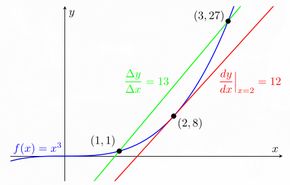<br>
*Fonte: Elaborado pelo autor (2025).*

### Diferenciabilidade:

Uma função $\displaystyle f$, diferenciável em um ponto interior $\displaystyle a$ do domínio, tem as seguintes características:

- **Valor no ponto:** $\displaystyle f\left(a\right)$ existe.
- **Continuidade no ponto:** $\displaystyle \lim_{x\to a}f\left(x\right)=f\left(a\right)$.
- **Derivadas laterais:** $\displaystyle f'_-\left(a\right)$ e $\displaystyle f'_+\left(a\right)$ existem, são finitas e iguais.

> A ideia de não ter uma “quina” ajuda a visualizar a terceira condição. Entretanto, continuidade e ausência de quina, sozinhas, não garantem uma derivada finita: uma tangente vertical também exige cuidado.

### Derivada Como uma Função:

Ao invés de considerar a derivada de uma função em um ponto específico é considerado um ponto qualquer.

Para $\displaystyle f\left(x\right)=x^2$:

$$
\displaystyle f'\left(a\right)=\lim_{x\to a}\frac{x^2-a^2}{x-a}=\lim_{x\to a}\frac{\left(x+a\right)\left(x-a\right)}{x-a}=\lim_{x\to a}\left(x+a\right)=2a
$$

Como $\displaystyle a$ é um ponto qualquer, escrevemos $\displaystyle f'\left(x\right)=2x$, para todo $\displaystyle x\in\mathbb R$.

## Aproximação Linear:

$$
\displaystyle f'\left(x\right)=\lim_{h\to0}\frac{f\left(x+h\right)-f\left(x\right)}h
$$

Para $\displaystyle h$ pequeno e diferente de zero:

$$
\displaystyle f'\left(x\right)\approx\frac{f\left(x+h\right)-f\left(x\right)}h
\quad\Rightarrow\quad
f\left(x+h\right)\approx f\left(x\right)+hf'\left(x\right)
$$

Para valores de $\displaystyle h$ pequenos, a variação da função é praticamente igual ao valor correspondente na reta tangente.

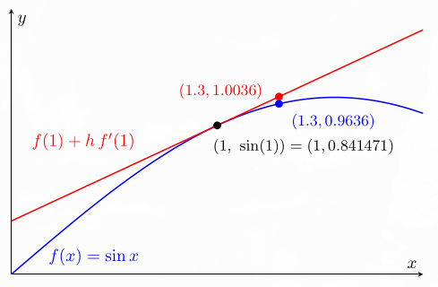<br>
*Fonte: Elaborado pelo autor (2025).*

A diferença dos valores é aproximadamente $\displaystyle 0{,}04$. Perto do ponto de tangência, a aproximação acompanha a função; neste exemplo, reduzir $\displaystyle h$ melhora a precisão.

## Propriedades das Derivadas:

Operações entre derivadas que podem ser generalizadas. As funções envolvidas devem ser diferenciáveis nos pontos considerados, e $\displaystyle \alpha$ é constante. **As deduções estão no apêndice**.

### Soma de Derivadas:
$$
\displaystyle \frac{d}{dx}\left[f\left(x\right)+g\left(x\right)\right]=f'\left(x\right)+g'\left(x\right)
$$

### Derivada de Produto por Escalar:

$$
\displaystyle \frac{d}{dx}\left[\alpha f\left(x\right)\right]=\alpha f'\left(x\right)
$$

### Regra do Produto:

$$
\displaystyle \frac{d}{dx}\left[f\left(x\right)g\left(x\right)\right]=f'\left(x\right)g\left(x\right)+f\left(x\right)g'\left(x\right)
$$

### Regra do Quociente:

Para $\displaystyle g\left(x\right)\ne0$:

$$
\displaystyle \frac{d}{dx}\left[\frac{f\left(x\right)}{g\left(x\right)}\right]=\frac{f'\left(x\right)g\left(x\right)-f\left(x\right)g'\left(x\right)}{g^2\left(x\right)}
$$

### Regra da Cadeia:

$$
\displaystyle \frac{d}{dx} \left[f\left(g\left(x\right)\right)\right]=f'\left(g\left(x\right)\right)g'\left(x\right)
$$

## Derivada de Funções Inversas:

Considerando funções inversas, nos respectivos domínios, com $\displaystyle f\left(g\left(x\right)\right) = g\left(f\left(x\right)\right) = x$, tais quais $\displaystyle x^3$ e $\displaystyle \sqrt[3]{x}$, $\displaystyle e^x$ e $\displaystyle \ln{x}$, $\displaystyle \sin x$ e $\displaystyle \arcsin x$ (restringindo o seno a $\displaystyle \left[-\frac{\pi}{2},\frac{\pi}{2}\right]$), etc. A fórmula abaixo vale nos pontos em que a função tem inversa diferenciável; em particular, exige $\displaystyle f'\left(f^{-1}\left(x\right)\right)\ne0$.

$$
\displaystyle f\left(f^{-1}\left(x\right)\right)=x
\quad\Rightarrow\quad
f'\left(f^{-1}\left(x\right)\right)\left(f^{-1}\right)'\left(x\right)=1
$$

Assim:

$$
\displaystyle \left(f^{-1}\right)'\left(x\right)=\frac1{f'\left(f^{-1}\left(x\right)\right)}
$$

Considerando $\displaystyle f^{-1}\left(x\right) = \ln x \Rightarrow f\left(x\right) = e^x$, sendo $\displaystyle f'\left(x\right) = e^x$: $\displaystyle \dfrac{d}{dx} \ln x = \dfrac{1}{e^{\ln{x}}} = \frac{1}{x}$.

## Derivadas Importantes:

Algumas das derivadas mais comuns e importantes, sendo base para o cálculo de funções mais complexas. **As deduções estão no apêndice**.

| Função | Derivada | Condições |
|---|---|---|
| $\displaystyle c$ | $\displaystyle 0$ | $\displaystyle c$ constante real. |
| $\displaystyle \sin x$ | $\displaystyle \cos x$ | Ângulo em radianos. |
| $\displaystyle \cos x$ | $\displaystyle -\sin x$ | Ângulo em radianos. |
| $\displaystyle a^x$ | $\displaystyle a^x\ln a$ | $\displaystyle a>0$. |
| $\displaystyle e^x$ | $\displaystyle e^x$ | $\displaystyle x\in\mathbb R$. |
| $\displaystyle \log_a x$ | $\displaystyle \frac{1}{x\ln a}$ | $\displaystyle x>0$, $\displaystyle a>0$ e $\displaystyle a\ne1$. |
| $\displaystyle \ln x$ | $\displaystyle \frac{1}{x}$ | $\displaystyle x>0$. |

### Regra do Tombo:

$$
\displaystyle \frac{d}{dx}x^n=nx^{n-1}
$$

O expoente “desce” multiplicando e diminui uma unidade. Para expoentes reais, a regra vale em $\displaystyle x>0$; em outros pontos, é preciso respeitar o domínio e a diferenciabilidade da potência. Para expoentes inteiros positivos, vale em toda a reta. 

> O caso constante $\displaystyle x^0=1$ tem derivada zero.

## Derivada de Ordem Superior:

Trata-se apenas do processo de realizar a derivada de uma função que já tinha sido derivada anteriormente.

$$
\displaystyle \frac{d}{dx} \left( \frac{d}{dx} f\left(x\right) \right) = \frac{d^2}{dx^2}f\left(x\right) = f''\left(x\right) \text{ ou } f^{\left(2\right)}\left(x\right)
$$

$$
\displaystyle \frac{d}{dx} \left( \frac{d}{dx} \left( \cdots \left( \frac{d}{dx} f\left(x\right) \right) \right) \right) = \frac{d^n }{dx^n}f\left(x\right) = f^{\left(n\right)}\left(x\right)
$$

$$
\displaystyle
\frac{d^3}{dx^3}\sin x=\frac{d}{dx}\left[\frac{d}{dx}\left(\frac{d}{dx}\sin x\right)\right]=\frac{d}{dx}\left(\frac{d}{dx}\cos x\right)=\frac{d}{dx}\left(-\sin x\right)=-\cos x
$$

## Derivada de uma Função Implícita:

Em uma função explícita, a variável dependente $\displaystyle y$ está expressa diretamente em termos da variável independente $\displaystyle x$, $\displaystyle y = f\left(x\right)$, enquanto em uma relação implícita não é necessário ou não é fácil isolar $\displaystyle y$ explicitamente como função de $\displaystyle x$, tendo-se a relação $\displaystyle F\left(x,y\right) = 0$.

O processo para achar a taxa de variação de uma variável em relação à outra é basicamente derivando tudo e manipulando algebricamente a parte referente à variável de interesse até achar o resultado.

Com $\displaystyle F\left(x,y\right) = x^2 + y^2 - 25 = 0$, para achar $\displaystyle \dfrac{dy}{dx}$:

$$
\displaystyle \frac{d}{dx}\left(x^2+y^2-25\right)=\frac{d}{dx}0
$$

$$
\displaystyle \frac{d}{dx}x^2+\frac{d}{dx}y^2-\frac{d}{dx}25=0
\quad\Rightarrow\quad
2x+\frac{d}{dx}y^2=0
$$

Como $\displaystyle y$ depende de $\displaystyle x$, aplicamos a regra da cadeia: $\displaystyle \frac{d}{dx}\left[y\left(x\right)^2\right]=2y\frac{dy}{dx}$. Assim:

$$
\displaystyle 2x + 2y \dfrac{dy}{dx} = 0 \Rightarrow 2y \dfrac{dy}{dx} = -2x \Rightarrow \dfrac{dy}{dx} = -\dfrac{2x}{2y} = -\dfrac{x}{y},\quad y\ne0
$$

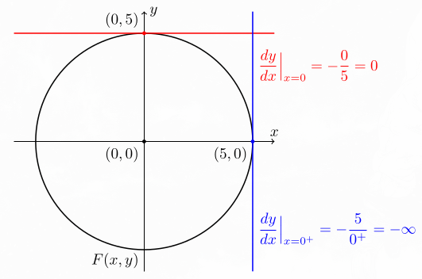<br>
*Fonte: Elaborado pelo autor (2025).*

Em $\displaystyle \left(0,5\right)$, a inclinação é zero. Em $\displaystyle \left(5,0\right)$, a tangente é vertical e $\displaystyle \frac{dy}{dx}$ não existe como número real finito.

 > Lembrando que $\displaystyle \frac{dy}{dx}$ não existe como número real finito no ponto $\displaystyle \left(5,0\right)$ (a derivada em $x = 0^{+}$ é uma simplificação visual.
 
## Derivação Logarítmica:

Dada uma função muito complexa, tal qual $\displaystyle f\left(x\right) = y = \frac{x^3 \sqrt{x^2 + 1}}{\left(3x + 2\right)^5}$, para encontrar $\displaystyle f'\left(x\right)$ teriam de ser usadas a regra do produto, a regra do quociente e a regra da cadeia, tornando-se um processo extremamente longo.

Uma abordagem interessante pode ser trabalhar com logaritmos. Neste desenvolvimento, consideramos $\displaystyle x>0$, de modo que todos os logaritmos escritos estejam definidos. Pela regra da cadeia:

$$
\displaystyle \dfrac{d}{dx} \ln y = \frac{dy}{dx} \dfrac{d}{dy} \ln y = \frac{dy}{dx} \dfrac{1}{y} \Rightarrow \frac{dy}{dx} = y\,\frac{d}{dx}\ln y
$$

$$
\displaystyle \begin{aligned}
\ln y =\ln\left(\frac{x^3\sqrt{x^2+1}}{\left(3x+2\right)^5}\right)
&=\ln\left(x^3\right)+\ln\sqrt{x^2+1}-\ln\left(\left(3x+2\right)^5\right)\\
&=3\ln x+\frac12\ln\left(x^2+1\right)-5\ln\left(3x+2\right)
\end{aligned}
$$

$$
\displaystyle \begin{aligned}
\frac{d}{dx} \ln y
&=\frac{d}{dx} \left[ 3\ln x + \frac{1}{2} \ln\left(x^2 + 1\right) - 5 \ln\left(3x + 2\right) \right]\\
&= \frac{3}{x} + \frac{x}{x^2 + 1} - \frac{15}{3x+2}
\end{aligned}
$$

Como $\displaystyle \dfrac{dy}{dx} = y \dfrac{d}{dx} \ln y$:

$$
\displaystyle \frac{d}{dx} \left[ \dfrac{x^3 \sqrt{x^2 + 1}}{\left(3x + 2\right)^5} \right] = \dfrac{x^3 \sqrt{x^2 + 1}}{\left(3x + 2\right)^5}\left( \frac{3}{x} + \frac{x}{x^2 + 1} - \frac{15}{3x+2}\right)
$$

## Diferenciais:

Relembrando a aproximação linear:

$$
\displaystyle f\left(x+h\right) - f\left(x\right) \approx h f'\left(x\right)
$$

$\displaystyle h$ pode ser substituído por $\displaystyle \Delta x$, ficando:

$$
\displaystyle \begin{aligned}f\left(x+\Delta x\right) - f\left(x\right) \approx \Delta x\,f'\left(x\right) \quad &\Rightarrow 
\quad \Delta y \approx \frac{dy}{dx} \, \Delta x \\
&\Rightarrow \quad \frac{\Delta y}{\Delta x} \approx \frac{dy}{dx}
\end{aligned}
$$

Escolhemos $\displaystyle dx=\Delta x$ e definimos $\displaystyle dy=f'\left(x\right)\,dx$. Assim, $\displaystyle dy$ é a variação na reta tangente, enquanto $\displaystyle \Delta y$ é a variação real da função. Para incrementos pequenos, $\displaystyle \Delta y\approx dy$.

Isso faz sentido, já que $\displaystyle \frac{\Delta y}{\Delta x} \approx \frac{dy}{dx}$ para $\displaystyle \Delta x$ próximo de 0.

Portanto, para encontrar um valor na função, ao invés de seguir o caminho por $\displaystyle f$, seguimos pela reta tangente a um ponto conhecido ($\displaystyle y + \Delta y \approx y + dy$).

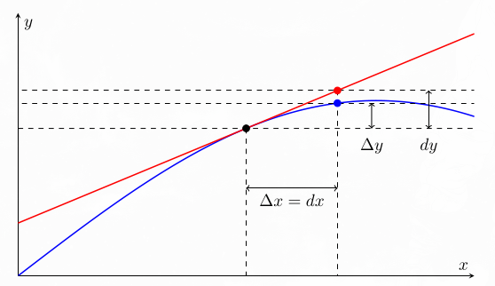<br>
*Fonte: Elaborado pelo autor (2025).*

Dessa maneira é possível aproximar funções que seriam complicadas de calcular.

Tendo $\displaystyle f\left(x\right) = \sqrt{x} \Rightarrow f'\left(x\right) = \dfrac{1}{2\sqrt{x}}$, tem-se, por exemplo, $\displaystyle f\left(4\right) = \sqrt{4} =2$. $\displaystyle f\left(4{,}02\right)=2{,}004993\dots$, sendo difícil de calcular manualmente, enquanto, por diferenciais, $\displaystyle f\left(4{,}02\right) \approx \sqrt{4} + \dfrac{0{,}02}{2\sqrt{4}} = 2 + \frac{0{,}02}{4} = 2+0{,}005 = 2{,}005$ (uma ótima aproximação, visto que o erro é menor que $\displaystyle 0{,}000006$).

## Regra de L’Hôpital:

É uma ferramenta que permite resolver limites indeterminados do tipo $\displaystyle \frac{0}{0}$ ou $\displaystyle \frac{\infty}{\infty}$ de maneira simples. Derivamos o numerador e o denominador separadamente:

$$
\displaystyle \lim_{x\to a}\frac{f\left(x\right)}{g\left(x\right)}=\lim_{x\to a}\frac{f'\left(x\right)}{g'\left(x\right)}
$$

Para aplicar a regra, $\displaystyle f$ e $\displaystyle g$ devem ser diferenciáveis perto do ponto considerado, exceto possivelmente no próprio ponto, com $\displaystyle g'\left(x\right)\ne0$ nessa região. É necessário que exista o limite da razão das derivadas, finito ou infinito. A regra também pode ser aplicada a limites laterais e no infinito, nas condições correspondentes.

### Caso de $\displaystyle 0/0$:
Pode-se utilizar a intuição dada pelos diferenciais: perto de um ponto em que as duas funções se anulam, suas variações são aproximadas pelas respectivas retas tangentes. Comparar essas variações sugere comparar as derivadas. Essa é uma motivação intuitiva; a validade da regra depende das condições acima.

$$
\displaystyle \lim_{x\to0}\frac{\sin x}{x}
=\lim_{x\to0}\frac{\cos x}{1}=1
$$

O exemplo parte da forma $\displaystyle \frac{0}{0}$. A dedução da derivada do seno, no apêndice, obtém esse limite por geometria, sem depender de L’Hôpital.

### Caso de $\displaystyle \infty/\infty$: 
É bastante intuitivo comparar o crescimento de duas funções. Quando uma se torna cada vez maior em proporção à outra, a razão pode tender ao infinito; a razão inversa, a zero.

Para $\displaystyle \lim_{x\to\infty}\frac{\ln\left(x\right)}{x}$, uma análise simples mostra:

$$
\displaystyle \frac{\ln10}{10}\approx0{,}230,\qquad
\frac{\ln100}{100}\approx0{,}046,
$$

$$
\displaystyle \frac{\ln1000}{1000}\approx0{,}007,\qquad
\frac{\ln1000000}{1000000}\approx1{,}38\cdot10^{-5}
$$

$\displaystyle x$ cresce muito mais rápido que $\displaystyle \ln x$ quando $\displaystyle x\to\infty$. Mesmo que ambas tendam ao infinito, a razão $\displaystyle \frac{\ln\left(x\right)}{x}$ tende a zero:

$$
\displaystyle \lim_{x\to\infty}\frac{\ln x}{x}
=\lim_{x\to\infty}\frac{\frac{1}{x}}{1}=0
$$

**Outras indeterminações.** Através de manipulação algébrica é possível transformar outras formas em um quociente adequado à regra. No exemplo abaixo, reunimos as frações e obtemos $\displaystyle \frac{0}{0}$:

$$
\displaystyle \lim_{x\to0}\left(\frac1x-\frac1{\sin x}\right)
=\lim_{x\to0}\frac{\sin x-x}{x\sin x}
$$

A primeira aplicação de L’Hôpital ainda produz $\displaystyle \frac{0}{0}$. Aplicando a regra novamente:

$$
\displaystyle \begin{aligned}
\lim_{x\to0}\frac{\sin x-x}{x\sin x}
&=\lim_{x\to0}\frac{\cos x-1}{\sin x+x\cos x}\\
&=\lim_{x\to0}\frac{-\sin x}{2\cos x-x\sin x}=0
\end{aligned}
$$

## Análise de Curvas:
### Crescimento e Decrescimento:

A primeira derivada indica a taxa de variação instantânea. Em um ponto $\displaystyle a$, se $\displaystyle f'\left(a\right)<0$, essa taxa é negativa; se $\displaystyle f'\left(a\right)=0$, ela é nula; e, se $\displaystyle f'\left(a\right)>0$, é positiva.

Para determinar o comportamento em um intervalo, analisamos o sinal da derivada nesse intervalo: $\displaystyle f'\left(x\right)>0$ indica que a função é **crescente**, enquanto $\displaystyle f'\left(x\right)<0$ indica que ela é **decrescente**. Ter derivada zero em um ponto não significa que a função seja constante ao redor dele.

### Concavidade e Inflexão:

A segunda derivada permite analisar a concavidade. Em um intervalo, se $\displaystyle f''\left(x\right)>0$, a função é **convexa**, com concavidade para cima; se $\displaystyle f''\left(x\right)<0$, a concavidade é para baixo.

Um **ponto de inflexão** é um ponto em que a concavidade muda. Encontrar $\displaystyle f''\left(a\right)=0$ não basta para concluir que há inflexão: em $\displaystyle f\left(x\right)=x^4$, temos $\displaystyle f''\left(0\right)=12\cdot0^2=0$, mas a concavidade continua para cima dos dois lados. Uma função afim também tem segunda derivada zero, sem mudança de concavidade.

### Máximos e Mínimos:

Um **máximo local** é um valor da função maior ou igual aos valores próximos; um **mínimo local** é menor ou igual aos valores próximos. Se o extremo ocorre em um ponto interior $\displaystyle a$ no qual a função é diferenciável, então $\displaystyle f'\left(a\right)=0$.

Quando $\displaystyle f'\left(a\right)=0$ e a função é duas vezes diferenciável perto de $\displaystyle a$, podemos usar o teste da segunda derivada:

| Resultado | Conclusão |
|---|---|
| $\displaystyle f''\left(a\right)<0$ | Máximo local. |
| $\displaystyle f''\left(a\right)>0$ | Mínimo local. |
| $\displaystyle f''\left(a\right)=0$ | Teste inconclusivo. |

O teste não é uma condição obrigatória para existir extremo. A função $\displaystyle x^4$, por exemplo, tem mínimo em zero, embora sua segunda derivada seja zero nesse ponto. Também podem existir extremos em pontos onde a derivada não existe.

Para ser um **máximo ou mínimo global**, o valor deve ser o maior ou o menor em todo o domínio considerado. Se a função é contínua em um intervalo fechado $\displaystyle \left[a,b\right]$, esses extremos existem. Para encontrá-los, comparamos os valores nos candidatos interiores - onde a derivada é zero ou não existe - e nas extremidades $\displaystyle f\left(a\right)$ e $\displaystyle f\left(b\right)$.

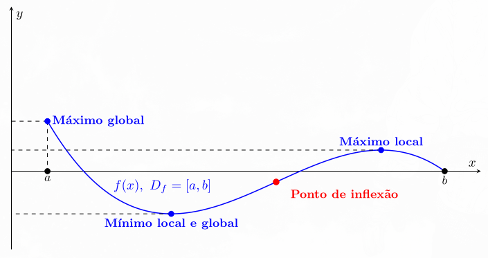<br>
*Fonte: Elaborado pelo autor (2025).*

## Assíntotas:

Trata-se do comportamento que algumas funções têm de se aproximarem de uma reta para certos valores.

### Horizontais:

A reta $\displaystyle y=c$ é uma assíntota horizontal quando $\displaystyle \lim_{x\to+\infty}f\left(x\right)=c$ ou $\displaystyle \lim_{x\to-\infty}f\left(x\right)=c$, com $\displaystyle c\in\mathbb R$. Cada direção é analisada separadamente.

$\displaystyle \lim_{x \to -\infty} 2+\frac{1}{x} = \lim_{x \to \infty} 2+\frac{1}{x} = 2$, logo, $\displaystyle f$ tem uma assíntota horizontal em $\displaystyle y=2$.

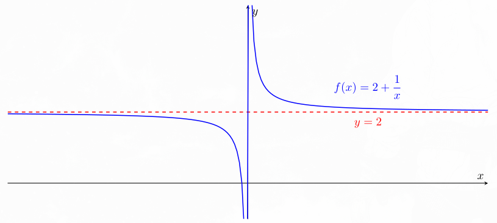<br>
*Fonte: Elaborado pelo autor (2025).*

### Verticais:

A reta $\displaystyle x=c$ é uma assíntota vertical quando pelo menos um dos limites laterais de $\displaystyle f\left(x\right)$ em $\displaystyle c$ é $\displaystyle +\infty$ ou $\displaystyle -\infty$.

$\displaystyle \lim_{x \to \left(\frac{\pi}{2}\right)^-} \tan x = \infty$ e $\displaystyle \lim_{x \to \left(\frac{\pi}{2}\right)^+} \tan x = -\infty$, logo, $\displaystyle f$ tem uma assíntota vertical em $\displaystyle x = \frac{\pi}{2}$.

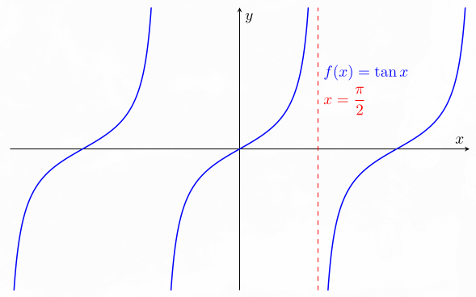<br>
*Fonte: Elaborado pelo autor (2025).*

### Oblíquas:

Quando uma função $\displaystyle f$ se aproxima de uma reta $\displaystyle g\left(x\right)=ax+b$, com $\displaystyle a\ne0$, de modo que $\displaystyle \lim_{x\to\infty}\left[f\left(x\right)-g\left(x\right)\right]=0$, essa reta é uma assíntota oblíqua. A mesma análise pode ser feita em $\displaystyle x\to-\infty$.

Para encontrá-la, podemos escrever $\displaystyle f\left(x\right)=m\left(x\right)+h\left(x\right)$, com $\displaystyle m\left(x\right)$ afim, e verificar se o restante $\displaystyle h\left(x\right)$ tende a zero. Assim, $\displaystyle f\left(x\right)\approx m\left(x\right)$ para valores suficientemente grandes de $\displaystyle x$.

Sendo $\displaystyle f\left(x\right) = \frac{2x^2-3x-\ln{x}}{x+1}$, para valores $\displaystyle x$ muito grandes:

$$
\displaystyle \frac{2x^2-3x-\ln{x}}{x+1} =
\frac{2x^2-3x}{x+1} - \frac{\ln{x}}{x+1} \approx \frac{2x^2-3x}{x+1}=2x-5+\frac{5}{x+1}\approx2x-5
$$

Como $\displaystyle \lim_{x\to \infty}\left[\frac{2x^2-3x-\ln{x}}{x+1}-\left(2x-5\right)\right] = 0$, então $\displaystyle 2x-5$ é uma assíntota oblíqua de $\displaystyle f$.

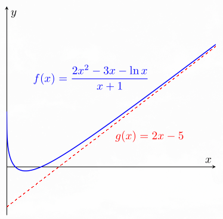<br>
*Fonte: Elaborado pelo autor (2025).*

---

# 3. Integrais

## Primitivas:

Encontrar primitivas é o processo inverso de derivar: $\displaystyle F$ é primitiva de $\displaystyle f$ em um intervalo se:

$$
\displaystyle F'\left(x\right)=f\left(x\right)\quad\Longleftrightarrow\quad\int f\left(x\right)\,dx=F\left(x\right)+c
$$

A constante $\displaystyle c$ representa o termo constante que é perdido na derivada.

$$
\displaystyle \frac{d}{dx}\left(2x+4\right)=2
\quad\Longleftrightarrow\quad
\int2\,dx=2x+c
$$

Para recuperar a mesma função, basta assumir $\displaystyle c=4$, obtendo $\displaystyle 2x+4$. Toda função contínua em um intervalo possui uma primitiva nesse espaço.

### Primitivas Comuns e Propriedades:

Realizando o processo inverso do cálculo da derivada:

| Integral | Primitiva | Condições |
|---|---|---|
| $\displaystyle \int a\,dx$ | $\displaystyle ax+c$ | $\displaystyle a$ constante. |
| $\displaystyle \int\sin x\,dx$ | $\displaystyle -\cos x+c$ | Ângulo em radianos. |
| $\displaystyle \int\cos x\,dx$ | $\displaystyle \sin x+c$ | Ângulo em radianos. |
| $\displaystyle \int a^x\,dx$ | $\displaystyle \frac{a^x}{\ln a}+c$ | $\displaystyle a>0$ e $\displaystyle a\ne1$. |
| $\displaystyle \int e^x\,dx$ | $\displaystyle e^x+c$ | $\displaystyle x\in\mathbb R$. |
| $\displaystyle \int\frac{dx}{x}$ | $\displaystyle \ln\left\lvert x\right\rvert+c$ | Em intervalos que não contenham zero. |
| $\displaystyle \int\frac{dx}{x\ln a}$ | $\displaystyle \frac{\ln\left\lvert x\right\rvert}{\ln a}+c=\log_a\left\lvert x\right\rvert+c$ | $\displaystyle x\ne0$, $\displaystyle a>0$ e $\displaystyle a\ne1$. |
| $\displaystyle \int x^n\,dx$ | $\displaystyle \frac{x^{n+1}}{n+1}+c$ | $\displaystyle n\ne-1$, em intervalos onde a potência e a fórmula estejam definidas. |

### Soma de Integrais: 

$$
\displaystyle \int\left[f\left(x\right)+g\left(x\right)\right]\,dx=\int f\left(x\right)\,dx+\int g\left(x\right)\,dx
$$

### Integral de Produto por Escalar:
$$
\displaystyle \int \alpha f\left(x\right)\,dx=\alpha\int f\left(x\right)\,dx
$$

As constantes das primitivas são reunidas em uma constante final $\displaystyle c$. No caso $\displaystyle \alpha=0$, a integral é diretamente $\displaystyle \int0\,dx=c$.

Não podemos integrar produtos, quocientes ou composições simplesmente integrando cada parte separadamente (**não existe uma regra do produto ou regra da cadeia universal para uma integral qualquer**). 

Para integrais de maior complexidade, são necessários métodos expecíficos e mais direcionados, que aproveitam as regras da cadeia e do produto da derivação.

## Integrais Definidas:

As integrais são ferramentas que permitem calcular a **área com sinal** entre o gráfico e o eixo $\displaystyle x$ no intervalo $\displaystyle a\le x\le b$: acima do eixo, as contribuições são positivas; abaixo, são negativas.

Essa lógica vem da aproximação através da soma de retângulos de largura $\displaystyle \Delta x=\frac{b-a}{n}$ e altura $\displaystyle f\left(x_i\right)$, em que $\displaystyle x_i$ é um ponto escolhido no respectivo subintervalo:

$$
\displaystyle A\approx\sum_{i=1}^n f\left(x_i\right)\Delta x
$$

Para uma função contínua, aumentando o número de retângulos, suas larguras diminuem e a soma se aproxima da integral:

$$
\displaystyle A=\lim_{n\to\infty}\sum_{i=1}^n f\left(x_i\right)\Delta x=\int_a^b f\left(x\right)\,dx
$$

> A área geométrica total não considera parcelas negativas. Por isso, quando o gráfico cruza o eixo, a integral pode ser diferente dessa área total.

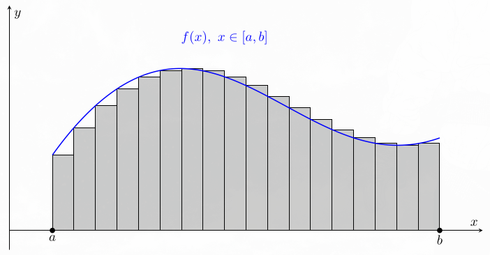<br>
*Fonte: Elaborado pelo autor (2025).*

### Teorema Fundamental do Cálculo:

Relaciona integrais definidas e primitivas. Se $\displaystyle f$ é contínua em $\displaystyle \left[a,b\right]$ e $\displaystyle F$ é uma primitiva de $\displaystyle f$, então:

$$
\displaystyle \int_a^b f\left(x\right)\,dx = F\left(b\right) - F\left(a\right)
$$

**A dedução está no apêndice**.

### Integrais Impróprias:

São integrais em que o intervalo é infinito ou a função se torna ilimitada perto de algum ponto do intervalo. Nesses casos, o cálculo é definido por limites.

**Intervalo infinito.** Se apenas uma extremidade é infinita:

$$
\displaystyle \int_a^{\infty}f\left(x\right)\,dx
=\lim_{b\to\infty}\int_a^b f\left(x\right)\,dx
=\lim_{b\to\infty}\left[F\left(b\right)-F\left(a\right)\right]
$$

$$
\displaystyle \int_{-\infty}^b f\left(x\right)\,dx
=\lim_{a\to-\infty}\int_a^b f\left(x\right)\,dx
=\lim_{a\to-\infty}\left[F\left(b\right)-F\left(a\right)\right]
$$

Para integrar de $\displaystyle -\infty$ a $\displaystyle +\infty$, escolhemos um ponto finito $\displaystyle c$ e separamos:

$$
\displaystyle \int_{-\infty}^{\infty}f\left(x\right)\,dx
=\int_{-\infty}^c f\left(x\right)\,dx+\int_c^{\infty}f\left(x\right)\,dx
$$

**As duas integrais precisam convergir separadamente para valores finitos.** Uma parte infinita não pode ser compensada pela outra.

**Função ilimitada.** Se o problema está em um ponto interior $\displaystyle c\in\left(a,b\right)$, separamos os dois lados:

$$
\displaystyle \int_a^b f\left(x\right)\,dx
=\lim_{u\to c^-}\int_a^u f\left(x\right)\,dx
+\lim_{v\to c^+}\int_v^b f\left(x\right)\,dx
$$

Cada limite deve existir e ser finito. Se o problema estiver apenas em uma extremidade, usamos somente o limite correspondente, aproximando-nos por dentro do intervalo.

> Nem toda descontinuidade torna uma integral imprópria. Um salto finito ou um ponto isolado sem valor definido não significa, por si só, que a função cresça sem limite.

## Métodos de Integração:

### Substituição de Variáveis:

A substituição utiliza a regra da cadeia no sentido inverso:

$$
\displaystyle \frac{d}{dx}f\left(g\left(x\right)\right)=f'\left(g\left(x\right)\right)g'\left(x\right)
\quad\Rightarrow\quad
\int f'\left(g\left(x\right)\right)g'\left(x\right)\,dx=f\left(g\left(x\right)\right)+c
$$

Para resolver $\displaystyle \int x\sqrt{x^2+1}\,dx$, fazemos $\displaystyle u=x^2+1$ e $\displaystyle du=2x\,dx$. Assim, $\displaystyle x\,dx=\frac{du}{2}$:

$$
\displaystyle \begin{aligned}
\int x\sqrt{x^2+1}\,dx=\frac12\int u^{\frac{1}{2}}\,du
&=\frac12\frac{u^{\frac{3}{2}}}{\frac{3}{2}}+c\\
&=\frac{\left(x^2+1\right)^{\frac{3}{2}}}3+c
\end{aligned}
$$

### Integral por Partes:

$$
\displaystyle \begin{aligned}
\frac{d}{dx} \left[f\left(x\right)\,g\left(x\right)\right] &= f'\left(x\right)\,g\left(x\right) + f\left(x\right)\,g'\left(x\right) \\
&\Rightarrow
\int\frac{d}{dx} \left[f\left(x\right)\,g\left(x\right)\right] \, dx= \int f'\left(x\right)\,g\left(x\right)\, dx + \int f\left(x\right)\,g'\left(x\right) \, dx\\
& \Rightarrow f\left(x\right)\,g\left(x\right) = \int f'\left(x\right)\,g\left(x\right)\, dx + \int f\left(x\right)\,g'\left(x\right) \, dx
\end{aligned}
$$

Assim:

$$
\displaystyle \int f\left(x\right)\,g'\left(x\right) \, dx=f\left(x\right)\,g\left(x\right) - \int f'\left(x\right)\,g\left(x\right)\, dx
$$

De maneira simplificada, considerando $\displaystyle f\left(x\right) = u$, $\displaystyle f'\left(x\right)\,dx = du$, $\displaystyle g\left(x\right) = v$ e $\displaystyle g'\left(x\right)\,dx = dv$:

$$
\displaystyle \int u\,dv =u\,v -\int v\,du
$$

Se $\displaystyle u=x^3$, $\displaystyle du=3x^2\,dx$, $\displaystyle dv=e^x\,dx$ e $\displaystyle v=e^x$:

$$
\displaystyle \int x^3e^x\,dx=x^3e^x-\int3x^2e^x\,dx
=x^3e^x-3\int x^2e^x\,dx
$$

Repetindo o processo com $\displaystyle u=x^2$, $\displaystyle du=2x\,dx$, $\displaystyle dv=e^x\,dx$ e $\displaystyle v=e^x$:

$$
\displaystyle \int x^3e^x\,dx
=x^3e^x-3\left(x^2e^x-2\int xe^x\,dx\right)
$$

Por fim, com $\displaystyle u=x$, $\displaystyle du=dx$, $\displaystyle dv=e^x\,dx$ e $\displaystyle v=e^x$:

$$
\displaystyle \begin{aligned}
\int x^3e^x\,dx
&=x^3e^x-3\left[x^2e^x-2\left(xe^x-\int e^x\,dx\right)\right]\\ 
&= x^3 e^x -3x^2 e^x + 6x\,e^x - 6 e^x + c \\
&= e^x \left(x^3 - 3x^2 + 6x - 6\right) + c
\end{aligned} 
$$

Um método eficiente de resolver integrais por partes repetidas é montar duas colunas: derivamos sucessivamente a expressão escolhida como $\displaystyle u$ e integramos sucessivamente a expressão que acompanha $\displaystyle dx$ em $\displaystyle dv$. Multiplicamos os termos pelas diagonais, alternando os sinais + e −. Quando a coluna das derivadas chega a zero, o processo termina, como no exemplo abaixo.

$$
\displaystyle \int x^3 e^x \, dx
$$

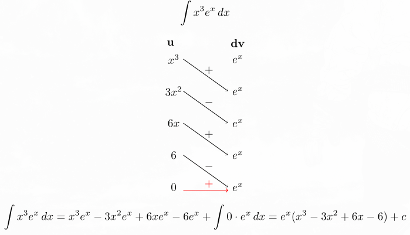<br>
*Fonte: Elaborado pelo autor (2025).*

$$
\displaystyle \begin{aligned}
\int x^3 e^x \, dx &= x^3e^x - 3x^2e^x + 6xe^x - 6e^x + \int 0\cdot e^x \,dx \\
&= e^x \left(x^3 - 3x^2 + 6x - 6\right) + c
\end{aligned}
$$

Nesse caso, a integração por partes chegava a uma integral conhecida. Em outros casos, a integral original reaparece. Quando obtemos esse termo repetido, podemos isolá-lo para resolver a equação.

$$
\displaystyle \int e^x \sin{x} \, dx
$$

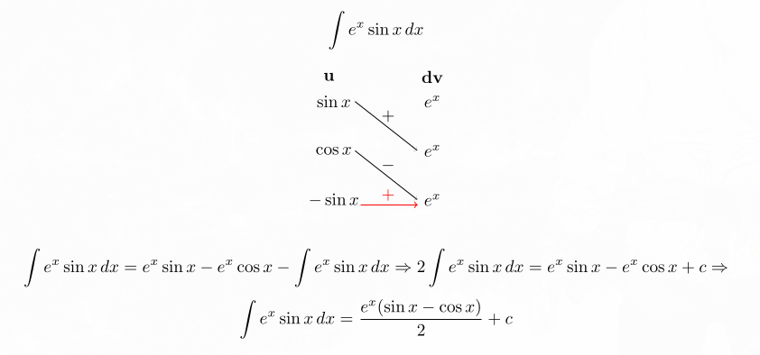<br>
*Fonte: Elaborado pelo autor (2025).*


$$
\displaystyle \begin{aligned}
\int e^x \sin{x} \, dx=e^x\sin{x}-e^x\cos{x}-\int e^x\sin{x} \,dx &\Rightarrow 2\int e^x \sin{x} \, dx=e^x\sin{x}-e^x\cos{x} + c\\
&\Rightarrow \int e^x \sin{x} \, dx=\frac{e^x\left(\sin{x}-\cos{x}\right)}{2} + c
\end{aligned}
$$

### Integrais Trigonométricas:

O método depende dos fatores e dos expoentes presentes. Nos casos de paridade abaixo, os expoentes são inteiros não negativos.

**Uma potência acompanhada da derivada da função.** Para as formas:

$$
\displaystyle \int\sin^m x\cos x\,dx
\qquad\text{ou}\qquad
\int\cos^m x\sin x\,dx,
$$

substituímos $\displaystyle u=\sin x$, com $\displaystyle du=\cos x\,dx$, ou $\displaystyle u=\cos x$, com $\displaystyle du=-\sin x\,dx$, respectivamente.

**Potências pares de seno ou cosseno.** Para $\displaystyle \int\sin^m x\,dx$ ou $\displaystyle \int\cos^m x\,dx$, com $\displaystyle m$ par, usamos:

$$
\displaystyle \sin^2 x=\frac{1-\cos\left(2x\right)}2,
\qquad
\cos^2 x=\frac{1+\cos\left(2x\right)}2
$$

**Potências ímpares de seno ou cosseno.** Se $\displaystyle m$ é ímpar, separamos um fator de seno ou cosseno e usamos $\displaystyle \sin^2 x+\cos^2 x=1$, transformando a integral no primeiro caso.

**Produto de potências.** Em $\displaystyle \int\sin^m x\cos^n x\,dx$, se algum expoente for ímpar, separamos um fator da função correspondente e usamos $\displaystyle \sin^2 x+\cos^2 x=1$. Se ambos forem pares, usamos as identidades de redução de potência acima.

**Produtos com argumentos diferentes.** Para $\displaystyle \sin\left(ax\right)\sin\left(bx\right)$, $\displaystyle \sin\left(ax\right)\cos\left(bx\right)$ ou $\displaystyle \cos\left(ax\right)\cos\left(bx\right)$, usamos as identidades de produto em soma:

$$
\displaystyle \sin A\sin B=\frac12\left[\cos\left(A-B\right)-\cos\left(A+B\right)\right]
$$

$$
\displaystyle \cos A\cos B=\frac12\left[\cos\left(A-B\right)+\cos\left(A+B\right)\right]
$$

$$
\displaystyle \sin A\cos B=\frac12\left[\sin\left(A+B\right)+\sin\left(A-B\right)\right].
$$

**Potências de tangente ou secante.** Para $\displaystyle \int\tan^m x\,dx$ ou $\displaystyle \int\sec^n x\,dx$, usamos $\displaystyle \tan^2 x+1=\sec^2 x$ e/ou integração por partes, a depender do caso.

### Substituição Trigonométrica:

Com as identidades $\displaystyle \sin^2\theta+\cos^2\theta=1$ e $\displaystyle \tan^2\theta+1=\sec^2\theta$, utilizamos um triângulo retângulo para relacionar a expressão da raiz a uma razão trigonométrica. No exemplo abaixo, o desenho representa $\displaystyle x>0$; a substituição algébrica também permite tratar os demais valores reais de $\displaystyle x$.

$$
\displaystyle \int \frac{dx}{\sqrt{4 + x^2}}
$$

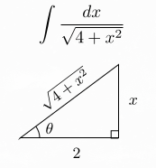<br>
*Fonte: Elaborado pelo autor (2025).*

Analisando o triângulo:

$$
\displaystyle \tan\theta=\frac x2
\quad\Rightarrow\quad
x=2\tan\theta,\qquad dx=2\sec^2\theta\,d\theta
$$

$$
\displaystyle \begin{aligned}
\int\frac{dx}{\sqrt{4+x^2}}
&=\int\frac{2\sec^2\theta}{\sqrt{4+4\tan^2\theta}}\,d\theta\\
&=\int\frac{2\sec^2\theta}{\sqrt{4\left(1+\tan^2\theta\right)}}\,d\theta
\end{aligned}
$$

$$
\displaystyle \int\frac{2\sec^2\theta}{\sqrt{4\sec^2\theta}}\,d\theta
=\int\frac{2\sec^2\theta}{2\left\lvert\sec\theta\right\rvert}\,d\theta
$$

Como $\displaystyle \theta=\arctan\left(\frac{x}{2}\right)$, temos $\displaystyle -\frac{\pi}{2}<\theta<\frac{\pi}{2}$. Como, nesse intervalo, para todo $\displaystyle \theta$, $\displaystyle \sec \theta > 0$, então $\displaystyle \left|\sec \theta\right| = \sec \theta$. Logo:

$$
\displaystyle \begin{aligned}
\int\frac{\sec^2\theta}{\left\lvert\sec\theta\right\rvert}\,d\theta
&=\int\frac{\sec^2\theta}{\sec\theta}\,d\theta\\
&=\int\sec\theta\,d\theta\\
&=\int\sec\theta\frac{\sec\theta+\tan\theta}{\sec\theta+\tan\theta}\,d\theta\\
&=\int\frac{\sec^2\theta+\sec\theta\tan\theta}{\sec\theta+\tan\theta}\,d\theta
\end{aligned}
$$

Se $\displaystyle u=\sec\theta+\tan\theta$, então:

$$
\displaystyle du=\left(\sec^2\theta+\sec\theta\tan\theta\right)\,d\theta
$$

$$
\displaystyle \begin{aligned}
\int\frac{\sec^2\theta+\sec\theta\tan\theta}{u}\,
\frac{du}{\sec^2\theta+\sec\theta\tan\theta}
&=\int\frac{du}{u}\\
&=\ln\left\lvert u\right\rvert+c
\end{aligned}
$$

Voltando às variáveis anteriores:

$$
\displaystyle \ln\left\lvert u\right\rvert+c
=\ln\left\lvert\sec\theta+\tan\theta\right\rvert+c
=\ln\left|\frac{\sqrt{4+x^2}}2+\frac x2\right|+c
$$

$$
\displaystyle \int \frac{dx}{\sqrt{4 + x^2}} = \ln \left|\frac{\sqrt{4 + x^2}}{2} + \frac{x}{2}\right| + c
$$

### Frações Parciais:

Trata-se de separar uma fração com denominador polinomial em uma soma de frações mais simples.

$$
\displaystyle \int\frac{5x - 3}{x^2 - 2x - 3}\,dx= \int \frac{5x - 3}{\left(x+1\right)\left(x-3\right)}\,dx = \int\left(\frac{A}{x+1} + \frac{B}{x-3}\right)\,dx
$$

$$
\displaystyle 5x - 3= A\left(x-3\right) + B\left(x+1\right) \Rightarrow \left(A + B - 5\right)x +\left(-3A + B +3\right) = 0
$$

$$
\displaystyle \begin{cases}
A+B=5\\
-3A+B=-3
\end{cases}
\quad\Rightarrow\quad A=2,\ B=3
$$

Portanto:

$$
\displaystyle \int\left(\frac2{x+1}+\frac3{x-3}\right)\,dx
=2\ln\left\lvert x+1\right\rvert+3\ln\left\lvert x-3\right\rvert+c
$$

Caso o polinômio do numerador $\displaystyle f\left(x\right)$ tenha grau maior ou igual ao do denominador $\displaystyle g\left(x\right)$, realizamos primeiro a divisão polinomial:

$$
\displaystyle \frac{f\left(x\right)}{g\left(x\right)} = m\left(x\right)+\frac{h\left(x\right)}{g\left(x\right)},\qquad \deg h<\deg g
$$

Caso exista um fator linear repetido no denominador, incluímos todas as potências até sua multiplicidade. Por exemplo:

$$
\displaystyle \frac{2x}{\left(x+1\right)^2}\text{, tem-se que: }\frac{2x}{\left(x+1\right)^2}=\frac{A}{x+1}+\frac{B}{\left(x+1\right)^2}
$$

Caso exista um fator quadrático irredutível nos reais, seu numerador é da forma $\displaystyle Bx+C$. Por exemplo:

$$
\displaystyle \frac{7x+2}{\left(x+2\right)\left(x^2+5\right)}\text{, tem-se que: } \frac{7x+2}{\left(x+2\right)\left(x^2+5\right)}= \frac{A}{x+2}+\frac{Bx+C}{x^2+5}
$$

---

# Apêndice A. Deduções Complementares

As deduções abaixo complementam as regras usadas na apostila. Podem ser consultadas separadamente, sem interromper a sequência dos capítulos.

## Propriedades das Derivadas:

### Soma de Derivadas:

Pela definição de derivada, separamos a variação de cada função:

$$
\displaystyle \begin{aligned}
\frac{d}{dx}\left[f\left(x\right)+g\left(x\right)\right]
&=\lim_{h\to0}\frac{\left[f\left(x+h\right)+g\left(x+h\right)\right]-\left[f\left(x\right)+g\left(x\right)\right]}{h}\\
&=\lim_{h\to0}\left[\frac{f\left(x+h\right)-f\left(x\right)}h+\frac{g\left(x+h\right)-g\left(x\right)}h\right]\\
&=f'\left(x\right)+g'\left(x\right)
\end{aligned}
$$

### Produto de Derivada por Escalar:

Como $\displaystyle \alpha$ é constante, podemos colocá-la em evidência:

$$
\displaystyle \begin{aligned}
\frac{d}{dx}\left[\alpha f\left(x\right)\right]
&=\lim_{h\to0}\frac{\alpha f\left(x+h\right)-\alpha f\left(x\right)}h\\
&=\alpha\lim_{h\to0}\frac{f\left(x+h\right)-f\left(x\right)}h\\
&=\alpha f'\left(x\right).
\end{aligned}
$$

### Regra do Produto:

A noção de aproximação linear, $\displaystyle f\left(x+h\right)\approx f\left(x\right)+hf'\left(x\right)$ para $\displaystyle h$ pequeno, ajuda a visualizar por que surgem duas parcelas. Para acompanhar a conta por igualdades, somamos e subtraímos o termo $\displaystyle f\left(x\right)g\left(x+h\right)$:

$$
\displaystyle \begin{aligned}
\frac{d}{dx}\left[f\left(x\right)g\left(x\right)\right]
&=\lim_{h\to0}\frac{f\left(x+h\right)g\left(x+h\right)-f\left(x\right)g\left(x\right)}h\\
&=\lim_{h\to0}\left[
\frac{f\left(x+h\right)-f\left(x\right)}h g\left(x+h\right)
+f\left(x\right)\frac{g\left(x+h\right)-g\left(x\right)}h
\right].
\end{aligned}
$$

Como $\displaystyle g$ é diferenciável, também é contínua: $\displaystyle g\left(x+h\right)\to g\left(x\right)$. Assim:

$$
\displaystyle \frac{d}{dx}\left[f\left(x\right)g\left(x\right)\right]=f'\left(x\right)g\left(x\right)+f\left(x\right)g'\left(x\right).
$$

### Regra do Quociente:

Com $\displaystyle g\left(x\right)\ne0$, reunimos as frações e reorganizamos o numerador:

$$
\displaystyle \begin{aligned}
\frac{d}{dx}\frac{f\left(x\right)}{g\left(x\right)}
&=\lim_{h\to0}\frac{\frac{f\left(x+h\right)}{g\left(x+h\right)}-\frac{f\left(x\right)}{g\left(x\right)}}h\\
&=\lim_{h\to0}\frac{f\left(x+h\right)g\left(x\right)-f\left(x\right)g\left(x+h\right)}{h\,g\left(x+h\right)g\left(x\right)}\\
&=\lim_{h\to0}
\frac{g\left(x\right)\frac{f\left(x+h\right)-f\left(x\right)}h-f\left(x\right)\frac{g\left(x+h\right)-g\left(x\right)}h}
{g\left(x+h\right)g\left(x\right)}\\
&=\frac{f'\left(x\right)g\left(x\right)-f\left(x\right)g'\left(x\right)}{g^2\left(x\right)}.
\end{aligned}
$$

### Regra da Cadeia:

Na composição $\displaystyle f\left(g\left(x\right)\right)$, uma pequena mudança em $\displaystyle x$ altera primeiro $\displaystyle g$ e, em seguida, $\displaystyle f$. Pela aproximação linear:

$$
\displaystyle \Delta g=g\left(x+h\right)-g\left(x\right)\approx g'\left(x\right)h,
$$

$$
\displaystyle f\left(g\left(x+h\right)\right)-f\left(g\left(x\right)\right)\approx f'\left(g\left(x\right)\right)\Delta g.
$$

Juntando as duas relações, a variação da composição é aproximada por $\displaystyle f'\left(g\left(x\right)\right)g'\left(x\right)h$. Dividindo por $\displaystyle h$, obtemos a intuição para a regra:

$$
\displaystyle \frac{d}{dx}f\left(g\left(x\right)\right)=f'\left(g\left(x\right)\right)g'\left(x\right).
$$

> Essa explicação usa aproximações para mostrar a ideia da regra. Quando $\displaystyle f$ e $\displaystyle g$ são diferenciáveis nos pontos envolvidos, os erros dessas aproximações, divididos por $\displaystyle h$, tendem a zero; por isso o limite fornece a igualdade indicada.

## Derivadas Importantes:

### Constante:

Para qualquer constante real $\displaystyle c$:

$$
\displaystyle \frac{d}{dx}c=\lim_{h\to0}\frac{c-c}h=\lim_{h\to0}\frac0h=0.
$$

### Seno:

Usando a fórmula do seno da soma:

$$
\displaystyle \begin{aligned}
\frac{d}{dx}\sin x
&=\lim_{h\to0}\frac{\sin\left(x+h\right)-\sin x}h\\
&=\lim_{h\to0}\frac{\sin x\cos h+\cos x\sin h-\sin x}h\\
&=\sin x\lim_{h\to0}\frac{\cos h-1}h
+\cos x\lim_{h\to0}\frac{\sin h}h.
\end{aligned}
$$

Para definir esses limites, podemos usar trigonometria. Consideramos um círculo de raio 1, com um ângulo $\displaystyle \theta$ em radianos, e comparamos as áreas de um setor circular e de dois triângulos:

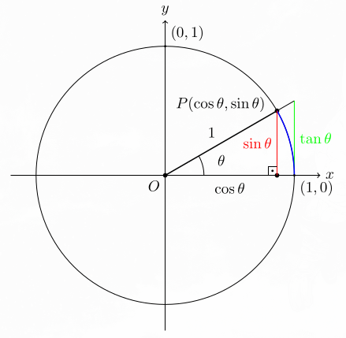<br>
*Fonte: Elaborado pelo autor (2025).*

Para $\displaystyle 0<\theta<\frac{\pi}{2}$, as áreas do triângulo menor, do setor circular e do triângulo maior são, respectivamente, $\displaystyle \frac12\cos\theta\sin\theta$, $\displaystyle \frac12\theta$ e $\displaystyle \frac12\tan\theta$. Assim:

$$
\displaystyle \frac12\cos\theta\sin\theta\le\frac12\theta\le\frac12\tan\theta.
$$

Dividindo e invertendo as razões positivas:

$$
\displaystyle \cos\theta\le\frac{\theta}{\sin\theta}\le\frac1{\cos\theta}
\quad\Rightarrow\quad
\cos\theta\le\frac{\sin\theta}{\theta}\le\frac1{\cos\theta}.
$$

As duas funções externas tendem a 1. Pelo teorema do confronto, o limite pela direita é 1; como $\displaystyle \frac{\sin\left(-\theta\right)}{-\theta}=\frac{\sin\theta}{\theta}$, o limite pela esquerda é o mesmo:

$$
\displaystyle \lim_{\theta\to0}\frac{\sin\theta}{\theta}=1.
$$

Para o outro limite, racionalizamos:

$$
\displaystyle \begin{aligned}
\frac{\cos\theta-1}{\theta}
&=\frac{\left(\cos\theta-1\right)\left(\cos\theta+1\right)}{\theta\left(\cos\theta+1\right)}\\
&=-\frac{\sin^2\theta}{\theta\left(\cos\theta+1\right)}\\
&=-\frac{\sin\theta}{\theta}\frac{\sin\theta}{\cos\theta+1}.
\end{aligned}
$$

Logo:

$$
\displaystyle \lim_{\theta\to0}\frac{\cos\theta-1}{\theta}
=-1\cdot\frac02=0.
$$

Voltando à derivada:

$$
\displaystyle \frac{d}{dx}\sin x=\sin x\cdot0+\cos x\cdot1=\cos x.
$$

### Cosseno:

Usando a fórmula do cosseno da soma e os limites anteriores:

$$
\displaystyle \begin{aligned}
\frac{d}{dx}\cos x
&=\lim_{h\to0}\frac{\cos\left(x+h\right)-\cos x}h\\
&=\lim_{h\to0}\frac{\cos x\cos h-\sin x\sin h-\cos x}h\\
&=\cos x\lim_{h\to0}\frac{\cos h-1}h
-\sin x\lim_{h\to0}\frac{\sin h}h\\
&=\cos x\cdot0-\sin x\cdot1=-\sin x.
\end{aligned}
$$

### Exponencial:

Para $\displaystyle a>0$, colocamos $\displaystyle a^x$ em evidência:

$$
\displaystyle \frac{d}{dx}a^x
=\lim_{h\to0}\frac{a^{x+h}-a^x}h
=a^x\lim_{h\to0}\frac{a^h-1}h.
$$

Usamos aqui o limite fundamental da exponencial $\displaystyle \lim_{u\to0}\frac{e^u-1}{u}=1$. Tomando esse limite como conhecido, escrevemos $\displaystyle a^h=e^{h\ln a}$. Para $\displaystyle a\ne1$, com $\displaystyle u=h\ln a$:

$$
\displaystyle \begin{aligned}
\lim_{h\to0}\frac{a^h-1}h
&=\lim_{h\to0}\frac{e^{h\ln a}-1}{h\ln a}\ln a\\
&=1\cdot\ln a=\ln a.
\end{aligned}
$$

Portanto:

$$
\displaystyle \frac{d}{dx}a^x=a^x\ln a.
$$

Se $\displaystyle a=1$, a função é constante e a fórmula também fornece zero.

**Muito usada:** $\displaystyle \frac{d}{dx}e^x=e^x\ln e=e^x$.

### Logaritmo:

O logaritmo $\displaystyle \log_a x$ é a função inversa de $\displaystyle f\left(x\right)=a^x$, com $\displaystyle a>0$, $\displaystyle a\ne1$ e $\displaystyle x>0$. Aplicando a derivada da inversa:

$$
\displaystyle \frac{d}{dx}\log_a x
=\frac1{f'\left(f^{-1}\left(x\right)\right)}
=\frac1{a^{\log_a x}\ln a}
=\frac1{x\ln a}.
$$

**Muito usada:** $\displaystyle \frac{d}{dx}\ln x=\frac{1}{x}$.

### Regra do Tombo:

A dedução pelo binômio de Newton abaixo considera $\displaystyle n$ inteiro positivo. Começamos com:

$$
\displaystyle \frac{d}{dx}x^n=\lim_{h\to0}\frac{\left(x+h\right)^n-x^n}h.
$$

O binômio de Newton permite expandir:

$$
\displaystyle \left(x+h\right)^n=\sum_{k=0}^{n}\binom nk x^{n-k}h^k,
\qquad
\binom nk=\frac{n!}{k!\left(n-k\right)!}.
$$

Os coeficientes são:

$$
\displaystyle \binom n0=\frac{n!}{0!n!}=1,
\qquad
\binom n1=\frac{n!}{1!\left(n-1\right)!}=n,
\binom n2=\frac{n\left(n-1\right)}2,
$$

$$
\qquad\cdots\qquad
$$

$$
\binom n{n-2}=\frac{n\left(n-1\right)}2, \qquad
\displaystyle \binom n{n-1}=n,
\qquad
\binom nn=1.
$$

Os termos com índice 2 pressupõem $\displaystyle n\ge2$. Aplicando a expansão à derivada:

$$
\displaystyle \begin{aligned}
\frac{d}{dx}x^n
&=\lim_{h\to0}
\frac{x^n+nx^{n-1}h+\binom n2x^{n-2}h^2+\cdots+h^n-x^n}h\\
&=\lim_{h\to0}
\left[nx^{n-1}+\binom n2x^{n-2}h+\cdots+h^{n-1}\right]\\
&=nx^{n-1}.
\end{aligned}
$$

Para $\displaystyle n=1$, a conta é diretamente $\displaystyle \lim_{h\to0}\frac{h}{h}=1$. Para expoentes reais em $\displaystyle x>0$, podemos usar $\displaystyle x^n=e^{n\ln x}$ e as regras já apresentadas:

$$
\displaystyle \frac{d}{dx}x^n=e^{n\ln x}\frac nx=nx^{n-1}.
$$

## Teorema Fundamental do Cálculo:

### Teorema do Valor Médio para Integrais:

Dada uma função $\displaystyle f$ contínua em $\displaystyle \left[a,b\right]$, com $\displaystyle a<b$, sua integral pode ser igualada à contribuição de um retângulo de base $\displaystyle b-a$ e altura $\displaystyle f\left(c\right)$, para algum $\displaystyle c\in\left[a,b\right]$:

$$
\displaystyle \int_a^b f\left(x\right)\,dx=f\left(c\right)\left(b-a\right).
$$

Essa comparação considera a área com sinal: uma altura negativa representa uma contribuição negativa.

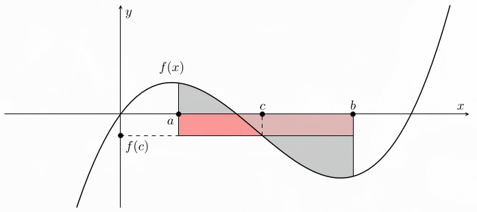<br>
*Fonte: Elaborado pelo autor (2025).*

### Relação Entre Integrais e Primitivas:

Definindo $\displaystyle G\left(x\right)=\int_a^x f\left(t\right)\,dt$, podemos entender $\displaystyle G\left(x\right)$ como a área com sinal acumulada a partir de $\displaystyle a$. Usamos $\displaystyle t$ dentro da integral para distingui-lo da extremidade variável $\displaystyle x$:

$$
\displaystyle 
G'\left(x\right)
=\lim_{h\to0}\frac{G\left(x+h\right)-G\left(x\right)}h=\lim_{h\to0}
\frac{\int_a^{x+h}f\left(t\right)\,dt-\int_a^x f\left(t\right)\,dt}{h}.
$$

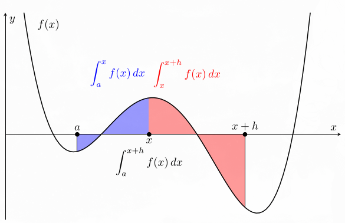<br>
*Fonte: Elaborado pelo autor (2025).*

Como visto pela imagem, a diferença corresponde ao trecho entre $\displaystyle x$ e $\displaystyle x+h$:

$$
\displaystyle \int_a^{x+h}f\left(t\right)\,dt-\int_a^x f\left(t\right)\,dt
=\int_x^{x+h}f\left(t\right)\,dt.
$$

De acordo com o teorema do valor médio para integrais, existe um ponto $\displaystyle c_h$ entre $\displaystyle x$ e $\displaystyle x+h$ tal que:

$$
\displaystyle \int_x^{x+h}f\left(t\right)\,dt=f\left(c_h\right)h.
$$

Assim:

$$
\displaystyle G'\left(x\right)=\lim_{h\to0}\frac{f\left(c_h\right)h}h=\lim_{h\to0}f\left(c_h\right).
$$

Quando $\displaystyle h\to0$, o intervalo em que $\displaystyle c_h$ está contido encolhe e $\displaystyle c_h\to x$, tanto para $\displaystyle h>0$ quanto para $\displaystyle h<0$. Pela continuidade de $\displaystyle f$, concluímos que $\displaystyle G'\left(x\right)=f\left(x\right)$.

Sendo $\displaystyle F$ uma primitiva de $\displaystyle f$, tem-se:

$$
\displaystyle \frac{d}{dx}\left[F\left(x\right)-G\left(x\right)\right]=f\left(x\right)-f\left(x\right)=0.
$$

Logo, $\displaystyle F\left(x\right)-G\left(x\right)$ é constante no intervalo. Chamando essa constante de $\displaystyle C$:

$$
\displaystyle F\left(x\right)-G\left(x\right)=C
\quad\Rightarrow\quad
G\left(x\right)=F\left(x\right)-C.
$$

Como $\displaystyle G\left(a\right)=\int_a^a f\left(t\right)\,dt=0$, temos $\displaystyle C=F\left(a\right)$. Portanto:

$$
\displaystyle G\left(x\right)=F\left(x\right)-F\left(a\right).
$$

Definindo uma extremidade $\displaystyle b\ge a$, obtemos:

$$
\displaystyle \int_a^b f\left(x\right)\,dx=F\left(b\right)-F\left(a\right).
$$

---

# Fontes:

- STEWART, James. *Cálculo: volume 1*. 7. ed. São Paulo: Cengage Learning, 2013.
- THOMAS, George B.; WEIR, Maurice D.; HASS, Joel. *Cálculo: volume 1*. 12. ed. São Paulo: Pearson, 2012.
- THOMAS, George B.; WEIR, Maurice D.; HASS, Joel. *Cálculo: volume 2*. 12. ed. São Paulo: Pearson, 2012.
- LIMA, Elon Lages. *Análise real: volume 1*. 8. ed. Rio de Janeiro: IMPA, 2006.
- TAKHE. *Cálculo 1: aulas e exercícios resolvidos*. [YouTube], 2023. Disponível em: [https://www.youtube.com/playlist?list=PLmAu9dltGZtp1apl5ib_uL7UkP4fDwy4m](https://www.youtube.com/playlist?list=PLmAu9dltGZtp1apl5ib_uL7UkP4fDwy4m). Acesso em: 10 set. 2025.
- BARROS, Tatiana Leal. *Disciplina: Cálculo com funções de uma variável real*. Curso de graduação em Engenharia de Computação - Centro Federal de Educação Tecnológica de Minas Gerais (CEFET-MG), 2024.
- CAMARGO JUNIOR, Fausto de. *Disciplina: Integração e séries*. Curso de graduação em Engenharia de Computação - CEFET-MG, 2024.
