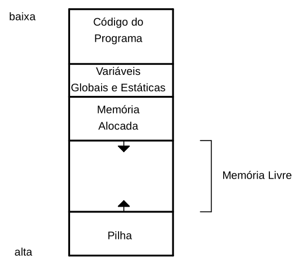
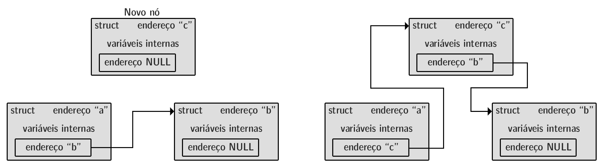
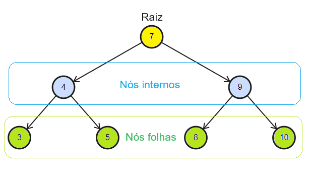

```
 .´‾‾‾‾‾‾‾`.
/     _____|
▏   /        
▏   ▏      
▏   \      
\     ‾‾‾‾‾|
 `.______.´
```

# 0. Basic Characteristics of the Language

> This handout uses **C17** as its reference.

C is a general-purpose language used in applications and in components close to the hardware. It combines functions and control structures with operations on memory addresses and binary representations.

## Paradigms:

C is **imperative**: statements modify the program's state, represented by the values held in memory.

```c
int saldo = 100;
saldo = saldo + 50;  // 150.
saldo = saldo - 30;  // 120.
```

It is also **procedural**: operations are grouped into reusable functions, such as an average calculation applied to different values. **Structured programming** organizes flow through sequence, selection, and repetition, as when checking a purchase or going through an inventory.

## Typing:

C has **static typing**: types are known during compilation and guide the interpretation of data and the checking of operations. The language allows automatic, **implicit** conversions (which is why it is often described as **weakly typed**), and **explicit** conversions specified in the code.

```c
int quantidade = 3;
double preco = 12.50;
double total = quantidade * preco;  // 37.50.
```

In the multiplication, the value of `quantidade` is converted to `double` (the variable remains an `int`). Conversions can lose information or produce unexpected results.

## Level of Abstraction:

Functions and variables allow programming without describing every CPU instruction. At the same time, C provides access to addresses, bits, and memory organization. A variable's name identifies a storage location; pointers also allow working with its address.

> Being close to the hardware does not mean unrestricted memory access: under operating systems, the program remains subject to its process's permissions and limits.

## Compilation and Execution:

In typical use, `.c` files are translated by the **compiler**, and the **linker** combines the parts needed for the executable. This advance translation must be repeated after source code changes for them to appear in the running program.

> **GCC** is one of the tools used. Preprocessing, compilation, and linking will be covered in more detail in the corresponding chapter.

### Performance:

Control over data and memory, combined with compiler optimizations, makes it possible to build efficient programs. Performance also depends on the algorithm, implementation, and hardware (the language alone does not guarantee speed).

### Portability:

Standard-compliant code can be recompiled for different platforms, but the executable usually depends on the target architecture and system. Type sizes, representations, and system-specific features also limit portability.

## Memory Management:

C combines **automatic** management, as with ordinary local variables, and **manual** management for dynamic allocations. These can outlive the function that requested them, requiring control over their use and release.

> C has no automatic garbage collector built into the language to reclaim unused dynamic allocations in general.

## Main Applications:

- **Operating systems:** kernels, drivers, and system tools.
- **Embedded systems:** microcontrollers and devices with limited resources or interaction with peripherals.
- **Libraries and tools:** functionality reused by programs and other languages.
- **High performance:** components requiring control over the cost of operations and memory.

## Notable Features:

- **Pointers:** indirect access to objects and functions.
- **Bitwise operations:** manipulation of the binary representation of integers.
- **Data organization:** grouping with arrays and structures.
- **Dynamic allocation:** requesting and releasing memory during execution.
- **Standard library:** input and output, strings, mathematics, and other common operations.
- **Preprocessing:** file inclusion, macros, and selection of sections before compilation proper.

---

# 1. Language Fundamentals

> This chapter brings together general programming fundamentals and their particularities in C: data types, operators, control structures, and functions.

Complete programs include headers and `main`. In fragments, statements are assumed to be placed inside a function (function definitions go outside it). Examples using `printf` assume `stdio.h`. Separate fragments are independent unless continuity is indicated.

## Structure of a Program:

In conventional programs running on an operating system, **`main`** is the entry point defined by the language. `stdio.h` declares input and output facilities, and `#include` incorporates the header during preprocessing.

```c
#include <stdio.h>

int main(void) {                             // Returns int; no parameters.
    int quantidade = 5;
    quantidade += 2;
    printf("Quantidade: %d\n", quantidade);  // 7.
    /* Block comment,
       which can span several lines. */
    return 0;                                // Successful termination.
}
```

Braces delimit **blocks**. A semicolon ends declarations and statements such as assignments, calls, and returns. An `if` or `for` block usually has no `;` after the closing brace (`struct` definitions and `do while` require this delimiter).

`//` comments end at the newline; `/* ... */` can span several lines but cannot be nested. Indentation highlights the organization, while syntax determines the blocks. Inside strings, spaces and represented line breaks are part of the content.

> Embedded environments without an operating system may use a different startup procedure defined by the implementation.

### Basic Compilation:

With the code in `programa.c`, GCC produces the executable, which can be started in a Linux terminal:

```sh
gcc -std=c17 -Wall -Wextra -Wpedantic programa.c -o programa # Compilation, linking, and creation of the executable.
./programa
gcc programa.c -o programa # Short compilation command: default language version (defined by the compiler); reports only warnings and errors.
```

`-std=c17` selects the standard; `-Wall` and `-Wextra` enable groups of warnings; `-Wpedantic` requests additional diagnostics related to the standard; `-o` sets the output name.
> The absence of warnings DOES NOT GUARANTEE that the program works correctly.

## Data Types and Variables:

The **type** determines representable values and permitted operations. A **variable** is an object identified by a name. As with a compartment, the name identifies the space, the type guides interpretation, and assignment replaces the contents.

### Basic Types:

| Type | Use |
|---|---|
| `char` | Integer type frequently used for characters. |
| `int` | Integers. |
| `float` | Floating-point numbers. |
| `double` | Floating point, usually with greater precision and range than `float`. |
| `_Bool` | Boolean values: `false` and `true`. |
| `void` | Absence of a value in contexts such as a function's return. |

```c
int pessoas = 4;
float temperatura = 26.5f;      // Suffix f: float constant.
double distancia = 1234.56789;  // No suffix: double constant.
char letra = 'A';
```

Floating point has limited precision: many decimals are approximated, like a division stopped after a certain number of decimal places. `char` occupies one C byte, usually eight bits. Sizes such as four bytes for `int` and `float` and eight for `double` are common, but depend on the implementation.

> C does not require ASCII. A visual character can occupy several bytes in encodings such as UTF-8.

### Signed and Unsigned Integers:

`int` is equivalent to `signed int`; `unsigned int` represents nonnegative values. `short`, `long`, and `long long` select other integer categories, and the word `int` can be omitted in these combinations.

```c
int saldo = -20;
unsigned int quantidade = 20;
short pequeno = 100;
long populacao = 1000000L;
long long contador = 10000000000LL;
unsigned long capacidade = 500000UL;
```

Distinct types can have the same size: `long` does not guarantee more space than `int` on every platform.

`char`, `signed char`, and `unsigned char` are different types (the signedness of `char` depends on the implementation).

### Boolean Values:

These represent binary choices (`true` and `false`). In numeric conversion, **zero becomes false** and **any other value becomes true**.

```c
_Bool ativo = true;
_Bool bloqueado = false;
_Bool possui_itens = 5;   // Stores 1.
```

> Through C18, `bool` was a macro outside the language itself (accessed through the `<stdbool.h>` library), but starting with C23, `bool` became a keyword of the language itself, working without adding libraries (with `_Bool` becoming only an alias).

### Literals and Special Characters:

Values written directly include `10`, `3.5`, `'A'`, and `"Texto"`. Single quotes delimit a character constant; double quotes delimit a string.

```c
int decimal = 25, hexadecimal = 0x19, octal = 031;  // Same value.
printf("Nome:\tAna\nCaminho: pasta\\arquivo\nMensagem: \"Ola\"\n");
```

| Escape | Meaning |
|---|---|
| `\n` | Newline. |
| `\t` | Horizontal tab. |
| `\\` | Backslash. |
| `\"` | Double quote. |
| `\'` | Single quote. |
| `\0` | Null character, with value zero. |

> `'0'` is the character used to write the digit zero; `'\0'` is the null character. Their values differ.

### Declaration, Initialization, and Assignment:

A declaration specifies the type and name; initialization supplies the first value; a later assignment changes the existing object. Copying a value does not establish a permanent connection between variables.

```c
int a;                     // Declaration without initialization.
a = 10;                    // Assignment.
int b = 20, c = b;         // Multiple declaration with initialization.
b = 30;                    // c remains 20.
int largura = 10, altura = 5;
int area = largura * altura;
int total = 0;             // Known initial value.
```

An ordinary local variable without initialization has an **indeterminate value** (reading it can cause undefined behavior). Objects with static storage duration, such as variables outside functions, receive default initialization when there is no explicit initializer (the difference will be explored in the memory chapter).

> Zero represents “no information” only when the program adopts this convention.

### Constants with `const`:

`const` prevents modification through an expression that treats the object as constant. For a simple variable, the value is usually supplied during initialization.

```c
const double taxa = 0.15;
double preco = 100.0;
double acrescimo = preco * taxa;
// taxa = 0.20;  // Invalid.
```

> In C17, a `const int` variable is not automatically a constant expression accepted in contexts such as `case` labels.

`volatile` characterizes accesses subject to the implementation's rules for volatile objects, as in certain interactions with devices. It will be revisited alongside memory and optimizations (it does not guarantee atomicity or synchronization between threads).

### Size with `sizeof`:

`sizeof` reports the size of a type or object in bytes. Its result has type `size_t`, displayed with `%zu`.

```c
int numero = 10;
printf("Tipo: %zu; objeto: %zu\n", sizeof(int), sizeof numero);
```

## Operators and Expressions:

An **expression** combines values and operators to produce a result. Assignments and increments also modify the program's state.

### Arithmetic and Conversions:

| Operator | Operation | Example |
|---|---|---|
| `+` | Addition. | `7 + 2` -> `9`. |
| `-` | Subtraction. | `7 - 2` -> `5`. |
| `*` | Multiplication. | `7 * 2` -> `14`. |
| `/` | Division. | `7 / 2` -> `3`. |
| `%` | Integer remainder. | `7 % 2` -> `1`. |

If both operands are integers, division discards the fractional part toward zero. The destination type does not retroactively change the operation. **Implicit** conversions follow the language's rules; an explicit cast uses `(tipo) expressao`.

```c
int a = 7 / 2, b = -7 / 2;      // a = 3 and b = -3.
double c = 7 / 2;               // Integer division, then conversion: c = 3.0.
double d = 7 / 2.0;             // Floating-point division: d = 3.5.
double total = a;               // Implicit conversion: c 3.0 (a remains 3).
int parte_inteira = (int) 8.9;  // 8.
int soma = 15, elementos = 2;
double media = (double) soma / elementos;  // 7.5.
```

A cast does not guarantee safety: the destination may be unable to represent the value. Mixing signed and unsigned integers can also change the interpretation of a comparison:

```c
int saldo = -1;
unsigned int limite = 10;
int resultado = saldo < limite;  // 0: the value of saldo (-1) is converted to unsigned int (11111111111111111111111111111111 = 2^32 - 1).
```

> Integer division by zero, remainder by zero, and signed integer arithmetic overflow cause **undefined behavior**: the language does not require a specific result or response. Unsigned integers follow modular reduction, which can also conflict with the intended logic.

### Assignment and Updating:

`=` assigns a value; compound operators combine calculation and updating. `++` and `--` add or subtract one. The postfix form produces the previous value; the prefix form produces the updated value.

```c
int saldo = 100;
saldo += 20;  // Equivalent here to saldo = saldo + 20.
saldo -= 10;
saldo *= 2;
saldo /= 5;
saldo %= 7;
int contador = 5;
int anterior = contador++;  // anterior = 5; contador = 6.
int atual = ++contador;     // atual = 7; contador = 7.
```

> `i++ + i++` modifies the same object without the required sequencing and causes undefined behavior. Separate updates make the order explicit.

### Comparisons and Logical Operations:

Comparisons produce `1` for true and `0` for false. In numeric conditions, zero is false and any other value is true.

| Operators | Relation or operation |
|---|---|
| `==`, `!=` | Equality and inequality. |
| `<`, `<=`, `>`, `>=` | Less than, less than or equal to, greater than, greater than or equal to. |
| `&&` | True when both conditions are true. |
| `\|\|` | True when at least one condition is true. |
| `!` | Reverses the logical result. |

```c
int idade = 20, possui_documento = 1;
int entrada_permitida = idade >= 18 && possui_documento;  // 1.
int entrada_bloqueada = !entrada_permitida;               // 0.
int tem_dez_anos = idade == 10;                           // 0.
int alternativa = idade < 18 || !possui_documento;        // 0.
int divisor = 0;
int resultado = divisor != 0 && 20 / divisor > 2;  // Does not execute the division.
```

`&&` and `||` use **short-circuit evaluation**: they evaluate the second expression only when it is still necessary. `=` performs assignment, not comparison; replacing it with `==` can change the logic without preventing compilation.

> Ranges require separate relations: `valor >= 0 && valor <= 10`. `0 <= valor <= 10` does not represent this range.

### Bitwise Operations:

Each bit can be visualized as a switch. The operators act on positions in the representation of integer values.

| Operator | Operation |
|---|---|
| `&` | AND: bits present in both. |
| `\|` | OR: bits present in at least one. |
| `^` | XOR: differing bits. |
| `~` | Inversion of all bits of the type used. |
| `<<`, `>>` | Left and right shifts. |

```c
unsigned int a = 6, b = 3;  // Final bits: 0110 and 0011.
unsigned int intersecao = a & b;  // 0010 -> 2.
unsigned int uniao = a | b;       // 0111 -> 7.
unsigned int diferentes = a ^ b;  // 0101 -> 5.
unsigned int dobro = a << 1;      // 1100 -> 12.
unsigned int metade = a >> 1;     // 0011 -> 3.
```

> `&` and `|` do not provide short-circuit evaluation. Shifts require a nonnegative count smaller than the width of the promoted operand. Unsigned types make these operations more predictable; `~` also inverts bits omitted from the abbreviated representation.

### Conditional Operator:

`condicao ? expressao_verdadeira : expressao_falsa` evaluates only the selected alternative and produces a value usable in other expressions.

```c
int a = 10, b = 20;
int maior = a > b ? a : b;  // 20.
```

### Precedence and Grouping:

Precedence determines grouping: `2 + 3 * 4` produces `14`; `(2 + 3) * 4` produces `20`. The table runs from highest to lowest precedence; some operators will be explored later.

| Group | Operators |
|---|---|
| Postfix | Call `()`, index `[]`, members `.` and `->`, `x++`, `x--`. |
| Unary | `++x`, `--x`, `+`, `-`, `!`, `~`, `&`, `*`, `sizeof`, `_Alignof`. |
| Explicit conversion | `(tipo)`. |
| Multiplicative | `*`, `/`, `%`. |
| Additive | `+`, `-`. |
| Shifts | `<<`, `>>`. |
| Relational | `<`, `<=`, `>`, `>=`. |
| Equality | `==`, `!=`. |
| Bitwise AND | `&`. |
| Bitwise XOR | `^`. |
| Bitwise OR | `\|`. |
| Logical AND | `&&`. |
| Logical OR | `\|\|`. |
| Conditional | `?:`. |
| Assignment | `=`, `+=`, `-=`, `*=`, `/=`, `%=`, `&=`, `^=`, `\|=`, `<<=`, `>>=`. |
| Comma | `,`. |

Associativity resolves operators with the same precedence: `a - b - c` corresponds to `(a - b) - c`; `a = b = 0` corresponds to `a = (b = 0)`.

> Grouping generally does not determine evaluation order. In `f() + g()`, there is no guarantee about which function is called first.

## Basic Input and Output:

`stdio.h` provides input and output through streams. In a typical interactive execution, standard input and output connect to the terminal, but they can also be redirected.

### Output with `printf`:

`printf` combines the format text with the following arguments. `%.2f` displays two decimal places; `%%` writes the percent sign.

```c
int quantidade = 3;
double preco = 12.5;
char categoria = 'A';
printf("Quantidade: %d; preco: %.2f; categoria: %c; desconto: 10%%\n",
       quantidade, preco, categoria);
```

| Data | `printf` | `scanf` |
|---|---|---|
| `int` | `%d` | `%d` |
| `unsigned int` | `%u` | `%u` |
| `long int` | `%ld` | `%ld` |
| `long long int` | `%lld` | `%lld` |
| `float` | `%f` | `%f` |
| `double` | `%f` | `%lf` |
| `long double` | `%Lf` | `%Lf` |
| `char` as a character | `%c` | `%c` |
| String | `%s` | `%s` |
| `size_t` | `%zu` | `%zu` |

In `printf`, `float` is promoted to `double`; in `scanf`, the destinations require distinguishing `%f` and `%lf`. Formats incompatible with the expected types can cause undefined behavior.

### Input with `scanf`:

`scanf` interprets the input and returns how many conversions were successfully assigned. `&` specifies where to store the result, like a delivery address (pointers will be explained in the next chapter).

```c
#include <stdio.h>

int main(void) {
    int idade;
    double altura;
    char opcao;
    printf("Idade, altura e opcao:\n");
    if (scanf("%d %lf %c", &idade, &altura, &opcao) != 3) {
        printf("Entrada invalida.\n");
        return 1;
    }
    printf("Idade: %d; altura: %.2f; opcao: %c\n", idade, altura, opcao);
    return 0;
}
```

The `if` prevents use of the results when the read does not obtain all three values. `%c` does not automatically skip spaces: the preceding space in the format consumes whitespace, including newlines. To read it alone, use `scanf(" %c", &opcao)`.

> Unconsumed input remains for later reads. Values outside the type's range and arbitrary input require additional validation.

## Conditional Structures:

### `if`, `else if`, and `else`:

`if` executes the true alternative; `else` handles the false case. In a chain, the first satisfied test selects its block, and the others are ignored. A simple `if` can omit both `else if` and `else`.

```c
int nota = 5;
if (nota >= 6) {
    printf("Aprovado.\n");
} else if (nota >= 4) {
    printf("Recuperacao.\n");
} else {
    printf("Reprovado.\n");
}
```

> Without braces, only the next statement belongs to the branch. Braces make grouping explicit.

### `switch` and `case`:

`switch` selects an entry point identified by an integer constant. The optional `default` handles values with no match. `break` ends the `switch` (without an interruption, execution continues into the following statements - fall-through).

```c
int opcao = 2;
switch (opcao) {
    case 1:
        printf("Cadastrar.\n");
        break;
    case 2:
        printf("Consultar.\n");
        break;
    case 3:
    case 4:  // Two options share the action.
        printf("Operacao administrativa.\n");
        break;
    default:
        printf("Opcao desconhecida.\n");
        break;
}
```

> `break` depends on the desired flow; it is not required in every `case`. `switch` does not directly compare strings or floating point.

## Repetition Structures:

### `while` and `do while`:

`while` tests before the body and may not execute it. `do while` tests afterward, guaranteeing an initial execution. The condition is reevaluated on each iteration.

```c
int contador = 1;
while (contador <= 3) {
    printf("%d ", contador++);
}
printf("\n");  // 1 2 3.

contador = 5;
do {
    printf("%d\n", contador++);  // 5: executes even with a false condition.
} while (contador < 3);
```

> The `;` after the condition is part of `do while` syntax.

### `for`:

`for (inicializacao; condicao; atualizacao)` executes initialization once, tests before the body, and updates after each iteration. A variable declared in the header has scope restricted to the structure.

```c
for (int i = 0; i < 4; i++) {
    printf("%d ", i);
}
printf("\n");  // 0 1 2 3.

int i;  // Can also be declared before the loop.
for (i = 10; i >= 0; i -= 5) {
    printf("%d ", i);
}
printf("\n");  // 10 5 0.
```

All three parts can be omitted. Without a condition, it is treated as true: `for (;;) { break; }` ends only through an explicit transfer of control.

### `break` and `continue`:

`break` ends the innermost loop or `switch` containing it. `continue` skips the remainder of the iteration: in `for`, it proceeds to the update and test; in `while` and `do while`, to the test.

```c
for (int i = 1; i <= 10; i++) {
    if (i == 3) {
        continue;
    }
    if (i == 6) {
        break;
    }
    printf("%d ", i);
}
printf("\n");  // 1 2 4 5.
```

### Jumping with `goto`:

`goto` transfers execution to a label in the same function. The label is an identifier followed by `:` and, in C17, must precede a statement.

```c
int valor = -1;
if (valor < 0) {
    goto entrada_invalida;
}
printf("Valor aceito.\n");
goto fim;
entrada_invalida:
printf("Valor invalido.\n");
fim:
printf("Encerramento.\n");
```

Unrestricted jumps make flow harder to follow (ordinary decisions and repetitions are usually clearer with their dedicated structures).

## Functions:

A function groups operations under a name and specifies inputs and return, like a tool with a defined interface. **Parameters** are the variables in the definition; **arguments** are the values supplied in the call.

### Return, Prototypes, and Passing by Value:

The **prototype** declares the name, return type, and parameter types before use. The definition can follow later. C passes arguments **by value**: changing a parameter modifies its local copy.

```c
#include <stdio.h>

int incrementar(int valor);  // Could also be "int incrementar(int);"
void mostrar_linha(void);

int main(void) {
    int numero = 10;
    int resultado = incrementar(numero);
    mostrar_linha();
    printf("Numero: %d; resultado: %d\n", numero, resultado);  // 10 and 11.
    return 0;
}

int incrementar(int valor) {
    valor++;
    return valor;
}

void mostrar_linha(void) {
    printf("----------------\n");
}
```

> A prototype provides information to the compiler without executing or “precompiling” the function.

`return expressao;` ends the function and produces its result. A `void` function returns no value: it can end at the end of the body or earlier with `return;`.

```c
int maior(int a, int b) {
    if (a > b) {
        return a;  // Ends early.
    }
    return b;
}
```

> In C17, `int funcao(void);` specifies no parameters; `int funcao();` leaves parameters unspecified. A function used to produce a result needs to return an appropriate value (reaching the end of `main` is equivalent to returning zero).

Pointers allow access to the caller's objects, but the pointer's own value is also passed as a copy.

### Scope:

**Scope** determines where a name can be used, starting at its declaration. Local names cover the rest of the block and its nested blocks; declarations outside functions have file scope, informally called global scope.

```c
#include <stdio.h>
int total = 100;

int main(void) {
    int quantidade = 5;
    {
        int quantidade = 2;  // Shadows the outer name.
        printf("%d\n", quantidade);  // 2.
    }
    printf("%d %d\n", quantidade, total);  // 5 and 100.
    return 0;
}
```

**Shadowing** makes the name identify the innermost object without eliminating the outer one. Scope indicates where the name is usable; lifetime indicates how long the object exists.

### Recursion:

A recursive function calls itself, directly or through other functions, reducing the problem until a stopping condition is reached.

```c
unsigned int fatorial(unsigned int n) {
    if (n <= 1) {
        return 1;
    }
    return n * fatorial(n - 1);
}
// Call inside another function: printf("%u\n", fatorial(5)); -> 120.
```

`fatorial(5)` depends on `fatorial(4)` and so on (the results are combined as calls return). Each call has its own parameters and automatic local variables. Excessive depth can exhaust resources, and large results can exceed the type's range: the example handles small values.

## Groups of Data:

### Arrays:

An **array** groups elements of the same type in consecutive positions, like equal compartments numbered from zero. An array of four elements has indices from `0` to `3`.

```c
int notas[4] = {8, 7, 9, 6};
int inferido[] = {10, 20, 30};  // Inferred size: 3.
int parcial[5] = {1, 2};        // {1, 2, 0, 0, 0}.
int zerado[5] = {0};            // All receive zero.
int indefinido[5];              // Ordinary local: indeterminate values.
notas[1] = 10;                  // Individual modification.
printf("%d %d\n", notas[0], notas[3]);  // 8 and 6.
// notas = {1, 2, 3, 4};        // Invalid: whole-array assignment is not allowed.
```

A partial initializer also initializes the remaining positions (for integers, they receive zero). After creation, elements can be modified individually, but the array is not reassigned with `=`.

Loops traverse the positions. The count comes from dividing the total size by the size of one element:

```c
int notas[] = {8, 7, 9, 6};
size_t quantidade = sizeof notas / sizeof notas[0];
int soma = 0;
for (size_t i = 0; i < quantidade; i++) {
    soma += notas[i];
}
double media = (double) soma / quantidade;
printf("Quantidade: %zu; media: %.2f\n", quantidade, media);  // 4 and 7.50.
```

> The calculation requires the array itself, not a pointer or a parameter adjusted to a pointer. Out-of-bounds accesses cause undefined behavior (C does not automatically check every index).

### Matrices:

A matrix can be represented as an array of arrays. In `matriz[linha][coluna]`, the first index selects a row and the second an element within it. Rows follow one another contiguously in memory.

```c
int matriz[][3] = {  // First dimension inferred: 2; [2][3] would also work.
    {1, 2, 3},
    {4, 5, 6}
};
printf("%d\n", matriz[1][2]);  // 6.
for (int linha = 0; linha < 2; linha++) {
    for (int coluna = 0; coluna < 3; coluna++) {
        printf("%d ", matriz[linha][coluna]);
    }
    printf("\n");
}
// Printed rows: 1 2 3 and 4 5 6.
```

The first dimension can be inferred from the initializer; the following dimensions define the organization of each composite element.

### Strings:

A **string** is a sequence of characters terminated by `'\0'`. Array capacity and text length differ: `"Ana"` contains three characters before the terminator and requires four positions.

```c
char exato[] = "Ana";       // Four positions.
char nome[20] = "Ana";      // Capacity 20; initial length 3.
char texto[] = {'O', 'l', 'a', '\0'};
nome[0] = 'E';
printf("%s: %s\n", nome, texto);  // Ena: Ola.
puts(exato);                // Ana, followed by a newline.
```

`%s` displays a string; `puts` adds a newline. To read a word, the maximum width reserves space for the terminator:

```c
char nome[20];
if (scanf("%19s", nome) == 1) {
    printf("Nome: %s\n", nome);
} else {
    printf("Falha na leitura.\n");
}
```

The array's name provides access to the destination without `&nome`. `%s` stops at whitespace; `fgets`, introduced in the next chapter, allows reading lines with spaces.

> The absence of `'\0'` can cause functions to go beyond the array. `=` does not copy entire arrays, and `==` does not compare string contents (the corresponding operations will be introduced with `string.h`).

### Structures (`struct`):

A `struct` groups members of different types, each with its own storage, like a record with a code, name, and price. The definition describes the format; the variable declaration creates the object; `.` selects a member.

```c
struct Produto {
    int codigo;
    char nome[20];
    double preco;
};
struct Produto produto = {10, "Caderno", 15.50};
struct Produto outro = {.preco = 2.0, .codigo = 11, .nome = "Lapis"};
produto.preco = 17.0;
struct Produto copia = produto;
copia.preco = 20.0;
printf("%s: %.2f\n", produto.nome, produto.preco);  // Caderno: 17.00.
```

Initialization can follow the order of members or specify them by name. Assignment between compatible structures copies their members, including the `nome` array (changing this copy's members does not change the corresponding members of `produto`). A `struct` definition does not allow default values for its members.

> A `struct`'s size can include alignment padding. Pointer members, studied later, copy addresses, not the objects pointed to.

### Enumerations with `enum`:

Enumerations name integer constants. Without an explicit value, the first receives zero, and the following ones receive the previous value plus one.

```c
enum Estado { DESLIGADO, LIGADO, EM_ESPERA };  // 0, 1, and 2.
enum Codigo { SUCESSO = 0, ERRO_LEITURA = 10, ERRO_ESCRITA };  // Last: 11.
enum Estado estado = LIGADO;
if (estado == LIGADO) {
    printf("Equipamento em funcionamento.\n");
}
```

> An enumeration variable does not automatically validate whether the value corresponds to one of the declared names. These names can also be used in `switch`.

### Unions with `union`:

The members of a `union` share storage, like a compartment that accepts different content formats, used one at a time.

```c
union Valor {
    int inteiro;
    double decimal;
};
union Valor valor;
valor.inteiro = 10;
printf("%d\n", valor.inteiro);
valor.decimal = 3.5;
printf("%.1f\n", valor.decimal);
```

Its size accommodates the largest member and alignment requirements, not the sum of independent spaces. Reading another member after a write does not perform an ordinary numeric conversion (in basic use, the program tracks which representation is valid and reads that member).

## Aliases with `typedef`:

`typedef` creates an alternative name without modifying the storage or operations of the original type: `typedef unsigned long Contador;` allows declaring `Contador acessos = 0;`. It also simplifies structure names.

### Arrays of Structures:

The example combines the alias with several records. The index selects the student, and `.` selects a field.

```c
#include <stdio.h>

typedef struct {
    char nome[20];
    double nota;
} Aluno;

int main(void) {
    Aluno turma[] = {{"Ana", 8.0}, {"Bruno", 6.5}, {"Carla", 9.0}};
    size_t quantidade = sizeof turma / sizeof turma[0];
    for (size_t i = 0; i < quantidade; i++) {
        printf("%s: %.1f\n", turma[i].nome, turma[i].nota);
    }
    return 0;
}
// Output on three lines: Ana: 8.0; Bruno: 6.5; Carla: 9.0.
```

---

# 2. Pointers

> Starting with this chapter, tools specific and almost exclusive to C are introduced.

**Pointers** allow indirect access to objects, sharing of data between parts of the program, and use of interfaces for strings, files, and other resources. The address indicates the location of a compartment; the data is its contents. Copying the address allows reaching the same compartment without duplicating its contents.

## Addresses and Indirect Access:

The `&` operator obtains an address; `*` accesses the indicated object. The pointer is also an object, with its own address and lifetime.

```c
#include <stdio.h>

int main(void) {
    int numero = 10, outro = 20;
    int *ponteiro = &numero;
    int *copia = ponteiro;   // Same target, without duplicating numero.
    printf("Valor: %d; endereco: %p\n", *ponteiro, (void *) ponteiro);
    *copia = 25;
    printf("%d\n", numero);  // 25.
    ponteiro = &outro;       // Changes the target.
    *ponteiro = 30;          // Modifies outro.
    printf("%d %d\n", numero, outro);  // 25 and 30.
    return 0;
}
```

`%p` expects `void *`, which explains the conversion in the `printf` call. The displayed format and address depend on the implementation and execution.

| Expression | Meaning |
|---|---|
| `numero` | Integer object. |
| `&numero` | Address of this object. |
| `ponteiro` | Variable storing an address. |
| `*ponteiro` | Access to the pointed-to object. |
| `&ponteiro` | Address of the pointer variable itself. |

### Declaration and Target Type:

The type specifies how the target will be accessed and guides pointer arithmetic. Each identifier requires its own asterisk.

```c
int numero = 10;
double medida = 2.5;
char letra = 'A';
int *p_numero = &numero;
double *p_medida = &medida;
char *p_letra = &letra;
int *a, b;   // a: pointer; b: integer.
int *c, *d;  // Both are pointers.
```

`int *p`, `int* p`, and `int * p` are equivalent. Declaring a pointer does not create its target: an ordinary local pointer without initialization has an indeterminate value.

> Converting `int` to `double` converts the value. Forcing its address to `double *` does not transform the object and can violate type and alignment rules when accessing it.

## Null Pointers and Validity:

`NULL`, available in headers such as `stddef.h` and `stdio.h`, represents a null pointer. It indicates the absence of a valid target, not an empty object or space for writing.

```c
int *ponteiro = NULL;
{
    int temporario = 10;
    ponteiro = &temporario;
    if (ponteiro != NULL) {  // Could also be if (ponteiro).
        *ponteiro = 20;
        printf("%d\n", temporario);  // 20.
    }
}
// temporario has ceased to exist: dereferencing ponteiro would be invalid.
ponteiro = NULL;
```

Storing the address does not extend the object's existence. This also prevents safely returning the address of an automatic local variable that ceases to exist on return. A pointer that loses validity this way is called a **dangling pointer**.

> Dereferencing a null pointer causes undefined behavior. Testing for `NULL` does not establish general validity: the object's lifetime, bounds, and permissions must also be respected.

## Pointers and `const`:

The position of `const` determines whether the restriction applies to access to the data, the pointer variable, or both.

```c
int numero = 10, outro = 20;
const int *leitura = &numero;        // Also: int const *leitura.
int *const fixo = &numero;
const int *const ambos = &numero;

leitura = &outro;  // Can change targets.
// *leitura = 30;  // Cannot modify the data through this access.
*fixo = 30;        // Can modify numero.
// fixo = &outro;  // Cannot change targets.
// *ambos = 40;    // Cannot modify the data through this access.
// ambos = NULL;   // Cannot change targets.
numero = 50;       // numero was not defined as const.
printf("%d\n", *ambos);  // 50.
```

| Declaration | Reassign the pointer | Modify the data through it |
|---|---|---|
| `int *p` | Yes. | Yes, if the object is modifiable. |
| `const int *p` | Yes. | No. |
| `int *const p` | No. | Yes, if the object is modifiable. |
| `const int *const p` | No. | No. |

A pointer to constant data does not necessarily make the original object immutable. On the other hand, removing `const` with a cast does not allow modifying an object originally defined as constant: that write causes undefined behavior.

## Pointers in Functions:

C passes the pointer itself **by value**, but its local copy reaches the caller's object. This mechanism is often informally called “passing by reference”. Additional destinations also allow producing several results.

```c
#include <stdio.h>

void dividir(int dividendo, int divisor, int *quociente, int *resto) {
    *quociente = dividendo / divisor;
    *resto = dividendo % divisor;
}

int main(void) {
    int quociente, resto;
    dividir(17, 5, &quociente, &resto);
    printf("Quociente: %d; resto: %d\n", quociente, resto);  // 3 and 2.
    return 0;
}
```

The interface assumes valid destinations, a nonzero divisor, and a representable division result. Changing `*quociente` changes the caller's integer; assigning another address to the `quociente` parameter would change only the local copy of the pointer.

### Pointers to Pointers:

To modify a pointer variable in the caller, the function receives its address. Each indirect access traverses one level, like a card pointing to another card, which finally points to the data.

```c
#include <stdio.h>

void redirecionar(int **destino, int *novo) {
    *destino = novo;
}

int main(void) {
    int a = 10, b = 20;
    int *ponteiro = &a;
    redirecionar(&ponteiro, &b);
    printf("%d\n", *ponteiro);  // 20.
    return 0;
}
```

Inside the function, `destino` holds the address of the caller's pointer; `*destino` accesses that pointer; `**destino` accesses the integer it reaches.

## Arrays and Pointers:

An array **contains elements**; a pointer variable **stores an address**. In most expressions, the array is converted to a pointer to its first element, a process called **decay** (array-to-pointer decay). The original storage remains an array.

### Indexing and Arithmetic:

`p[i]` is equivalent to `*(p + i)` for valid accesses. Adding one advances by one element of the pointed-to type, not necessarily one byte.

```c
int valores[] = {10, 20, 30};
int *ponteiro = valores;       // Same target as &valores[0].
printf("%d %d %d\n", valores[1], ponteiro[1], *(ponteiro + 1));  // 20 20 20.
(*ponteiro)++;                 // Changes valores[0] to 11.
int anterior = *ponteiro++;    // Equivalent to *(ponteiro++).
printf("%d %d\n", anterior, *ponteiro);  // 11 and 20.

int *fim = valores + 3;
for (int *atual = valores; atual != fim; atual++) {
    printf("%d ", *atual);
}
printf("\n");  // 11 20 30.
```

If `int` occupies four bytes, one advance corresponds to four bytes. As with equal compartments, the type determines the distance between positions. `(*p)++` changes the data; `p++` changes the pointer.

> Arithmetic must remain within the same array or at the position immediately after it. This last position can serve as a boundary, but cannot be dereferenced. Moving pointers freely through memory is not valid.

### Distance and Comparison:

The difference between positions in the same array produces the number of elements between them, with type `ptrdiff_t`, from `stddef.h`, displayed with `%td`.

```c
#include <stddef.h>
int valores[5] = {10, 20, 30, 40, 50};
ptrdiff_t distancia = &valores[4] - &valores[1];
// Inside a function, with stdio.h: printf("%td\n", distancia); -> 3.
```

Ordering comparisons can also be used between positions in the same array. `<` and `>` do not provide a general portable ordering between independent objects.

### Size, Identity, and Reassignment:

`sizeof` applied to an array measures the whole group; applied to a pointer, it measures that variable without reporting how many elements are available. The `&` operator also preserves the array's identity.

```c
int valores[4] = {10, 20, 30, 40};
int outros[4] = {50, 60, 70, 80};
int *elemento = valores;
int (*conjunto)[4] = &valores;
printf("%zu %zu\n", sizeof valores, sizeof elemento);
valores[0] = 15;      // Changes an element.
elemento = outros;    // Reassigns the pointer.
// valores = outros;  // Invalid.
// valores++;         // Invalid.
```

If `int` occupies four bytes, `sizeof valores` is sixteen (the pointer size depends on the implementation). `elemento` points to one integer, while `conjunto` points to four grouped integers: their types and advances differ.

> `sizeof` and `&` are important contexts without decay. An array is not a “constant pointer”: its elements may be modifiable, but it has its own type and storage.

## Arrays as Parameters:

In parameters, `int valores[]` is adjusted to `int *valores`. The size does not accompany the pointer and can be supplied separately.

```c
#include <stdio.h>

void mostrar(const int *valores, size_t quantidade) {
    for (size_t i = 0; i < quantidade; i++) {
        printf("%d ", valores[i]);
    }
    printf("\n");
}

int main(void) {
    int numeros[] = {10, 20, 30, 40};
    mostrar(numeros, sizeof numeros / sizeof numeros[0]);  // 10 20 30 40.
    mostrar(numeros + 1, 2);  // 20 30.
    return 0;
}
```

`const` prevents modification of the integers through this parameter. The second call supplies two elements starting at the second one. Writing `int valores[10]` in the parameter does not create a local array or automatically check its size (`sizeof valores` there would measure the adjusted pointer).

## Matrices and Pointers:

`int matriz[2][3]` contains two rows of three integers. Its decay produces `int (*)[3]`, a pointer to a row. Advancing this pointer traverses three integers at a time.

### Pointer to an Array and Parameters:

```c
#include <stdio.h>

void mostrar_matriz(int matriz[][3], size_t linhas) {
    for (size_t i = 0; i < linhas; i++) {
        for (size_t j = 0; j < 3; j++) {
            printf("%d ", matriz[i][j]);
        }
        printf("\n");
    }
}

int main(void) {
    int matriz[2][3] = {{1, 2, 3}, {4, 5, 6}};
    int (*linha)[3] = matriz;
    printf("%d\n", linha[0][2]);  // 3.
    linha++;
    printf("%d\n", linha[0][2]);  // 6.
    mostrar_matriz(matriz, 2);    // Rows: 1 2 3 and 4 5 6.
    return 0;
}
```

The `int matriz[][3]` parameter is adjusted to `int (*matriz)[3]`. The column count is part of the type and allows offsets to be calculated.

| Declaration | Meaning |
|---|---|
| `int (*p)[3]` | Pointer to an array of three integers. |
| `int *p[3]` | Array of three pointers to integers. |

### Arrays of Pointers:

Another representation uses an array of addresses. The first access obtains the stored pointer; the second accesses the indicated sequence.

```c
int primeira[] = {1, 2, 3}, segunda[] = {4, 5, 6};
int *linhas[] = {primeira, segunda};
int **ponteiro = linhas;
printf("%d %d\n", ponteiro[0][2], ponteiro[1][2]);  // 3 and 6.
```

The sequences can occupy distinct regions and have different lengths, supplied separately. A contiguous matrix does not convert to `int **`: a cast does not create the array of pointers required by this representation.

## Strings and Pointers:

A pointer to the first character allows access to a string, but does not report its capacity or whether it is modifiable.

### Modifiable Array and Literal:

```c
char editavel[] = "Casa";     // Array initialized with the characters.
const char *literal = "Casa"; // Pointer to a literal.
editavel[0] = 'M';
printf("%s %s\n", editavel, literal);  // Masa Casa.
literal = "Outra";            // Can change the target.
// literal[0] = 'X';          // Not allowed through this access.
```

Literals have static storage duration, but trying to modify them causes undefined behavior. C17 allows `char *p = "Texto"` without making the literal modifiable (`const char *` expresses the restriction better).

### Traversing to the Terminator:

```c
#include <stdio.h>

size_t comprimento(const char *texto) {
    size_t quantidade = 0;
    while (*texto != '\0') {
        quantidade++;
        texto++;
    }
    return quantidade;
}

int main(void) {
    printf("%zu\n", comprimento("Casa"));  // 4.
    return 0;
}
```

The function advances its local copy of the pointer without modifying the characters. It assumes an accessible, correctly terminated string (`strlen` provides this operation in the standard library).

### Arguments to `main`:

`argc` reports the argument count; `argv` allows access to the corresponding strings. When available, `argv[0]` identifies the program; `argv[argc]` is a null pointer.

```c
#include <stdio.h>

int main(int argc, char *argv[]) {
    for (int i = 0; i < argc; i++) {
        printf("Argumento %d: %s\n", i, argv[i]);
    }
    return 0;
}
```

In a typical execution, `./programa Ana 20` supplies `./programa`, `Ana`, and `20`, with `argc` equal to three. Each string ends with `'\0'`; numeric arguments arrive as text and need to be converted.

## Pointers to Structures:

`p->membro` is equivalent to `(*p).membro`. This access allows modifying an existing structure (query functions can receive `const Produto *`).

```c
#include <stdio.h>
typedef struct {
    int codigo;
    double preco;
} Produto;

void aplicar_desconto(Produto *produto, double taxa) {
    produto->preco *= 1.0 - taxa;
}

int main(void) {
    Produto produto = {10, 20.0};
    aplicar_desconto(&produto, 0.25);
    printf("%.2f\n", produto.preco);  // 15.00.
    return 0;
}
```

> Assigning a structure containing pointers copies their addresses (the pointed-to objects remain shared).

## Generic Pointers with `void *`:

`void *` carries pointers to objects without specifying the concrete type. Conversions with object pointers do not require a cast in C (before access, an appropriate type must be recovered).

```c
int numero = 10;
void *generico = &numero;
int *ponteiro = generico;
printf("%d\n", *ponteiro);  // 10.
```

> `void *` does not report the target's size or operations. C17 allows neither arithmetic on it nor direct access to a value through `*`. Compiler extensions are not part of the adopted standard.

This type appears in generic interfaces, including memory allocation.

## Pointers to Functions:

An operation can be selected during execution or received as an argument (callback). The pointer specifies a compatible return type and parameters.

```c
#include <stdio.h>

int somar(int a, int b) {
    return a + b;
}
int multiplicar(int a, int b) {
    return a * b;
}
int calcular(int a, int b, int (*operacao)(int, int)) {
    return operacao(a, b);
}

int main(void) {
    int (*operacao)(int, int) = somar;      // Could also use &somar.
    printf("%d\n", operacao(4, 3));         // 7.
    operacao = multiplicar;
    printf("%d\n", (*operacao)(4, 3));      // 12; alternative call syntax.
    printf("%d\n", calcular(4, 3, somar));  // 7.
    return 0;
}
```

Callbacks appear, for example, in sorting criteria. The called function must be compatible with the pointer. Function pointers do not support array arithmetic, and C17 does not guarantee their conversion to `void *`.

---

# 3. Memory and Allocation

Allocating memory means **reserving storage for data**. The required size, the lifetime of objects, and the responsibility for releasing them determine how to manage this space.

The pointer acts as an access address, while allocation provides the storage. Creating, copying, or removing a pointer variable does not automatically create or release the pointed-to object.

## Storage Duration of Objects:

The examples in this summary mainly use three forms of storage duration:

| Duration | Examples | Lifetime | Control over release |
|---|---|---|---|
| Automatic | Parameters and ordinary local variables. | Usually until leaving the corresponding block. | Managed automatically. |
| Static | Variables outside functions and locals with `static`. | The entire execution of the program. | Does not depend on `free`. |
| Allocated, or dynamic | Space obtained through `malloc` and `calloc`. | From allocation to deallocation. | Controlled by the program with the appropriate functions. |

An automatic variable resembles a temporary workspace, returned when the activity ends. A static variable keeps its reserved space throughout execution. A dynamic allocation remains reserved until its release, even after the function that requested it returns.

> **Scope** determines where a name can be used; **lifetime**, how long the object exists; **linkage** determines whether declarations can identify the same object or function at different points in the program. These properties are not equivalent.

### Automatic and Static Variables:

In C17, `auto` makes explicit the storage class normally implicit in ordinary local variables. It does not perform type inference. A local variable with `static` retains its value between calls without making its name accessible outside the block.

```c
#include <stdio.h>

int total;  // Static storage duration; implicit initialization to zero.

void registrar(void) {
    auto int local = 0;       // Equivalent here to int local = 0.
    static int persistente;   // Initialized once, to zero.
    local++;
    persistente++;
    total++;
    printf("%d %d %d\n", local, persistente, total);
}

int main(void) {
    registrar();  // 1 1 1.
    registrar();  // 1 2 2.
    registrar();  // 1 3 3.
    return 0;
}
```

Each call recreates `local` and performs its initialization. `persistente` keeps the same object and value between calls; `total` also exists throughout execution, but its name has file scope.

Without explicit initialization, static objects receive default initialization: arithmetic types receive zero, pointers receive a null pointer, and aggregates have their elements or members initialized according to these rules. Ordinary automatic variables without initialization have indeterminate values.

> A static object's initializer must satisfy C17's static initialization rules. An ordinary function call, such as `static int valor = calcular();`, is not accepted for this purpose.

### `static`, `extern`, and Program Organization:

Outside functions, `static` also establishes **internal linkage**: the name identifies an object restricted to that translation unit. This does not make its memory secret (another function can still receive a pointer to it).

`extern` allows declaring an object defined elsewhere. In the usual form `extern int total;`, the declaration does not create a second integer: it states that the name refers to an object whose definition will be supplied.

```c
// Fragment at file scope.
static int reservado = 0;  // Static storage duration and internal linkage.
extern int compartilhado;  // Declaration; the definition must exist.

void incrementar(void) {
    extern int compartilhado;  // extern is also allowed in a block.
    compartilhado++;
    reservado++;
}
```

In simple use across files, the definition `int compartilhado = 0;` appears once, and `extern` declarations allow referencing it. An `extern` declaration with an initializer at file scope, such as `extern int compartilhado = 0;`, is already a definition.

> `extern` does not mean “dynamic allocation” or automatically extend every name's scope. Organization with `.c` files, headers, and linking will be explored in the compilation chapter.

`const` and `volatile` qualify accesses and types; by themselves, they do not choose between automatic, static, and allocated storage duration. An ordinary local `const` object, for example, can still have automatic storage duration.

## Memory Organization:

In typical implementations, a program's memory can be visualized in regions. This representation helps explain how it works, but **C does not require a single physical layout**.

| Usual region | Role |
|---|---|
| Code | Executable instructions of functions. |
| Data with static storage duration | Global variables and `static` objects, often separated into initialized data and zero-initialized data areas. |
| Read-only data | Constants and literals that the implementation chooses to place in a region protected against writing. |
| Stack - call stack | Storage associated with calls, parameters, local variables, and return information. |
| Heap - dynamic allocation area | Regions managed by the allocator to handle requests such as `malloc`. |


*Source: BATISTA, Natália Cosse - Ponteiros e alocação dinâmica de memória, p. 23.*

On the stack, a call usually adds a set of information (frame), removed when it returns. The organization resembles a stack of cards for activities still in progress. Recursive calls can accumulate several of these frames.

On the heap, blocks can have lifetimes independent of the order of calls. The allocator keeps information about occupied and available areas, allowing reservations and releases at different times.

> Local variables can reside in registers or be eliminated by optimization; `const` does not guarantee a read-only region. Executable code is also distinct from objects with static storage duration.

### Available Memory and Limits:

Diagrams showing the stack and heap growing in opposite directions over a “free area” are simplifications. Real systems can use several regions and mappings (C has no mandatory region of “common memory” between the two).

Large automatic objects and deep recursion can exhaust the available stack. Dynamic allocation also has limits and can fail. Releasing a block allows the allocator to reuse it, but does not require the process to immediately return all that memory to the operating system.

## Choosing an Allocation Method:

Automatic allocation usually serves temporary data of manageable size. Static storage duration serves data that needs to persist throughout execution. Dynamic allocation allows adjusting the reserved space to the needs and keeping data beyond the function that created it.

| Situation | Usual choice |
|---|---|
| A few temporary values in a function. | Automatic variables. |
| Counter preserving state between calls. | Local `static` variable. |
| Element count known only during execution. | Dynamic allocation, especially when the size can be large or needs to change. |
| Data produced by a function and used after it returns. | Storage supplied by the caller or dynamic allocation with defined responsibility. |

- **Advantages of dynamic allocation:** adjustable size, lifetime independent of the block, and the ability to build structures whose volume varies.
- **Disadvantages:** the need to handle failures and release, management overhead, and the risk of fragmentation or invalid accesses.

Fragmentation occurs when memory utilization is impaired by the division of available regions or by extra space reserved internally. Having free memory overall does not guarantee that every request can be fulfilled.

> Dynamic allocation is not automatically faster. Using it unnecessarily adds management work; choosing static storage duration only to avoid this work also changes the persistence and sharing of data.

## Allocation Functions:

The basic functions are declared in `stdlib.h`. Their sizes use `size_t`, and allocation functions return `void *`, automatically converted to object pointers in C.

| Function | Operation |
|---|---|
| `malloc(bytes)` | Reserves a region without initializing its values. |
| `calloc(quantidade, tamanho)` | Reserves space for the elements and fills all bits with zero. |
| `realloc(ponteiro, bytes)` | Requests another size for an allocation, preserving the content that fits within both sizes. |
| `free(ponteiro)` | Releases a valid allocation; `free(NULL)` performs no operation. |

For requests of positive size, a null return indicates failure. The region must be obtained successfully before any access.

### Reservation, Initialization, Resizing, and Release:

The example brings together all four functions. The counts are small and fixed in the code to highlight the cycle (validation of calculated sizes appears in the next section).

```c
#include <stdio.h>
#include <stdlib.h>

int main(void) {
    size_t quantidade = 3;
    int *dados = malloc(quantidade * sizeof *dados);
    int *zeros = calloc(quantidade, sizeof(int)); // Valid alternative syntax (the parentheses in sizeof are required).
    if (dados == NULL || zeros == NULL) {
        free(dados);  // Also works if one of the pointers is NULL.
        free(zeros);
        return 1;
    }
    for (size_t i = 0; i < quantidade; i++) {
        dados[i] = 10;  // malloc did not supply an initial value.
    }
    printf("%d %d\n", dados[0], zeros[0]);  // 10 and 0.
    free(zeros);
    zeros = NULL;

    size_t nova_quantidade = 5;
    int *novo = realloc(dados, nova_quantidade * sizeof *dados);
    if (novo == NULL) {
        free(dados);  // With positive size, failure preserves the previous allocation.
        return 1;
    }
    dados = novo;
    for (size_t i = quantidade; i < nova_quantidade; i++) {
        dados[i] = 20;  // The added part is not initialized.
    }
    quantidade = nova_quantidade;
    for (size_t i = 0; i < quantidade; i++) {
        printf("%d ", dados[i]);
    }
    printf("\n");  // 10 10 10 20 20.
    free(dados);
    dados = NULL;
    return 0;
}
```

`sizeof *dados` measures the pointed-to type, keeping the calculation tied to the pointer's declaration. In this case, the expression does not access the contents of `dados`. `sizeof dados`, on the other hand, would measure only the pointer.

`dados` and `zeros` are automatic local variables; the pointed-to blocks have allocated storage duration. The end of `main` ends these variables' existence, while the `free` calls demonstrate explicit release of the regions.

> `calloc` zeroes bits. This produces zero for the integers in the example, but does not guarantee null pointers or floating-point zero in every implementation. It is not equivalent to the language's type-based initialization in all cases.

### Behavior of `realloc`:

The allocator can keep the region in the same location or transfer its contents to another area. On success, the previous allocation is no longer valid: the program uses the returned pointer and updates any derived references as needed.

When growing, the previous data is preserved and the new part needs initialization. When shrinking, only the content fitting in the new size is preserved. There is no guarantee that the address remains the same.

```c
// Problematic form if dados is the only access to the allocation:
// dados = realloc(dados, novo_tamanho);
// Failure would replace dados with NULL, losing the previous address.
```

The program's temporary variable avoids this loss. On failure with a positive size, the previous block remains available: the application can keep or release it, as in the example. `realloc(NULL, tamanho)` works like `malloc(tamanho)`.

> Zero-size requests have implementation-dependent particularities in C17. To release memory, use `free` without relying on `realloc(p, 0)`.

## Size and Responsibility for Memory:

A reservation for `quantidade` elements uses `quantidade * sizeof elemento`. If the multiplication exceeds the limit of `size_t`, it can produce a small size and reserve less space than needed. The check must occur **before** multiplication.

`SIZE_MAX`, from `stdint.h`, reports the largest `size_t` value. Comparing the count with `SIZE_MAX / tamanho_elemento` avoids overflow in this calculation; allocation can still fail for other reasons.

### Creating in One Function and Releasing in Another:

The function below combines size validation, creation of a zeroed array, and returning its address. The contract establishes that the caller releases the received region.

```c
#include <stdint.h>
#include <stdio.h>
#include <stdlib.h>

int *criar_array(size_t quantidade) {
    int *dados = NULL;
    if (quantidade == 0 || quantidade > SIZE_MAX / sizeof *dados) {
        return NULL;
    }
    dados = calloc(quantidade, sizeof *dados);
    return dados;  // The block continues to exist after return.
}

int main(void) {
    size_t quantidade = 4;
    int *valores = criar_array(quantidade);
    if (valores == NULL) {
        return 1;
    }
    valores[1] = 25;
    for (size_t i = 0; i < quantidade; i++) {
        printf("%d ", valores[i]);
    }
    printf("\n");  // 0 25 0 0.
    free(valores);
    return 0;
}
```

The local variable `dados` ceases to exist, but its value is copied to the caller. The allocation remains valid until `free`. This differs from returning the address of an automatic local array, which ceases to exist upon leaving the function.

The example rejects a zero count as an interface choice. When the size comes from external input, validation must also reject negative or invalid values **before** converting them to `size_t`.

### Who Releases the Block:

Responsibility for release, often called ownership, is a program convention, not a property automatically tracked by a pointer in C. A function can merely inspect a block, modify it, or take responsibility for releasing it; this must be clear in the interface.

Copying an address does not duplicate the region or create another obligation to call `free`. If the block is released, all pointers that reached it lose their validity for access.

```c
// Fragment inside a function; stdlib.h included.
int *dono = malloc(sizeof *dono);
if (dono != NULL) {
    *dono = 10;
    int *emprestado = dono;  // Same block, not a second allocation.
    printf("%d\n", *emprestado);  // 10; stdio.h required.
    free(dono);
    dono = NULL;
    // *emprestado and free(emprestado) would be invalid after release.
}
```

> Assigning `NULL` to the freed pointer prevents reusing that value through that variable, but does not fix existing copies. `free` also does not promise to erase the memory's previous contents.

## Common Problems:

| Problem | Cause and consequence |
|---|---|
| Memory leak | Reserved space is no longer needed but is not released; losing its last address prevents recovering it through the program's normal accesses. |
| Use-after-free | Access to an object whose lifetime has ended; undefined behavior. |
| Double free | Two releases of the same allocation without a new valid reservation; undefined behavior. |
| Invalid release | `free` receives the address of an automatic or static variable, an interior position in the block, or another disallowed value. |
| Insufficient reservation | Incorrect count, overflow in the calculation, or use of `sizeof ponteiro` instead of `sizeof *ponteiro`. |
| Uninitialized read | Contents of `malloc` or a `realloc` expansion are used without receiving an appropriate value. |
| Out-of-bounds access | An index exceeds the reserved count, even if the address seems accessible. |

`free` receives the start of a valid allocation, not an offset address such as `dados + 1`. Allocations already obtained must also be released when a later operation fails, as in the first program.

Losing a pointer variable does not automatically end the reservation; keeping a pointer also does not extend an already released object. The distinction between **address**, **storage**, and **lifetime** guides both dynamic arrays and the structures in the next chapter.

---

# 4. Preprocessing, Compilation, and Linking

Building a program transforms source code into an executable. Directives guide part of this preparation: they include files, define substitutions, and select which sections will be compiled.

Preprocessing can be compared to preparing a document: it brings parts together, replaces markers, and chooses versions before forwarding the result for translation.

## Build Stages:

| Stage | Function |
|---|---|
| Preprocessing | Processes directives, includes headers, and expands macros. |
| Compilation proper | Analyzes the code and produces a target representation, usually with optimizations. |
| Assembly | Converts assembly code into object files. |
| Linking | Combines object files and libraries, resolving references between them. |

An object file, usually `.o`, contains code and information for linking. It can still depend on functions or data defined in other files.

> Tools can integrate stages internally. This separation describes the usual flow and helps locate problems.

## Directives:

Directives start with `#` and usually end at the newline, without `;`. A backslash `\` immediately before the newline allows the directive to continue on the next line.

### Inclusion with `#include`:

`#include` makes a header's contents available at the point of inclusion.

```c
#include <stdio.h>     // Standard library header.
#include "calculos.h"  // Project header.
```

The delimiters guide the search for the header. In typical use, quotes allow searching first alongside the file performing the inclusion, while `<...>` uses the paths configured for headers. The details depend on the implementation.

A header provides information such as prototypes, types, and macros. Including a library's header does not automatically incorporate its entire implementation into the executable.

### Macros with `#define` and `#undef`:

`#define` associates a name with a sequence of elements that will be substituted during preprocessing. A macro can represent a value or receive arguments.

```c
#define PI 3.141592653589793
#define NOME "Calculadora"
#define QUADRADO(x) ((x) * (x))

// Fragment inside a function:
double area = PI * QUADRADO(2.0 + 1.0);  // PI * 9.
printf("%s: %.2f\n", NOME, area);        // Calculadora: 28.27.

// Removes the definition for subsequent uses.
#undef NOME  
```

Parentheses preserve the grouping of arguments and the resulting expression. `QUADRADO(2 + 1)` expands to `((2 + 1) * (2 + 1))`.

A macro is not a function: it does not create local parameters and can repeat the evaluation of the argument.

```c
int i = 2;
// int resultado = QUADRADO(i++);  // Invalid: expands to two i++ without sequencing.
```

> Parentheses solve grouping problems but do not prevent duplicated side effects. For common operations with arguments, functions offer type checking and avoid this repetition caused by expansion.

Macros also do not follow the scope of C blocks. A definition remains active from the point it is processed until `#undef` or the end of the unit being processed.

### Conditional Compilation:

Conditional directives select sections while building the program. An ordinary `if` expresses a program decision; `#if` decides which code will be passed to compilation.

| Directive | Role |
|---|---|
| `#if expressao` | Tests a preprocessor integer expression. |
| `#ifdef NOME` | Tests whether the macro is defined. |
| `#ifndef NOME` | Tests whether the macro is not defined. |
| `#elif expressao` | Tests another condition. |
| `#else` | Selects the remaining alternative. |
| `#endif` | Ends the conditional group. |
| `#error mensagem` | Issues an error diagnostic for the selected configuration. |

```c
#include <stdio.h>

#ifndef NIVEL
#define NIVEL 1
#endif

#if NIVEL < 0
#error "NIVEL nao pode ser negativo"
#elif NIVEL == 0
#define MENSAGEM "Modo simples"
#else
#define MENSAGEM "Modo detalhado"
#endif

int main(void) {
#ifdef DEPURACAO
    printf("Diagnostico habilitado\n");
#endif
    printf("%s\n", MENSAGEM);
    return 0;
}
```

In GCC, macros can also be defined through the compilation command:

```sh
gcc -std=c17 -DNIVEL=0 -DDEPURACAO diretivas.c -o programa
```

In this case, the output contains the diagnostic and `Modo simples`. Without these options, the example uses `NIVEL` equal to one and displays only `Modo detalhado`.

`#ifdef NOME` is equivalent to `#if defined(NOME)`. The macro's existence differs from its value: a macro defined as zero still satisfies `#ifdef`.

> The preprocessor does not consult C variables or interpret types as the compiler does. A `const` variable or an expression with `sizeof` cannot be used directly as a condition for `#if`. `#warning`, accepted by some tools, does not belong to the C17 standard.

### Predefined Macros:

| Macro | Information |
|---|---|
| `__FILE__` | Source file name, as a string. |
| `__LINE__` | Line number, as an integer constant. |
| `__DATE__` | Date of file processing, as a string. |
| `__TIME__` | Time of file processing, as a string. |
| `__STDC_VERSION__` | Standard version; for C17, `201710L`. |

```c
printf("Origem: %s, linha %d\n", __FILE__, __LINE__);
printf("Construcao: %s %s\n", __DATE__, __TIME__);
```

> The date and time are incorporated during the build. They do not represent the moment when the executable is being used.

## Headers and Multiple Files:

The `.h` file, or header, presents the shared interface. The `.c` file usually contains function definitions. The header acts as a description of the available tools; the implementation provides their behavior.

The example uses three files, identified in the comments:

```c
/* calculos.h */
#ifndef APOSTILA_CALCULOS_H
#define APOSTILA_CALCULOS_H

#include <stddef.h>
double media(const double *valores, size_t quantidade);

#endif
```

```c
/* calculos.c */
#include "calculos.h"

double media(const double *valores, size_t quantidade) {
    double total = 0;
    for (size_t i = 0; i < quantidade; i++) {
        total += valores[i];
    }
    return total / quantidade;
}
```

```c
/* main.c */
#include <stdio.h>
#include "calculos.h"

int main(void) {
    double valores[] = {10, 20, 30};
    printf("Media: %.2f\n", media(valores, 3));  // 20.00.
    return 0;
}
```

The interface assumes an accessible array with `quantidade` elements and a count greater than zero. The header includes `stddef.h` because its prototype uses `size_t`.

The implementation also includes its own header, allowing the compiler to check compatibility between the declaration and definition.

### Protection against Repeated Inclusion:

The combination of `#ifndef`, `#define`, and `#endif` forms an **include guard**. On the first inclusion, the macro is defined; on subsequent inclusions, the protected content is ignored.

This avoids repeatedly processing definitions such as structures when several headers include the same file.

> The guard acts within each translation unit, not across all project files. Each header needs a distinct guard name. `#pragma once` is a common alternative, but is not standardized in C17.

### Declaration and Definition:

A header can group prototypes, type definitions, macros, and `extern` declarations. A shared variable can be declared as `extern int total;` in the header and defined as `int total = 0;` in a single `.c` file.

Placing ordinary definitions of variables or functions with external linkage in a header can generate multiple definitions when it is included by different files.

> Including a `.h` file does not automatically include its `.c` file. The implementation needs to participate in the build (normally, `.c` files are compiled separately without being included in one another).

## Compiling and Linking the Project:

The two source files can be compiled and linked in one command:

```sh
gcc -std=c17 -Wall -Wextra -Wpedantic main.c calculos.c -o programa
./programa
```

GCC also allows stopping the process at intermediate stages:

| Option | Result |
|---|---|
| `-E` | Preprocessed code. |
| `-S` | Assembly code. |
| `-c` | Object file, without linking. |

```sh
gcc -std=c17 -E main.c -o main.i
gcc -std=c17 -c main.c calculos.c
gcc main.o calculos.o -o programa
```

Each `.c` file, after processing inclusions and directives, forms a **translation unit**. Linking connects references in these units to the corresponding definitions.

If `calculos.c` does not participate in the build and no library provides `media`, its declaration allows compiling the call, but linking will not find the implementation.

## Optimizations and When Errors Occur:

The compiler can calculate known values in advance, eliminate operations with no observable effect, and replace calls with equivalent operations. For example, `int total = 3 * 4;` can directly produce the value `12` without a multiplication during execution.

In GCC, options such as `-O2` enable sets of optimizations. They can increase compilation time and make step-by-step tracing harder, without guaranteeing improved performance in every program.

| Stage | Examples of problems |
|---|---|
| Preprocessing | Header not found or configuration rejected by `#error`. |
| Compilation | Invalid syntax or certain type incompatibilities. |
| Linking | Missing external definition or duplicate definition. |
| Execution | Failure to open a file, allocation failure, or invalid access dependent on the data. |

> Not every error is diagnosed. Undefined behavior can go unnoticed and produce different results with optimization. The compiler can assume that the language's rules are respected when transforming the code.

---

# Appendix A. Data Structures

Data structures organize information according to the operations the program needs to perform: traversing records, handling requests, retrieving recent actions, or searching for values.

In C, these organizations can be built by combining arrays, `structs`, pointers, and dynamic allocation. The choice depends on the form of access, the frequency of changes, and the available space.

## Contiguous and Linked Storage:

An array keeps its elements in consecutive positions. A linked structure uses references to connect elements that can be in different regions of memory.

| Organization | Advantages | Limitations |
|---|---|---|
| Contiguous | Direct access by index, little auxiliary data, and good proximity between elements in memory. | Insertions and removals in the middle can require shifting elements (growing a dynamic region can require reallocation). |
| Linked | Allows connecting and disconnecting nodes without shifting the other elements. | Requires space for pointers and usually requires traversing nodes to locate a position. |

An array resembles a sequence of numbered compartments. In a linked organization, each compartment contains an indication of where the next one is.

> Linking does not guarantee greater speed or safety. Searching for the position to change can cost more than the change itself, and pointers must remain valid.

## Linked Lists:

A **singly linked list** groups nodes that store data and a pointer to the next node. An initial pointer allows reaching the sequence, and `NULL` can indicate its end.

```c
typedef struct No {
    int valor;
    struct No *proximo;
} No;

// Fragment inside a function; stdio.h included.
No terceiro = {30, NULL};
No segundo = {20, &terceiro};
No primeiro = {10, &segundo};
No *inicio = &primeiro;

for (No *atual = inicio; atual != NULL; atual = atual->proximo) {
    printf("%d ", atual->valor);
}
printf("\n");  // 10 20 30.
```

The `proximo` member points to another object of the same type. The example uses automatic nodes to highlight the links (a list that grows during execution can obtain its nodes through `malloc`).

Inserting between two nodes involves connecting the new node to the successor and updating the predecessor. Removing a node requires reconnecting the sequence and, when it was dynamically allocated and will no longer be used, releasing its memory.


*Source: Created by the author (2025).*

- **Advantage:** local changes can preserve the other nodes and their addresses.
- **Applications:** sequences with frequent insertions and removals, groups of records, and implementation of stacks or queues.
- **Limitation:** accessing the element at a given position usually requires traversing the preceding ones.

> A list does not prioritize old or recent data by definition. This order depends on where elements are inserted, queried, and removed.

A **doubly linked** list also stores the predecessor's address, making traversal in both directions easier at the cost of more storage and updates.

## Linear Structures:

These structures, such as **stacks** and **queues**, primarily define an **access rule**. Both can be implemented with arrays or linked nodes.

| Structure | Removal rule | Inputs: `10`, `20`, `30` | Analogy |
|---|---|---|---|
| Stack | Last in, first out - LIFO. | Removal: `30`, `20`, `10`. | Stack of plates: the last one placed is on top. |
| Queue | First in, first out - FIFO. | Removal: `10`, `20`, `30`. | Waiting line: whoever arrived first is served first. |

### Stacks:

A **stack** concentrates insertion and removal at the top. This organization makes it easy to retrieve the most recently added data.

- **Advantage:** simple access to the most recent item without searching the entire collection.
- **Applications:** undoing actions, tracking function calls, and storing steps that need to be resumed in reverse order.
- **Limitation:** directly reaching an old item is not the structure's main operation.

In an array, the top can be tracked by an index or the element count. In a linked list, the beginning can represent the top, concentrating insertion and removal at that position.

> A stack data structure and the call stack use a similar organization, but are not the same memory region. A stack created by the program can, for example, use dynamic memory.

### Queues:

A **queue** inserts elements at the end and removes them from the beginning. It favors processing the oldest data still pending.

- **Advantage:** preserves arrival order.
- **Applications:** requests waiting for service, received messages, and pending tasks.
- **Limitation:** selecting an intermediate or more recent element falls outside a queue's basic operation.

A linked implementation can keep pointers to the beginning and end, avoiding traversing the entire sequence on every insertion.

With arrays, a **circular queue** reuses positions freed at the beginning. Indices return to the beginning when they reach the limit, like markers circulating around a track, avoiding shifting all elements after each removal.

> A queue makes removing the oldest item easier (it does not automatically speed up searching for an arbitrary old piece of data).

## Trees:

A **tree** organizes nodes through branches. The initial node is the **root**, nodes connected below another are its **children**, and nodes without children are **leaves**.

This organization represents hierarchical relationships, such as categories and subcategories. In a binary tree, each node has at most two children.

```c
typedef struct NoArvore {
    int valor;
    struct NoArvore *esquerda;
    struct NoArvore *direita;
} NoArvore;
```

The declaration defines the possible connections. Insertion and query rules determine what these branches mean.

### Binary Search Trees:

In a **binary search tree**, smaller values are in the left subtree and larger ones in the right, assuming distinct values here.


*Source: estrategiaconcursos - Percursos em Árvores Binárias para o CNU (TI), Available at: [https://www.estrategiaconcursos.com.br/blog/percursos-arvores-binarias/](https://www.estrategiaconcursos.com.br/blog/percursos-arvores-binarias/). Accessed: 26 Sep. 2026.*

To search for `5`, the comparison with `7` directs the search to the left; the comparison with `4`, to the right. This organization allows discarding parts of the tree without visiting all its elements.

When the tree maintains a height proportional to the logarithm of the node count, searching costs `O(log n)`. If it becomes very unbalanced, forming an elongated sequence, the cost can reach `O(n)`.

- **Advantage:** balanced search trees allow finding values and maintaining an ordered organization efficiently.
- **Applications:** ordered sets, indexes, and queries by value.
- **Limitation:** maintaining a good organization requires additional rules (an arbitrary binary tree does not guarantee logarithmic search).

> `O(n)` indicates growth proportional to the element count - `O(log n)` grows more slowly. A simple linked list usually requires a linear search, but a sorted array can also support logarithmic binary search: this advantage is not exclusive to trees.

## Choosing the Structure:

| Main need | Usual option |
|---|---|
| Directly access a known position. | Array. |
| Connect or remove elements without shifting the entire group. | Linked list, considering the cost of locating the point of change. |
| Retrieve first what was added last. | Stack. |
| Process pending items in arrival order. | Queue. |
| Represent hierarchical relationships. | Tree. |
| Maintain ordered data with frequent searches and changes. | Balanced search tree, according to the required operations. |

The organization rule and storage method are related but different choices. A queue does not require linking, a list does not necessarily require dynamic allocation, and a tree is not automatically a search tree.

Insertion, removal, traversal, and balancing algorithms are explored in the Algorithms handout. Here, these structures show how C's features can be combined to support different ways of organizing and accessing data.

---

# Sources:

- DEITEL, Harvey M.; DEITEL, Paul J. *Como programar em C*. 2nd ed. Rio de Janeiro: LTC, 1994.

- ZIVIANI, Nivio. *Projeto de algoritmos com implementações em Pascal e C*. 4th ed. São Paulo: Pioneira, 1999.

- PEIXOTO, Daniela Cristina Cascini. *Disciplina: Lógica de programação*. Undergraduate Computer Engineering program - Centro Federal de Educação Tecnológica de Minas Gerais (CEFET-MG), 2024.
- CAMPOS, Luciana Maria de Assis. *Disciplina: Programação orientada a objetos*. Undergraduate Computer Engineering program - CEFET-MG, 2024.
- BATISTA, Natália Cosse. *Disciplina: Algoritmos e estruturas de dados*. Undergraduate Computer Engineering program - CEFET-MG, 2025.
- CPPREFERENCE.COM. *C reference*. [No place], [no date]. Available at: [https://en.cppreference.com/w/c](https://en.cppreference.com/w/c). Accessed: 4 Aug. 2026.
- FREE SOFTWARE FOUNDATION. *Options Controlling C Dialect*. [No place], [no date]. Available at: [https://gcc.gnu.org/onlinedocs/gcc/C-Dialect-Options.html](https://gcc.gnu.org/onlinedocs/gcc/C-Dialect-Options.html). Accessed: 26 Sep. 2026.
- FREE SOFTWARE FOUNDATION. *Options to Request or Suppress Warnings*. [No place], [no date]. Available at: [https://gcc.gnu.org/onlinedocs/gcc/Warning-Options.html](https://gcc.gnu.org/onlinedocs/gcc/Warning-Options.html). Accessed: 26 Sep. 2026.
- ISO/IEC JTC 1/SC 22/WG 14. *Programming languages — C*. [No place], 12 Apr. 2011. Available at: [https://www.open-std.org/jtc1/sc22/wg14/www/docs/n1570.pdf](https://www.open-std.org/jtc1/sc22/wg14/www/docs/n1570.pdf). Accessed: 26 Sep. 2026.
- FREE SOFTWARE FOUNDATION. *The C Preprocessor*. [No place], [no date]. Available at: [https://gcc.gnu.org/onlinedocs/cpp/](https://gcc.gnu.org/onlinedocs/cpp/). Accessed: 26 Sep. 2026.
- FREE SOFTWARE FOUNDATION. *Using the GNU Compiler Collection (GCC)*. [No place], [no date]. Available at: [https://gcc.gnu.org/onlinedocs/gcc/](https://gcc.gnu.org/onlinedocs/gcc/). Accessed: 26 Sep. 2026.
