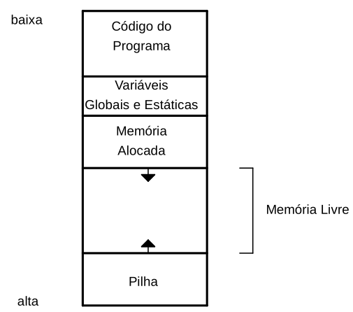
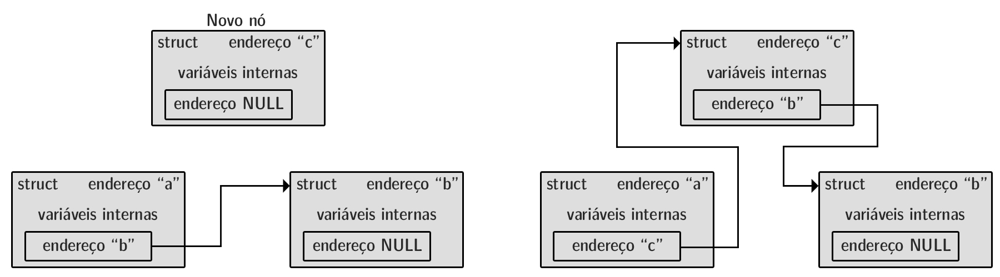
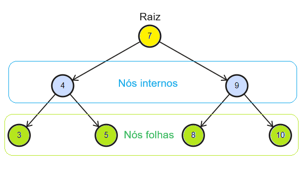

```
 .´‾‾‾‾‾‾‾`.
/     ____|
▏   /        
▏   ▏      
▏   \      
\     ‾‾‾‾‾|
 `.______.´
```

# 00. Características Básicas da Linguagem

> Esta apostila utiliza o **C17** como referência.

C é uma linguagem de propósito geral, utilizada em aplicações e em componentes próximos ao *hardware*. Combina funções e estruturas de controle com operações sobre endereços de memória e representações binárias.

## Paradigmas:

C é **imperativa**: as instruções modificam o estado do programa, representado pelos valores mantidos na memória.

```c
int saldo = 100;
saldo = saldo + 50;  // 150.
saldo = saldo - 30;  // 120.
```

Também é **procedural**: operações são agrupadas em funções reutilizáveis, como um cálculo de média aplicado a diferentes valores. A **programação estruturada** organiza o fluxo por sequência, decisão e repetição, como ao verificar uma compra ou percorrer um estoque.

## Tipagem:

C possui **tipagem estática**: os tipos são conhecidos durante a compilação e orientam a interpretação dos dados e a verificação das operações. A linguagem admite conversões **implícitas**, automáticas, e **explícitas**, indicadas no código.

```c
int quantidade = 3;
double preco = 12.50;
double total = quantidade * preco;  // 37.50.
```

Na multiplicação, o valor de `quantidade` é convertido para `double` (a variável continua sendo `int`). Conversões podem perder informações ou produzir resultados inesperados.

> A descrição “tipagem fraca” não possui definição única. As regras de tipos e conversões explicam melhor o comportamento da linguagem.

## Nível de Abstração:

Funções e variáveis permitem programar sem descrever cada instrução da CPU. Ao mesmo tempo, C oferece acesso a endereços, bits e organização da memória. O nome de uma variável identifica um espaço de armazenamento; ponteiros permitem trabalhar também com seu endereço.

> Proximidade com o *hardware* não significa acesso irrestrito à memória: em sistemas operacionais, o programa continua sujeito às permissões e aos limites de seu processo.

## Compilação e Execução:

No uso habitual, arquivos `.c` são traduzidos pelo **compilador**, e o **ligador** combina as partes necessárias ao executável. Essa tradução antecipada precisa ser refeita após mudanças no código-fonte para que apareçam no programa executado.

> O **GCC** é uma das ferramentas utilizadas. Pré-processamento, compilação e ligação serão aprofundados no capítulo correspondente.

### Desempenho:

O controle dos dados e da memória, combinado às otimizações do compilador, permite construir programas eficientes. O desempenho depende também do algoritmo, da implementação e do *hardware* (a linguagem, isoladamente, não garante velocidade).

### Portabilidade:

Código padronizado pode ser recompilado para diferentes plataformas, mas o executável normalmente depende da arquitetura e do sistema de destino. Tamanhos de tipos, representações e recursos específicos do sistema também limitam a portabilidade.

## Gerenciamento de Memória:

C combina gerenciamento **automático**, como o de variáveis locais comuns, e **manual**, para alocações dinâmicas. Estas podem sobreviver à função que as solicitou, exigindo controle de utilização e liberação.

> C não possui um coletor de lixo automático integrado à linguagem para recuperar, de forma geral, alocações dinâmicas sem utilização.

## Principais Aplicações:

- **Sistemas operacionais:** *kernels*, *drivers* e ferramentas de sistema.
- **Sistemas embarcados:** microcontroladores e dispositivos com recursos limitados ou interação com periféricos.
- **Bibliotecas e ferramentas:** funcionalidades reutilizadas por programas e outras linguagens.
- **Alto desempenho:** componentes que exigem controle do custo das operações e da memória.

## Características Marcantes:

- **Ponteiros:** acesso indireto a objetos e funções.
- **Operações sobre bits:** manipulação da representação binária de inteiros.
- **Organização dos dados:** agrupamentos com arrays e estruturas.
- **Alocação dinâmica:** solicitação e liberação de memória durante a execução.
- **Biblioteca padrão:** entrada e saída, *strings*, matemática e outras operações comuns.
- **Pré-processamento:** inclusão de arquivos, macros e seleção de trechos antes da compilação propriamente dita.

---

# 01. Fundamentos da Linguagem

> Este capítulo reúne os fundamentos de programação no geral e suas particularidades em C: tipos descrevem os dados, operadores realizam cálculos, estruturas de controle definem o fluxo e funções organizam operações reutilizáveis.

Os programas completos incluem cabeçalhos e `main`. Nos fragmentos, instruções pressupõem sua inserção em uma função (definições de funções ficam fora dela). Exemplos com `printf` pressupõem `stdio.h`. Fragmentos separados são independentes, salvo indicação de continuidade.

## Estrutura de um Programa:

Em programas convencionais sobre um sistema operacional, **`main`** é o ponto de entrada definido pela linguagem. `stdio.h` declara recursos de entrada e saída e `#include` incorpora o cabeçalho durante o pré-processamento.

```c
#include <stdio.h>

int main(void) {                             // Retorno int; sem parâmetros.
    int quantidade = 5;
    quantidade += 2;
    printf("Quantidade: %d\n", quantidade);  // 7.
    /* Comentário de bloco,
       que pode ocupar várias linhas. */
    return 0;                                // Encerramento bem-sucedido.
}
```

As chaves delimitam **blocos**. O ponto e vírgula encerra declarações e instruções como atribuições, chamadas e retornos. Um bloco de `if` ou `for` normalmente não recebe `;` após a chave final (a definição de `struct` e o `do while` exigem esse delimitador).

Comentários `//` terminam na quebra de linha; `/* ... */` pode abranger várias linhas, mas não admite aninhamento. A indentação evidencia a organização, enquanto a sintaxe determina os blocos. Dentro de *strings*, espaços e quebras representadas fazem parte do conteúdo.

> Ambientes embarcados sem sistema operacional podem adotar outra inicialização, definida pela implementação.

### Compilação Básica:

Com o código em `programa.c`, o GCC produz o executável, que pode ser iniciado em um terminal Linux:

```sh
gcc -std=c17 -Wall -Wextra -Wpedantic programa.c -o programa # Compilação, linkagem e criação do executável.
./programa
gcc programa.c -o programa # Compilação resumida: versão default da linguagem (definida pelo compilador); indica apenas warnings e erros.
```

`-std=c17` seleciona o padrão; `-Wall` e `-Wextra` habilitam grupos de avisos; `-Wpedantic` solicita diagnósticos adicionais ligados ao padrão; `-o` define o nome da saída. A ausência de avisos não garante a correção do programa.

## Tipos de Dados e Variáveis:

O **tipo** determina valores representáveis e operações permitidas. Uma **variável** é um objeto identificado por um nome. Como em um compartimento, o nome identifica o espaço, o tipo orienta a interpretação e a atribuição substitui o conteúdo.

### Tipos Básicos:

| Tipo | Utilização |
|---|---|
| `char` | Tipo inteiro utilizado frequentemente para caracteres. |
| `int` | Números inteiros. |
| `float` | Números em ponto flutuante. |
| `double` | Ponto flutuante, normalmente com maior precisão e alcance que `float`. |
| `_Bool` | Valores booleanos: `0` e `1`. |
| `void` | Ausência de valor em contextos como o retorno de uma função. |

```c
int pessoas = 4;
float temperatura = 26.5f;  // Sufixo f: constante float.
double distancia = 1234.56789;  // Sem sufixo: constante double.
char letra = 'A';
```

Ponto flutuante possui precisão limitada: muitos decimais são aproximados, como uma divisão interrompida após certo número de casas. `char` ocupa um byte de C, normalmente de oito bits. Tamanhos como quatro bytes para `int` e `float` e oito para `double` são comuns, mas dependem da implementação.

> C não exige ASCII. Um caractere visual pode ocupar vários bytes em codificações como UTF-8.

### Inteiros com e sem Sinal:

`int` equivale a `signed int`; `unsigned int` representa valores não negativos. `short`, `long` e `long long` selecionam outras categorias de inteiros, e a palavra `int` pode ser omitida nessas combinações.

```c
int saldo = -20;
unsigned int quantidade = 20;
short pequeno = 100;
long populacao = 1000000L;
long long contador = 10000000000LL;
unsigned long capacidade = 500000UL;
```

Tipos distintos podem ter o mesmo tamanho: `long` não garante mais espaço que `int` em qualquer plataforma. `char`, `signed char` e `unsigned char` são tipos diferentes (o comportamento de `char` quanto ao sinal depende da implementação).

### Valores Booleanos:

No C17, `stdbool.h` fornece `bool`, `true` e `false` para facilitar o uso de `_Bool`. Na conversão numérica, zero se torna falso e qualquer outro valor se torna verdadeiro.

```c
#include <stdbool.h>
bool ativo = true;
bool bloqueado = false;
bool possui_itens = 5;  // Armazena 1.
```

### Literais e Caracteres Especiais:

Valores escritos diretamente incluem `10`, `3.5`, `'A'` e `"Texto"`. Aspas simples delimitam uma constante de caractere; aspas duplas delimitam uma *string*.

```c
int decimal = 25, hexadecimal = 0x19, octal = 031;  // Mesmo valor.
printf("Nome:\tAna\nCaminho: pasta\\arquivo\nMensagem: \"Ola\"\n");
```

| Escape | Significado |
|---|---|
| `\n` | Nova linha. |
| `\t` | Tabulação horizontal. |
| `\\` | Barra invertida. |
| `\"` | Aspas duplas. |
| `\'` | Aspas simples. |
| `\0` | Caractere nulo, de valor zero. |

> `'0'` é o caractere usado para escrever o algarismo zero; `'\0'` é o caractere nulo. Seus valores são diferentes.

### Declaração, Inicialização e Atribuição:

A declaração informa tipo e nome; a inicialização fornece o primeiro valor; uma atribuição posterior altera o objeto existente. A cópia de um valor não estabelece uma ligação permanente entre variáveis.

```c
int a;                     // Declaração sem inicialização.
a = 10;                    // Atribuição.
int b = 20, c = b;         // Declaração múltipla com inicialização.
b = 30;                    // c continua valendo 20.
int largura = 10, altura = 5;
int area = largura * altura;
int total = 0;             // Valor inicial conhecido.
```

Uma variável local comum sem inicialização possui **valor indeterminado** (sua leitura pode causar comportamento indefinido). Objetos com duração estática, como variáveis fora das funções, recebem inicialização padrão quando não há inicializador explícito. A diferença será aprofundada no capítulo de memória.

> Zero só representa “ausência de informação” quando o programa adota essa convenção.

### Constantes com `const`:

`const` impede a alteração por uma expressão que trate o objeto como constante. Para uma variável simples, o valor normalmente é fornecido na inicialização.

```c
const double taxa = 0.15;
double preco = 100.0;
double acrescimo = preco * taxa;
// taxa = 0.20;  // Inválido.
```

> Em C17, uma variável `const int` não é automaticamente uma expressão constante aceita em contextos como os rótulos de `case`.

`volatile` caracteriza acessos sujeitos às regras da implementação para objetos voláteis, como em determinadas interações com dispositivos. Será retomado junto de memória e otimizações (não garante atomicidade nem sincronização entre *threads*).

### Tamanho com `sizeof`:

`sizeof` informa o tamanho de um tipo ou objeto em bytes. Seu resultado possui tipo `size_t`, apresentado por `%zu`.

```c
int numero = 10;
printf("Tipo: %zu; objeto: %zu\n", sizeof(int), sizeof numero);
```

## Operadores e Expressões:

Uma **expressão** combina valores e operadores para produzir um resultado. Atribuições e incrementos também modificam o estado do programa.

### Aritmética e Conversões:

| Operador | Operação | Exemplo |
|---|---|---|
| `+` | Adição. | `7 + 2` → `9`. |
| `-` | Subtração. | `7 - 2` → `5`. |
| `*` | Multiplicação. | `7 * 2` → `14`. |
| `/` | Divisão. | `7 / 2` → `3`. |
| `%` | Resto inteiro. | `7 % 2` → `1`. |

Se os dois operandos são inteiros, a divisão descarta a parte fracionária em direção a zero. O tipo do destino não altera retroativamente a operação. Conversões **implícitas** seguem as regras da linguagem; um *cast* explícito usa `(tipo) expressao`.

```c
int a = 7 / 2, b = -7 / 2;      // 3 e -3.
double c = 7 / 2;               // Divisão inteira, depois conversão: 3.0.
double d = 7 / 2.0;             // Divisão em ponto flutuante: 3.5.
double total = a;               // Conversão implícita: 3 → 3.0.
int parte_inteira = (int) 8.9;  // 8.
int soma = 15, elementos = 2;
double media = (double) soma / elementos;  // 7.5.
```

Um *cast* não garante segurança: o destino pode ser incapaz de representar o valor. Misturar inteiros com e sem sinal também pode mudar a interpretação da comparação:

```c
int saldo = -1;
unsigned int limite = 10;
int resultado = saldo < limite;  // 0: saldo é convertido para unsigned int.
```

> Divisão inteira por zero, resto por zero e estouro aritmético de inteiros com sinal causam **comportamento indefinido**: a linguagem não exige um resultado ou reação específicos. Inteiros sem sinal seguem redução modular, o que também pode contrariar a lógica pretendida.

### Atribuição e Atualização:

`=` atribui um valor; operadores compostos combinam cálculo e atualização. `++` e `--` acrescentam ou retiram uma unidade. A forma pós-fixada produz o valor anterior; a pré-fixada produz o atualizado.

```c
int saldo = 100;
saldo += 20;  // Equivale, aqui, a saldo = saldo + 20.
saldo -= 10;
saldo *= 2;
saldo /= 5;
saldo %= 7;
int contador = 5;
int anterior = contador++;  // anterior = 5; contador = 6.
int atual = ++contador;     // atual = 7; contador = 7.
```

> `i++ + i++` modifica o mesmo objeto sem o sequenciamento necessário e causa comportamento indefinido. Atualizações separadas deixam a ordem explícita.

### Comparações e Operações Lógicas:

Comparações produzem `1` para verdadeiro e `0` para falso. Em condições numéricas, zero é falso e qualquer outro valor é verdadeiro.

| Operadores | Relação ou operação |
|---|---|
| `==`, `!=` | Igualdade e diferença. |
| `<`, `<=`, `>`, `>=` | Menor, menor ou igual, maior, maior ou igual. |
| `&&` | Verdadeiro quando ambas as condições são verdadeiras. |
| `\|\|` | Verdadeiro quando pelo menos uma condição é verdadeira. |
| `!` | Inverte o resultado lógico. |

```c
int idade = 20, possui_documento = 1;
int entrada_permitida = idade >= 18 && possui_documento;  // 1.
int entrada_bloqueada = !entrada_permitida;               // 0.
int tem_dez_anos = idade == 10;                           // 0.
int alternativa = idade < 18 || !possui_documento;        // 0.
int divisor = 0;
int resultado = divisor != 0 && 20 / divisor > 2;  // Não executa a divisão.
```

`&&` e `||` utilizam **curto-circuito**: só avaliam a segunda expressão quando ela ainda é necessária. `=` faz atribuição, não comparação; sua troca por `==` pode alterar a lógica sem impedir a compilação.

> Intervalos exigem relações separadas: `valor >= 0 && valor <= 10`. `0 <= valor <= 10` não representa esse intervalo.

### Operações sobre Bits:

Cada bit pode ser visualizado como um interruptor. Os operadores atuam sobre as posições da representação de valores inteiros.

| Operador | Operação |
|---|---|
| `&` | AND: bits presentes em ambos. |
| `\|` | OR: bits presentes em pelo menos um. |
| `^` | XOR: bits diferentes. |
| `~` | Inversão de todos os bits do tipo utilizado. |
| `<<`, `>>` | Deslocamento para esquerda e direita. |

```c
unsigned int a = 6, b = 3;  // Bits finais: 0110 e 0011.
unsigned int intersecao = a & b;  // 0010 → 2.
unsigned int uniao = a | b;       // 0111 → 7.
unsigned int diferentes = a ^ b; // 0101 → 5.
unsigned int dobro = a << 1;     // 1100 → 12.
unsigned int metade = a >> 1;    // 0011 → 3.
```

> `&` e `|` não oferecem curto-circuito. Deslocamentos exigem quantidade não negativa e menor que a largura do operando promovido. Tipos sem sinal tornam essas operações mais previsíveis; `~` inverte também os bits omitidos na representação abreviada.

### Operador Condicional:

`condicao ? expressao_verdadeira : expressao_falsa` avalia somente a alternativa selecionada e produz um valor utilizável em outras expressões.

```c
int a = 10, b = 20;
int maior = a > b ? a : b;  // 20.
```

### Precedência e Agrupamento:

A precedência determina o agrupamento: `2 + 3 * 4` resulta em `14`; `(2 + 3) * 4`, em `20`. A tabela segue da maior para a menor precedência; alguns operadores serão aprofundados adiante.

| Grupo | Operadores |
|---|---|
| Pós-fixados | Chamada `()`, índice `[]`, membros `.` e `->`, `x++`, `x--`. |
| Unários | `++x`, `--x`, `+`, `-`, `!`, `~`, `&`, `*`, `sizeof`, `_Alignof`. |
| Conversão explícita | `(tipo)`. |
| Multiplicativos | `*`, `/`, `%`. |
| Aditivos | `+`, `-`. |
| Deslocamentos | `<<`, `>>`. |
| Relacionais | `<`, `<=`, `>`, `>=`. |
| Igualdade | `==`, `!=`. |
| AND bit a bit | `&`. |
| XOR bit a bit | `^`. |
| OR bit a bit | `\|`. |
| AND lógico | `&&`. |
| OR lógico | `\|\|`. |
| Condicional | `?:`. |
| Atribuição | `=`, `+=`, `-=`, `*=`, `/=`, `%=`, `&=`, `^=`, `\|=`, `<<=`, `>>=`. |
| Vírgula | `,`. |

A associatividade resolve operadores de mesma precedência: `a - b - c` corresponde a `(a - b) - c`; `a = b = 0`, a `a = (b = 0)`.

> Agrupamento não determina, em geral, a ordem de avaliação. Em `f() + g()`, não há garantia de qual função é chamada primeiro.

## Entrada e Saída Básica:

`stdio.h` oferece entrada e saída por fluxos. Em uma execução interativa comum, entrada e saída padrão se conectam ao terminal, mas também podem ser redirecionadas.

### Saída com `printf`:

`printf` combina o texto de formato com os argumentos seguintes. `%.2f` apresenta duas casas decimais; `%%` escreve o sinal de porcentagem.

```c
int quantidade = 3;
double preco = 12.5;
char categoria = 'A';
printf("Quantidade: %d; preco: %.2f; categoria: %c; desconto: 10%%\n",
       quantidade, preco, categoria);
```

| Dado | `printf` | `scanf` |
|---|---|---|
| `int` | `%d` | `%d` |
| `unsigned int` | `%u` | `%u` |
| `long int` | `%ld` | `%ld` |
| `long long int` | `%lld` | `%lld` |
| `float` | `%f` | `%f` |
| `double` | `%f` | `%lf` |
| `long double` | `%Lf` | `%Lf` |
| `char` como caractere | `%c` | `%c` |
| String | `%s` | `%s` |
| `size_t` | `%zu` | `%zu` |

Em `printf`, `float` é promovido a `double`; em `scanf`, os destinos exigem distinguir `%f` e `%lf`. Formatos incompatíveis com os tipos esperados podem causar comportamento indefinido.

### Entrada com `scanf`:

`scanf` interpreta a entrada e retorna quantas conversões foram atribuídas com sucesso. `&` informa onde armazenar o resultado, como um endereço de entrega (ponteiros serão explicados no próximo capítulo).

```c
#include <stdio.h>

int main(void) {
    int idade;
    double altura;
    char opcao;
    printf("Idade, altura e opcao:\n");
    if (scanf("%d %lf %c", &idade, &altura, &opcao) != 3) {
        printf("Entrada invalida.\n");
        return 1;
    }
    printf("Idade: %d; altura: %.2f; opcao: %c\n", idade, altura, opcao);
    return 0;
}
```

O `if` impede o uso dos resultados quando a leitura não obtém os três valores. `%c` não ignora espaços automaticamente: o espaço anterior no formato consome espaços em branco, incluindo quebras de linha. Para lê-lo sozinho, aplica-se `scanf(" %c", &opcao)`.

> Entrada não consumida permanece para leituras posteriores. Valores fora da faixa do tipo e entradas arbitrárias exigem validação adicional.

## Estruturas Condicionais:

### `if`, `else if` e `else`:

`if` executa a alternativa verdadeira; `else` atende ao caso falso. Em uma cadeia, o primeiro teste satisfeito seleciona seu bloco e os demais são ignorados. Um `if` simples pode omitir tanto `else if` quanto `else`.

```c
int nota = 5;
if (nota >= 6) {
    printf("Aprovado.\n");
} else if (nota >= 4) {
    printf("Recuperacao.\n");
} else {
    printf("Reprovado.\n");
}
```

> Sem chaves, apenas a instrução seguinte pertence ao ramo. As chaves tornam o agrupamento explícito.

### `switch` e `case`:

`switch` seleciona um ponto de entrada identificado por uma constante inteira. `default`, opcional, atende a valores sem correspondência. `break` encerra o `switch` (sem interrupção, a execução continua nas instruções seguintes - *fall-through*).

```c
int opcao = 2;
switch (opcao) {
    case 1:
        printf("Cadastrar.\n");
        break;
    case 2:
        printf("Consultar.\n");
        break;
    case 3:
    case 4:  // Duas opções compartilham a ação.
        printf("Operacao administrativa.\n");
        break;
    default:
        printf("Opcao desconhecida.\n");
        break;
}
```

> `break` depende do fluxo desejado, não é obrigatório em todo `case`. `switch` não compara diretamente *strings* nem ponto flutuante.

## Estruturas de Repetição:

### `while` e `do while`:

`while` testa antes do corpo e pode não executá-lo. `do while` testa depois, garantindo uma execução inicial. A condição é reavaliada a cada repetição.

```c
int contador = 1;
while (contador <= 3) {
    printf("%d ", contador++);
}
printf("\n");  // 1 2 3.

contador = 5;
do {
    printf("%d\n", contador++);  // 5: executa mesmo com condição falsa.
} while (contador < 3);
```

> O `;` após a condição faz parte da sintaxe de `do while`.

### `for`:

`for (inicializacao; condicao; atualizacao)` executa a inicialização uma vez, testa antes do corpo e atualiza após cada repetição. Uma variável declarada no cabeçalho tem escopo restrito à estrutura.

```c
for (int i = 0; i < 4; i++) {
    printf("%d ", i);
}
printf("\n");  // 0 1 2 3.

int i;  // Também pode ser declarada antes do laço.
for (i = 10; i >= 0; i -= 5) {
    printf("%d ", i);
}
printf("\n");  // 10 5 0.
```

As três partes podem ser omitidas. Sem condição, ela é tratada como verdadeira: `for (;;) { break; }` só termina pela transferência de controle explícita.

### `break` e `continue`:

`break` encerra o laço ou `switch` mais interno que o contém. `continue` pula o restante da repetição: no `for`, segue para a atualização e o teste; no `while` e `do while`, para o teste.

```c
for (int i = 1; i <= 10; i++) {
    if (i == 3) {
        continue;
    }
    if (i == 6) {
        break;
    }
    printf("%d ", i);
}
printf("\n");  // 1 2 4 5.
```

### Desvio com `goto`:

`goto` transfere a execução para um rótulo da mesma função. O rótulo é um identificador seguido de `:` e, em C17, deve preceder uma instrução.

```c
int valor = -1;
if (valor < 0) {
    goto entrada_invalida;
}
printf("Valor aceito.\n");
goto fim;
entrada_invalida:
printf("Valor invalido.\n");
fim:
printf("Encerramento.\n");
```

Desvios livres dificultam acompanhar o fluxo (decisões e repetições comuns costumam ser mais claras com estruturas próprias).

## Funções:

Uma função reúne operações sob um nome e informa entradas e retorno, como uma ferramenta com interface definida. **Parâmetros** são as variáveis da definição; **argumentos** são os valores fornecidos na chamada.

### Retorno, Protótipos e Passagem por Valor:

O **protótipo** declara nome, retorno e tipos dos parâmetros antes do uso. A definição pode vir depois. C passa argumentos **por valor**: alterar um parâmetro modifica sua cópia local.

```c
#include <stdio.h>

int incrementar(int valor);  // Também poderia ser int incrementar(int);
void mostrar_linha(void);

int main(void) {
    int numero = 10;
    int resultado = incrementar(numero);
    mostrar_linha();
    printf("Numero: %d; resultado: %d\n", numero, resultado);  // 10 e 11.
    return 0;
}

int incrementar(int valor) {
    valor++;
    return valor;
}

void mostrar_linha(void) {
    printf("----------------\n");
}
```

`return expressao;` encerra a função e produz seu resultado. Uma função `void` não retorna valor: pode terminar pelo final do corpo ou antecipadamente com `return;`. Um protótipo fornece informações ao compilador, sem executar nem “pré-compilar” a função.

```c
int maior(int a, int b) {
    if (a > b) {
        return a;  // Encerra antecipadamente.
    }
    return b;
}
```

> Em C17, `int funcao(void);` informa ausência de parâmetros; `int funcao();` deixa os parâmetros sem especificação. Uma função usada para produzir resultado precisa retornar um valor adequado (atingir o fim de `main` equivale a retornar zero).

Ponteiros permitem alcançar objetos do chamador, mas o valor do próprio ponteiro também é passado por cópia.

### Escopo:

O **escopo** determina onde um nome pode ser usado, a partir da declaração. Nomes locais abrangem o restante do bloco e seus blocos internos; declarações fora de funções possuem escopo de arquivo, chamado informalmente de global.

```c
#include <stdio.h>
int total = 100;

int main(void) {
    int quantidade = 5;
    {
        int quantidade = 2;  // Sombreamento do nome externo.
        printf("%d\n", quantidade);  // 2.
    }
    printf("%d %d\n", quantidade, total);  // 5 e 100.
    return 0;
}
```

O **sombreamento** (*shadowing*) faz o nome identificar o objeto mais interno, sem eliminar o externo. Escopo indica onde o nome é utilizável; tempo de vida indica por quanto tempo o objeto existe.

### Recursão:

Uma função recursiva chama a si mesma, diretamente ou por outras funções, reduzindo o problema até uma condição de encerramento.

```c
unsigned int fatorial(unsigned int n) {
    if (n <= 1) {
        return 1;
    }
    return n * fatorial(n - 1);
}
// Chamada dentro de outra função: printf("%u\n", fatorial(5)); → 120.
```

`fatorial(5)` depende de `fatorial(4)` e assim sucessivamente (os resultados são combinados no retorno). Cada chamada possui parâmetros e variáveis locais automáticas próprios. Profundidade excessiva pode esgotar recursos, e resultados grandes podem ultrapassar a faixa do tipo: o exemplo atende a valores pequenos.

## Grupos de Dados:

### Arrays:

Um **array** reúne elementos do mesmo tipo em posições consecutivas, como compartimentos iguais numerados a partir de zero. Um array de quatro elementos possui índices de `0` a `3`.

```c
int notas[4] = {8, 7, 9, 6};
int inferido[] = {10, 20, 30};  // Tamanho deduzido: 3.
int parcial[5] = {1, 2};       // {1, 2, 0, 0, 0}.
int zerado[5] = {0};           // Todos recebem zero.
int indefinido[5];            // Local comum: valores indeterminados.
notas[1] = 10;                // Alteração individual.
printf("%d %d\n", notas[0], notas[3]);  // 8 e 6.
// notas = {1, 2, 3, 4};      // Inválido: não admite atribuição integral.
```

Um inicializador parcial inicializa também as posições restantes; para inteiros, elas recebem zero. Depois da criação, os elementos podem ser modificados individualmente, mas o array não é reatribuído com `=`.

Laços percorrem as posições. A quantidade resulta da divisão do tamanho total pelo tamanho de um elemento:

```c
int notas[] = {8, 7, 9, 6};
size_t quantidade = sizeof notas / sizeof notas[0];
int soma = 0;
for (size_t i = 0; i < quantidade; i++) {
    soma += notas[i];
}
double media = (double) soma / quantidade;
printf("Quantidade: %zu; media: %.2f\n", quantidade, media);  // 4 e 7.50.
```

> O cálculo exige o próprio array, não um ponteiro nem um parâmetro ajustado para ponteiro. Acessos fora dos limites causam comportamento indefinido (C não verifica automaticamente todos os índices).

### Matrizes:

Uma matriz pode ser representada como um array de arrays. Em `matriz[linha][coluna]`, o primeiro índice seleciona uma linha e o segundo um elemento dela. As linhas se sucedem de forma contígua na memória.

```c
int matriz[][3] = {  // Primeira dimensão deduzida: 2; também caberia [2][3].
    {1, 2, 3},
    {4, 5, 6}
};
printf("%d\n", matriz[1][2]);  // 6.
for (int linha = 0; linha < 2; linha++) {
    for (int coluna = 0; coluna < 3; coluna++) {
        printf("%d ", matriz[linha][coluna]);
    }
    printf("\n");
}
// Linhas impressas: 1 2 3 e 4 5 6.
```

A primeira dimensão pode ser deduzida do inicializador; as seguintes definem a organização de cada elemento composto.

### *Strings*:

Uma **string** é uma sequência de caracteres terminada por `'\0'`. Capacidade do array e comprimento do texto são distintos: `"Ana"` contém três caracteres antes do terminador e exige quatro posições.

```c
char exato[] = "Ana";       // Quatro posições.
char nome[20] = "Ana";      // Capacidade 20; comprimento inicial 3.
char texto[] = {'O', 'l', 'a', '\0'};
nome[0] = 'E';
printf("%s: %s\n", nome, texto);  // Ena: Ola.
puts(exato);                // Ana, seguida de uma nova linha.
```

`%s` apresenta uma *string*; `puts` acrescenta uma nova linha. Para ler uma palavra, a largura máxima reserva espaço ao terminador:

```c
char nome[20];
if (scanf("%19s", nome) == 1) {
    printf("Nome: %s\n", nome);
} else {
    printf("Falha na leitura.\n");
}
```

O nome do array fornece acesso ao destino, sem `&nome`. `%s` para no espaço em branco; `fgets`, apresentada no capítulo seguinte, permite ler linhas com espaços.

> A ausência de `'\0'` pode fazer funções ultrapassarem o array. `=` não copia integralmente arrays e `==` não compara o conteúdo de *strings* (as operações correspondentes serão apresentadas com `string.h`).

### Estruturas (`struct`):

Uma `struct` reúne membros de tipos diferentes, cada um com armazenamento próprio, como uma ficha com código, nome e preço. A definição descreve o formato; a declaração da variável cria o objeto; `.` seleciona um membro.

```c
struct Produto {
    int codigo;
    char nome[20];
    double preco;
};
struct Produto produto = {10, "Caderno", 15.50};
struct Produto outro = {.preco = 2.0, .codigo = 11, .nome = "Lapis"};
produto.preco = 17.0;
struct Produto copia = produto;
copia.preco = 20.0;
printf("%s: %.2f\n", produto.nome, produto.preco);  // Caderno: 17.00.
```

A inicialização pode seguir a ordem dos membros ou indicá-los por nome. A atribuição entre estruturas compatíveis copia seus membros, incluindo o array `nome` (alterar os membros dessa cópia não modifica os correspondentes de `produto`).

> A definição de `struct` não admite valores padrão para seus membros. Seu tamanho pode incluir preenchimento de alinhamento. Membros ponteiros, estudados adiante, copiam endereços, não os objetos apontados.

### Enumerações com `enum`:

Enumerações nomeiam constantes inteiras. Sem valor explícito, a primeira recebe zero e as seguintes recebem o valor anterior mais um.

```c
enum Estado { DESLIGADO, LIGADO, EM_ESPERA };  // 0, 1 e 2.
enum Codigo { SUCESSO = 0, ERRO_LEITURA = 10, ERRO_ESCRITA };  // Último: 11.
enum Estado estado = LIGADO;
if (estado == LIGADO) {
    printf("Equipamento em funcionamento.\n");
}
```

> Uma variável de enumeração não valida automaticamente se o valor corresponde a um dos nomes declarados. Esses nomes também podem ser usados em `switch`.

### Uniões com `union`:

Os membros de uma `union` compartilham armazenamento, como um compartimento que admite formatos diferentes de conteúdo, usados um de cada vez.

```c
union Valor {
    int inteiro;
    double decimal;
};
union Valor valor;
valor.inteiro = 10;
printf("%d\n", valor.inteiro);
valor.decimal = 3.5;
printf("%.1f\n", valor.decimal);
```

Seu tamanho comporta o maior membro e os requisitos de alinhamento, não a soma de espaços independentes. Ler outro membro após uma escrita não faz conversão numérica comum (no uso básico, o programa acompanha qual representação está válida e lê esse membro).

## Apelidos com `typedef`:

`typedef` cria um nome alternativo, sem modificar o armazenamento nem as operações do tipo original: `typedef unsigned long Contador;` permite declarar `Contador acessos = 0;`. Também simplifica nomes de estruturas.

### Arrays de Estruturas:

O exemplo combina o apelido com vários registros. O índice seleciona o aluno, e `.` seleciona um campo.

```c
#include <stdio.h>

typedef struct {
    char nome[20];
    double nota;
} Aluno;

int main(void) {
    Aluno turma[] = {{"Ana", 8.0}, {"Bruno", 6.5}, {"Carla", 9.0}};
    size_t quantidade = sizeof turma / sizeof turma[0];
    for (size_t i = 0; i < quantidade; i++) {
        printf("%s: %.1f\n", turma[i].nome, turma[i].nota);
    }
    return 0;
}
// Saída em três linhas: Ana: 8.0; Bruno: 6.5; Carla: 9.0.
```

---

# 02. Ponteiros

> A partir desse capítulo são apresentadas ferramentas específicas e quase exclusivas da linguagem C.

Ponteiros permitem acessar objetos indiretamente, compartilhar dados entre partes do programa e utilizar interfaces de *strings*, arquivos e outros recursos. O endereço indica a localização de um compartimento; o dado é seu conteúdo. Copiar o endereço permite alcançar o mesmo compartimento sem duplicar seu conteúdo.

## Endereços e Acesso Indireto:

O operador `&` obtém um endereço; `*` acessa o objeto indicado. O ponteiro também é um objeto, com endereço e tempo de vida próprios.

```c
#include <stdio.h>

int main(void) {
    int numero = 10, outro = 20;
    int *ponteiro = &numero;
    int *copia = ponteiro;  // Mesmo destino, sem duplicar numero.
    printf("Valor: %d; endereco: %p\n", *ponteiro, (void *) ponteiro);
    *copia = 25;
    printf("%d\n", numero);  // 25.
    ponteiro = &outro;       // Muda o destino.
    *ponteiro = 30;          // Modifica outro.
    printf("%d %d\n", numero, outro);  // 25 e 30.
    return 0;
}
```

`%p` espera `void *`, justificando a conversão na chamada de `printf`. O formato e o endereço apresentados dependem da implementação e da execução.

| Expressão | Significado |
|---|---|
| `numero` | Objeto inteiro. |
| `&numero` | Endereço desse objeto. |
| `ponteiro` | Variável que armazena um endereço. |
| `*ponteiro` | Acesso ao objeto apontado. |
| `&ponteiro` | Endereço da própria variável ponteiro. |

### Declaração e Tipo do Destino:

O tipo informa como o destino será acessado e orienta a aritmética do ponteiro. Cada identificador exige seu próprio asterisco.

```c
int numero = 10;
double medida = 2.5;
char letra = 'A';
int *p_numero = &numero;
double *p_medida = &medida;
char *p_letra = &letra;
int *a, b;   // a: ponteiro; b: inteiro.
int *c, *d;  // Ambos ponteiros.
```

`int *p`, `int* p` e `int * p` são equivalentes. Declarar um ponteiro não cria seu destino: um ponteiro local comum sem inicialização possui valor indeterminado.

> Converter `int` para `double` converte o valor. Forçar seu endereço para `double *` não transforma o objeto e pode violar regras de tipo e alinhamento ao acessá-lo.

## Ponteiros Nulos e Validade:

`NULL`, disponível em cabeçalhos como `stddef.h` e `stdio.h`, representa um ponteiro nulo. Ele indica ausência de destino válido, não um objeto vazio ou espaço para escrita.

```c
int *ponteiro = NULL;
{
    int temporario = 10;
    ponteiro = &temporario;
    if (ponteiro != NULL) {  // Também poderia ser if (ponteiro).
        *ponteiro = 20;
        printf("%d\n", temporario);  // 20.
    }
}
// temporario deixou de existir: desreferenciar ponteiro seria inválido.
ponteiro = NULL;
```

Guardar o endereço não prolonga a existência do objeto. Isso também impede devolver com segurança o endereço de uma variável local automática que deixa de existir no retorno. Um ponteiro que perde a validade dessa forma é chamado de **pendente** (*dangling pointer*).

> Desreferenciar um ponteiro nulo causa comportamento indefinido. Testar `NULL` não comprova validade geral: tempo de vida, limites e permissões do objeto também precisam ser respeitados.

## Ponteiros e `const`:

A posição de `const` determina se a restrição recai sobre o acesso ao dado, sobre a variável ponteiro ou sobre ambos.

```c
int numero = 10, outro = 20;
const int *leitura = &numero;        // Também: int const *leitura.
int *const fixo = &numero;
const int *const ambos = &numero;

leitura = &outro;  // Pode mudar de destino.
// *leitura = 30;  // Não pode alterar o dado por esse acesso.
*fixo = 30;        // Pode alterar numero.
// fixo = &outro;  // Não pode mudar de destino.
// *ambos = 40;    // Não pode alterar o dado por esse acesso.
// ambos = NULL;   // Não pode mudar de destino.
numero = 50;       // numero não foi definido como const.
printf("%d\n", *ambos);  // 50.
```

| Declaração | Reatribuir o ponteiro | Alterar o dado por ele |
|---|---|---|
| `int *p` | Sim. | Sim, se o objeto for modificável. |
| `const int *p` | Sim. | Não. |
| `int *const p` | Não. | Sim, se o objeto for modificável. |
| `const int *const p` | Não. | Não. |

Um ponteiro para dado constante não torna necessariamente o objeto original imutável. Por outro lado, remover `const` com um *cast* não permite modificar um objeto originalmente definido como constante: essa escrita causa comportamento indefinido.

## Ponteiros em Funções:

C passa o próprio ponteiro **por valor**, mas sua cópia local alcança o objeto do chamador. O mecanismo costuma ser chamado informalmente de “passagem por referência”. Destinos adicionais também permitem produzir vários resultados.

```c
#include <stdio.h>

void dividir(int dividendo, int divisor, int *quociente, int *resto) {
    *quociente = dividendo / divisor;
    *resto = dividendo % divisor;
}

int main(void) {
    int quociente, resto;
    dividir(17, 5, &quociente, &resto);
    printf("Quociente: %d; resto: %d\n", quociente, resto);  // 3 e 2.
    return 0;
}
```

A interface pressupõe destinos válidos, divisor não nulo e divisão representável. Alterar `*quociente` muda o inteiro do chamador; atribuir outro endereço ao parâmetro `quociente` mudaria apenas a cópia local do ponteiro.

### Ponteiros para Ponteiros:

Para modificar uma variável ponteiro do chamador, a função recebe seu endereço. Cada acesso indireto percorre um nível, como uma ficha que indica outra ficha, que finalmente indica o dado.

```c
#include <stdio.h>

void redirecionar(int **destino, int *novo) {
    *destino = novo;
}

int main(void) {
    int a = 10, b = 20;
    int *ponteiro = &a;
    redirecionar(&ponteiro, &b);
    printf("%d\n", *ponteiro);  // 20.
    return 0;
}
```

Dentro da função, `destino` guarda o endereço do ponteiro do chamador; `*destino` acessa esse ponteiro; `**destino` acessa o inteiro alcançado por ele.

## Arrays e Ponteiros:

Um array **contém elementos**; uma variável ponteiro **armazena um endereço**. Na maioria das expressões, o array é convertido para um ponteiro ao primeiro elemento, processo chamado de **decaimento** (*array-to-pointer decay*). O armazenamento original continua sendo um array.

### Indexação e Aritmética:

`p[i]` equivale a `*(p + i)`, para acessos válidos. Somar uma unidade avança um elemento do tipo apontado, não necessariamente um byte.

```c
int valores[] = {10, 20, 30};
int *ponteiro = valores;       // Mesmo destino que &valores[0].
printf("%d %d %d\n", valores[1], ponteiro[1], *(ponteiro + 1));  // 20 20 20.
(*ponteiro)++;                // Altera valores[0] para 11.
int anterior = *ponteiro++;   // Equivale a *(ponteiro++).
printf("%d %d\n", anterior, *ponteiro);  // 11 e 20.

int *fim = valores + 3;
for (int *atual = valores; atual != fim; atual++) {
    printf("%d ", *atual);
}
printf("\n");  // 11 20 30.
```

Se `int` ocupa quatro bytes, um avanço corresponde a quatro bytes. Como compartimentos iguais, o tipo determina a distância entre posições. `(*p)++` altera o dado; `p++` altera o ponteiro.

> A aritmética deve permanecer no mesmo array ou na posição imediatamente posterior. Essa última posição pode servir de limite, mas não pode ser desreferenciada. Não é válido deslocar ponteiros livremente pela memória.

### Distância e Comparação:

A diferença entre posições do mesmo array produz a quantidade de elementos entre elas, com tipo `ptrdiff_t`, de `stddef.h`, apresentado por `%td`.

```c
#include <stddef.h>
int valores[5] = {10, 20, 30, 40, 50};
ptrdiff_t distancia = &valores[4] - &valores[1];
// Dentro de uma função, com stdio.h: printf("%td\n", distancia); -> 3.
```

Comparações de ordem também podem ser usadas entre posições do mesmo array. `<` e `>` não fornecem uma ordenação geral portável entre objetos independentes.

### Tamanho, Identidade e Reatribuição:

`sizeof` aplicado ao array mede o conjunto; aplicado ao ponteiro mede essa variável, sem informar quantos elementos estão disponíveis. O operador `&` também preserva a identidade do array.

```c
int valores[4] = {10, 20, 30, 40};
int outros[4] = {50, 60, 70, 80};
int *elemento = valores;
int (*conjunto)[4] = &valores;
printf("%zu %zu\n", sizeof valores, sizeof elemento);
valores[0] = 15;      // Altera um elemento.
elemento = outros;    // Reatribui o ponteiro.
// valores = outros;  // Inválido.
// valores++;         // Inválido.
```

Se `int` ocupa quatro bytes, `sizeof valores` é dezesseis (o tamanho do ponteiro depende da implementação). `elemento` aponta para um inteiro, enquanto `conjunto` aponta para quatro inteiros agrupados: os tipos e os avanços são diferentes.

> `sizeof` e `&` são contextos importantes sem decaimento. Um array não é um “ponteiro constante”: seus elementos podem ser modificáveis, mas ele possui tipo e armazenamento próprios.

## Arrays como Parâmetros:

Em parâmetros, `int valores[]` é ajustado para `int *valores`. O tamanho não acompanha o ponteiro e pode ser fornecido separadamente.

```c
#include <stdio.h>

void mostrar(const int *valores, size_t quantidade) {
    for (size_t i = 0; i < quantidade; i++) {
        printf("%d ", valores[i]);
    }
    printf("\n");
}

int main(void) {
    int numeros[] = {10, 20, 30, 40};
    mostrar(numeros, sizeof numeros / sizeof numeros[0]);  // 10 20 30 40.
    mostrar(numeros + 1, 2);  // 20 30.
    return 0;
}
```

`const` impede modificar os inteiros por esse parâmetro. A segunda chamada fornece dois elementos a partir do segundo. Escrever `int valores[10]` no parâmetro não cria um array local nem verifica automaticamente seu tamanho (`sizeof valores` ali mediria o ponteiro ajustado).

## Matrizes e Ponteiros:

`int matriz[2][3]` contém duas linhas de três inteiros. Seu decaimento produz `int (*)[3]`, um ponteiro para linha. Avançar esse ponteiro percorre três inteiros de cada vez.

### Ponteiro para Array e Parâmetros:

```c
#include <stdio.h>

void mostrar_matriz(int matriz[][3], size_t linhas) {
    for (size_t i = 0; i < linhas; i++) {
        for (size_t j = 0; j < 3; j++) {
            printf("%d ", matriz[i][j]);
        }
        printf("\n");
    }
}

int main(void) {
    int matriz[2][3] = {{1, 2, 3}, {4, 5, 6}};
    int (*linha)[3] = matriz;
    printf("%d\n", linha[0][2]);  // 3.
    linha++;
    printf("%d\n", linha[0][2]);  // 6.
    mostrar_matriz(matriz, 2);    // Linhas: 1 2 3 e 4 5 6.
    return 0;
}
```

O parâmetro `int matriz[][3]` é ajustado para `int (*matriz)[3]`. O número de colunas integra o tipo e permite calcular os deslocamentos.

| Declaração | Significado |
|---|---|
| `int (*p)[3]` | Ponteiro para array de três inteiros. |
| `int *p[3]` | Array de três ponteiros para inteiros. |

### Arrays de Ponteiros:

Outra representação utiliza um array de endereços. O primeiro acesso obtém o ponteiro guardado; o segundo acessa a sequência indicada.

```c
int primeira[] = {1, 2, 3}, segunda[] = {4, 5, 6};
int *linhas[] = {primeira, segunda};
int **ponteiro = linhas;
printf("%d %d\n", ponteiro[0][2], ponteiro[1][2]);  // 3 e 6.
```

As sequências podem ocupar regiões distintas e ter comprimentos diferentes, informados separadamente. Uma matriz contígua não se converte em `int **`: um *cast* não cria o array de ponteiros exigido por essa representação.

## *Strings* e Ponteiros:

Um ponteiro para o primeiro caractere permite acessar uma *string*, mas não informa sua capacidade nem se ela é modificável.

### Array Modificável e Literal:

```c
char editavel[] = "Casa";       // Array inicializado com os caracteres.
const char *literal = "Casa";  // Ponteiro para literal.
editavel[0] = 'M';
printf("%s %s\n", editavel, literal);  // Masa Casa.
literal = "Outra";            // Pode mudar o destino.
// literal[0] = 'X';          // Não permitido por esse acesso.
```

Literais têm duração estática, mas tentar modificá-los causa comportamento indefinido. C17 permite `char *p = "Texto"`, sem tornar o literal modificável (`const char *` expressa melhor a restrição).

### Percurso pelo Terminador:

```c
#include <stdio.h>

size_t comprimento(const char *texto) {
    size_t quantidade = 0;
    while (*texto != '\0') {
        quantidade++;
        texto++;
    }
    return quantidade;
}

int main(void) {
    printf("%zu\n", comprimento("Casa"));  // 4.
    return 0;
}
```

A função avança sua cópia local do ponteiro, sem modificar os caracteres. Pressupõe uma *string* acessível, terminada corretamente (`strlen` oferece essa operação na biblioteca padrão).

### Argumentos de `main`:

`argc` informa a quantidade de argumentos; `argv` permite acessar as *strings* correspondentes. Quando disponível, `argv[0]` identifica o programa; `argv[argc]` é um ponteiro nulo.

```c
#include <stdio.h>

int main(int argc, char *argv[]) {
    for (int i = 0; i < argc; i++) {
        printf("Argumento %d: %s\n", i, argv[i]);
    }
    return 0;
}
```

Em uma execução habitual, `./programa Ana 20` fornece `./programa`, `Ana` e `20`, com `argc` igual a três. Cada *string* termina com `'\0'`; argumentos numéricos chegam como texto e precisam ser convertidos.

## Ponteiros para Estruturas:

`p->membro` equivale a `(*p).membro`. O acesso permite modificar uma estrutura existente (funções de consulta podem receber `const Produto *`).

```c
#include <stdio.h>
typedef struct {
    int codigo;
    double preco;
} Produto;

void aplicar_desconto(Produto *produto, double taxa) {
    produto->preco *= 1.0 - taxa;
}

int main(void) {
    Produto produto = {10, 20.0};
    aplicar_desconto(&produto, 0.25);
    printf("%.2f\n", produto.preco);  // 15.00.
    return 0;
}
```

> Atribuir uma estrutura que contém ponteiros copia seus endereços (os objetos apontados continuam compartilhados).

## Ponteiros Genéricos com `void *`:

`void *` transporta ponteiros para objetos sem especificar o tipo concreto. As conversões com ponteiros para objetos não exigem *cast* em C (antes do acesso, é necessário recuperar um tipo adequado).

```c
int numero = 10;
void *generico = &numero;
int *ponteiro = generico;
printf("%d\n", *ponteiro);  // 10.
```

> `void *` não informa tamanho nem operações do destino. C17 não permite aritmética sobre ele nem acesso direto a um valor por `*`. Extensões de compiladores não fazem parte do padrão adotado.

Esse tipo aparece em interfaces genéricas, incluindo alocação de memória.

## Ponteiros para Funções:

Uma operação pode ser selecionada durante a execução ou recebida como argumento (*callback*). O ponteiro informa retorno e parâmetros compatíveis.

```c
#include <stdio.h>

int somar(int a, int b) {
    return a + b;
}
int multiplicar(int a, int b) {
    return a * b;
}
int calcular(int a, int b, int (*operacao)(int, int)) {
    return operacao(a, b);
}

int main(void) {
    int (*operacao)(int, int) = somar;      // Também poderia usar &somar.
    printf("%d\n", operacao(4, 3));         // 7.
    operacao = multiplicar;
    printf("%d\n", (*operacao)(4, 3));      // 12; outra sintaxe de chamada.
    printf("%d\n", calcular(4, 3, somar));  // 7.
    return 0;
}
```

Callbacks aparecem, por exemplo, em critérios de ordenação. A função chamada deve ser compatível com o ponteiro. Ponteiros para funções não admitem aritmética de arrays, e C17 não garante sua conversão para `void *`.

---

# 03. Memória e Alocação

Alocar memória significa reservar armazenamento para dados. O tamanho necessário, o tempo de vida dos objetos e a responsabilidade pela liberação determinam a forma de administrar esse espaço.

O ponteiro funciona como um endereço de acesso, enquanto a alocação fornece o armazenamento. Criar, copiar ou eliminar uma variável ponteiro não cria nem libera automaticamente o objeto apontado.

## Duração dos Objetos:

Os exemplos deste resumo utilizam principalmente três formas de duração de armazenamento:

| Duração | Exemplos | Tempo de vida | Controle da liberação |
|---|---|---|---|
| Automática | Parâmetros e variáveis locais comuns. | Normalmente, até sair do bloco correspondente. | Administrado automaticamente. |
| Estática | Variáveis fora das funções e locais com `static`. | Toda a execução do programa. | Não depende de `free`. |
| Alocada, ou dinâmica | Espaço obtido por `malloc` e `calloc`. | Da alocação à desalocação. | Controlado pelo programa com as funções apropriadas. |

Uma variável automática se assemelha a um espaço de trabalho temporário, devolvido ao terminar a atividade. Uma variável estática mantém sua reserva durante toda a execução. Uma alocação dinâmica permanece reservada até sua liberação, mesmo após o retorno da função que a solicitou.

> **Escopo** determina onde um nome pode ser utilizado; **tempo de vida**, por quanto tempo o objeto existe; **ligação** determina se declarações podem identificar o mesmo objeto ou função em diferentes pontos do programa. Essas propriedades não são equivalentes.

### Variáveis Automáticas e Estáticas:

No C17, `auto` explicita a classe de armazenamento normalmente implícita nas variáveis locais comuns. Ele não realiza inferência de tipo. Uma variável local com `static` conserva seu valor entre chamadas, sem tornar seu nome acessível fora do bloco.

```c
#include <stdio.h>

int total;  // Duração estática; inicialização implícita com zero.

void registrar(void) {
    auto int local = 0;       // Equivale, aqui, a int local = 0.
    static int persistente;  // Inicializada uma vez, com zero.
    local++;
    persistente++;
    total++;
    printf("%d %d %d\n", local, persistente, total);
}

int main(void) {
    registrar();  // 1 1 1.
    registrar();  // 1 2 2.
    registrar();  // 1 3 3.
    return 0;
}
```

Cada chamada recria `local` e executa sua inicialização. `persistente` mantém o mesmo objeto e valor entre chamadas; `total` também existe durante toda a execução, mas seu nome possui escopo de arquivo.

Sem inicialização explícita, objetos estáticos recebem inicialização padrão: tipos aritméticos recebem zero, ponteiros recebem um ponteiro nulo e agregados têm seus elementos ou membros inicializados conforme essas regras. Variáveis automáticas comuns, sem inicialização, possuem valores indeterminados.

> Um inicializador de objeto estático precisa atender às regras de inicialização estática de C17. Uma chamada comum de função, como `static int valor = calcular();`, não é aceita para essa finalidade.

### `static`, `extern` e Organização do Programa:

Fora de funções, `static` também estabelece **ligação interna**: o nome identifica um objeto restrito àquela unidade de tradução. Isso não torna sua memória secreta (outra função ainda pode receber um ponteiro para ele).

`extern` permite declarar um objeto definido em outro ponto. Na forma usual `extern int total;`, a declaração não cria um segundo inteiro: informa que aquele nome se refere a um objeto cuja definição será fornecida.

```c
// Fragmento em escopo de arquivo.
static int reservado = 0;  // Duração estática e ligação interna.
extern int compartilhado;  // Declaração; a definição precisa existir.

void incrementar(void) {
    extern int compartilhado;  // extern também é permitido em um bloco.
    compartilhado++;
    reservado++;
}
```

Em um uso simples entre arquivos, a definição `int compartilhado = 0;` aparece uma vez, e as declarações `extern` permitem referenciá-la. Uma declaração `extern` com inicializador em escopo de arquivo, como `extern int compartilhado = 0;`, já é uma definição.

> `extern` não significa “alocação dinâmica” nem amplia automaticamente o escopo de todo nome. A organização com arquivos `.c`, cabeçalhos e ligação será aprofundada no capítulo de compilação.

`const` e `volatile` qualificam acessos e tipos (não escolhem, por si só), entre duração automática, estática e alocada. Um objeto `const` local comum, por exemplo, pode continuar tendo duração automática.

## Organização da Memória:

Em implementações usuais, a memória de um programa pode ser visualizada por regiões. Essa representação ajuda a compreender seu funcionamento, mas **C não exige um desenho físico único**.

| Região usual | Papel |
|---|---|
| Código | Instruções executáveis das funções. |
| Dados de duração estática | Variáveis globais e objetos `static`, frequentemente separados em áreas de dados inicializados e de inicialização com zero. |
| Dados somente de leitura | Constantes e literais que a implementação decide colocar em uma região protegida contra escrita. |
| *Stack* — pilha de chamadas | Armazenamento associado a chamadas, parâmetros, variáveis locais e informações de retorno. |
| *Heap* — área de alocação dinâmica | Regiões administradas pelo alocador para atender a pedidos como `malloc`. |

<br>
*Fonte: BATISTA, Natália Cosse - Ponteiros e alocação dinâmica de memória, p. 23.*

Na *stack*, uma chamada normalmente acrescenta um quadro de informações (*frame*), retirado quando ela retorna. A organização lembra uma pilha de fichas de atividades ainda em andamento. Chamadas recursivas podem acumular vários desses quadros.

No *heap*, os blocos podem ter tempos de vida independentes da ordem das chamadas. O alocador mantém informações sobre áreas ocupadas e disponíveis, permitindo reservas e devoluções em momentos diferentes.

> Variáveis locais podem ficar em registradores ou ser eliminadas por otimização; `const` não garante uma região somente de leitura. Código executável também não se confunde com objetos de duração estática.

### Memória Disponível e Limites:

Diagramas que mostram *stack* e *heap* crescendo em sentidos opostos sobre uma “área livre” são simplificações. Sistemas reais podem utilizar várias regiões e mapeamentos (não existe em C uma região obrigatória de “memória comum” entre as duas).

Grandes objetos automáticos e recursão profunda podem esgotar a pilha disponível. A alocação dinâmica também tem limites e pode falhar. Liberar um bloco permite sua reutilização pelo alocador, mas não exige que o processo devolva imediatamente toda essa memória ao sistema operacional.

## Escolha da Alocação:

A alocação automática costuma atender a dados temporários e de tamanho administrável. A duração estática atende a dados que precisam persistir durante toda a execução. A dinâmica permite ajustar a reserva às necessidades e manter dados além da função que os criou.

| Situação | Escolha usual |
|---|---|
| Poucos valores temporários de uma função. | Variáveis automáticas. |
| Contador que preserva estado entre chamadas. | Variável local `static`. |
| Quantidade de elementos conhecida apenas durante a execução. | Alocação dinâmica, especialmente quando o tamanho pode ser grande ou precisa mudar. |
| Dados produzidos por uma função e utilizados após seu retorno. | Armazenamento fornecido pelo chamador ou alocação dinâmica com responsabilidade definida. |

- **Vantagens da alocação dinâmica:** tamanho ajustável, tempo de vida independente do bloco e possibilidade de construir estruturas cujo volume varia.
- **Desvantagens:** necessidade de tratar falhas e liberação, custo de administração e risco de fragmentação ou acessos inválidos.

Fragmentação ocorre quando o aproveitamento da memória é prejudicado pela divisão das regiões disponíveis ou por espaços extras reservados internamente. Ter memória livre no conjunto não garante o atendimento de qualquer pedido.

> Alocação dinâmica não é automaticamente mais rápida. Usá-la sem necessidade acrescenta trabalho de gerenciamento; escolher duração estática apenas para evitar esse trabalho também muda a persistência e o compartilhamento dos dados.

## Funções de Alocação:

As funções básicas estão declaradas em `stdlib.h`. Seus tamanhos utilizam `size_t`, e as funções de alocação retornam `void *`, convertido automaticamente para ponteiros de objetos em C.

| Função | Operação |
|---|---|
| `malloc(bytes)` | Reserva uma região sem inicializar seus valores. |
| `calloc(quantidade, tamanho)` | Reserva espaço para os elementos e preenche todos os bits com zero. |
| `realloc(ponteiro, bytes)` | Solicita outro tamanho para uma alocação, preservando o conteúdo que cabe em ambos os tamanhos. |
| `free(ponteiro)` | Libera uma alocação válida; `free(NULL)` não realiza operação. |

Para pedidos de tamanho positivo, o retorno nulo indica falha. A região precisa ser obtida com sucesso antes de qualquer acesso.

### Reserva, Inicialização, Redimensionamento e Liberação:

O exemplo reúne as quatro funções. As quantidades são pequenas e fixadas no código para destacar o ciclo (a validação de tamanhos calculados aparece na seção seguinte).

```c
#include <stdio.h>
#include <stdlib.h>

int main(void) {
    size_t quantidade = 3;
    int *dados = malloc(quantidade * sizeof *dados);
    int *zeros = calloc(quantidade, sizeof *zeros);
    if (dados == NULL || zeros == NULL) {
        free(dados);  // Também funciona se um dos ponteiros for NULL.
        free(zeros);
        return 1;
    }
    for (size_t i = 0; i < quantidade; i++) {
        dados[i] = 10;  // malloc não forneceu um valor inicial.
    }
    printf("%d %d\n", dados[0], zeros[0]);  // 10 e 0.
    free(zeros);
    zeros = NULL;

    size_t nova_quantidade = 5;
    int *novo = realloc(dados, nova_quantidade * sizeof *dados);
    if (novo == NULL) {
        free(dados);  // Com tamanho positivo, a falha preserva a alocação anterior.
        return 1;
    }
    dados = novo;
    for (size_t i = quantidade; i < nova_quantidade; i++) {
        dados[i] = 20;  // A parte acrescentada não vem inicializada.
    }
    quantidade = nova_quantidade;
    for (size_t i = 0; i < quantidade; i++) {
        printf("%d ", dados[i]);
    }
    printf("\n");  // 10 10 10 20 20.
    free(dados);
    dados = NULL;
    return 0;
}
```

`sizeof *dados` mede o tipo apontado, mantendo o cálculo ligado à declaração do ponteiro. Nesse caso, a expressão não acessa o conteúdo de `dados`. `sizeof dados`, por outro lado, mediria apenas o ponteiro.

`dados` e `zeros` são variáveis locais automáticas; os blocos apontados têm duração alocada. O fim de `main` encerra a existência dessas variáveis, enquanto as chamadas de `free` demonstram a liberação explícita das regiões.

> `calloc` zera bits. Isso produz zero para os inteiros do exemplo, mas não garante, em toda implementação, ponteiros nulos ou zero de ponto flutuante. Não equivale à inicialização por tipo feita pela linguagem em todos os casos.

### Comportamento de `realloc`:

O alocador pode manter a região no mesmo local ou transferir o conteúdo para outra área. Se houver sucesso, a alocação anterior deixa de ser válida: o programa utiliza o ponteiro retornado e atualiza quaisquer referências derivadas conforme necessário.

Ao aumentar, os dados anteriores são preservados e a parte nova precisa de inicialização. Ao diminuir, somente o conteúdo que cabe no novo tamanho é preservado. Não existe garantia de que o endereço permaneça igual.

```c
// Forma problemática, se dados for o único acesso à alocação:
// dados = realloc(dados, novo_tamanho);
// Uma falha substituiria dados por NULL, perdendo o endereço anterior.
```

A variável temporária do programa evita essa perda. Em caso de falha com tamanho positivo, o bloco anterior continua disponível: a aplicação pode mantê-lo ou liberá-lo, como no exemplo. `realloc(NULL, tamanho)` funciona como `malloc(tamanho)`.

> Pedidos de tamanho zero possuem particularidades dependentes da implementação no C17. Para liberar, utiliza-se `free`, sem depender de `realloc(p, 0)`.

## Tamanho e Responsabilidade pela Memória:

Uma reserva para `quantidade` elementos usa `quantidade * sizeof elemento`. Se a multiplicação ultrapassar o limite de `size_t`, pode produzir um tamanho pequeno e reservar menos espaço que o necessário. A verificação precisa ocorrer **antes** da multiplicação.

`SIZE_MAX`, de `stdint.h`, informa o maior valor de `size_t`. Comparar a quantidade com `SIZE_MAX / tamanho_elemento` evita o estouro desse cálculo; a alocação ainda pode falhar por outros motivos.

### Criação em uma Função e Liberação em Outra:

A função abaixo reúne validação de tamanho, criação de um array zerado e devolução de seu endereço. O contrato estabelece que o chamador libera a região recebida.

```c
#include <stdint.h>
#include <stdio.h>
#include <stdlib.h>

int *criar_array(size_t quantidade) {
    int *dados = NULL;
    if (quantidade == 0 || quantidade > SIZE_MAX / sizeof *dados) {
        return NULL;
    }
    dados = calloc(quantidade, sizeof *dados);
    return dados;  // O bloco continua existindo após o retorno.
}

int main(void) {
    size_t quantidade = 4;
    int *valores = criar_array(quantidade);
    if (valores == NULL) {
        return 1;
    }
    valores[1] = 25;
    for (size_t i = 0; i < quantidade; i++) {
        printf("%d ", valores[i]);
    }
    printf("\n");  // 0 25 0 0.
    free(valores);
    return 0;
}
```

A variável local `dados` deixa de existir, mas seu valor é copiado para o chamador. A alocação permanece válida até `free`. Isso difere de retornar o endereço de um array local automático, que deixa de existir ao sair da função.

O exemplo rejeita quantidade zero por escolha da interface. Quando o tamanho vem de entrada externa, a validação também precisa rejeitar valores negativos ou inválidos **antes** de convertê-los para `size_t`.

### Quem Libera o Bloco:

A responsabilidade pela liberação, frequentemente chamada de *ownership*, é uma convenção do programa, não uma propriedade automaticamente acompanhada pelo ponteiro em C. Uma função pode apenas consultar um bloco, modificá-lo ou assumir sua liberação; isso precisa estar claro na interface.

Copiar um endereço não duplica a região nem cria outra obrigação de `free`. Se o bloco for liberado, todos os ponteiros que o alcançavam perdem sua validade para acesso.

```c
// Fragmento dentro de uma função; stdlib.h incluído.
int *dono = malloc(sizeof *dono);
if (dono != NULL) {
    *dono = 10;
    int *emprestado = dono;  // Mesmo bloco, não uma segunda alocação.
    printf("%d\n", *emprestado);  // 10; stdio.h necessário.
    free(dono);
    dono = NULL;
    // *emprestado e free(emprestado) seriam inválidos após a liberação.
}
```

> Atribuir `NULL` ao ponteiro liberado evita reutilizar esse valor por aquela variável, mas não corrige cópias existentes. `free` também não promete apagar o conteúdo anterior da memória.

## Problemas Comuns:

| Problema | Causa e consequência |
|---|---|
| Vazamento de memória (*memory leak*) | Uma reserva deixa de ser necessária, mas não é liberada; perder seu último endereço impede recuperá-la pelos acessos normais do programa. |
| Uso após liberação (*use-after-free*) | Acesso a um objeto cujo tempo de vida terminou; comportamento indefinido. |
| Liberação duplicada (*double free*) | Duas liberações da mesma alocação sem uma nova reserva válida; comportamento indefinido. |
| Liberação inválida | `free` recebe endereço de variável automática, estática, posição interna do bloco ou outro valor não permitido. |
| Reserva insuficiente | Quantidade errada, estouro no cálculo ou uso de `sizeof ponteiro` no lugar de `sizeof *ponteiro`. |
| Leitura sem inicialização | Conteúdo de `malloc` ou da expansão de `realloc` é utilizado sem receber um valor adequado. |
| Acesso fora dos limites | Índice ultrapassa a quantidade reservada, mesmo que o endereço pareça acessível. |

`free` recebe o início de uma alocação válida, não um endereço deslocado como `dados + 1`. Também é necessário liberar reservas já obtidas quando uma operação posterior falha, como no primeiro programa.

Perder uma variável ponteiro não encerra automaticamente a reserva; manter um ponteiro também não prolonga um objeto já liberado. A separação entre **endereço**, **armazenamento** e **tempo de vida** orienta tanto arrays dinâmicos quanto as estruturas do próximo capítulo.

---

# 04. Estruturas de Dados

Estruturas de dados organizam informações conforme as operações que o programa precisa realizar: percorrer registros, atender solicitações, recuperar ações recentes ou procurar valores.

Em C, essas organizações podem ser construídas combinando arrays, `structs`, ponteiros e alocação dinâmica. A escolha depende da forma de acesso, da frequência de alterações e do espaço disponível.

## Armazenamento Contíguo e Encadeado:

Um array mantém seus elementos em posições consecutivas. Uma estrutura encadeada utiliza referências para conectar elementos que podem estar em regiões diferentes da memória.

| Organização | Vantagens | Limitações |
|---|---|---|
| Contígua | Acesso direto por índice, poucos dados auxiliares e boa proximidade entre elementos na memória. | Inserções e remoções intermediárias podem exigir deslocamentos (crescer uma região dinâmica pode exigir realocação). |
| Encadeada | Permite conectar e desconectar nós sem deslocar os demais elementos. | Exige espaço para os ponteiros e normalmente precisa percorrer os nós para localizar uma posição. |

Um array se assemelha a uma sequência de compartimentos numerados. No encadeamento, cada compartimento contém uma indicação de onde está o próximo.

> Encadeamento não garante maior velocidade ou segurança. A busca pela posição de alteração pode custar mais que a própria alteração, e os ponteiros precisam permanecer válidos.

## Listas Encadeadas:

Uma **lista simplesmente encadeada** reúne nós que armazenam um dado e um ponteiro para o próximo nó. Um ponteiro inicial permite alcançar a sequência, e `NULL` pode indicar seu final.

```c
typedef struct No {
    int valor;
    struct No *proximo;
} No;

// Fragmento dentro de uma função; stdio.h incluído.
No terceiro = {30, NULL};
No segundo = {20, &terceiro};
No primeiro = {10, &segundo};
No *inicio = &primeiro;

for (No *atual = inicio; atual != NULL; atual = atual->proximo) {
    printf("%d ", atual->valor);
}
printf("\n");  // 10 20 30.
```

O membro `proximo` aponta para outro objeto do mesmo tipo. O exemplo utiliza nós automáticos para destacar o encadeamento (uma lista que cresce durante a execução pode obter seus nós com `malloc`).

Inserir entre dois nós envolve conectar o novo nó ao sucessor e atualizar o antecessor. Retirar um nó exige reconectar a sequência e, quando ele foi alocado dinamicamente e não será mais utilizado, liberar sua memória.

<br>
*Fonte: Elaborado pelo autor (2025).*

- **Vantagem:** alterações locais podem preservar os demais nós e seus endereços.
- **Aplicações:** sequências com inserções e remoções frequentes, agrupamentos de registros e implementação de pilhas ou filas.
- **Limitação:** acessar o elemento de determinada posição normalmente exige percorrer os anteriores.

> Uma lista não prioriza dados antigos ou recentes por definição. Essa ordem depende de onde os elementos são inseridos, consultados e retirados.

Uma lista **duplamente encadeada** também guarda o endereço do antecessor, facilitando o percurso nos dois sentidos, ao custo de mais armazenamento e atualizações.

## Estruturas lineares:

Essas estruturas, como **pilhas** e **filas** definem principalmente uma **regra de acesso**. Ambas podem ser implementadas com arrays ou nós encadeados.

| Estrutura | Regra de retirada | Entradas: `10`, `20`, `30` | Analogia |
|---|---|---|---|
| Pilha | Último a entrar, primeiro a sair — *LIFO*. | Retirada: `30`, `20`, `10`. | Pilha de pratos: o último colocado fica no topo. |
| Fila | Primeiro a entrar, primeiro a sair — *FIFO*. | Retirada: `10`, `20`, `30`. | Fila de atendimento: quem chegou antes é atendido antes. |

### Pilhas:

Uma **pilha** concentra inserção e retirada no topo. Essa organização facilita recuperar os dados mais recentemente adicionados.

- **Vantagem:** acesso simples ao item mais recente, sem procurar por toda a coleção.
- **Aplicações:** desfazer ações, acompanhar chamadas de funções e guardar etapas que precisam ser retomadas em ordem inversa.
- **Limitação:** alcançar diretamente um item antigo não é a operação principal da estrutura.

Em um array, o topo pode ser acompanhado por um índice ou pela quantidade de elementos. Em uma lista encadeada, o início pode representar o topo, reunindo inserção e retirada nessa posição.

> A pilha como estrutura de dados e a *stack* de chamadas utilizam uma organização semelhante, mas não são a mesma região de memória. Uma pilha criada pelo programa pode, por exemplo, utilizar memória dinâmica.

### Filas:

Uma **fila** insere elementos no final e retira do início. Ela favorece o processamento dos dados mais antigos ainda pendentes.

- **Vantagem:** preserva a ordem de chegada.
- **Aplicações:** solicitações aguardando atendimento, mensagens recebidas e tarefas pendentes.
- **Limitação:** selecionar um elemento intermediário ou mais recente foge da operação básica de uma fila.

Uma implementação encadeada pode manter ponteiros para início e final, evitando percorrer toda a sequência a cada inserção.

Com arrays, uma **fila circular** reutiliza as posições liberadas no começo. Os índices retornam ao início ao atingir o limite, como marcadores que circulam por uma pista, evitando deslocar todos os elementos após cada retirada.

> A fila facilita retirar o mais antigo (ela não torna automaticamente mais rápida a busca por um dado antigo arbitrário).

## Árvores:

Uma **árvore** organiza nós por ramificações. O nó inicial é a **raiz**, os nós ligados abaixo de outro são seus **filhos**, e os nós sem filhos são **folhas**.

Essa organização representa relações hierárquicas, como categorias e subcategorias. Em uma árvore binária, cada nó possui no máximo dois filhos.

```c
typedef struct NoArvore {
    int valor;
    struct NoArvore *esquerda;
    struct NoArvore *direita;
} NoArvore;
```

A declaração define as ligações possíveis. As regras de inserção e consulta determinam o significado dessas ramificações.

### Árvores Binárias de Busca:

Em uma **árvore binária de busca**, os valores menores ficam na subárvore esquerda e os maiores na direita, considerando aqui valores distintos.

<br>
*Fonte: estrategiaconcursos - Percursos em Árvores Binárias para o CNU (TI), Disponível em: [https://www.estrategiaconcursos.com.br/blog/percursos-arvores-binarias/](https://www.estrategiaconcursos.com.br/blog/percursos-arvores-binarias/). Acesso em: 26 set. 2026.*

Para procurar `5`, a comparação com `7` direciona a busca à esquerda; a comparação com `4`, à direita. A organização permite descartar partes da árvore sem visitar todos os seus elementos.

Quando a árvore mantém altura proporcional ao logaritmo da quantidade de nós, a busca custa `O(log n)`. Se ficar muito desbalanceada, formando uma sequência alongada, o custo pode chegar a `O(n)`.

- **Vantagem:** árvores de busca equilibradas permitem localizar valores e manter uma organização ordenada com eficiência.
- **Aplicações:** conjuntos ordenados, índices e consultas por valor.
- **Limitação:** manter uma boa organização exige regras adicionais (uma árvore binária qualquer não garante busca logarítmica).

> `O(n)` indica crescimento proporcional à quantidade de elementos - `O(log n)` cresce mais lentamente. Uma lista encadeada simples normalmente exige busca linear, mas um array ordenado também pode admitir busca binária logarítmica: essa vantagem não é exclusiva das árvores.

## Escolha da Estrutura:

| Necessidade principal | Opção usual |
|---|---|
| Acessar diretamente uma posição conhecida. | Array. |
| Conectar ou retirar elementos sem deslocar todo o conjunto. | Lista encadeada, considerando o custo de localizar o ponto da alteração. |
| Recuperar primeiro o que foi adicionado por último. | Pilha. |
| Processar pendências na ordem de chegada. | Fila. |
| Representar relações hierárquicas. | Árvore. |
| Manter dados ordenados com buscas e alterações frequentes. | Árvore de busca equilibrada, conforme as operações necessárias. |

A regra de organização e a forma de armazenamento são escolhas relacionadas, mas diferentes. Uma fila não exige encadeamento, uma lista não exige necessariamente alocação dinâmica e uma árvore não é automaticamente uma árvore de busca.

Os algoritmos de inserção, remoção, percurso e balanceamento são aprofundados na apostila de Algoritmos. Aqui, essas estruturas mostram como os recursos de C podem ser combinados para atender a diferentes formas de organizar e acessar os dados.

---

# 05. Pré-processamento, Compilação e Ligação

A construção de um programa transforma o código-fonte em um executável. As diretivas orientam parte dessa preparação: incluem arquivos, definem substituições e selecionam quais trechos serão compilados.

O pré-processamento pode ser comparado à preparação de um documento: reúne partes, substitui marcações e escolhe versões antes de encaminhar o resultado para a tradução.

## Etapas de Construção:

| Etapa | Função |
|---|---|
| Pré-processamento | Processa diretivas, inclui cabeçalhos e expande macros. |
| Compilação propriamente dita | Analisa o código e produz uma representação de destino, normalmente com otimizações. |
| Montagem | Converte código de montagem em arquivos objeto. |
| Ligação | Combina arquivos objeto e bibliotecas, resolvendo referências entre eles. |

Um arquivo objeto, normalmente `.o`, contém código e informações para a ligação. Ele ainda pode depender de funções ou dados definidos em outros arquivos.

> As ferramentas podem integrar etapas internamente. Essa separação descreve o fluxo usual e ajuda a localizar problemas.

## Diretivas:

As diretivas começam com `#` e normalmente terminam na quebra de linha, sem `;`. Uma barra invertida `\` imediatamente antes da quebra permite continuar a diretiva na linha seguinte.

### Inclusão com `#include`:

`#include` disponibiliza o conteúdo de um cabeçalho no ponto da inclusão.

```c
#include <stdio.h>     // Cabeçalho da biblioteca padrão.
#include "calculos.h"  // Cabeçalho do projeto.
```

Os delimitadores orientam a procura pelo cabeçalho. No uso habitual, aspas permitem procurar primeiro junto ao arquivo que realiza a inclusão, enquanto `<...>` utiliza os caminhos configurados para cabeçalhos. Os detalhes dependem da implementação.

Um cabeçalho fornece informações como protótipos, tipos e macros. Incluir o cabeçalho de uma biblioteca não equivale a incorporar automaticamente toda a sua implementação ao executável.

### Macros com `#define` e `#undef`:

`#define` associa um nome a uma sequência de elementos que será substituída durante o pré-processamento. Uma macro pode representar um valor ou receber argumentos.

```c
#define PI 3.141592653589793
#define NOME "Calculadora"
#define QUADRADO(x) ((x) * (x))

// Fragmento dentro de uma função:
double area = PI * QUADRADO(2.0 + 1.0);  // PI * 9.
printf("%s: %.2f\n", NOME, area);        // Calculadora: 28.27.

#undef NOME  // Remove a definição para os usos posteriores.
```

Os parênteses preservam o agrupamento dos argumentos e da expressão resultante. `QUADRADO(2 + 1)` se expande para `((2 + 1) * (2 + 1))`.

Uma macro não é uma função: não cria parâmetros locais e pode repetir a avaliação do argumento.

```c
int i = 2;
// int resultado = QUADRADO(i++);  // Inválido: expande para dois i++ sem sequenciamento.
```

> Parênteses resolvem problemas de agrupamento, mas não impedem efeitos colaterais duplicados. Para operações comuns com argumentos, funções oferecem verificação de tipos e evitam essa repetição causada pela expansão.

Macros também não seguem o escopo dos blocos de C. Uma definição permanece ativa, a partir de seu processamento, até `#undef` ou o final da unidade em processamento.

### Compilação Condicional:

As diretivas condicionais selecionam trechos durante a construção do programa. Um `if` comum expressa uma decisão do programa; `#if` decide qual código será encaminhado à compilação.

| Diretiva | Papel |
|---|---|
| `#if expressao` | Testa uma expressão inteira do pré-processador. |
| `#ifdef NOME` | Testa se a macro está definida. |
| `#ifndef NOME` | Testa se a macro não está definida. |
| `#elif expressao` | Testa outra condição. |
| `#else` | Seleciona a alternativa restante. |
| `#endif` | Encerra o grupo condicional. |
| `#error mensagem` | Emite um diagnóstico de erro para a configuração selecionada. |

```c
#include <stdio.h>

#ifndef NIVEL
#define NIVEL 1
#endif

#if NIVEL < 0
#error "NIVEL nao pode ser negativo"
#elif NIVEL == 0
#define MENSAGEM "Modo simples"
#else
#define MENSAGEM "Modo detalhado"
#endif

int main(void) {
#ifdef DEPURACAO
    printf("Diagnostico habilitado\n");
#endif
    printf("%s\n", MENSAGEM);
    return 0;
}
```

No GCC, macros também podem ser definidas pelo comando de compilação:

```sh
gcc -std=c17 -DNIVEL=0 -DDEPURACAO diretivas.c -o programa
```

Nesse caso, a saída contém o diagnóstico e `Modo simples`. Sem essas opções, o exemplo utiliza `NIVEL` igual a um e apresenta apenas `Modo detalhado`.

`#ifdef NOME` equivale a `#if defined(NOME)`. A existência da macro é diferente de seu valor: uma macro definida como zero ainda satisfaz `#ifdef`.

> O pré-processador não consulta variáveis de C nem interpreta tipos como o compilador. Uma variável `const` ou uma expressão com `sizeof` não pode ser usada diretamente como condição de `#if`. `#warning`, aceito por algumas ferramentas, não pertence ao padrão C17.

### Macros Predefinidas:

| Macro | Informação |
|---|---|
| `__FILE__` | Nome do arquivo-fonte, como *string*. |
| `__LINE__` | Número da linha, como constante inteira. |
| `__DATE__` | Data do processamento do arquivo, como *string*. |
| `__TIME__` | Horário do processamento do arquivo, como *string*. |
| `__STDC_VERSION__` | Versão do padrão; para C17, `201710L`. |

```c
printf("Origem: %s, linha %d\n", __FILE__, __LINE__);
printf("Construcao: %s %s\n", __DATE__, __TIME__);
```

> Data e horário são incorporados durante a construção. Eles não representam o momento em que o executável está sendo utilizado.

## Cabeçalhos e Múltiplos Arquivos:

O arquivo `.h`, ou *header*, apresenta a interface compartilhada. O arquivo `.c` normalmente contém as definições das funções. O cabeçalho funciona como uma descrição das ferramentas disponíveis; a implementação fornece seu funcionamento.

O exemplo utiliza três arquivos, identificados nos comentários:

```c
/* calculos.h */
#ifndef APOSTILA_CALCULOS_H
#define APOSTILA_CALCULOS_H

#include <stddef.h>
double media(const double *valores, size_t quantidade);

#endif
```

```c
/* calculos.c */
#include "calculos.h"

double media(const double *valores, size_t quantidade) {
    double total = 0;
    for (size_t i = 0; i < quantidade; i++) {
        total += valores[i];
    }
    return total / quantidade;
}
```

```c
/* main.c */
#include <stdio.h>
#include "calculos.h"

int main(void) {
    double valores[] = {10, 20, 30};
    printf("Media: %.2f\n", media(valores, 3));  // 20.00.
    return 0;
}
```

A interface pressupõe um array acessível com `quantidade` elementos e quantidade maior que zero. O cabeçalho inclui `stddef.h` porque seu protótipo utiliza `size_t`.

A implementação também inclui seu próprio cabeçalho, permitindo ao compilador verificar a compatibilidade entre declaração e definição.

### Proteção contra Inclusões Repetidas:

A combinação `#ifndef`, `#define` e `#endif` forma uma **proteção de inclusão** (*include guard*). Na primeira inclusão, a macro é definida; nas seguintes, o conteúdo protegido é ignorado.

Isso evita processar repetidamente definições como as de estruturas quando vários cabeçalhos incluem o mesmo arquivo.

> A proteção atua dentro de cada unidade de tradução, não entre todos os arquivos do projeto. Cada cabeçalho precisa de um nome de proteção distinto. `#pragma once` é uma alternativa comum, mas não é padronizada em C17.

### Declaração e Definição:

Um cabeçalho pode reunir protótipos, definições de tipos, macros e declarações `extern`. Uma variável compartilhada pode ser declarada como `extern int total;` no cabeçalho e definida como `int total = 0;` em um único `.c`.

Colocar definições comuns de variáveis ou funções com ligação externa em um cabeçalho pode gerar múltiplas definições quando ele é incluído por diferentes arquivos.

> Incluir um `.h` não inclui automaticamente seu `.c`. A implementação precisa participar da construção (normalmente, arquivos `.c` são compilados separadamente, sem serem incluídos uns nos outros).

## Compilação e Ligação do Projeto:

Os dois arquivos-fonte podem ser compilados e ligados em um comando:

```sh
gcc -std=c17 -Wall -Wextra -Wpedantic main.c calculos.c -o programa
./programa
```

O GCC também permite interromper o processo em etapas:

| Opção | Resultado |
|---|---|
| `-E` | Código pré-processado. |
| `-S` | Código de montagem. |
| `-c` | Arquivo objeto, sem realizar a ligação. |

```sh
gcc -std=c17 -E main.c -o main.i
gcc -std=c17 -c main.c calculos.c
gcc main.o calculos.o -o programa
```

Cada `.c`, após o processamento das inclusões e diretivas, forma uma **unidade de tradução**. A ligação conecta as referências dessas unidades às definições correspondentes.

Se `calculos.c` não participar da construção e nenhuma biblioteca fornecer `media`, sua declaração permitirá compilar a chamada, mas a ligação não encontrará a implementação.

## Otimizações e Momento dos Erros:

O compilador pode antecipar cálculos conhecidos, eliminar operações sem efeito observável e substituir chamadas por operações equivalentes. Por exemplo, `int total = 3 * 4;` pode resultar diretamente no valor `12`, sem uma multiplicação durante a execução.

No GCC, opções como `-O2` habilitam conjuntos de otimizações. Elas podem aumentar o tempo de compilação e dificultar o acompanhamento passo a passo, sem garantir melhora de desempenho em todo programa.

| Momento | Exemplos de problemas |
|---|---|
| Pré-processamento | Cabeçalho não encontrado ou configuração rejeitada por `#error`. |
| Compilação | Sintaxe inválida ou certas incompatibilidades de tipos. |
| Ligação | Definição externa ausente ou definida em duplicidade. |
| Execução | Falha ao abrir um arquivo, falha de alocação ou acesso inválido dependente dos dados. |

> Nem todo erro é diagnosticado. Comportamento indefinido pode passar despercebido e produzir resultados diferentes com otimização. O compilador pode assumir que as regras da linguagem são respeitadas ao transformar o código.

---

# Fontes:

- DEITEL, Harvey M.; DEITEL, Paul J. *Como programar em C*. 2. ed. Rio de Janeiro: LTC, 1994.

- ZIVIANI, Nivio. *Projeto de algoritmos com implementações em Pascal e C*. 4. ed. São Paulo: Pioneira, 1999.

- BATISTA, Natália Cosse. *Ponteiros e alocação dinâmica de memória*. 2022. 40 f. Slides (PDF) da disciplina Algoritmos e Estruturas de Dados. Centro Federal de Educação Tecnológica de Minas Gerais (CEFET-MG), 2025.

- PEIXOTO, Daniela Cristina Cascini. *Disciplina: Lógica de programação*. Curso de graduação em Engenharia de Computação - CEFET-MG, 2024.

- CAMPOS, Luciana Maria de Assis. *Disciplina: Programação orientada a objetos*. Curso de graduação em Engenharia de Computação - CEFET-MG, 2024.

- BATISTA, Natália Cosse. *Disciplina: Algoritmos e estruturas de dados*. Curso de graduação em Engenharia de Computação - CEFET-MG, 2025.

- cppreference.com. *C reference*. Disponível em: [https://en.cppreference.com/w/c](https://en.cppreference.com/w/c). Acesso em: 04 ago. 2026.

- gcc.gnu.org. *Options Controlling C Dialect*. Disponível em: [https://gcc.gnu.org/onlinedocs/gcc/C-Dialect-Options.html](https://gcc.gnu.org/onlinedocs/gcc/C-Dialect-Options.html). Acesso em: 26 set. 2026.

- gcc.gnu.org. *Options to Request or Suppress Warnings*. Disponível em: [https://gcc.gnu.org/onlinedocs/gcc/Warning-Options.html](https://gcc.gnu.org/onlinedocs/gcc/Warning-Options.html). Acesso em: 26 set. 2026.

- ISO/IEC. *Programming languages — C: Committee Draft N1570*. Disponível em: [https://www.open-std.org/jtc1/sc22/wg14/www/docs/n1570.pdf](https://www.open-std.org/jtc1/sc22/wg14/www/docs/n1570.pdf). Acesso em: 26 set. 2026.

- FREE SOFTWARE FOUNDATION. *The C Preprocessor*. Disponível em: [https://gcc.gnu.org/onlinedocs/cpp/](https://gcc.gnu.org/onlinedocs/cpp/). Acesso em: 26 set. 2026.

- FREE SOFTWARE FOUNDATION. *Using the GNU Compiler Collection*. Disponível em: [https://gcc.gnu.org/onlinedocs/gcc/](https://gcc.gnu.org/onlinedocs/gcc/). Acesso em: 26 set. 2026.
